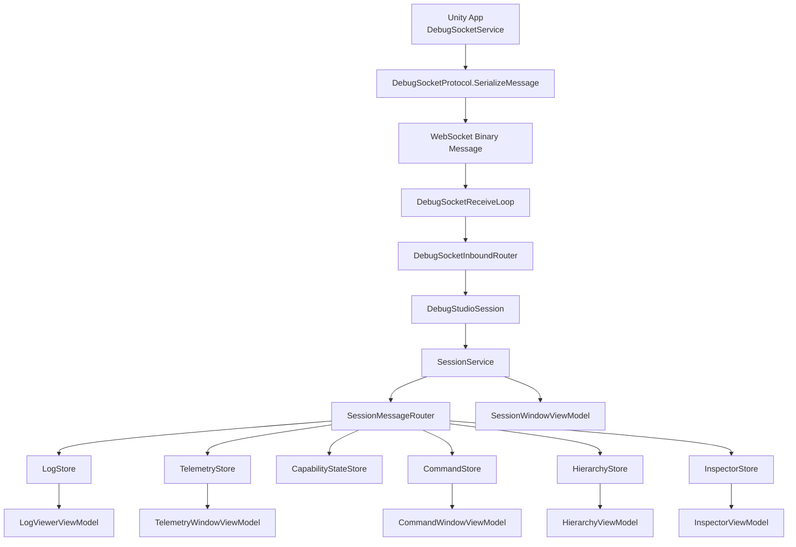

# DebugStudio: App 側から来る MessagePack がどう解釈されるか

## 目的

このドキュメントは、**Unity 側 App から DebugStudio 側へ届く MessagePack バイナリが、どのように decode / 解釈 / store 反映 / UI 表示されるか**を整理したものです。

対象は主に次の経路です。

- Unity App (`Assets\OneStarMaker\Runtime\DebugSocketServices\DebugSocketService.cs`)
- DebugStudio transport/client (`DebugStudio.Client`)
- DebugStudio app/service/store (`DebugStudio.App`)

---

## 全体像

DebugStudio では、App 側から届くバイナリをいきなり DTO として読むのではなく、**2 段階**で解釈します。

1. **framed message** を `DebugSocketEnvelopeV1` として読む
2. `MessageType` を見て、`Payload` を対応する DTO へ MessagePack deserialize する

つまり構造は次です。

```text
[4byte little-endian length]
  +
MessagePack(DebugSocketEnvelopeV1)
    ├─ SchemaVersion
    ├─ MessageType
    ├─ RequestId
    └─ Payload = MessagePack(各DTO)
```

---

## 1. 送信側では何が作られているか

Unity 側では `DebugSocketProtocol.SerializeMessage(...)` が使われ、**payload DTO** を共通 envelope に包んでから送信します。

関係ファイル:

- `DebugStudio\src\DebugStudio.Contracts\Protocol\DebugSocketProtocol.cs`
- `DebugStudio\src\DebugStudio.Contracts\Protocol\DebugSocketEnvelopeV1.cs`
- `Assets\OneStarMaker\Runtime\DebugSocketServices\DebugSocketService.cs`

### envelope の中身

`DebugSocketEnvelopeV1` は次の 4 フィールドを持ちます。

| Field | 意味 |
|---|---|
| `SchemaVersion` | 現在の wire schema version |
| `MessageType` | payload が何の DTO か |
| `RequestId` | command / query 応答を相関させるための ID |
| `Payload` | 実 DTO を MessagePack 化した byte[] |

### 代表的な送信例

- log: `DebugSocketMessageType.Log`
- telemetry: `DebugSocketMessageType.Telemetry`
- service status: `DebugSocketMessageType.ServiceStatus`
- hierarchy snapshot: `DebugSocketMessageType.HierarchySnapshot`
- hierarchy delta: `DebugSocketMessageType.HierarchyDelta`
- inspector detail: `DebugSocketMessageType.InspectorDetail`

---

## 2. DebugStudio 側で最初に受ける層

WebSocket 受信は `DebugStudio.Client.Internal.DebugSocketReceiveLoop` が担当します。

関係ファイル:

- `DebugStudio\src\DebugStudio.Client\Internal\DebugSocketReceiveLoop.cs`
- `DebugStudio\src\DebugStudio.Client\Internal\DebugSocketInboundRouter.cs`

### ここでやっていること

`DebugSocketReceiveLoop` は **1 WebSocket message = 1 framed message** として扱い、chunk を `MemoryStream` に積み上げてから、**完成した 1 フレーム**を router へ渡します。

つまり受信ループ自体は DTO の意味を知りません。責務は次だけです。

1. WebSocket の binary message を最後まで受ける
2. 完成した `ReadOnlyMemory<byte>` を `DebugSocketInboundRouter.RouteInboundFrame(...)` へ渡す

---

## 3. framed binary はどこで envelope として解釈されるか

`DebugSocketInboundRouter.RouteInboundFrame(...)` が最初の decode 点です。

### 手順

1. `DebugSocketProtocol.TryDeserializeEnvelope(...)`
2. `SchemaVersion == 1` を確認
3. `MessageType` ごとに `TryDeserializePayload<TDto>(...)`
4. 対応する typed event を発火

### 重要なポイント

- **schema 不一致** はここで遮断される
- **payload decode failure** でも transport 全体は落とさず、`ServiceStatusReceived` に **synthetic status** として流す
- つまり protocol error は「例外で全停止」ではなく「状態通知として可視化」が基本方針

---

## 4. typed DTO への分岐

`DebugSocketInboundRouter` の `switch ((DebugSocketMessageType)envelope.MessageType)` で、payload は各 DTO に分岐します。

### 代表的な分岐

| MessageType | DTO | Router event |
|---|---|---|
| `Log` | `LogEnvelopeV1` | `LogReceived` |
| `Telemetry` | `DebugTelemetryEnvelopeV1` | `TelemetryReceived` |
| `ServiceStatus` | `DebugSocketServiceStatusEnvelopeV1` | `ServiceStatusReceived` |
| `CommandResult` | `DebugCommandResultEnvelopeV1` | `CommandResultReceived` |
| `CapabilityWelcome` | `CapabilityHandshakeWelcomeEnvelopeV1` | `CapabilityWelcomeReceived` |
| `HierarchySnapshot` | `HierarchySnapshotEnvelopeV1` | `HierarchySnapshotReceived` |
| `HierarchyDelta` | `HierarchyDeltaEnvelopeV1` | `HierarchyDeltaReceived` |
| `InspectorDetail` | `InspectorDetailEnvelopeV1` | `InspectorDetailReceived` |

---

## 5. transport session から app 層へどう渡るか

`DebugStudioSession` は client 層の facade で、`DebugSocketInboundRouter` の typed event を **そのまま再公開**します。

関係ファイル:

- `DebugStudio\src\DebugStudio.Client\DebugStudioSession.cs`

この層では主に次をやっています。

1. inbound router の event を購読
2. session の public event (`TelemetryReceived` など) として再発行
3. app 層は `DebugStudioSession` だけを見ればよい形にする

ここでもまだ store mutation は行いません。

---

## 6. app 層ではどこで「意味のある状態」へ変わるか

App 層では `SessionService` と `SessionMessageRouter` が受信 DTO を store へ流します。

関係ファイル:

- `DebugStudio\src\DebugStudio.App\Core\Services\SessionService.cs`
- `DebugStudio\src\DebugStudio.App\Core\Services\SessionMessageRouter.cs`

### 役割分担

#### `SessionService`

- `DebugStudioSession` の event を受ける
- 接続制御・capability hello 送信・reset 戦略を管理
- 各受信メッセージを `SessionMessageRouter` へ委譲

#### `SessionMessageRouter`

- typed DTO を対応 store へ反映
- 必要なら app 向け event を再発行

---

## 7. DTO は最終的にどの store に入るか

| DTO | Store / State | 解釈の意味 |
|---|---|---|
| `LogEnvelopeV1` | `LogStore` | retain され、`LogRecord` に変換されて UI が扱う |
| `DebugTelemetryEnvelopeV1` | `TelemetryStore` | telemetry recent/retained/history に反映 |
| `DebugSocketServiceStatusEnvelopeV1` | `TelemetryStore` | service status recent/retained/history に反映 |
| `DebugCommandResultEnvelopeV1` | `CommandStore` | pending command と相関される |
| `CapabilityHandshakeWelcomeEnvelopeV1` | `CapabilityStateStore` | negotiated capability の正本になる |
| `HierarchySnapshotEnvelopeV1` | `HierarchyStore` | tree 全量正本として差し替える |
| `HierarchyDeltaEnvelopeV1` | `HierarchyStore` | base revision 一致時のみ差分適用する |
| `InspectorDetailEnvelopeV1` | `InspectorStore` | target/revision を見ながら latest detail として採用する |

### 特に重要な解釈ルール

#### Log

`LogEnvelopeV1` はそのまま UI に流れず、`LogStore.Append(...)` を通って **`LogRecord`** へ変わります。  
つまり DebugStudio の Logcat が直接扱うのは wire DTO ではなく、retain 済みの app model です。

#### Hierarchy delta

`HierarchyStore.ApplyDelta(...)` では `BaseRevision` が現在 revision と一致する場合だけ適用します。  
ずれていれば「欠落や順序逆転の疑いあり」とみなし、**壊れた tree を作るより snapshot 再同期を優先**します。

#### Inspector detail

`InspectorStore.ApplyDetail(...)` では、次の detail を捨てます。

- すでに別 target が選択されているのに遅れて届いた detail
- 同一 target でも古い revision の detail

つまり inspector は **「最後に見たい対象を巻き戻さない」** 方を優先して解釈しています。

#### CommandResult

`CommandStore` へ入る前に、`CapabilityStateStore` で `CommandResult` capability が negotiated 済みかを確認します。  
交渉前や stray frame は UI 状態を壊し得るため、無条件では採用しません。

---

## 8. UI はどの層を見るか

多くの UI は wire DTO ではなく、**store か app model** を見ます。

### 主な消費先

| 画面 / VM | 見ているもの |
|---|---|
| `LogViewerViewModel` | `LogStore` の retain 済み log |
| `TelemetryWindowViewModel` | `TelemetryStore` の snapshot / recent / retained |
| `HierarchyViewModel` | `HierarchyStore` の snapshot / node 列 |
| `InspectorViewModel` | `InspectorStore` の snapshot / document |
| `CommandWindowViewModel` | `CommandStore` |
| `SessionWindowViewModel` | session event を activity として文字列化したもの |

つまり MessagePack DTO は、最終的に

- **そのまま activity 表示されるもの**
- **store で app state に変換されるもの**

の 2 系統に分かれます。

---

## 9. シーケンス図

```mermaid
sequenceDiagram
    participant Unity as Unity App
    participant Proto as DebugSocketProtocol.SerializeMessage
    participant WS as WebSocket
    participant Loop as DebugSocketReceiveLoop
    participant Inbound as DebugSocketInboundRouter
    participant Session as DebugStudioSession
    participant Service as SessionService
    participant Router as SessionMessageRouter
    participant Store as Stores
    participant VM as ViewModels/UI

    Unity->>Proto: DTO を MessagePack 化して envelope 化
    Proto->>WS: [length][MessagePack(DebugSocketEnvelopeV1)]
    WS->>Loop: binary message 受信
    Loop->>Inbound: RouteInboundFrame(framed bytes)
    Inbound->>Inbound: TryDeserializeEnvelope()
    Inbound->>Inbound: MessageType ごとに TryDeserializePayload<T>()
    Inbound->>Session: typed event 発火
    Session->>Service: typed event 再発行
    Service->>Router: RouteXxxMessage(dto)
    Router->>Store: store mutation
    Router->>VM: app event 再発行（必要時）
    Store->>VM: snapshot / retained state を UI が読む
```

---

## 10. レイヤ図



---

## 11. 「MessagePack はどこで DTO になるのか」の答え

一言でいうと、**MessagePack は `DebugSocketInboundRouter` の中で DTO になります**。

より正確には:

1. `DebugSocketReceiveLoop` は **byte 列を完成フレームとして集めるだけ**
2. `DebugSocketProtocol.TryDeserializeEnvelope(...)` で **共通 envelope** になる
3. `DebugSocketProtocol.TryDeserializePayload<TDto>(...)` で **具体 DTO** になる
4. `SessionMessageRouter` で **app 上の意味ある state** になる
5. ViewModel がそれを **表示用に整形**する

---

## 12. 実務上の読み方

受信不具合を追うときは、次の順で見ると切り分けやすいです。

1. **届いているか**  
   `DebugSocketReceiveLoop`
2. **framing / schema / message type が壊れていないか**  
   `DebugSocketProtocol.TryDeserializeEnvelope`  
   `DebugSocketInboundRouter`
3. **payload DTO decode に失敗していないか**  
   `TryDeserializePayload<T>()`
4. **store で捨てられていないか**  
   例: `HierarchyStore.ApplyDelta`, `InspectorStore.ApplyDetail`
5. **UI は store をどう見ているか**  
   対応 ViewModel

---

## 13. 代表ファイル一覧

### Protocol / transport

- `DebugStudio\src\DebugStudio.Contracts\Protocol\DebugSocketProtocol.cs`
- `DebugStudio\src\DebugStudio.Contracts\Protocol\DebugSocketEnvelopeV1.cs`
- `DebugStudio\src\DebugStudio.Contracts\Protocol\DebugSocketMessageType.cs`
- `DebugStudio\src\DebugStudio.Client\Internal\DebugSocketReceiveLoop.cs`
- `DebugStudio\src\DebugStudio.Client\Internal\DebugSocketInboundRouter.cs`
- `DebugStudio\src\DebugStudio.Client\DebugStudioSession.cs`

### App orchestration

- `DebugStudio\src\DebugStudio.App\Core\Services\SessionService.cs`
- `DebugStudio\src\DebugStudio.App\Core\Services\SessionMessageRouter.cs`

### Stores

- `DebugStudio\src\DebugStudio.App\Core\Stores\LogStore.cs`
- `DebugStudio\src\DebugStudio.App\Core\Stores\TelemetryStore.cs`
- `DebugStudio\src\DebugStudio.App\Core\Stores\CommandStore.cs`
- `DebugStudio\src\DebugStudio.App\Core\Stores\CapabilityStateStore.cs`
- `DebugStudio\src\DebugStudio.App\Core\Stores\HierarchyStore.cs`
- `DebugStudio\src\DebugStudio.App\Core\Stores\InspectorStore.cs`

### Unity sender

- `Assets\OneStarMaker\Runtime\DebugSocketServices\DebugSocketService.cs`

---

## 14. まとめ

App 側から来る MessagePack は、DebugStudio の中で次のように段階的に意味付けされます。

1. **binary framed message**
2. **`DebugSocketEnvelopeV1`**
3. **typed DTO**
4. **store に反映された app state**
5. **ViewModel が整形した UI 表示**

したがって、DebugStudio における「MessagePack の解釈」とは単なる deserialize ではなく、
**protocol envelope の検証、message type による DTO 分岐、store での採用/棄却ルール、最終的な UI state 化までを含む**、という理解が正確です。
