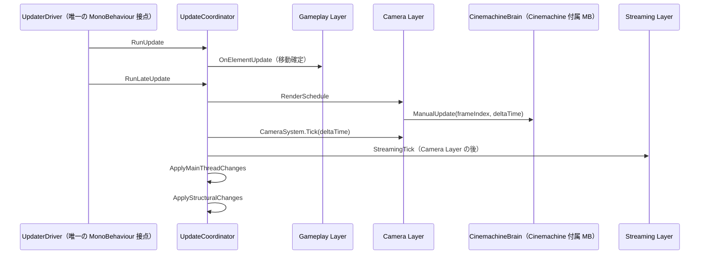

# CameraSystem × UpdateSystem 統合施行表 — 2026-07-13

> Bootstrap 完了（`CAMERA_SYSTEM_BOOTSTRAP_EXECUTION_PLAN_2026-07-11.md`）後の後続フェーズ。
> 目的は **CameraSystem が所有する自前の MonoBehaviour をゼロにし**、カメラの 1 フレーム進行を UpdateSystem の managed `IUpdateElement` が一度だけ実行すること。
>
> 設計の正典: `unity/Assets/Docs/Architecture/23-camera-system.md`  
> UpdateSystem 正典: `docs/updater/UPDATER_CURRENT_SPEC.md`  
> 更新順序不変条件: `docs/planning/CAMERA_SYSTEM_TDD_PLAN_2026-07-07.md` §2.2（I-1〜I-4）

---

## 1. 背景と動機

Bootstrap では意図的に UpdateSystem 統合を見送り、以下 2 つの MonoBehaviour で駆動している。

| 現状の MonoBehaviour | 役割 |
|---|---|
| `CameraSystemUpdateAdapter` | `LateUpdate` → `CameraSystem.Tick` |
| `CameraSystemHostDriver`（Host 内 nested） | `LateUpdate` → `ProcessRenderScheduling` |

これにより次の問題が顕在化した。

1. **LateUpdate 経路が 3 系統** — `UpdaterDriver` / `CameraSystemHostDriver` / `CameraSystemUpdateAdapter` が独立し、CinemachineBrain との相対順序がコード上で保証されない
2. **本番とテストの駆動経路が乖離** — 本番は MonoBehaviour、テストは `Tick()` 直接呼び出し
3. **Streaming 未配線** — `CameraStreamingFocusAdapter` は「UpdateSystem から駆動」と設計済みだが未接続。Snapshot 確定後の focus 更新順序を Coordinator で宣言できない
4. **常駐 GameObject が増殖** — `[UpdaterHost]` と `[CameraSystemHost]` がそれぞれ独自の MonoBehaviour ドライバを持つ

ポリシー層（`CameraSystem` / `CameraView` / `ICameraBackend`）は既に純 C# で分離済み。**変更は Hosting 層と Bootstrap に限定できる**。

---

## 2. 目的と完了像

### 2.1 実装前に答えるべき問い（結論）

> **「CameraSystem を UpdateSystem に登録するか」ではなく、  
> 「誰が、どの時計で、どの順に Cinemachine の結果・Modifier・Snapshot を一度だけ進めるか」を単一の所有者として定義できるか。**

答えは **できる**。`CameraSystem` 自体を `IUpdateElement` にしてライフサイクル責務を混ぜるのではなく、Bootstrap が所有する純 C# の `CameraSystemUpdateElement` を一つ登録する。この Element を唯一のフレーム所有者とし、同じ `UpdateFrameContext` で次を実行する。

1. RenderTexture View の描画要求を進める
2. 全 `CinemachineBrain` を `ManualUpdate(frameIndex, deltaTime)` で一度だけ進める
3. `CameraSystem.Tick(deltaTime)` で Modifier と Snapshot を確定する

この結論には条件がある。Follow / LookAt target を変更するゲームコードは、Camera Layer より前の UpdateSystem Layer で完了しなければならない。UpdateSystem 外の MonoBehaviour が後から target を変更する限り、CameraSystem だけでは順序保証を完結できない。

### 2.2 目的

- CameraSystem が所有する **自前 MonoBehaviour を 0 にする**（`CameraSystemUpdateAdapter` 削除、`CameraSystemHostDriver` 削除）
- フレーム駆動を `UpdateSystemRuntime.RegisterElement` 経由の **純 C# `IUpdateElement`** に統一する
- 更新順序不変条件 I-1〜I-4 を **単一 Element の固定手順**で明示化する
- テストでも `UpdateCoordinator.RunLateUpdate()` 経由で本番と同一経路を再現できる

### 2.3 完了像（1 フレーム）



### 2.4 非目標（本フェーズではやらない）

- `CameraSystemHost` の廃止や `[CameraSystemHost]` GameObject の UpdateSystem Host への統合
- Unity 側 `Camera` / `CinemachineBrain` / `CinemachineCamera` の排除（Unity エンジン制約のため不可）
- `CameraBackgroundApplier` の `IMainThreadApplyElement` 化（任意の後続チケット）
- `CameraSystemSliceSetup` / Volume クロスフェードの Game 層配線
- UpdateSystem Layer 定数の全システム共通化（Camera + Streaming のみ）

---

## 3. 設計方針

### 3.1 最小のフレーム所有者（採用）

「将来の Phase 拡張」を見越して 7〜8 型へ分割する必要はない。現時点の仕事は 3 操作で固定されており、抽象を増やすと所有者を曖昧にする。純 C# の Element と、Cinemachine 固有の内部 port の 2 型だけを追加する。

```csharp
// Hosting/CameraSystemUpdateElement.cs
internal sealed class CameraSystemUpdateElement : IUpdateElement
{
    private readonly ICameraFrameDriver _frameDriver;
    private readonly CameraSystem _cameraSystem;
    private bool _isActive = true;

    public void OnElementStart() { }
    public void OnElementUpdate(in UpdateFrameContext context) { }

    public void OnElementLateUpdate(in UpdateFrameContext context)
    {
        if (!_isActive)
            return;

        _frameDriver.AdvanceFrame(context.FrameIndex, context.DeltaTime);
        _cameraSystem.Tick(context.DeltaTime);
    }

    public void Deactivate() => _isActive = false;
}

// Hosting/ICameraFrameDriver.cs
// Unity/Cinemachine を 1 フレーム進める framework 契約。ポリシー層には公開しない。
public interface ICameraFrameDriver
{
    void AdvanceFrame(uint frameIndex, float deltaTime);
}
```

`CinemachineCameraBackend` が `ICameraFrameDriver` を実装し、`AdvanceFrame` 内で以下を順に呼ぶ。

1. `_host.ProcessRenderScheduling()`
2. 登録済みの各 `CinemachineBrain.ManualUpdate(frameIndex, deltaTime)`

`CameraSystem.Tick` は `AdvanceFrame` 完了後にだけ呼ばれる。これにより I-1 を同一の純 C# 呼び出しスタックで保証できる。

`ICameraFrameDriver` は `ICameraBackend` に追加しない。前者は Unity/Cinemachine の PlayerLoop 制御、後者は CameraSystem ポリシーが必要とする描画バックエンド契約であり、責務が異なるためである。C# の公開 Backend がこの契約を実装できるよう public とするが、Game 層は `CameraSystemUpdateElement.Create` 以外から利用しない。

**テスト時:** `CameraSystemUpdateElement` を `UpdateCoordinator.RegisterElement` し、`RunLateUpdate` で実行する。ユニットテストでは recording `ICameraFrameDriver` を注入し、順序だけを検証する。

### 3.2 Cinemachine タイミングと時計（最重要）

I-1 不変条件: **Brain 更新（ブレンド済み POV 確定）→ Modifier 適用 → Snapshot 確定**

現状のままでは両者とも Unity `LateUpdate` に依存するため、Script Execution Order だけでは外部スクリプトや Cinemachine の設定変更に対して脆い。Cinemachine 3.1.7 の `ManualUpdate(int, float)` を採用し、UpdateSystem が明示的に実行する。

| 選択肢 | 結果 | 採否 |
|---|---|---|
| **ManualUpdate を Element から一度だけ呼ぶ** | Brain 確定 → Modifier → Snapshot を同じ呼び出しスタックで保証できる | **採用** |
| Script Execution Order のみ | Unity の別 LateUpdate に順序保証を委ねる | 不採用 |
| `CameraUpdatedEvent` コールバック | UpdateSystem 外の隠れた更新入口を作る | 不採用 |
| 現状の独自 MonoBehaviour | CameraSystem に更新入口が残る | 不採用 |

View 作成時は `brain.UpdateMethod = CinemachineBrain.UpdateMethods.ManualUpdate` にする。`BlendUpdateMethod` は `ManualUpdate()` が実行時に利用する `LateUpdate` のままにし、手動用の値を設定しない。Cinemachine 3.1.7 の `BrainUpdateMethods` には Manual 値が存在しない。

時計も UpdateSystem に統一する。`Camera` Layer は既定では pause しない・timeScale=1 とし、`context.DeltaTime` を **Brain と `CameraSystem.Tick` の両方**へ渡す。将来「ポーズ中も UI 用カメラを動かす」要件が出た場合は、別 Layer または明示的な `CameraClockPolicy` を追加する。ここで `Time.deltaTime` / `Time.unscaledDeltaTime` を直接読むことは禁止する。

### 3.3 Layer 境界

```csharp
// Runtime/UpdateSystem/Layers/UpdateLayerIds.cs
internal static class UpdateLayerIds
{
    public const string Camera = "Camera";
    public const string Streaming = "Streaming";
}
```

`Gameplay`（target を更新）→ `Camera`（Brain / Modifier / Snapshot）→ `Streaming`（Snapshot 消費）の順とする。LayerOrder はこの 3 境界だけを表し、Camera Element 内部の 3 操作へ executionOrder を割り当てない。

Camera の前提を壊さないため、Camera Layer より後で Camera target を変更するコードを追加してはならない。既存の UpdateSystem 外 MonoBehaviour に target 書き込みがある場合は、統合前に移設または実行順を明文化する。

---

## 4. 変更対象と削除

### 4.1 削除

| ファイル / 型 | 理由 |
|---|---|
| `Hosting/CameraSystemUpdateAdapter.cs` | `IUpdateElement` に置換 |
| `CameraSystemHost.CameraSystemHostDriver`（nested） | `ICameraFrameDriver.AdvanceFrame` に吸収 |

### 4.2 新規

| ファイル | 内容 |
|---|---|
| `Hosting/ICameraFrameDriver.cs` | Unity/Cinemachine の 1 フレーム進行を表す framework 契約 |
| `Hosting/CameraSystemUpdateElement.cs` | `IUpdateElement` 実装 |
| `Runtime/UpdateSystem/Layers/UpdateLayerIds.cs` | Layer 定数 |

### 4.3 変更

| ファイル | 変更内容 |
|---|---|
| `Hosting/CameraSystemHost.cs` | `_driver` フィールドと `AddComponent<CameraSystemHostDriver>` を削除 |
| `Cinemachine/CinemachineCameraBackend.cs` | `ICameraFrameDriver.AdvanceFrame` 実装、View 生成時 `UpdateMethod = ManualUpdate` |
| `SampleGame/DependOnAll/AppInitializer.cs` | Adapter 生成を application-scope Element の即時登録に置換、解放時 `Deactivate` → `UnregisterElement` |
| `Bootstrap/AbstractApplicationInitializer.cs` | AfterSceneLoad 後段失敗時に派生側の常駐リソースを回収できる失敗フックを追加 |
| `docs/planning/CAMERA_SYSTEM_BOOTSTRAP_EXECUTION_PLAN_2026-07-11.md` | 変更しない。これは Bootstrap 当時のスコープ制約として履歴を保つ |

### 4.4 触らない

- `Core/CameraSystem.cs` の `Tick` シグネチャ（そのまま利用）
- `ICameraSystem` 公開 API
- ポリシー層・Stacking・Modifiers・Geometry
- Framework 共通リソースの強制破棄（Camera 固有の回収は AppInitializer の失敗フックに留める）

---

## 5. Bootstrap 変更案

```csharp
// AppInitializer.Before()（BootstrapBeforeSceneLoad の直後）— 概念コード
// UpdateSystemHost は構築済みで、SceneDirector / Addressables はまだ不要。
var host = CameraSystemHost.Initialize();
var backend = new CinemachineCameraBackend(host);
var system = new CameraSystem(backend);

var updateElement = CameraSystemUpdateElement.Create(backend, system);
var coordinator = UpdateCoordinator
                  ?? throw new InvalidOperationException("UpdateSystem が未初期化です。");
if (!coordinator.RegisterElement(
        UpdateLayerIds.Camera,
        updateElement,
        layerOrder: 50,
        executionOrder: 0))
{
    throw new InvalidOperationException("Camera UpdateElement の登録に失敗しました。");
}

// CameraSystem はアプリ常駐で、初回シーンの ViewIn 中にも更新が必要。
// Scene stability gate を待たず、Bootstrap の main thread で即時 active 化する。
coordinator.ActivatePendingRegistrations();
_cameraUpdateElement = updateElement;
```

```csharp
// ReleaseCameraSystem()
if (_cameraUpdateElement != null)
{
    _cameraUpdateElement.Deactivate(); // structural change 反映前の再 Tick を防ぐ
    UpdateCoordinator?.UnregisterElement(_cameraUpdateElement);
    _cameraUpdateElement = null;
}
host.Dispose();
```

`SubsystemRegistration` の `ReleaseCameraSystem()` も同経路で解除する。`UnregisterElement` はフレーム終端まで構造変更を遅延するため、Element は `Deactivate()` 後に no-op となる必要がある。

---

## 6. 実装ガードレール

### 6.1 不変条件（TDD 計画 §2.2 の継承）

| ID | 内容 | 本フェーズでの保証方法 |
|---|---|---|
| I-1 | Brain 確定 → Modifier → Snapshot | `AdvanceFrame` → `CameraSystem.Tick` の順序固定 + Manual Update |
| I-2 | Modifier の加算蓄積禁止 | 既存 `CameraView.Tick` のまま（変更なし） |
| I-3 | Snapshot 自己一貫 | 既存のまま |
| I-4 | Handle Dispose 冪等 | 既存のまま |
| **I-5（新規）** | Camera Tick の単一入口 | `CameraSystemUpdateElement` のみが `CameraSystem.Tick` を呼ぶ。旧 Adapter 経路は削除 |
| **I-6（新規）** | 二重 Tick / 解放後 Tick 禁止 | Element は 1 回だけ登録し、解放時は `Deactivate` → `UnregisterElement` の順で処理する |

### 6.2 MonoBehaviour 方針

| 許容 | 不許容 |
|---|---|
| `UpdaterDriver`（UpdateSystem 唯一接点） | CameraSystem 配下の一切の MonoBehaviour |
| Unity / Cinemachine 付属 MB（Brain, CinemachineCamera） | `CameraSystemUpdateAdapter`, `CameraSystemHostDriver` |
| `Camera` コンポーネント（Unity 必須） | Gameplay 用 `UpdateBehaviourAdapter` の Camera 向け乱立 |

### 6.3 コメント方針（Bootstrap 計画と同趣旨）

- `AdvanceFrame` → `CameraSystem.Tick` と Manual Brain Update を選んだ理由
- I-5 / I-6 の単一入口保証
- `UnregisterElement` の所有者（AppInitializer）

---

## 7. チケット施行表

### CAM-US-00: Camera 入力の順序監査

| 項目 | 内容 |
|---|---|
| 目的 | Camera Layer 後に Follow / LookAt target を変更する経路がないことを確認する |
| 対象 | Camera target を変更するゲームコード、UpdateSystem 外の `Update` / `LateUpdate` |
| 受入条件 | 各 target writer を Gameplay 以前の Layer へ置くか、Camera target ではないことを記録する |
| 依存 | なし |

この監査が終わるまで ManualUpdate 化を開始しない。そうしないと、フレーム末に target が変わる一フレーム遅延を「CameraSystem の不具合」として埋め込む。

---

### CAM-US-01: 最小 `CameraSystemUpdateElement`

| 項目 | 内容 |
|---|---|
| 目的 | 純 C# の単一フレーム所有者を追加 |
| 新規 | `ICameraFrameDriver`、`CameraSystemUpdateElement` |
| 受入条件 | EditMode: `UpdateCoordinator` に登録し `RunLateUpdate` で `AdvanceFrame` → `CameraSystem.Tick` の順に一度だけ呼ばれる |
| 依存 | CAM-US-00 |

**テスト（`Tests/Camera/CameraSystemUpdateElementTests.cs`）:**

| テスト名 | 検証内容 |
|---|---|
| `LateUpdate_AdvancesBackendBeforeTick` | `AdvanceFrame` → `Tick` の順 |
| `LateUpdate_UsesSameContextDeltaTimeForBothOperations` | Brain / policy の時計が一致 |
| `UnregisterElement_StopsTicking` | 解除後は両方が呼ばれない（I-6） |

---

### CAM-US-02: Host から `CameraSystemHostDriver` を除去

| 項目 | 内容 |
|---|---|
| 目的 | Host 内 MonoBehaviour をゼロにする |
| 変更 | `CameraSystemHost.cs` — `_driver` 削除、`ProcessRenderScheduling` は public/internal のまま維持 |
| 受入条件 | 既存 `CinemachineBackendTests` の RT スケジューリングテストがグリーン（`AdvanceRenderScheduling` 経由） |

---

### CAM-US-03: `ICameraFrameDriver` + Manual Update 設定

| 項目 | 内容 |
|---|---|
| 目的 | I-1 をコードで保証 |
| 変更 | `CinemachineCameraBackend`（`ICameraFrameDriver` 実装）。`ICameraBackend` は変更しない |
| 受入条件 | Brain が `ManualUpdate` モードで生成され、Element が 1 フレームに一度だけ `AdvanceFrame` を呼ぶ。`AdvanceFrame` 後に `GetCurrentPose` が変化する EditMode テスト |

**テスト（`CinemachineBackendTests` へ追加）:**

| テスト名 | 検証内容 |
|---|---|
| `CreateView_BrainUsesManualUpdate` | 生成直後の `brain.UpdateMethod == ManualUpdate` |
| `AdvanceFrame_UpdatesPose_AfterCameraMoved` | `ManualUpdate(frameIndex, deltaTime)` 後の Pose を取得できる |
| `AdvanceFrame_UsesProvidedFrameAndDeltaTime` | UpdateSystem の frameIndex / deltaTime を渡す |
| `Element_AdvancesFrameOncePerLateUpdate` | 一度の `RunLateUpdate` で Brain を一度だけ進める |

---

### CAM-US-04: Bootstrap 配線 + Adapter 削除

| 項目 | 内容 |
|---|---|
| 目的 | 本番経路を UpdateSystem に切替 |
| 変更 | `AppInitializer.cs`、§4.1 削除 |
| 受入条件 | Play Mode で Title 起動・カメラ描画正常。`CameraSystemUpdateAdapter` がシーンに存在しない |

**手動確認:**

- [ ] Title シーンで黒背景 + カメラ描画
- [ ] Editor 再 Play で Host 二重生成なし
- [ ] `Application.quitting` / SubsystemRegistration で Element 解除

---

### CAM-US-05（任意・推奨）: Streaming Layer 接続

| 項目 | 内容 |
|---|---|
| 目的 | `CameraStreamingFocusAdapter` を Camera Tick 後に駆動 |
| 変更 | `AppInitializer` または `CameraSystemSliceSetup` の配線 |
| 受入条件 | 既存 `CameraStreamingFocusAdapterTests` グリーン + Coordinator 経由の統合テスト 1 件 |
| 依存 | CAM-US-04 |

---

## 8. テスト戦略

### 8.1 回帰

- `Tests/Camera/*` 全件
- `Tests/UpdateSystem/UpdateCoordinatorTests` — 登録・解除パターン
- `Tests/Streaming/CameraStreamingFocusAdapterTests`（CAM-US-05 実施時）

### 8.2 新規重点

- `AdvanceFrame → CameraSystem.Tick` 順序と同一時計（`CameraSystemUpdateElementTests`）
- Manual Brain + Tick の I-1 統合（`CinemachineBackendTests` 拡張）
- Bootstrap 統合（Play Mode チェックリスト。EditMode では Host 存在 + Element 登録の smoke）

### 8.3 本番 / テスト経路の統一

| 操作 | 本番 | テスト |
|---|---|---|
| フレーム進行 | `UpdaterDriver` → `RunLateUpdate` | `coordinator.RunLateUpdate(dt, udt)` |
| Camera Tick | `CameraSystemUpdateElement` 経由 | 同一 Element を Register |

---

## 9. リスクと未決事項

| リスク | 影響 | 緩和 |
|---|---|---|
| Manual Update と Cinemachine バージョン差 | `ManualUpdate()` API 差異 | Cinemachine 3.1.7 の `ManualUpdate(int, float)` を固定しテストで検知 |
| RT View の RenderScheduling タイミング | Brain 前後で `Camera.enabled` の効果が変わる | `AdvanceFrame` の先頭で実行。CAM-US-02 で回帰 |
| `UnregisterElement` と Dispose の順序 | structural change 前に最終 Tick が走る | Release 中は Element を無効化してから Unregister、次に Host Dispose |
| UpdateSystem 未起動時の Register 失敗 | `RegisterElement` が false | Bootstrap で例外化（既存パターン） |

### 実装開始前に確認すること

- CAM-US-00 の Camera target writer 監査
- ポーズ時の時計は scaled time とすること（別要件がない限り）

---

## 10. 完了判定

1. CameraSystem フォルダ配下に `MonoBehaviour` を継承する型が **0 件**
2. `CameraSystemUpdateAdapter.cs` がリポジトリから削除されている
3. `AppInitializer` が `UpdateSystemRuntime.RegisterElement` で駆動している
4. §7 の必須チケット（CAM-US-00〜04）が全て完了
5. `Tests/Camera` 回帰ゼロ
6. Play Mode チェックリスト（CAM-US-04）の証跡

---

## 11. 将来拡張（本フェーズ外メモ）

- `CameraBackgroundApplier` → `IMainThreadApplyElement` で背景変更を `ApplyMainThreadChanges` に遅延
- `VolumeCrossfade` 処理の追加（`CameraSystem.Tick` 内または別 Element）
- `UpdateBehaviourAdapter` を使ったシーン配置型の登録（本プロジェクト方針では非推奨。純 C# Register を維持）
- `CameraSystemHost` と `UpdateSystemHost` の GameObject 統合（別プロジェクト判断）

---

## 12. TDD 施行・レビュー手順（本実装）

### 12.1 Red → Green → Refactor

| 段階 | 最初に書くテスト | 最小実装 | 回帰確認 |
|---|---|---|---|
| CAM-US-01 | `CameraSystemUpdateElementTests` の順序・同一時計・Deactivate | `ICameraFrameDriver` と単一 Element | Camera 純 C# テスト |
| CAM-US-02 | 既存 RT スケジューリングテスト | Host driver の削除 | `CinemachineBackendTests` |
| CAM-US-03 | Brain が `ManualUpdate` 設定になるテスト | Host の Brain 設定と Backend の `AdvanceFrame` | Camera 全テスト |
| CAM-US-04 | BeforeSceneLoad での Camera 構築、登録失敗、AfterSceneLoad 失敗回収の確認 | `AppInitializer` の登録・解除配線と失敗フック | UpdateSystem + Camera 全テスト |

各段階で、先に失敗するテストを確認し、テストを満たす最小実装だけを追加する。Green 後の Refactor は、責務分離または重複除去に限る。API の見栄えを整えるための抽象追加、テスト弱化、Ignore 化は行わない。

### 12.2 施行時の不変条件

1. `CameraSystem.Tick` の呼び出し元は `CameraSystemUpdateElement` だけにする。
2. `CinemachineBrain.ManualUpdate` の呼び出し元は `CinemachineCameraBackend.AdvanceFrame` だけにする。
3. `AdvanceFrame` と `CameraSystem.Tick` は同一の `UpdateFrameContext.DeltaTime` を受ける。
4. `Deactivate` を先に呼び、遅延 `UnregisterElement` 中に破棄済み Host を参照しない。
5. Camera Layer より後に Follow / LookAt target を更新しない。
6. CameraSystem は application-scope のため、初回シーン遷移中でも Bootstrap で即時 active 化する。
7. CameraSystem は BeforeSceneLoad で構築し、AfterSceneLoad の非同期初期化中も View_Main と AudioListener を維持する。

### 12.3 レビュー反復

1. 実装差分と全テスト結果を確認する。
2. Bugbot に uncommitted changes のレビューを依頼する。
3. 指摘は一件ずつ、再現または設計根拠を確認して修正する。
4. 対象テストと回帰テストを再実行し、再レビューする。
5. Bugbot の指摘が 0 件になった後、更新経路・破棄順・MonoBehaviour 残存を人手観点で最終確認する。
