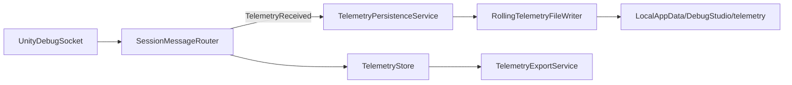
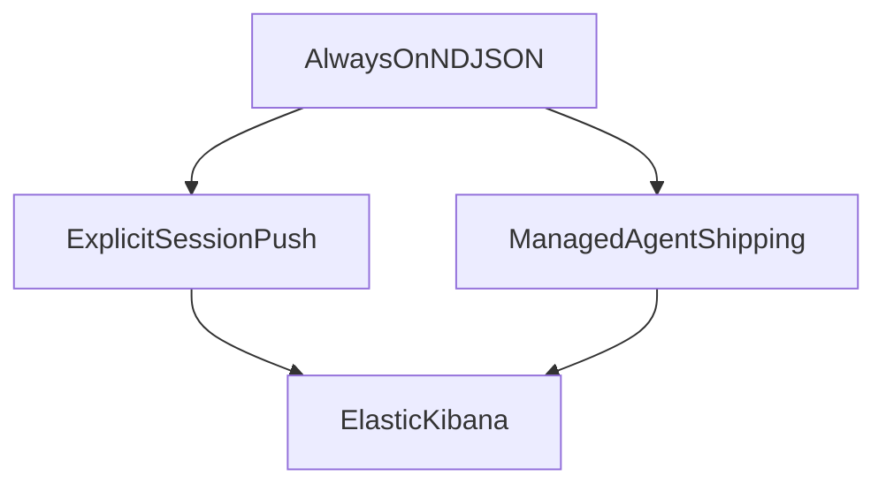
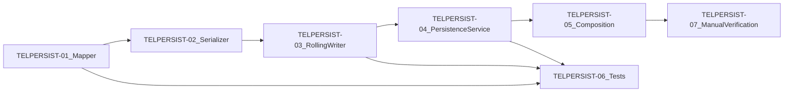

# DebugStudio Telemetry 永続化と Elastic 配信計画

## 目的

DebugStudio が Unity から受信した telemetry を、UI の retain 容量や手動 Export に依存せずローカルへ永続化する。

将来の Elastic/Kibana 運用では、DebugStudio を shipper にせず、安定した NDJSON をファイルベースの agent が配送する構成へ発展させる。

## 決定事項

| 項目 | 決定 |
|---|---|
| 今回の対象 | `Telemetry` フレームのみ |
| ServiceStatus | 今回の自動ファイルには含めない |
| ファイル形式 | NDJSON、日次・サイズ rolling |
| 出力先 | `%LocalAppData%\DebugStudio\telemetry\` |
| ファイル名 | `debugstudio-telemetry_yyyy-MM-dd_NNN.ndjson` |
| 保持 | 10 MB × 10 世代 |
| Elastic Bulk | 手動 Export 専用として維持 |
| Elastic 自動配送 | 今回は実装しない |

Log の自動永続はすでに `%LocalAppData%\DebugStudio\logs\` で稼働している。Telemetry は同じ運用契約に揃える。

## 今回実装する L0 Capture



### 実装構成

1. `TelemetryRecordExportMapper` を追加し、`DebugTelemetryEnvelopeV1` を既存の `TelemetryExportRecord` に正規化する。
   - 既存の [`TelemetryExportService`](../../tools/DebugStudio/src/DebugStudio.App/Core/Services/TelemetryExportService.cs) が持つ telemetry 変換処理を移す。
   - 手動 Export と自動永続で同じ record 形状を使う。

2. `RollingTelemetryFileWriter` を `DebugStudio.Export` に追加する。
   - [`RollingLogFileWriter`](../../tools/DebugStudio/src/DebugStudio.Export/Writers/RollingLogFileWriter.cs) と同じ Channel + 単一 background reader。
   - 日付変更または 10 MB 到達で roll する。
   - shut down 時は queue を flush する。
   - telemetry NDJSON serializer は [`NdjsonTelemetryExportWriter`](../../tools/DebugStudio/src/DebugStudio.Export/Writers/NdjsonTelemetryExportWriter.cs) と同じ JSON 形状にする。

3. `TelemetryPersistencePathPolicy` と `TelemetryPersistenceService` を `DebugStudio.App` に追加する。
   - `TelemetryPersistenceService` は `SessionMessageRouter.TelemetryReceived` を購読する。
   - 受信 callback は enqueue のみ行い、I/O を block しない。

4. [`AppCompositionRoot`](../../tools/DebugStudio/src/DebugStudio.App/Core/Composition/AppCompositionRoot.cs) で初期化・破棄する。
   - Log 永続化と同じく、初期化失敗は `Debug.WriteLine` へ出して shell の起動は継続する。
   - app lifetime の `IAsyncDisposable` に含め、終了時に flush する。

5. テストを追加する。
   - 1 telemetry が NDJSON に書かれる。
   - record の `stream` は `telemetry`。
   - 複数 telemetry の enqueue 後、`DisposeAsync` が全件を flush する。

### 受け入れ確認

1. DebugStudio を起動して Unity を接続する。
2. telemetry を発生させる。
3. `%LocalAppData%\DebugStudio\telemetry\` に NDJSON が増える。
4. 1行の JSON 形状が Telemetry パネルの手動 NDJSON Export と一致する。

## 将来の Elastic/Kibana 体験

### 目標

> 開発者または QA は DebugStudio を起動してプレイするだけでローカル証跡を取得できる。  
> 配信を有効化した端末では、明示的な送信操作なしに Elastic/Kibana で同じセッションを追える。  
> 送信障害があっても、ゲーム、DebugStudio、ローカル証跡は劣化しない。

### 役割分担

| コンポーネント | 責務 |
|---|---|
| Unity | telemetry/log を DebugSocket へ送る。Elastic の認証・送信は持たない |
| DebugStudio | 受信、表示、LocalAppData への versioned NDJSON、手動 Export、設定テンプレート |
| Elastic Agent / Filebeat | file tail、checkpoint、retry、backoff、TLS、Elastic 認証 |
| 運用 | agent 配布、API key の配付と rotation、監視、index lifecycle |

DebugStudio.WPF は常時 shipper を起動・監督しない。WPF の稼働状態に配送可否を依存させると、QA 長時間実行や本番端末で不安定になるため。

### 段階的な体験



| 層 | 体験 | 実装方針 |
|---|---|---|
| L0 Capture | 接続してプレイすればローカルに証跡がある | 今回の Telemetry 永続化と既存 Log 永続化 |
| L1 Verify | 現在セッションを安全に Elastic へ投入して疎通確認する | preflight、対象件数・サイズ表示、専用 `ElasticIngestClient` |
| L2 Ship | プレイするだけで Kibana に増える | 管理された Elastic Agent / Filebeat |

### L1 Verify の要件

- Elastic endpoint と API key の設定有無を検証する。秘密値を画面・ログへ出さない。
- 送信対象は `current session` または `today` に限定する。
- 実行前に stream、件数、概算サイズを表示する。
- 初回は template / ingest pipeline の bootstrap 状態を明示する。
- 成功時は index、件数、Kibana URL を示す。失敗時は安全な診断情報と retry 可否を示す。

既存の `import-telemetry.ps1` / `invoke-ingest.ps1` は operator と CI の導線として維持する。WPF が PowerShell を起動する実装は採用しない。実行ポリシーや profile に依存し、アプリ内の診断・エラー処理を不安定にするためである。

### L2 Ship の要件

初回導線は次の3段に分ける。

1. DebugStudio が NDJSON path 用の agent config template を生成する。
2. 運用が管理する仕組みで API key を注入する。
3. agent を起動し、shipper の health と ingest lag を運用監視する。

DebugStudio が API key を平文 config に書き出したり、agent を内包してプロセス監督したりしない。

## 将来の共通データ契約

Telemetry / Log の NDJSON は、既存フィールドを壊さず以下の共通 envelope を optional で追加できる余地を保つ。

```text
@timestamp
stream
schemaVersion
sessionId
deviceId
application
buildRevision
environment
source
```

- `sessionId`: Unity 起動単位で生成し、全 event に付与する。
- `deviceId`: 生の端末 ID ではなく匿名化済みの識別子を使う。
- `buildRevision` と `environment`: リリース比較、誤投入防止に使う。
- `schemaVersion`: pipeline と旧端末が混在しても安全に解釈できるようにする。

## 運用上の制約

| 領域 | ルール |
|---|---|
| 送信失敗 | L0 Capture を止めない。replay は agent の checkpoint/retry に任せる |
| memory | NDJSON write は非同期。shipper 停滞で DebugStudio の memory を増やさない |
| データ量 | 高頻度 telemetry は sampling / aggregation を producer または transform 層で明示する |
| PII / secrets | message/tag の allowlist と redaction 基準を本番導入前に定義する |
| retention | development / QA / production で index lifecycle を分ける |
| credentials | Unity、`app-config`、リポジトリに Elastic key を置かない |

## ロードマップ

1. L0: Telemetry の自動 NDJSON rolling（本計画の実装対象）
2. Data contract: schema version、session、build、environment の定義と追加
3. L1 bootstrap: agent config template、endpoint preflight、operator による疎通
4. L1 push: current-session を専用 HTTP client で明示投入
5. L2 QA: 管理された Elastic Agent/Filebeat、health と ingest lag の監視
6. Production gate: sampling、redaction、retention、incident runbook、key rotation を満たしてから端末展開

## L0 実装チケット

### 実装順と依存関係



| Ticket | 作業 | 主な対象 | 完了条件 | 実装上の注意 |
|---|---|---|---|---|
| `TELPERSIST-01` | Telemetry export mapper を分離 | `TelemetryExportService.cs`、新規 `TelemetryRecordExportMapper.cs` | 手動 Export が mapper を経由し、既存 telemetry NDJSON のフィールド形状が変わらない | `ServiceStatus` 用の変換は mapper に移さず、今回対象を telemetry に限定する。UTC ticks → Unix milliseconds、tag bit → tag names の既存変換を変えない |
| `TELPERSIST-02` | telemetry NDJSON serializer を共有化 | `NdjsonTelemetryExportWriter.cs`、新規 serializer | 手動 Export と rolling writer が同一 serializer / 同一 JSON options を使う | `@timestamp` や `null` の扱いを既存手動 Export から変えない。JSON の見た目だけを理由に schema を変更しない |
| `TELPERSIST-03` | rolling telemetry writer を追加 | 新規 `RollingTelemetryFileWriter.cs`、writer tests | 非同期 enqueue、日次・10 MB rolling、10 世代保持、Dispose flush が動く | `RollingLogFileWriter` と同じ producer 非 block / 単一 reader を守る。TelemetryStore の容量とは独立に全受信レコードを扱う。Log writer との過度な generic 統合はしない |
| `TELPERSIST-04` | persistence service と path policy を追加 | 新規 `TelemetryPersistenceService.cs`、`TelemetryPersistencePathPolicy.cs` | `SessionMessageRouter.TelemetryReceived` の1件が mapper → writer へ流れる | event handler 内で I/O・await・UI 操作をしない。出力先は `%LocalAppData%\\DebugStudio\\telemetry` に固定し、手動 Export の Documents パスを流用しない |
| `TELPERSIST-05` | DI / app lifetime に接続 | `AppCompositionRoot.cs` | 起動時に初期化し、終了時に log とともに telemetry queue も flush する | 初期化失敗は shell を落とさず `Debug.WriteLine` に診断を出して degrade。dispose の順序を明示し、二重 dispose を発生させない |
| `TELPERSIST-06` | 自動テストを追加 | `TelemetryPersistenceServiceTests.cs`、必要に応じ writer tests | 受信1件、複数件 flush、rolling / JSON shape の回帰を検証 | `LogPersistenceServiceTests` を手本にする。固定の temp directory と確実な cleanup を使い、時計依存の assertion はファイル名パターンまでに留める |
| `TELPERSIST-07` | 手動結合確認とドキュメント更新 | DebugStudio 実行環境、この文書 | Unity 接続後に telemetry NDJSON が増え、手動 Export と意味的に同じ1行を確認する | receiver 側の保存確認であって、Elastic 投入や Filebeat 起動は含めない。DebugStudio 実行中は DLL lock で build が失敗しうるため、ビルド前に終了する |

### チケット共通のコードコメント方針

今回追加・変更する production code には、**日本語で意図を説明するコメントを厚めに書く**。単にコードを日本語へ言い換えるのではなく、将来の保守で誤って壊しやすい設計制約を残す。

必ず説明する対象:

- Channel + 単一 background reader を使う理由（DebugSocket の受信 callback をファイル I/O で止めない）
- rolling の境界（日時・サイズ・世代削除）と、古いファイルを削除してもアプリを停止しない理由
- 手動 Export と自動永続で mapper / serializer を共有する理由（Elastic-ready schema のドリフト防止）
- `Telemetry` と `ServiceStatus` を今回分ける理由（stream 意味と運用判断を混ぜない）
- composition 初期化失敗時に degrade する理由（観測追加が DebugStudio 起動を阻害してはいけない）
- dispose 時に queue を flush する理由（終了直前の観測データを失わない）

コメント粒度の基準:

- `public` 型・重要メソッドには XML documentation を日本語で記述する
- 非自明な private 処理には「なぜこの制約が必要か」を日本語で記述する
- 名前と処理が自明な代入・null check・単純ループには冗長なコメントを付けない
- テストでは、守りたい契約（flush、schema、非 block、rolling）を日本語のテスト名と短いコメントで明示する

### L0 の非目標

- `ServiceStatus` の自動永続
- Elastic Bulk の常時生成
- Filebeat / Elastic Agent の起動・設定・監督
- API key / endpoint の UI 設定
- session / build / environment metadata の追加
- Log と Telemetry の rolling writer の汎用化
