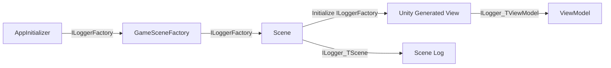

# Game層 Logging 実装ガイド

作成日: 2026-07-11  
対象: `unity/Assets/SampleGame/` のランタイムコード  
状態: 実装着手前

## 1. 目的

Game層の `Debug.Log*` を、既存の `AppLoggerFactory` が構成する
Microsoft.Extensions.Logging / ZLogger 経路へ統一する。

この変更の目的はログ出力先を増やすことではない。既存の rolling file、
DebugSocket realtime stream、カテゴリ単位のフィルタリングを、Game層のログにも
正しく適用することである。

## 2. 決定事項

| 項目 | 決定 | 実装上の意味 |
|---|---|---|
| ログAPI | `ILogger<T>` と ZLogger 拡張 | `IAppLogger<T>` のような独自ラッパーは追加しない |
| factoryの所有 | Bootstrap | `AppLoggerFactory` は `AbstractApplicationInitializer` が一度だけ生成・破棄する |
| Sceneへの配線 | 手動DI | `AppInitializer` → `GameSceneFactory` → `Scene` に `ILoggerFactory` を渡す |
| 子のlogger生成 | 子を生成するクラス | `new` する側が `CreateLogger<TChild>()` を呼ぶ |
| Unity生成View | `Initialize` 注入 | SceneがViewへ `ILoggerFactory` を明示的に渡す |
| DIコンテナ | 導入しない | logger実装を理由に導入しない |
| 汎用Service Locator | 導入しない | `GetService<T>()` / `IServiceProvider` をGameロジックへ渡さない |
| Global logger | 原則導入しない | 注入不能なUnity/Editor生成オブジェクトだけ、必要性をレビューして例外採用する |

## 3. 依存配線の規則



### 3.1 基本規則

1. **ログを書く型だけが `ILogger<T>` を持つ。** ログを書かないDTO、Entity、
   ViewModel、Viewへ予防的に注入しない。
2. **`new` する側が子の `ILogger<T>` を作る。** たとえばViewがViewModelを生成する
   なら、Viewが `ILogger<ViewModel>` を作って渡す。
3. **`ILoggerFactory` は生成境界でのみ保持する。** Factoryを単に中継するだけの
   クラスへ渡さない。
4. **カテゴリはログ発生型と一致させる。** 原則 `CreateLogger<TLogEmitter>()` を使い、
   任意文字列カテゴリを増やさない。
5. **loggerのために生成責務を移動しない。** ViewModelをViewが生成しているなら、
   ログ注入だけを理由にSceneへ移さない。

### 3.2 Unity管理オブジェクト

`MonoBehaviour` / `UIToolkitView` はコンストラクタ注入できない。
Sceneの `OnInitialize` から `Initialize(ILoggerFactory loggerFactory)` を一度だけ
呼び出す。

`Initialize` は以下を満たすこと。

- `null` を拒否する。
- 二重呼び出しを検出して例外にする。
- 依存を受け取るだけで、ログ出力やアセットロードなどの副作用を始めない。
- `OnRootCreated` より先に必要な依存が利用可能になるライフサイクルを確認する。

## 4. 実装チケット

### GL-01: MEL/ZLogger参照の確認とGame asmdef更新

**対象**
- `unity/Assets/SampleGame/OutGame/SampleGame.OutGame.asmdef`
- 必要に応じて `SampleGame.DependOnAll.asmdef`

**実施**
- `Microsoft.Extensions.Logging` と `ZLogger` をGameアセンブリから参照できるようにする。
- 既存のFoundation asmdefにあるDLL名・GUID参照を確認し、Unityのasmdef方針に合わせる。
- ZLogger の `ZLogInformation` / `ZLogError` 等の interpolated-string-handler API は
  **C# 10 必須**（CS8773）。対象 asmdef と同じフォルダに `csc.rsp` を置き、
  `-langVersion:10` を指定する（例: `unity/Assets/SampleGame/OutGame/csc.rsp`）。
  Foundation の `unity/Assets/OneStarMaker/Scripts/Foundation/csc.rsp` と同じ方式。

**完了条件**
- `ILoggerFactory`、`ILogger<T>`、`ZLogInformation` 等がGame層からコンパイルできる。
- 参照追加によってFoundation → Gameの逆依存を作らない。
- ZLogger を使う asmdef フォルダに `csc.rsp`（`-langVersion:10`）が存在する。

**注意**
- 実装者はDLL名を推測して追加しない。既存asmdef・Unityのコンパイル結果で確認する。
- `LangVersion.props` がリポジトリにあっても、Unity の asmdef コンパイルはそれを
  参照しない。言語バージョンは asmdef 隣の `csc.rsp` で制御する。
- テスト用ヘルパーなど、ZLogger API を使わないコードは C# 10 設定を追加せず、
  C# 9 互換の型定義で済ませる。

### GL-02: BootstrapからGameSceneFactoryへのfactory配線

**対象**
- `unity/Assets/SampleGame/DependOnAll/AppInitializer.cs`
- `unity/Assets/SampleGame/DependOnAll/GameSceneFactory.cs`

**実施**
- `AppInitializer.CreateSceneFactory()` がBootstrap所有の `LoggerFactory` を
  `GameSceneFactory` へ渡す。
- `GameSceneFactory` は `ILoggerFactory` をコンストラクタで受け、`readonly` で保持する。

**完了条件**
- Game側で `new AppLoggerFactory()` が存在しない。
- `LoggerFactory` が未初期化になり得る場合は、例外・`NullLoggerFactory`・起動順の
  いずれを採用するかを明示し、曖昧なnull許容にしない。

**必須の日本語コメント**

```csharp
// Bootstrapが構成した唯一のILoggerFactoryを受け取る。
// Game層でAppLoggerFactoryを再生成すると、rolling fileとDebugSocketへの出力経路が分断される。
```

### GL-03: Sceneへのfactory配線とDebug.Log置換

**対象**
- `unity/Assets/SampleGame/OutGame/Title/TitleScene.cs`
- `unity/Assets/SampleGame/OutGame/HpGauge/HpGaugeScene.cs`
- `unity/Assets/SampleGame/OutGame/ConfirmDialog/ConfirmDialogScene.cs`

**実施**
- 各Sceneは `ILoggerFactory` を受け、自身の `ILogger<TScene>` を生成する。
- `Debug.Log`、`Debug.LogWarning`、`Debug.LogError` を対応するZLogger APIへ置換する。
- 例外をログ化する場合は、例外オブジェクトをlogger APIへ渡し、文字列化だけで失わない。

**完了条件**
- 対象Sceneのランタイム `Debug.Log*` がゼロ件。
- `TitleScene` の初期化・ロード、`HpGaugeScene` のSceneDirector取得失敗、
  `ConfirmDialogScene` の既存エラー経路が同等以上のログレベルで記録される。
- ログカテゴリがSceneの完全修飾型名になる。

**必須の日本語コメント**

```csharp
// Sceneごとのカテゴリを維持するため、文字列カテゴリではなく型付きloggerを使用する。
// DebugStudio側で発生元Sceneを絞り込めることを優先する。
```

### GL-04: Unity生成Viewへのfactory配線

**対象**
- `unity/Assets/SampleGame/OutGame/HpGauge/HpGaugeScene.cs`
- `unity/Assets/SampleGame/OutGame/HpGauge/HpGaugeView.cs`
- `unity/Assets/SampleGame/OutGame/ConfirmDialog/ConfirmDialogScene.cs`
- `unity/Assets/SampleGame/OutGame/ConfirmDialog/ConfirmDialogView.cs`

**実施**
- View自身またはそのViewが生成するViewModelがログを書く場合だけ、Sceneが取得したViewへ `Initialize(ILoggerFactory)` を呼ぶ。
- View/ViewModelのどちらもログを書かない場合は、`Initialize(ILoggerFactory)` を追加しない。
- Viewは、自身または自身が生成するViewModelがログを書く場合にだけloggerを生成する。
- ViewModelの生成元は変えない。現在Viewが `new` しているなら、Viewがloggerを渡す。

**完了条件**
- ViewModel生成をログ注入の都合だけでSceneへ移していない。
- loggerを必要とするViewでは、`Initialize` の呼び出し順が `OnRootCreated` と整合し、初期化前にfactoryを使わない。
- loggerを使わないView/ViewModelに依存を追加していない。
- loggerを必要としないViewでは、`Initialize(ILoggerFactory)` を追加せず、不要な依存経路を作っていない。

**必須の日本語コメント**

```csharp
// Unityが生成するViewにはコンストラクタ注入できないため、ログが必要な場合だけ
// SceneBase.OnInitializeから一度だけILoggerFactoryを渡す。
// ログを書かないView/ViewModelには依存を追加せず、不要な初期化経路を増やさない。
// ViewModelの生成責務はViewに残し、ログ注入を理由に責務を移動しない。
```

### GL-05: テスト

**対象**
- `unity/Assets/OneStarMaker/Tests/` 配下の適切なアセンブリ
- 必要に応じて `SampleGame` 用テストasmdef

**実施**
- `NullLoggerFactory.Instance` を用いて、Scene/Factoryの構築が出力先に依存しないことを確認する。
- テスト用logger factoryでカテゴリ名を観測し、対象型のカテゴリが使われることを確認する。
- Unity管理Viewの `Initialize` 二重呼び出しとnullをテストする（実装する場合）。

**完了条件**
- 実ログファイル、DebugSocket、Unity Consoleを前提にしたテストがない。
- 失敗時のログ確認を文字列完全一致へ過度に固定しない。

### GL-06: ドキュメント整合

**対象**
- `unity/Assets/Docs/Architecture/10-coding-rules.md`
- `unity/Assets/README.md`
- `README.md`
- 必要に応じて `unity/Assets/Docs/Architecture/03-di.md`

**実施**
- 未実装の `IAppLogger<T>` / `NullAppLogger<T>` を標準APIとして記述する箇所を、
  実装後の `ILogger<T>` / `ILoggerFactory` / ZLogger方針へ更新する。
- 手動DI継続、DIコンテナ不採用、Service Locator不採用、およびGlobal loggerの例外条件を
  記録する。

**完了条件**
- README、Architecture、コードのログAPIが一致する。
- 「ZLoggerを隠蔽済み」のような事実と異なる主張が残らない。

## 5. 横断的な実装上の禁止事項

- Game層またはViewから `new AppLoggerFactory()` を呼ばない。
- `IServiceProvider`、`GetService<T>()`、汎用 `GameServices` を追加しない。
- ログのためだけにViewModelやServiceの生成責務を別レイヤーへ移さない。
- 通常のScene/Service/ViewModelでGlobal loggerを使わない。
- loggerを持つためだけにログを書かない型のコンストラクタ引数を増やさない。
- ログメッセージのために高頻度パスで不要な文字列補間・`ToString()`・配列生成をしない。
- Telemetryイベントを通常ログへ二重送信しない。既存のTelemetry経路を変更しない。

## 6. 日本語コメントの規約

コメントは「コードを日本語へ翻訳する」ためではなく、将来の実装者が誤った簡略化を
しないために残す。以下の場合は厚めの日本語コメントを必須とする。

| 場所 | コメントで説明すること |
|---|---|
| Bootstrap → factory | factoryを再生成してはいけない理由、出力経路の一意性 |
| Scene → View | Unityライフサイクル上コンストラクタ注入できない理由、初期化タイミング |
| factoryを保持する型 | 子生成の責務があり、単なるService Locatorではないこと |
| Global logger例外 | 注入不能である具体的な理由、使用範囲、初期化・終了時の扱い |
| ZLogger API選択 | 高頻度ログでallocationを避ける理由 |

以下は不要なコメントであり、追加しない。

```csharp
// loggerを代入する。
_logger = logger;
```

## 7. 実装後のレビュー観点

1. すべての変更がGL-01〜GL-06のいずれかに対応しているか。
2. Game層から出るログが既存 `AppLoggerFactory` の一つのインスタンスを通るか。
3. 各loggerのカテゴリが実際の発生型と一致しているか。
4. 依存がコンストラクタまたはUnity用 `Initialize` のシグネチャから判別できるか。
5. Service Locator・独自logger factory・不要なGlobalアクセスが導入されていないか。
6. 日本語コメントが境界・理由・ライフサイクルを説明しており、単なる逐語説明になっていないか。
7. asmdef、Unityコンパイル、関連テスト、既存Telemetryの振る舞いを確認したか。
