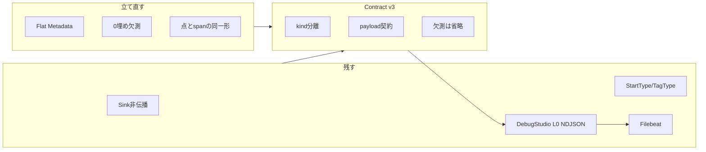

# Telemetry 契約再設計計画（草案）

> 作成日: 2026-07-27  
> ステータス: **合意済み（TC-00）/ 実装中（TC-01〜05 スライス）**  
> 対象: 実装 Agent / 人間  
> 前提: Filebeat → Elastic 投入は稼働。レコードは届くが「情報が無い／0 が多い」と体感される  
> 関連: [12-telemetry.md](../../unity/Assets/Docs/Architecture/12-telemetry.md)、[15-telemetry-v2.md](../../unity/Assets/Docs/Architecture/15-telemetry-v2.md)、[28-telemetry-contract-v3.md](../../unity/Assets/Docs/Architecture/28-telemetry-contract-v3.md)、[DEBUGSTUDIO_TELEMETRY_PERSISTENCE_AND_ELASTIC_DELIVERY_PLAN_2026-07-19.md](DEBUGSTUDIO_TELEMETRY_PERSISTENCE_AND_ELASTIC_DELIVERY_PLAN_2026-07-19.md)、[00-questions-we-are-answering](../reference/00-questions-we-are-answering-2026-07-11.md) Q3

---

## 0. 一文で言うと

> **輸送路（Sink / DebugSocket / DebugStudio / Filebeat）は残し、フラット `Metadata` に全部を詰める契約を廃して、kind 分離 + payload 契約へ立て直す。**

「再興」の対象は OpenTelemetry SDK 導入でも Elastic 全面置換でもなく、**Unity が何を・どの形で・なぜ出すか**の契約である。

---

## 1. 動機（なぜ今か）

### 1.1 観測事実（2026-07-27）

| 観測 | 意味 |
|---|---|
| Telemetry は DebugStudio / Filebeat 経由で Elastic に入る | transport は生きている |
| `elapsedMs` / `cpuTime` / `gpuTime` / `managedMem` / `nativeMem` が 0 の行が多い | パイプライン欠損ではなく **producer 契約の曖昧さ** |
| SceneStreaming の Play 確認は済 | Phase 0 の次の穴は Variant/Hybrid と **観測の実用性** |

### 1.2 根因（実装と設計のズレ）

現行は **1 レコード = 1 フラット `Metadata`**。用途の違う数値を同じ欄に同居させ、未設定を `0` / `-1` で表現している。

| レコード例 | 実際に埋まるもの | Elastic 上の見え方 |
|---|---|---|
| `ProfilerSummary` / `GcSpike` / `UiCost` | cpu/gpu/mem（点イベント）。**`elapsedMs` は意図的に 0** | 件数多く、elapsed=0 が支配的 |
| `CameraSystemSnapshot` | カメラカウンタのみ。elapsed/cpu/mem は空 | 「情報がない」行 |
| `SceneLoad` / `Unload` / `Transition` | elapsed + finish 時メモリ絶対値。**cpu/gpu は未配線で常に 0** | 「半分空っぽ」 |
| `AppStartup` | elapsed のみ。**`metadata: default` で mem も 0** | 芯なのに空 |

加えて [15-telemetry-v2.md](../../unity/Assets/Docs/Architecture/15-telemetry-v2.md) §4 は `memory.before/after/delta` を要求しているが、実装は finish 時の絶対値 1 点（または default）に退化している。

### 1.3 壊してはいけない芯

| 残す | 理由 |
|---|---|
| Sink 例外非伝播 | 観測がゲームを人質に取らない（Q3-2） |
| enum `TelemetryStartType` / `TelemetryTagType` | hot path で文字列増殖しない |
| lightweight span（カスタム） | OTel SDK 全面導入は非目標 |
| DebugSocket → DebugStudio → L0 NDJSON → Filebeat | 既に動く輸送路 |
| Bottleneck 自己申告（閾値 + tag + AlertStream） | v2 の目的そのもの |
| Release でもゲームを止めない | Profiler API 不可時は欠測を明示 |

---

## 2. 目的と成功条件

### 2.1 目的

1. Kibana / DebugStudio で **「この行は何の観測か」が一目で分かる**
2. 未計測と 0 値を混同しない（欠測は省略 or null、点イベントは elapsed 欄を持たない）
3. Phase 0 の問い（起動・シーンロード・Streaming 収束）に **直接答えられるレコード**がある
4. doc 15 のメモリ before/after/delta 意図を、契約として復帰させる

### 2.2 成功の目安（受け入れ）

Kibana（または DebugStudio Telemetry パネル）で次の 5 問に、フィルタなしの「全体平均」ではなく **適切な kind/name フィルタで**答えられること。

| # | 問い | 見るレコード | 必須フィールド |
|:---:|---|---|---|
| Q-A | Title→InGame（AppStartup 後段）は何 ms か | `kind=span`, `name=AppStartup` | `elapsedMs`, 段階識別, memory delta（任意だが推奨） |
| Q-B | 画面遷移 / Cell Add の SceneLoad は何 ms か | `kind=span`, `name=SceneLoad` | `elapsedMs`, target identity, memory before/after/delta |
| Q-C | 直近のフレーム負荷はどれくらいか | `kind=sample`, `name=ProfilerSummary` | `cpuMs`, `gpuMs?`, fps 相当 |
| Q-D | Streaming の常駐 Cell / in-flight はいくつカ | `kind=sample`, `name=StreamingStats`（新） | residentCount, inFlightCount, cancelCount 等 |
| Q-E | Bottleneck は自分で名乗るか | 任意 kind + `tags` に Bottleneck | tagBits / tagNames、閾値超過の根拠値 |

補足: Q-C で `elapsedMs` が無いこと、Q-B で `cpuTime` が無いことは **失敗ではない**。

---

## 3. 提案契約（Telemetry Contract v3）

### 3.1 Kind

```text
span   … 開始〜終了がある処理。elapsedMs 必須。
sample … 周期または状態スナップショット。ゲージ類。elapsedMs を持たない。
event  … 閾値超過・GC・UI コスト等の発火。理由 tag + 関連値。elapsedMs は任意（瞬間なら省略）。
```

| 現行 name | 移行先 kind | 備考 |
|---|---|---|
| AppStartup / SceneLoad / SceneUnload / SceneTransition / CameraSwitch | `span` | |
| ProfilerSummary / CameraSystemSnapshot / StreamingStats（新） | `sample` | |
| GcSpike / UiCost /（閾値超過の即時通知を event 化するなら） | `event` | Bottleneck tag は span/sample にも付与可 |

### 3.2 共通エンベロープ（全 kind）

輸送・相関に必要な最小集合。用途固有数値はここに増やさない。

| フィールド | 必須 | 説明 |
|---|---|---|
| `schemaVersion` | ✅ | v3 から明示（現行 envelope の 1 と区別） |
| `kind` | ✅ | `span` / `sample` / `event` |
| `name` | ✅ | 既存 `TelemetryStartType` 文字列（拡張時は enum 追加） |
| `traceId` / `spanId` / `parentSpanId` | span は ✅ | sample/event は生成 ID でよい |
| `startTimestampUtcTicks` / `endTimestampUtcTicks` | ✅ | sample/event は同一時刻可 |
| `elapsedMs` | span のみ ✅ | sample では **キー自体を出さない**（0 埋め禁止） |
| `isSuccess` | span 推奨 | sample は省略可 |
| `level` | ✅ | Verbose / Summary / Off |
| `tags` / `tagBits` | 任意 | Bottleneck 等 |
| `sessionId` / `producerSequence` | ✅ | 既存相関 |
| `unityFrameAtStart` / `unityFrameAtEnd` | 任意 | |
| `payload` | ✅ | kind×name ごとのオブジェクト（次節） |

### 3.3 Payload 契約（未設定は省略。0 埋め禁止）

#### A. `span` + Scene* / AppStartup — `payload.timing` / `payload.memory`

doc 15 §4 に寄せる。

```json
{
  "kind": "span",
  "name": "SceneLoad",
  "elapsedMs": 312.4,
  "payload": {
    "targetIdentity": "Cell_3_2",
    "memory": {
      "before": { "managedBytes": 120000000, "nativeBytes": 450000000 },
      "after":  { "managedBytes": 128000000, "nativeBytes": 460000000 },
      "delta":  { "managedBytes": 8000000, "nativeBytes": 10000000 }
    }
  }
}
```

| ルール | 内容 |
|---|---|
| Scene span に cpu/gpu を載せない | 区間 CPU 計測が無いのに欄を持たない |
| AppStartup も同じ memory 形 | 現状の `metadata: default` を廃止 |
| Release で native が取れない | `nativeBytes` キー省略（0 を書かない） |
| 早期 return（既に Stable） | 超短 span は許容。memory は省略可だが kind/name/elapsed は出す |

#### B. `sample` + ProfilerSummary — `payload.frame`

```json
{
  "kind": "sample",
  "name": "ProfilerSummary",
  "payload": {
    "fps": 59.2,
    "cpuMs": 14.1,
    "gpuMs": 8.3,
    "managedBytes": 130000000,
    "nativeBytes": 470000000
  }
}
```

| ルール | 内容 |
|---|---|
| `elapsedMs` キーなし | 「時間のかかった処理」ではない |
| GPU 非対応 | `gpuMs` 省略（0 埋めしない）。`gpuAvailable: false` を付けてもよい |
| メモリ取得 API | Editor/Dev 限定である旨を doc に明記。欠測は省略 |

#### C. `sample` + StreamingStats（新・T-08 相当）

```json
{
  "kind": "sample",
  "name": "StreamingStats",
  "payload": {
    "focusCellId": "Cell_3_2",
    "desiredCount": 9,
    "residentCount": 9,
    "inFlightAddCount": 1,
    "pendingUnloadCount": 0,
    "cancelCountWindow": 2
  }
}
```

WSC / Session 配線から周期 or 変化時 emit。SceneLoad span に混ぜない。

#### D. `event` + GcSpike / UiCost

```json
{
  "kind": "event",
  "name": "GcSpike",
  "tags": ["AllocSpike", "Bottleneck"],
  "payload": {
    "gcGen0Delta": 2,
    "unityFrame": 4821
  }
}
```

### 3.4 現行フラット Metadata との関係

```text
現状: TelemetryRecord + Metadata{ cpu, gpu, managed, native, scene*, camera* }
  ↓
提案: TelemetryRecord(envelope) + kind + payload(discriminated)
```

実装選択肢（合意時に 1 つ選ぶ）:

| 案 | 内容 | 向いている場合 |
|---|---|---|
| **A. 段階移行** | envelope に `kind` 追加。payload は JSON/構造化フィールドを増やし、旧フラット欄は deprecated で併記期間を置く | Filebeat 既存 dashboard を壊したくない |
| **B. 切替** | schemaVersion=3 で旧欄を削除。DebugStudio mapper / index template を同時更新 | きれい好き・既存 Kibana 資産が薄い |

**草案の既定推奨: A（段階移行）**。併記期間中も「消費者は payload / kind を正とする」。

---

## 4. 非目標（やらない）

| やらない | 理由 |
|---|---|
| OpenTelemetry .NET/Unity SDK 全面導入 | hot path・依存・ライセンス面のコストが Phase 0 に見合わない。概念（TraceId 等）は既に借用済み |
| Unity 内に Elastic 固有型を持ち込む | DebugStudio.Export / Filebeat 側の責務 |
| 「全レコードが全フィールドを埋める」 | 観測種が違うのに無理に揃えると再び 0 埋め地獄 |
| 統計的異常検知 | doc 15 どおりデータ蓄積後 |
| org 級 Catalog / Variant Registry 観測 | Phase 1。本計画の前段ではない |
| HLOD / Proxy テレメトリ | Streaming §22 以降 |

---

## 5. 影響範囲（実装フェーズ用の地図）

計画段階では変更しない。実装時の触点の見取り図のみ。

| 層 | 主な触点 |
|---|---|
| Foundation | `TelemetryRecord`, `Metadata`（縮小 or 廃止）, `AppTelemetry.FinishSpan` / `WriteRecord`, `DebugTelemetryEnvelopeV1`, `JsonFileTelemetrySink` |
| Runtime | `SceneDirector.*` FinishSpan 引数, `RuntimeTelemetryMetadataFactory`, `AbstractApplicationInitializer` AppStartup, Streaming sample 新設 |
| Debug | `DebugProfilerView.WriteProfilerTelemetry`（elapsed=0 廃止 → kind=sample） |
| Camera | `CameraSystemTelemetryEmitter` → sample payload |
| DebugStudio | Contracts envelope, `TelemetryRecordExportMapper`, Elastic index template / ingest pipeline / Kibana saved objects |
| Docs | 12 / 15 を v3 契約へ追記、または `16-telemetry-contract-v3.md` 新設 |

テスト: 既存 Telemetry / DebugStudio roundtrip を schemaVersion と kind で拡張。Unity EditMode で「sample に elapsedMs キーが無い」「Scene span に cpu キーが無い」を契約テスト化するのが望ましい。

---

## 6. 実装チケット案（合意後）

順序は **契約ドキュメント → envelope → producer 上位優先 → 消費者 → Streaming sample**。

| ID | 内容 | 受入 |
|---|---|---|
| **TC-00** | 本計画の合意（kind / payload / 移行案 A or B / 5 問） | 本文 §2–§4 が「正」とマークされる |
| **TC-01** | Architecture 正典化（12/15 追記 or 16 新設）。現行 flat Metadata を deprecated 宣言 | doc が実装の正になる |
| **TC-02** | envelope に `kind` + `payload`（または typed payload union）。DebugStudio Contracts 同期 | roundtrip テスト緑 |
| **TC-03** | AppStartup: `metadata: default` 廃止。memory before/after/delta + 段階名 | Q-A が Kibana で答えられる |
| **TC-04** | SceneLoad/Unload/Transition: doc 15 形の memory payload。cpu/gpu 欄を出さない | Q-B。Scene* で cpu=0 が消える |
| **TC-05** | ProfilerSummary / Camera snapshot: kind=sample。elapsedMs キー削除 | Q-C。全体平均の elapsed=0 汚染が減る |
| **TC-06** | GcSpike / UiCost: kind=event + 薄い payload | event としてフィルタ可能 |
| **TC-07** | Elastic template / pipeline / Kibana を kind・payload 対応。移行期は旧欄も読む | Filebeat 投入後に新フィールドで可視化 |
| **TC-08** | StreamingStats sample（21 の T-08） | Q-D |
| **TC-09** | 旧フラット欄の削除 or 永久 deprecated 決定 | 併記期間終了 |

推奨スライス（最初の実装セッション）: **TC-00 → TC-01 → TC-02 → TC-03 → TC-05**（起動と点イベント汚染の除去で体感が最も変わる）。

---

## 7. 移行・互換



| 期間 | Unity | DebugStudio / Elastic |
|---|---|---|
| Phase M1 | kind + payload を追加。旧フラットも埋める（deprecated） | mapper は payload 優先、無ければ旧欄 |
| Phase M2 | 主要 producer が payload のみ意味を持つ | Kibana を payload / kind ベースに更新 |
| Phase M3 | 旧フラット書き出し停止（案 B ならここがカットオーバー） | template から旧欄削除可 |

---

## 8. リスクと判断メモ

| リスク | 緩和 |
|---|---|
| schema 変更で既存 Kibana 可視化が死ぬ | 既定は段階移行 A。旧欄併記 |
| payload を string JSON にすると alloc | Unity 側は struct/typed writer を維持し、Serialize 境界だけでオブジェクト化 |
| kind 増殖 | 新 kind 禁止。増やすのは name（StartType）と payload 形のみ |
| Streaming sample がうるさすぎる | 変化時 + 最大 1 Hz などを TC-08 で決める |
| 「再設計」が巨大化 | 本日は計画のみ。実装は §6 の最初のスライスに閉じる |

---

## 9. 未決事項（合意済み 2026-08-01）

1. **移行戦略**: **A 段階併記**（kind + payload 追加、旧フラットは deprecated 併記）
2. **正典の置き場**: **`28-telemetry-contract-v3.md` 新設**（§16 は Update 基盤が占有）+ 12/15 からリンク
3. **Bottleneck 超過 span を event としても二重発行するか**: **しない**（span に tag、AlertStream 現状維持）
4. **StreamingStats の emit 周期**: **変化時 + 上限 1 Hz**（TC-08 で実装）
5. **単位**: **ワイヤは bytes（整数）。表示層で MB**

---

## 10. 次セッション開始プロンプト（コピー用）

```
docs/planning/TELEMETRY_CONTRACT_REDESIGN_PLAN_2026-07-27.md に従い、
まず未決事項 §9 を確認したうえで TC-01〜TC-05 を実装して。
transport（Sink/DebugSocket/Filebeat）は壊さない。
flat Metadata の 0 埋め欠測をやめ、kind + payload 契約へ段階移行（案 A）。
OpenTelemetry SDK 導入はしない。
```

---

## 11. 更新履歴

| 日付 | 内容 |
|---|---|
| 2026-07-27 | 草案。現行 flat Metadata / 0 埋めの診断と Contract v3（kind・payload・5 問・チケット）を記載。実装は行わない |
