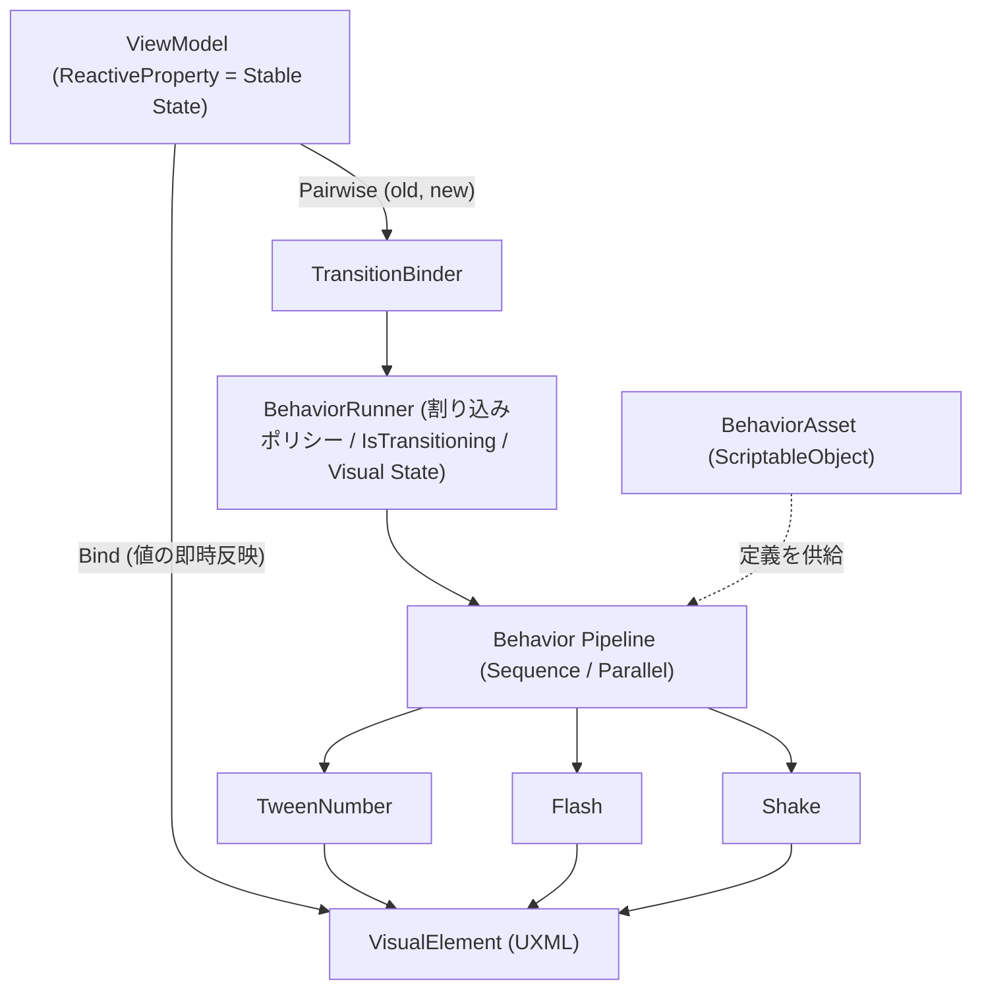

# UI Behavior Pipeline 施行表（実装チケット一覧）

作成日: 2026-07-06
対象計画: `docs/planning/UI_MVVM_Behaviour_Plan.md`（本施行で v0.2 に改訂する）

本ドキュメントは **施行者（人間または実装エージェント）が単独で作業できる** ことを目的とした実装チケット集である。
各チケットは「目的 / 作業内容 / 対象ファイル / 受入条件 / 注意点」を持ち、そのままチケット管理システムへ転記できる粒度とする。

---

## 0. 前提（施行者が最初に読むこと）

### 0.1 確定済みの方針（再議論しない）

| # | 決定 | 補足 |
|---|---|---|
| 1 | **UI Toolkit に直行**（uGUI フェーズは飛ばす） | `06-ui.md` の「Phase 4 で移行」は本施行で改訂する |
| 2 | **R3 ベースの独自バインディング** | Unity 6 組込 Data Binding は使わない。Transition Resolver は R3 `Pairwise` で実装 |
| 3 | **コード API を正とする** | ScriptableObject / UXML DSL は直列化表現。UXML DSL は今回スコープ外 |
| 4 | **最小 Vertical Slice で設計を検証** | HP ゲージ更新 + 確認ダイアログ開閉の 2 ユースケースのみ |
| 5 | 既存の UILayer 6層 / 1シーン=1UIView / `ViewIn`・`ViewOut` 抽象 / SceneDirector 仲介は**維持** | `UIView` の public シグネチャを変えない |

### 0.2 中核不変条件（全チケット共通の正しさの定義）

> **遷移が走っていないとき、Visual State は常に Stable State から一意に導出される値と一致する。**

- どの順序で割り込みが起きても、全 Behavior の完了・キャンセル後に表示値は `f(StableState)` へ収束すること。
- キャンセル時は最終値へスナップする。これは BehaviorRunner の責務であり、テスト（T-15）で検証する。

### 0.3 撤退ライン（T-17 で判定）

1. **記述量テスト**: HP ゲージの「Tween+Flash+Shake、連打で FromCurrent 追従」が、`ViewIn` に LitMotion を直書きした場合と比べてコード量・可読性で負けていないこと。
2. **割り込みテスト**: ダイアログの「Opening 途中で Close」が、Runner のポリシー指定だけで（画面固有のフラグ管理なしで）正しく動くこと。

失敗時は Behavior 層（T-07〜T-12）のみ破棄し、`UIView.ViewIn/ViewOut` + LitMotion 直書き（`06-ui.md` §6.9）へ撤退する。MVVM 基底と UICommon の UI Toolkit 対応（T-03〜T-06)は撤退しても残す。

### 0.4 必読ファイル

| ファイル | 読む理由 |
|---|---|
| `docs/planning/UI_MVVM_Behaviour_Plan.md` | 設計思想の原典（T-01 で v0.2 化） |
| `unity/Assets/Docs/Architecture/06-ui.md` | UICommon/UIView/UILayer の正本（T-02 で改訂） |
| `unity/Assets/Docs/Architecture/05-scene.md` | シーンライフサイクルと ViewIn/ViewOut の呼び出しタイミング |
| `unity/Assets/Docs/Architecture/03-di.md` | 手動 DI の規約（コンテナ禁止） |
| `unity/Assets/OneStarMaker/Scripts/Runtime/UISystem/UIView.cs` | 変更してはいけない抽象契約 |
| `unity/Assets/OneStarMaker/Scripts/Runtime/UISystem/UICommon.cs` | T-06 の改修対象 |

### 0.5 アーキテクチャ全体図

---

## 1. チケット一覧（依存関係つき）

| ID | タイトル | 依存 | 種別 | Unity Editor 手作業 |
|---|---|---|---|---|
| T-01 | 計画書 v0.2 改訂 | なし | ドキュメント | 不要 |
| T-02 | 06-ui.md 改訂 + 旧ガイド廃止注記 | T-01 | ドキュメント | 不要 |
| T-03 | MVVM 基底（ViewModelBase / BindingExtensions） | なし | Runtime | 不要 |
| T-04 | UIToolkitView（UIView 派生の UI Toolkit ビュー基底） | T-03 | Runtime | 不要 |
| T-05 | PanelSettings と UIScene への PanelRenderer 組込 | T-04 | アセット | **必要** |
| T-06 | UICommon の UI Toolkit 経路（レイヤーコンテナ + Blocker） | T-04, T-05 | Runtime | 不要 |
| T-07 | Behavior 契約（IUIBehavior / UIBehaviorContext / 合成） | なし | Runtime | 不要 |
| T-08 | BehaviorRunner（割り込みポリシー / IsTransitioning / 収束保証） | T-07 | Runtime | 不要 |
| T-09 | TransitionBinder（R3 Pairwise ヘルパ） | T-03, T-08 | Runtime | 不要 |
| T-10 | BehaviorAsset（ScriptableObject 直列化） | T-07 | Runtime | 不要 |
| T-11 | 具象 Behavior: TweenNumber / Flash / Shake | T-07, T-08 | Runtime | 不要 |
| T-12 | 具象 Behavior: Fade / Scale（Rewind 対応） | T-07, T-08 | Runtime | 不要 |
| T-13 | Vertical Slice 1: HP ゲージ画面 | T-06, T-09, T-11 | SampleGame | **必要** |
| T-14 | Vertical Slice 2: 確認ダイアログ | T-06, T-09, T-12 | SampleGame | **必要** |
| T-15 | テスト: Behavior コア（ポリシー / 収束 / 合成） | T-08, T-11, T-12 | Tests | 不要 |
| T-16 | テスト: UICommon レイヤー順 / Blocker / bind 冪等 | T-06, T-03 | Tests | 不要 |
| T-17 | 撤退ライン判定と計画書へのユースケース追記 | T-13, T-14, T-15, T-16 | レビュー | 不要 |

推奨施行順: T-01 → T-02 → (T-03, T-07 並行可) → T-04 → T-05 → T-06 → T-08 → T-09 → T-10 → T-11 → T-12 → T-13 → T-14 → T-15 → T-16 → T-17

---

## 2. チケット詳細

### T-01: 計画書 v0.2 改訂

- **目的**: `UI_MVVM_Behaviour_Plan.md` を評価結果反映済みの v0.2 とし、以後の実装の正とする。
- **対象**: `docs/planning/UI_MVVM_Behaviour_Plan.md`
- **作業内容**:
  1. 冒頭を「v0.2」へ更新し、改訂履歴を追加。
  2. 技術マッピング章を追加: Stable State = R3 `ReactiveProperty`、Transition Resolver = R3 `Pairwise` ヘルパ（TransitionBinder）、Behavior Runner = 独自実装 + LitMotion、View = UI Toolkit (UXML)。
  3. 割り込みポリシーを 3 つに限定して明記: `Restart` / `FromCurrent` / `Rewind`（ブレンド等は将来課題へ移動）。
  4. §0.2 の**収束不変条件**を「設計原則」章の筆頭へ追加。
  5. Runner が `IsTransitioning`（読み取り専用 Observable）を公開する旨を追加（状態の権威は ViewModel、遷移中フラグの権威は Runner）。
  6. 設計原則3を「コード API を正とし、宣言（SO/UXML）はその直列化表現とする」へ弱める。UXML DSL（`<On event=...>`）は「将来の拡張」章へ移動。
  7. 副作用系 Behavior（PlaySE / Particle）の章を追加: `UIBehaviorContext` へ手動 DI でサービスを注入する。UI Toolkit で表現できない演出（パーティクル・グロー等）は外部演出システムを叩く逃げ道を明記（今回は実装しない）。
  8. 「ユースケース」章の骨組みを追加（HP ゲージ / ダイアログの 2 節。実コード例は T-17 で追記）。
  9. 末尾の「最後に」節（レビューコメント）は削除し、内容をユースケース章の方針として吸収。
- **受入条件**: 上記 9 点がすべて反映され、原典の「Stable State / Transition 分離」「Model は補間値を持たない」の思想が変質していないこと。

### T-02: 06-ui.md 改訂 + 旧ガイド廃止注記

- **目的**: 公式アーキテクチャ文書と新方針（UI Toolkit 直行）の矛盾を解消する。
- **対象**: `unity/Assets/Docs/Architecture/06-ui.md`、`docs/planning/UIFRAMEWORK_IMPLEMENTATION_GUIDE_2026-05-27.md`
- **作業内容**:
  1. `06-ui.md` §6.8 の「uGUI で開始する」を「UI Toolkit で開始する」へ改訂。移行パス表を「現行(UI Toolkit) / レガシー(uGUI, DebugProfilerView のみ)」の並記に変更。
  2. IK-10 と FE-4 を「UI Toolkit 直行済み。uGUI 経路は Debug 用レガシーとして暫定維持」に更新。
  3. §6.7 に UI Toolkit 経路のフロー（レイヤーコンテナへの `Insert`、`pickingMode` Blocker）を追記（実装は T-06 の内容と一致させる）。
  4. UI_MVVM_Behaviour_Plan v0.2 への参照リンクを追加。
  5. `UIFRAMEWORK_IMPLEMENTATION_GUIDE_2026-05-27.md` の冒頭に廃止注記を追加: 「本ガイドは UI_MVVM_Behaviour_Plan v0.2 に統合済み。uGUI 二重バックエンド案と独自レイヤー再定義（Transient/Screen/...）は**不採用**」。本文は履歴として残す。
- **受入条件**: `06-ui.md` に uGUI 前提と UI Toolkit 前提の記述が矛盾なく共存し、UILayer 6層・1シーン=1UIView・ViewIn/ViewOut 契約の記述が無変更であること。
- **注意点**: `06-ui.md` の暗黙知テーブル（IK-1〜IK-9）のうち uGUI 固有のもの（SetParent、SiblingIndex、sub-canvas）は削除せず「uGUI レガシー経路」の節へ移動する。

### T-03: MVVM 基底（ViewModelBase / BindingExtensions）

- **目的**: R3 購読の寿命管理を統一した MVVM 基底を作る。
- **新規ファイル**（`unity/Assets/OneStarMaker/Scripts/Runtime/UISystem/Mvvm/`）:
  - `ViewModelBase.cs`: `IDisposable` 実装。`protected CompositeDisposable Disposables { get; }` を持ち、`Dispose()` で一括破棄。二重 Dispose 安全。
  - `BindingExtensions.cs`: 最小限の R3 → VisualElement バインディング拡張。
    - `IDisposable BindText(this Label label, Observable<string> source)`
    - `IDisposable BindText<T>(this Label label, Observable<T> source, Func<T, string> formatter)`（ZString 等でアロケーション配慮）
    - `IDisposable BindClick(this Button button, Action onClick)`（`clicked` イベントの購読解除を IDisposable 化）
    - `IDisposable BindVisible(this VisualElement element, Observable<bool> source)`（`style.display` 切替）
- **受入条件**:
  - ViewModel 層のコードが `UnityEngine.UIElements` 以外の Unity API に依存しないこと（ViewModelBase 自体は Unity 非依存）。
  - すべての Bind 拡張が `IDisposable` を返し、Dispose 後にコールバックが発火しないこと。
- **注意点**:
  - `#nullable enable` 必須。namespace は `OneStarMaker.Runtime.UISystem.Mvvm`。
  - R3 の `Subscribe` 戻り値は必ず呼び出し側の `CompositeDisposable` へ集約させる設計にする（拡張メソッド内で握りつぶさない）。
  - 既存コードのスタイル（日本語 XML ドキュメントコメント、`s_`/`_` プレフィックス）に合わせる。

### T-04: UIToolkitView（UI Toolkit ビュー基底）

- **目的**: 既存 `UIView` 契約を維持したまま UI Toolkit の実体を持つビュー基底を作る。
- **新規ファイル**: `unity/Assets/OneStarMaker/Scripts/Runtime/UISystem/UIToolkitView.cs`
- **作業内容**:
  - `public abstract class UIToolkitView : UIView`。
  - `[SerializeField] private VisualTreeAsset _visualTreeAsset;` を持ち、`CloneTree()` した結果を `public VisualElement Root { get; }` として公開する（初回アクセス時または明示 `Initialize` 時に生成）。
  - `protected virtual void OnRootCreated(VisualElement root)` フック（派生クラスがクエリとバインドを行う場所）。
  - `ViewIn(ct)` / `ViewOut()` は `UIView` の virtual をそのまま継承（デフォルト即時完了）。
  - GameObject 破棄時に `Root.RemoveFromHierarchy()` と ViewModel の Dispose を保証する（`OnDestroy`）。
- **受入条件**: `UIView` の public シグネチャ（`ViewIn`/`ViewOut`/`GetUILayer`）を一切変更していないこと。`SceneBase` が `GetComponentInChildren<UIView>` で検出できる MonoBehaviour であること。
- **注意点**:
  - シーン上の配置規約は既存どおり「Canvas 直下に UIView」だが、UI Toolkit ビューは Canvas を必要としない。`SceneBase.Initialize` の検索ロジック（RootObjects から UIView 検索）を確認し、**Canvas 前提の検索になっている場合は Canvas なしでも検出できるよう SceneBase 側を修正**する（`unity/Assets/OneStarMaker/Scripts/Runtime/SceneSystem/SceneBase.cs`）。修正時は既存テスト（`unity/Assets/OneStarMaker/Tests/Scene/`）を壊さないこと。

### T-05: PanelSettings と UIScene への PanelRenderer 組込

> **改訂（2026-07-06）**: `UIDocument` は Unity 6.5 で obsolete となり Inspector から新規追加不可のため、後継の `PanelRenderer` を使用する。

- **目的**: UICommon が UI Toolkit パネルを持てるようにする。
- **対象**: `unity/Assets/OneStarMaker/Scenes/UIScene.unity`、新規 `unity/Assets/OneStarMaker/UISettings/OneStarMakerPanelSettings.asset`
- **作業内容**（Unity Editor 上で実施）:
  1. `PanelSettings` アセットを作成。Scale Mode = `Scale With Screen Size`、Reference Resolution = 1920x1080（プロジェクト標準に合わせる。不明なら 1920x1080）。
  2. `UIScene.unity` の UICommon GameObject に `PanelRenderer` コンポーネントを追加し、作成した PanelSettings を割り当てて UICommon の `_panelRenderer` に参照を設定（Source Asset は空。ルートは T-06 のコードが `UIReloadCallback` 内で構築する。空 Source Asset で callback が発火しない場合は空の UXML を 1 枚割り当てる）。
  3. `PanelSettings.sortingOrder` は **uGUI の Debug 用 Canvas より背面**になる値に設定する（uGUI Canvas の sortingOrder を確認し、それ未満とする。例: uGUI 側=100, PanelSettings=0）。理由: `DebugProfilerView`（uGUI）は常に最前面の Debug レイヤーであるため。
  4. アセットと `.meta` をコミットに含める。
- **受入条件**: Play Mode で UICommon 上に空の UI Toolkit パネルが表示され（描画物なし）、既存 uGUI の表示・入力が壊れないこと。
- **注意点**: `.meta` は必ず Unity に生成させる（手書きしない）。Addressables グループへの登録が必要か `AddressableAssetsData` を確認する（UIScene.unity が Addressables 経由でロードされるため、PanelSettings が参照でビルドに含まれることを確認）。

### T-06: UICommon の UI Toolkit 経路

- **目的**: UICommon が `UIToolkitView` をレイヤー順に管理できるようにする。
- **対象**: `unity/Assets/OneStarMaker/Scripts/Runtime/UISystem/UICommon.cs`（改修）
- **作業内容**:
  1. `PanelRenderer` の `RegisterUIReloadCallback`（version 付き）で受け取った root 直下に UILayer 6層分のコンテナ `VisualElement`（name: `Layer-Background` 等、フルスクリーン絶対配置、`pickingMode = Ignore`）を順に構築（`PanelRenderer` は root を直接公開しないため）。
  2. `AddUIView`: 引数の `view` が `UIToolkitView` の場合、`view.Root` を該当レイヤーコンテナへ `Add`（後入れが末尾 = 前面）。Modal/Dialog/Loading なら直前にフルスクリーン Blocker `VisualElement`（`pickingMode = Position`、背景透明）を挿入。その後 `await view.ViewIn(ct)`。
  3. `RemoveUIView`: `await view.ViewOut()` → Blocker 除去 → `Root.RemoveFromHierarchy()`。
  4. 既存 uGUI 経路（`SetParent` / `SiblingIndex` / Image Blocker）は **無変更で維持**し、`UIToolkitView` かどうかの分岐で振り分ける。`UIViewEntry` に VisualElement Blocker の保持を追加。
- **受入条件**:
  - `UIToolkitView` と uGUI `UIView` が同時に登録されても両経路が干渉しないこと。
  - レイヤー順: 同レイヤー内は後入れ前面。異レイヤーはコンテナ構造で保証。
  - Modal/Dialog/Loading で Blocker が生成され、Remove で確実に除去されること。
  - 既存の `DebugProfilerView`（uGUI, Debug レイヤー）が従来どおり動くこと。
- **注意点**:
  - uGUI 経路の `RefreshSiblingOrder` ロジックに触らない。
  - Blocker は `ownerId` を name に含めて生成し、リークを追いやすくする（既存 uGUI Blocker と同じ流儀）。
  - `ViewOut` は非キャンセル（E-5）。`AddUIView` 中のキャンセル時に VisualElement が中途半端に残らないよう try/catch で除去する。

### T-07: Behavior 契約と合成

- **目的**: Behavior Pipeline の中核契約を固定する。
- **新規ファイル**（`unity/Assets/OneStarMaker/Scripts/Runtime/UISystem/Behaviors/`）:
  - `IUIBehavior.cs`: `UniTask ExecuteAsync(UIBehaviorContext context, CancellationToken ct);`
  - `UIBehaviorContext.cs`: 以下を持つ class（使い回すため mutable、ただし Target/Payload は生成時固定）:
    - `VisualElement Target`（演出対象）
    - `TransitionPayload Payload`（`object? OldValue` / `object? NewValue`。ジェネリクス版アクセサ `GetOld<T>()/GetNew<T>()` 付き）
    - `VisualStateStore VisualState`（key-value。例: 表示中 HP。`GetOr<T>(key, fallback)` / `Set<T>(key, value)`）
    - `IServiceResolver? Services`（手動 DI 注入ポイント。今回は null 許容のプレースホルダ interface のみ定義し、実装しない）
  - `SequenceBehavior.cs`: 子 Behavior を順次 await。途中キャンセルで残りを実行しない。
  - `ParallelBehavior.cs`: `UniTask.WhenAll` で並列実行。1 つの失敗/キャンセルが全体へ伝播。
- **受入条件**: Behavior 実装が `UnityEngine.UIElements` と LitMotion 以外のフレームワーク層に依存しないこと。Sequence/Parallel が入れ子で合成可能なこと。
- **注意点**:
  - hot path（毎フレーム/毎ヒット実行）で LINQ・boxing・文字列連結を避ける（既存規約）。`TransitionPayload` の boxing は許容（発火は変化時のみ）だが、ジェネリック版 `TransitionPayload<T>` の追加は T-17 の評価後でよい。
  - namespace は `OneStarMaker.Runtime.UISystem.Behaviors`。

### T-08: BehaviorRunner（割り込みポリシー / IsTransitioning / 収束保証）

- **目的**: 時間管理・割り込み・Visual State 保持を一手に担う Runner を実装する。
- **新規ファイル**（同フォルダ）:
  - `InterruptPolicy.cs`: enum `{ Restart, FromCurrent, Rewind }`
  - `BehaviorRunner.cs`
- **仕様**:
  - Runner は **1 ターゲット（VisualElement）+ 1 トラック** を担当する軽量オブジェクト。View が必要数だけ生成し `CompositeDisposable` で破棄。
  - `UniTask Run(IUIBehavior behavior, TransitionPayload payload, CancellationToken ct)`: 実行中に再度呼ばれた場合、`InterruptPolicy` に従う:
    - `Restart`: 実行中をキャンセル → **最終値へスナップ**（下記）→ 新規実行。
    - `FromCurrent`: 実行中をキャンセル（スナップしない）→ `VisualState` に残る現在値を OldValue として差し替えて新規実行。
    - `Rewind`: 実行中をキャンセルし、`IRewindableBehavior`（`UniTask RewindAsync(UIBehaviorContext, float progress, CancellationToken)`）を逆再生。非対応 Behavior は `Restart` 扱いにフォールバック。
  - **収束保証**: キャンセル時に `behavior` が `ISnapBehavior`（`void SnapToEnd(UIBehaviorContext)`）を実装していれば最終値を即時適用する。Runner の `DisposeAsync`/破棄時も同様。
  - `ReadOnlyReactiveProperty<bool> IsTransitioning` を公開（開始で true、完了・キャンセル・逆再生完了で false。多重割り込みでも true 期間が途切れない）。
  - 内部の `CancellationTokenSource` は外部 ct と `CreateLinkedTokenSource` で連結。
- **受入条件**: T-15 のテスト項目（ポリシー 3 種 / 収束 / IsTransitioning）を満たすこと。
- **注意点**:
  - Rewind の progress 計算は「経過時間 / 想定所要時間」の近似でよい（v0.2 の割り切り）。厳密なタイムライン逆再生は将来課題。
  - Runner 自体は MonoBehaviour にしない（純 C#）。時間は LitMotion / UniTask に委ねる。

### T-09: TransitionBinder（R3 Pairwise ヘルパ）

- **目的**: 「ReactiveProperty の変化 → Runner 起動」を 1 行で書けるようにする。
- **新規ファイル**: 同フォルダ `TransitionBinder.cs`
- **仕様**:
  - `static IDisposable BindTransition<T>(this ReadOnlyReactiveProperty<T> source, BehaviorRunner runner, IUIBehavior behavior)`:
    `source.Pairwise().Subscribe(pair => runner.Run(behavior, new TransitionPayload(pair.Previous, pair.Current), runner.LifetimeToken).Forget())`
  - 初期値では発火しない（`Pairwise` は 2 値目から発火する性質をそのまま使う。初期表示は通常バインド `BindText` 側が担う）。
- **受入条件**: 購読が `IDisposable` として返り、Dispose 後に Behavior が起動しないこと。`Forget()` で例外が握りつぶされないよう `UniTaskScheduler.UnobservedTaskException` に流れることを確認。
- **注意点**: R3 の `Pairwise` の正確な API 名はプロジェクト導入バージョン（R3 1.3.1）で確認する。存在しない場合は `Scan` か `Zip(source.Skip(1))` で等価実装する。

### T-10: BehaviorAsset（ScriptableObject 直列化）

- **目的**: Behavior 合成を Inspector で編集・差し替え可能なアセットにする。
- **新規ファイル**: 同フォルダ `BehaviorAsset.cs`
- **仕様**:
  - `[CreateAssetMenu(menuName = "OneStarMaker/UI/Behavior Asset")]`
  - `[SerializeReference] private List<IUIBehavior> _steps;` + 実行モード（Sequence/Parallel）。
  - `IUIBehavior Build()` で Sequence/Parallel に組み立てて返す。
  - 各具象 Behavior（T-11/T-12）は `[Serializable]` にし、パラメータ（duration, color, amplitude 等）を `[SerializeField]` で持つ。
- **受入条件**: Inspector 上でステップの追加・並べ替え・パラメータ編集ができ、`Build()` の結果がコード API で組んだものと等価であること。
- **注意点**: `[SerializeReference]` はフィールドリネームに脆い。具象 Behavior のフィールド名は最初から慎重に決める。カスタムエディタ（ドロップダウンでの型選択 UI）は作らない（Unity 標準の SerializeReference ドロップダウンで足りる。足りない場合も今回はスコープ外）。

### T-11: 具象 Behavior: TweenNumber / Flash / Shake

- **目的**: HP ゲージユースケースに必要な Behavior を実装する。
- **新規ファイル**（`Behaviors/Library/`）: `TweenNumberBehavior.cs`, `FlashBehavior.cs`, `ShakeBehavior.cs`
- **仕様**:
  - `TweenNumberBehavior`: Payload の old→new を LitMotion で補間し、`ctx.Target`（Label 想定）へ整数文字列を書き込む。毎フレーム `ctx.VisualState.Set("displayValue", current)` を更新（`FromCurrent` の起点になる）。`ISnapBehavior` 実装（最終値を即時表示）。フォーマッタは ZString で GC 回避。
  - `FlashBehavior`: `ctx.Target.style.color`（または `unityBackgroundImageTintColor`）を指定色 → 元色へ短時間で戻す。`ISnapBehavior` 実装（元色へ復帰）。元色は初回実行時に VisualState へ保存し、多重実行で「元色」が汚染されないようにする。
  - `ShakeBehavior`: `ctx.Target.style.translate` を LitMotion の Punch/減衰振動で揺らし、終了時に translate(0,0) へ戻す。`ISnapBehavior` 実装。
- **受入条件**: 3 つとも Sequence/Parallel の任意の組合せで動作し、キャンセル時のスナップで表示が崩れない（色残り・ズレ残りがない）こと。
- **注意点**:
  - LitMotion は `Bind(x => ...)` で VisualElement の style へ反映し、`.ToUniTask(ct)` で await。**`.AddTo(gameObject)` は VisualElement には使えない**ため、寿命は Runner のキャンセルトークンで保証する（規約 E-4 の趣旨を ct で満たす）。
  - `style.translate` 等の StyleProperty 書き込みは boxing を伴う場合がある。まず動作を優先し、最適化は T-17 の評価後。

### T-12: 具象 Behavior: Fade / Scale（Rewind 対応）

- **目的**: ダイアログ開閉ユースケースに必要な Behavior を実装する。
- **新規ファイル**（`Behaviors/Library/`）: `FadeBehavior.cs`, `ScaleBehavior.cs`
- **仕様**:
  - `FadeBehavior`: `style.opacity` を from→to へ補間。`IRewindableBehavior` 実装（現在 opacity から from へ逆補間）。`ISnapBehavior` 実装。
  - `ScaleBehavior`: `style.scale` を from→to へ補間。同上。
- **受入条件**: `Rewind` ポリシーの Runner で「実行 40% 時点で逆再生」を行ったとき、視覚的に連続（ジャンプなし）で開始状態へ戻ること。
- **注意点**: 逆再生の起点は「現在の style 値」を読むこと（進行率の記録に頼らない。VisualState 経由で現在値を保持するのが確実）。

### T-13: Vertical Slice 1: HP ゲージ画面

- **目的**: フレームワークを実データで検証する最初の画面。撤退ライン判定の材料。
- **新規ファイル**:
  - `unity/Assets/SampleGame/OutGame/HpGauge/HpGauge.uxml`（Label(HP数値) + ProgressBar + ダメージ/回復ボタン）
  - `unity/Assets/SampleGame/OutGame/HpGauge/HpGaugeViewModel.cs`（`ReactiveProperty<int> Hp`、`Damage(int)`/`Heal(int)` メソッド。ViewModelBase 継承）
  - `unity/Assets/SampleGame/OutGame/HpGauge/HpGaugeView.cs`（UIToolkitView 継承。`OnRootCreated` でバインド構築）
  - `unity/Assets/SampleGame/OutGame/HpGauge/HpGaugeScene.cs`（SceneBase 継承）
  - `unity/Assets/SampleGame/OutGame/HpGauge/HpGauge.unity`（シーン。UIView 配置）
- **作業内容**:
  1. ViewModel: `Hp` 初期値 100。Damage ボタンで 5〜25 のランダム減算。
  2. View: `BindText` で初期表示、`BindTransition` で HP 変化時に `Parallel(TweenNumber, Flash, Shake)` を起動。Runner ポリシーは `FromCurrent`。
  3. `GameSceneFactory`（`unity/Assets/SampleGame/DependOnAll/GameSceneFactory.cs`）に `"HpGauge"` ケースを追加。
  4. `SceneResourceMap.asset`（`unity/Assets/OneStarMakerCommon/SceneMap/`）に HpGauge シーンを登録し、Title からの遷移手段（Title に一時ボタン or 初期シーン差替 `app-config.json`）を用意。
  5. Addressables へのシーン登録（既存シーンの登録方法に倣う）。
- **受入条件**:
  - ダメージボタン連打時、表示 HP が `FromCurrent` で滑らかに追従し、静止後の表示値が ViewModel の `Hp` と一致する（収束不変条件の実機確認）。
  - Flash の色残り・Shake のズレ残りがない。
- **注意点**: シーン作成・SceneResourceMap 編集・Addressables 登録は Unity Editor 手作業。手順を PR 説明に記録すること。SceneResourceMap の Identity 命名・親子関係は `05-scene.md` を参照。

### T-14: Vertical Slice 2: 確認ダイアログ

- **目的**: ViewIn/ViewOut への Behavior 適用と `Rewind` 割り込み、Blocker を検証する。
- **新規ファイル**: `unity/Assets/SampleGame/OutGame/ConfirmDialog/` 配下に uxml / ViewModel / View / Scene / unity シーン（T-13 と同構成）。
- **作業内容**:
  1. `ConfirmDialogView`: `GetUILayer() => UILayer.Dialog`。`ViewIn(ct)` = `Parallel(Fade(0→1), Scale(0.8→1))` を Runner 経由で実行。`ViewOut()` = 逆方向。
  2. Opening 途中に Close 要求（SceneDirector の RemoveScene）が来た場合に `Rewind` が働くことを確認するデバッグ操作を用意（例: 開いた直後に自動で閉じるテストボタン）。
  3. HpGauge 画面に「ダイアログを開く」ボタンを追加し、AddScene で子シーンとして開く。
  4. Blocker で背面（HpGauge のボタン）の入力が遮断されることを確認。
- **受入条件**:
  - 開閉が Fade+Scale で演出され、Opening 途中の Close でジャンプなく逆再生される。
  - ダイアログ表示中、背面 UI が反応しない。閉じると再び反応する。
  - 画面固有の「遷移中フラグ」if 文が View/Scene 側に存在しない（撤退ライン 2 の判定材料）。
- **注意点**: `ViewOut` は非キャンセル契約なので、ViewOut 内部の LitMotion には `CancellationToken.None` 相当を渡す（GameObject 破棄時の安全は Runner 破棄時スナップで担保）。

### T-15: テスト: Behavior コア

- **目的**: Runner の正しさ（= 収束不変条件）を自動テストで固定する。
- **対象**: `unity/Assets/OneStarMaker/Tests/UISystem/`（新規フォルダ）
- **事前作業**: `OneStarMaker.Tests.asmdef` の `precompiledReferences` に `R3.dll` を追加（現状 nunit のみ）。
- **テスト項目**:
  1. `Restart`: 実行中に再 Run → 旧実行がキャンセルされ、スナップ後に新実行が最初から走る。
  2. `FromCurrent`: 実行中に再 Run → VisualState の現在値が新実行の OldValue になる。
  3. `Rewind`: 実行中に再 Run → RewindAsync が呼ばれる。非対応 Behavior は Restart にフォールバック。
  4. 収束: ランダムな順序・タイミングで N 回割り込んだ後、完了時の VisualState が最後の NewValue と一致する。
  5. `IsTransitioning`: 開始で true / 完了で false / 割り込み連鎖中に false を経由しない。
  6. Sequence の順次実行・途中キャンセルで後続が走らない。Parallel の全完了待ち・キャンセル伝播。
  7. TransitionBinder: Dispose 後に発火しない。初期値で発火しない。
- **受入条件**: 上記が EditMode テストとして Unity Test Runner でグリーン。
- **注意点**:
  - VisualElement は EditMode でも `new Label()` 等で生成可能（パネル不要の範囲でテストする）。LitMotion の時間進行が EditMode で扱いにくい場合、Behavior をテスト用フェイク（`ManualBehavior`: 外部から完了/進行を制御できる IUIBehavior 実装)に差し替えて Runner のロジックだけを検証する方針でよい。**Runner のテストに実時間 sleep を使わない。**
  - 既存テストの流儀（`unity/Assets/OneStarMaker/Tests/Scene/` の TestDoubles パターン）に合わせる。

### T-16: テスト: UICommon / バインディング

- **対象**: 同上 `unity/Assets/OneStarMaker/Tests/UISystem/`
- **テスト項目**:
  1. UI Toolkit 経路のレイヤー順: 異レイヤーの UIToolkitView を順不同で Add しても、レイヤーコンテナ構造で前後関係が正しい。
  2. 同レイヤー内 Stack: 後入れが末尾（前面）。
  3. Modal/Dialog/Loading で Blocker VisualElement が生成され、Remove で除去される。Debug では生成されない。
  4. uGUI 経路との共存: uGUI UIView の Add/Remove が既存挙動のまま（回帰確認）。
  5. bind/unbind 冪等: 同一 View で bind → unbind → bind しても購読が重複しない（コールバック発火回数で検証）。
- **受入条件**: EditMode テストでグリーン。既存の Scene 系テストも全てグリーンのまま。
- **注意点**: UICommon は MonoBehaviour のため、EditMode では `new GameObject()` + `AddComponent` で生成し、テスト後に `Object.DestroyImmediate`。`PanelRenderer` の root は EditMode で取得できないため、レイヤーコンテナ構築ロジックを「`VisualElement root` を受け取る内部メソッド」に切り出してそこを直接テストする（テスタビリティのための切り出しは可）。

### T-17: 撤退ライン判定と計画書へのユースケース追記

- **目的**: スライス結果で設計の生死を判定し、結果を文書化する。
- **作業内容**:
  1. §0.3 の撤退ライン 2 項目を判定し、結果（コード量比較・割り込み動作の所見）を `UI_MVVM_Behaviour_Plan.md` v0.2 の「ユースケース」章に実コード例つきで記録する。
  2. 合格の場合: 今後のユースケース候補（タブ切替・トースト・ローディング・リスト増減）を「次のスライス候補」として列挙。ジェネリック `TransitionPayload<T>` 化や GC 最適化の要否も所見として記録。
  3. 不合格の場合: 撤退手順（Behavior 層の削除範囲、ViewIn/ViewOut 直書きへの書き戻し）を別チケット群として起票する。
- **受入条件**: 判定結果と根拠が計画書に記録され、次のアクションがチケット化されていること。

---

## 3. 共通実装規約（全チケット適用）

1. **`#nullable enable`** を全新規ファイル先頭に付ける。
2. **XML ドキュメントコメントは日本語**。既存コード（`UICommon.cs` 等）のスタイルに合わせる。
3. **DI はコンストラクタ注入の手動 DI**（`03-di.md`）。DI コンテナ・ServiceLocator・static シングルトンを新設しない。MonoBehaviour は `Initialize()` パターン。
4. **LitMotion**: `.ToUniTask(ct)` で await し、別途 `UniTask.Delay` を併走させない（`06-ui.md` §6.9）。GameObject にバインドする場合は `.AddTo(gameObject)`、VisualElement の場合は Runner の CancellationToken で寿命を保証する。
5. **R3**: `Subscribe` の戻り値は必ず `CompositeDisposable` 等で管理する。破棄漏れはレビューで必ず指摘する。
6. **hot path で LINQ / boxing / 文字列連結禁止**。文字列生成は ZString。
7. **既存 public API（`UIView`, `SceneBase`, `SceneDirector`）のシグネチャを変えない**。変えたい場合は施行を止めてエスカレーションする。
8. **asmdef**: 新規コードは既存アセンブリ（`OneStarMaker.Runtime` / `SampleGame.OutGame` / `OneStarMaker.Tests`）に置き、新規 asmdef を作らない。`OneStarMaker.Tests` への `R3.dll` 追加のみ許可（T-15）。
9. **.meta ファイル**: Unity Editor に生成させ、コミットに含める。手書きで作らない。
10. **1 チケット = 1 PR（または 1 コミット群）**。無関係ファイルの変更（リフォーマット含む）を混ぜない。

## 4. チケット完了の定義（DoD）と検証手順

各チケットは以下をすべて満たして完了とする:

1. **コンパイル成功**: Unity Editor でコンパイルエラー・新規警告なし。
2. **テスト**: 該当チケットのテスト + 既存テスト全件が Unity Test Runner（EditMode）でグリーン。
   - CLI 例: `Unity.exe -batchmode -projectPath unity -runTests -testPlatform EditMode -testResults results.xml -logFile -`
3. **受入条件**: チケット記載の受入条件を 1 項目ずつ確認し、結果を PR 説明に記載。
4. **コードレビュー**: レビュアー（発注元エージェント）の指摘がゼロになるまで修正を繰り返す。レビュー観点は §5。
5. **手作業チケット（T-05/T-13/T-14）**: 実施手順と Play Mode での動作確認結果（何を操作し何を確認したか）を PR 説明に記録。

## 5. レビューチェックリスト（レビュアー用）

- [ ] 収束不変条件を破るパスがないか（キャンセル経路・例外経路・破棄経路すべてでスナップされるか）
- [ ] R3 購読・LitMotion モーション・VisualElement のリークがないか（Dispose / RemoveFromHierarchy の対応漏れ）
- [ ] `ViewOut` 非キャンセル契約が守られているか
- [ ] uGUI レガシー経路（DebugProfilerView）への回帰影響がないか
- [ ] 画面側コードに「遷移中フラグ」等の手書き状態管理が漏れ出していないか（Runner の責務が漏れていたら設計に立ち戻る）
- [ ] hot path の GC アロケーション（LINQ / boxing / string 連結）
- [ ] 共通実装規約 §3 の全項目
- [ ] ドキュメントチケットでは、既存文書との矛盾が残っていないか
