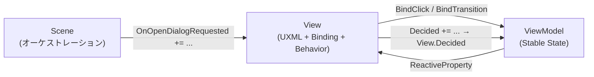

# UI 寿命管理・責務境界 修正案（D 項目）

作成日: 2026-07-10
ステータス: **提案のみ（実装未着手）**
関連: [`UI_MVVM_Behaviour_Plan.md`](UI_MVVM_Behaviour_Plan.md) v0.3、[`UI_BEHAVIOR_PIPELINE_WORKPLAN_2026-07-06.md`](UI_BEHAVIOR_PIPELINE_WORKPLAN_2026-07-06.md)、[`06-ui.md`](../../unity/Assets/Docs/Architecture/06-ui.md)

本ドキュメントは、UI フレームワーク弱点の切り分けで **D（要対応）** と判定した項目の修正案をまとめたものである。
**A（暫定）・B（意図的）・C（検証待ち）は対象外**とする。

---

## 0. 背景

velvet（宣言的 UI）との比較レビューにおいて、OneStarMaker UI の弱点を 4 分類（A 暫定 / B 意図的 / C 検証待ち / D 要対応）に整理した。  
**参照 doc 正本:** [docs/reference/velvet/01-declarative-ui-vs-mvvm-behavior.md](../reference/velvet/01-declarative-ui-vs-mvvm-behavior.md)
そのうち **フレームワークが決めるべきなのに画面作者に委ねている部分**、および **設計上の穴として早めに塞ぐべき部分** を本稿に集約する。

---

## 1. D 項目一覧

| ID | タイトル | 優先度 | 主な変更層 |
|---|---|---|---|
| D-1 | `UIToolkitView` の破棄順序 | **高** | Runtime（`UIToolkitView`） |
| D-2 | View / ViewModel / Scene の購読・通知境界 | **高** | 規約文書 + Runtime API |
| D-3 | View 寿命バッグの基底集約（`Track` API） | **高** | Runtime（`UIToolkitView`） |
| D-4 | 条件付き UI の標準パターン未定 | 中 | Runtime + 規約 + Sample |
| D-5 | UI 部品再利用の標準パターン未定 | 中 | 規約 + Sample（リストスライスと連動） |
| D-6 | Behavior 演出のプレビュー経路未定 | 低 | Runtime + BehaviorAsset + Unity 既存 Editor |

**推奨施行順**: D-1 + D-3（同 PR 可）→ D-2（文書 + Sample 整理）→ D-4 → D-5（撤退ライン v2 リストスライスと並行）→ D-6（任意。Unity Animation / Timeline 連携）

---

## 2. D-1: `UIToolkitView` の破棄順序

### 現状

`UIToolkitView.OnDestroy` は次の順で実行される。

```
1. Root.RemoveFromHierarchy()
2. ViewModel.Dispose()        ← ReactiveProperty 等が先に破棄される
3. OnViewDestroy()            ← 派生が _disposables.Dispose()（Hp への購読がまだ残っている可能性）
```

`HpGaugeView` では `_disposables` が `_viewModel.Hp` を購読したまま、先に `ViewModel.Dispose()` → `_hp.Dispose()` が走る。

### 問題

- 購読解除より先に購読元（`ReactiveProperty`）が破棄される。**破棄順序がフレームワーク未規定**であり、画面・実装次第で潜在バグになる。
- これは画面作者が直すべき問題ではなく、**基底の `OnDestroy` が決めるべき不変条件**である。

### 修正案

`OnDestroy` の順序を以下に固定する。

```
1. View 寿命バッグの Dispose（D-3 の _bindings）
2. ViewModel.Dispose()
3. Root.RemoveFromHierarchy()
4. OnViewDestroy()（派生の追加クリーンアップのみ。購読の主 Dispose は 1 で完了していること）
```

### 対象ファイル

- `unity/Assets/OneStarMaker/Scripts/Runtime/UISystem/UIToolkitView.cs`
- テスト追加: `unity/Assets/OneStarMaker/Tests/UISystem/UIToolkitViewLifecycleTests.cs`（新規）

### 受入条件

- `OnRootCreated` で `Hp` を購読した View を破棄しても例外・未解除コールバックが発生しない。
- 既存 UISystem テスト・Scene テストがすべてグリーン。

### 非目標

- `ViewOut` 中の Runner キャンセル順序の変更（E-5 / Runner 既存契約は維持）。

---

## 3. D-2: View / ViewModel / Scene の購読・通知境界（本稿の中心）

### 現状の 3 層



### 現状コードでの実例

#### HpGauge — Scene が View の outbound event を購読

| 層 | コード | 寿命 |
|---|---|---|
| View → VM | `BindClick(_viewModel.Damage)` | View `_disposables` |
| VM → View | `Hp.Subscribe(hpBar)` / `BindTransition` | View `_disposables` |
| View → Scene | `OnOpenDialogRequested` event | **Scene** `OnLoaded` / `OnPreUnLoaded` |

```csharp
// HpGaugeScene.cs — Scene が購読寿命を持つ（正しい例）
hpGaugeView.OnOpenDialogRequested += HandleOpenDialogRequested;
// OnPreUnLoaded で -=
```

#### ConfirmDialog — View が VM event を中継し、Scene が View event を購読

| 層 | コード | 寿命 |
|---|---|---|
| View → VM | `okButton.BindClick(() => _viewModel.Decide(true))` | View `_disposables` |
| VM → View | （Binding なし。message は直接代入） | — |
| VM → View（通知） | `_viewModel.Decided += HandleViewModelDecided` | **View** `OnViewDestroy` で `-=` のみ。**`+=` は `_disposables` 外** |
| View → Scene | `View.Decided` event | **Scene** `OnLoaded` / `OnPreUnLoaded` |

```csharp
// ConfirmDialogView.cs
_viewModel.Decided += HandleViewModelDecided;   // C# event（Disposable 化されていない）
// ...
public event Action<bool>? Decided;             // Scene 向け facade
```

```csharp
// ConfirmDialogScene.cs
dialogView.Decided += HandleDecided;
```

### 問題

1. **View 寿命と ViewModel 寿命の判断基準が文書化されていない。** SampleGame では ViewModel の `Disposables` が未使用で、すべて View 側 `_disposables` に寄っている。
2. **C# `event` の `+=` / `-=` が View に散在**し、R3 購読（`IDisposable`）と寿命管理の作法が二系統になる。
3. **ConfirmDialog の VM→Scene 経路が View 中継 2 段**（`VM.Decided` → `View.Decided` → `Scene`）。意図的な facade なのか偶然の重複なのかが読み手に伝わらない。
4. **Scene が ViewModel を直接触れない**（View が VM を private）。オーケストレーション専用の購読を View 経由に強制されるが、パターンが未規定。

### 修正案: 責務境界の不変条件

フレームワークと規約で次を **決め打ち** する。

#### ルール L-1: 寿命の判定（1 行）

> **`VisualElement` または `BehaviorRunner` に触れる購読・オブジェクトは View 寿命。それ以外で ViewModel が保持するロジック・外部 I/O は ViewModel 寿命。**

| 対象 | 寿命 | 集約先 |
|---|---|---|
| `BindText` / `BindClick` / `BindVisible` | View | `UIToolkitView` バッグ（D-3） |
| `Subscribe` で VE の property を更新 | View | 同上 |
| `BehaviorRunner` / `BindTransition` | View | 同上 |
| `ReactiveProperty` フィールド | ViewModel | `DisposeCore` |
| ViewModel → 外部 API / Domain の購読 | ViewModel | `ViewModelBase.Disposables` |
| Scene フロー用の outbound 通知 | Scene 購読 | **Scene** が `+=` / `-=` |

#### ルール L-2: Scene は View の public 契約だけを見る

- Scene は **View の outbound API**（event / メソッド / 読み取り専用プロパティ）または **Scene が注入したコールバック** のみを使う。
- Scene が ViewModel を直接購読するのは **View が `ViewModel` を明示公開している場合に限定**（後述パターン B）。デフォルトはパターン A。

#### ルール L-3: View は VM の outbound を Scene 向けに **facade するか、VM を読み取り専用公開するか、どちらか一方**

| パターン | 用途 | ConfirmDialog での書き方（案） |
|---|---|---|
| **A: View facade event**（現行に近い） | Scene が View だけ知っていればよい | `public event Action<bool>? Decided` を維持。VM `Decided` の中継は View の責務と明記 |
| **B: ViewModel 読み取り公開** | Scene が VM の Stable State / 通知を直接購読 | `public ConfirmDialogViewModel ViewModel => _viewModel!;` を Scene が `OnLoaded` で購読 |
| **C: Scene にコールバック注入** | ダイアログ結果を呼び出し元が渡す | `Initialize(Action<bool> onDecided)` — FE-2 Dialog プールと相性よい（将来） |

**推奨（現フェーズ）**: 単純画面は **パターン A**。同一 ViewModel を複数 Scene から再利用する場合は **パターン C** を検討。

#### ルール L-4: C# event の登録は View か Scene かを名前で区別する

| 登録場所 | 命名 | 寿命管理 |
|---|---|---|
| View 内で VM を購読（facade 中継） | `SubscribeViewModelEvents()` / `UnsubscribeViewModelEvents()` | `OnViewDestroy` で対称に `-=`。**D-3 完了後は View バッグに含めない**（C# event は IDisposable 非対応のため） |
| Scene が View を購読 | Scene の `OnLoadedImpl` / `OnPreUnLoadedImpl` | Scene ライフサイクル（現行どおり） |

### ConfirmDialog の整理例（実装前の目標形）

**パターン A を採用し、中継の意図を明示する。**

```csharp
// ConfirmDialogView.cs（目標形・疑似コード）
protected override void OnRootCreated(VisualElement root)
{
    SetViewModel(_viewModel = new ConfirmDialogViewModel { Message = "..." });
    // Track(...) で BindClick, Runner 等（D-3）
    SubscribeViewModelEvents();
}

protected override void OnViewDestroy()
{
    UnsubscribeViewModelEvents();
    base.OnViewDestroy(); // または基底が先にバッグを Dispose（D-1）
}

private void SubscribeViewModelEvents()
{
    _viewModel!.Decided += OnViewModelDecided;
}

private void UnsubscribeViewModelEvents()
{
    if (_viewModel != null) _viewModel.Decided -= OnViewModelDecided;
}

private void OnViewModelDecided(bool accepted) => Decided?.Invoke(accepted);
```

Scene 側は **変更不要**（`dialogView.Decided += HandleDecided` のまま）。

### HpGauge の整理例

- View: `OnOpenDialogRequested` は **Scene 向け outbound event**（L-2, L-4）。View 内で VM event にしないのは正しい（ダイアログ開閉は Scene の仕事）。
- Scene: 現行の `+=` / `-=` を標準パターンとして `06-ui.md` に記載。

### 対象ファイル（文書・Sample）

| ファイル | 変更内容 |
|---|---|
| `docs/planning/UI_MVVM_Behaviour_Plan.md` | §スコープ境界の直後に「寿命・通知境界」節を追加 |
| `unity/Assets/Docs/Architecture/06-ui.md` | E-7 として L-1〜L-4 を施行ルール化 |
| `ConfirmDialogView.cs` / `HpGaugeView.cs` | D-1〜D-3 施行時にパターン準拠へ整理（別 PR） |

### 受入条件

- 新規画面のレビューで「この購読はどの寿命か」を L-1 で即断できる。
- ConfirmDialog / HpGauge が文書のパターン A / Scene 購読の参照実装になる。
- ViewModel `Disposables` を使う例が 1 つ（外部 I/O 模擬でよい）テストまたは Sample に存在する。

### 非目標

- Scene が ViewModel を必ず直接触る設計への統一（オーケストレーション命令的容認は v0.3 維持）。
- C# event をすべて R3 `Observable` に置換すること。

---

## 4. D-3: View 寿命バッグの基底集約（`Track` API）

### 現状

各 View が `readonly CompositeDisposable _disposables` を宣言し、`OnViewDestroy` で Dispose する（HpGauge / ConfirmDialog 同一）。

`BindingExtensions` の XML ドキュメントは「呼び出し側の `CompositeDisposable` へ集約」とあるが、**集約先が View ごとにバラバラ**。

### 修正案

`UIToolkitView` に View 寿命専用バッグを追加する。

```csharp
// 疑似 API（実装は別チケット）
protected readonly CompositeDisposable ViewBindings = new(); // または private + Track

protected void Track(IDisposable subscription)
{
    ViewBindings.Add(subscription);
}

// OnDestroy（D-1 と合わせて）
ViewBindings.Dispose();
_viewModel?.Dispose();
// Root 除去 ...
```

派生クラスは `_disposables` フィールドを **持たない**。

### オプション（同チケットまたは追従）

```csharp
protected void BindClick(Button button, Action onClick)
    => Track(button.BindClick(onClick));

protected BehaviorRunner TrackRunner(VisualElement target, InterruptPolicy policy)
{
    var runner = new BehaviorRunner(target, policy);
    Track(runner);
    return runner;
}
```

### 対象ファイル

- `unity/Assets/OneStarMaker/Scripts/Runtime/UISystem/UIToolkitView.cs`
- `BindingExtensions.cs` — XML コメントを「`UIToolkitView.Track` へ集約」に更新
- SampleGame 2 View — `_disposables` 削除

### 受入条件

- T-16 の bind 冪等テストが Track 経由でもグリーン。
- 派生 View に `CompositeDisposable` のフィールド宣言が不要になる。

### 非目標

- ViewModel 側の `Disposables` の削除（VM 寿命は別）。

---

## 5. D-4: 条件付き UI の標準パターン未定

### 現状

- `BindVisible(Observable<bool>)` は **実装済み**（`BindingExtensions`）。
- SampleGame では **未使用**。条件付き UI の参照パターンがない。

### 問題

出し分けが増えると、次のどちらかに寄りやすい。

- UXML に全バリエーションを事前配置 + `BindVisible`（uGUI 的）
- velvet 的にコードでツリー全体を組み替え（本設計の非目標）

**中間パターンが規約として存在しない**ため、画面ごとにブレる（D）。

### 修正案

#### パターン V-1: 単一要素の表示切替（標準）

```csharp
Track(someElement.BindVisible(viewModel.IsVisible));
```

- UXML に要素を 1 つ置き、Stable State 1 つで表示制御。
- **勝利条件（静止時 = Stable State 導出）と両立**。

#### パターン V-2: 排他グループ（タブ・モード切替）

- `Stable State` を enum / discriminated な `ReactiveProperty` にし、各パネルに `BindVisible(state.Select(s => s == Mode.A))`。
- Behavior はモード遷移時のみ（ViewIn 相当）。毎フレーム切替しない。

#### パターン V-3: 動的リスト（C 領域との境界）

- リスト増減は **撤退ライン v2** の検証対象。D-4 では「V-1/V-2 で足りる範囲」と「V-3 は別スライス」を明記するのみ。

### 対象ファイル

- `06-ui.md` — UI パターン節を追加
- 次スライス候補のタブ or トーストで V-2 の参照実装 1 本

### 受入条件

- 新規画面で条件付き UI が必要なとき、V-1 / V-2 のどちらを使うか判断できる。

---

## 6. D-5: UI 部品再利用の標準パターン未定

### 現状

- 再利用単位 = `UIToolkitView` + UXML 1 枚 + 1 シーン。
- `06-ui.md` FE-2（Dialog プール）・FE-3（Modal 内タブ）は将来。

### 問題

画面数が増えると ConfirmDialog 的な View のコピペ、または Scene からの呼び出し方が統一されない。

### 修正案（段階）

| 段階 | パターン | 内容 |
|---|---|---|
| 1 | **UXML テンプレート** | 共通 `*.uxml` を `CloneTree` で部品化。View が子ツリーを `Track` でバインド |
| 2 | **BehaviorAsset プリセット** | `DialogEnter.asset` 等（D では方向性のみ。Animation 語彙は A 暫定） |
| 3 | **Dialog プール** | FE-2 実装時にパターン C（コールバック注入）を標準化 |

### 受入条件

- リスト増減スライス（撤退ライン v2）の設計時に、部品粒度の判断基準がある。

### 非目標

- velvet 的な関数コンポーネント（本設計の非目標）。

---

## 7. D-6: Behavior 演出のプレビュー経路

### 方針（2026-07-10 改訂）

**専用 Storybook 型 Preview EditorWindow は採用しない。**

Behavior の見た目調整は Unity 既存の **Animation ウィンドウ / `AnimationCurve` / Timeline** を正とする。Runner は演出制作を代替せず、**割り込み・収束・duration の所有権だけ**を握る（`UI_MVVM_Behaviour_Plan.md` §将来の拡張・デザイナーオーサリング経路と同じ）。

velvet 比較で一度 D とした「Preview なし」は、**未完成フレームワーク vs 完成品**の差の一部でもあり、OneStarMaker では別ツールを新規実装するより **既存 Editor ワークフローへの接続**で足りる、という判断に改める。

### 現状

- 動作確認は Play Mode + シーン遷移が主。
- `BehaviorAsset` は Inspector でパラメータ編集可能だが、イージングの手触り調整は数値直打ちになりがち。
- 割り込み（FromCurrent / Rewind）・収束は EditMode テストで担保済み。プレビュー不足の本体は **カーブ・時間軸の調整 UX** にある。

### ツール分担

| 用途 | 手段 | 備考 |
|---|---|---|
| duration・イージング・数値の手触り調整 | **Animation ウィンドウ** / Inspector の **`AnimationCurve`** | BehaviorAsset の curve フィールド化が前提（未実装） |
| 複合演出・デザイナー慣れのある制作 | **Timeline** + Timeline 再生 Behavior | 副作用系 Behavior と同格。Runner は duration / Rewind 可否を契約に載せる |
| 割り込み・収束・Blocker・Scene 連携 | **Play Mode** + Vertical Slice | 専用 Preview の代わり。テスト（T-15）で自動担保する部分は維持 |
| UI 構造・Binding の一覧プレビュー | **対象外** | velvet 型 Storybook は非目標。レイアウトは UXML / UI Builder |

### 修正案（優先順）

1. **BehaviorAsset に `AnimationCurve` フィールド**を追加し、Fade / Scale / TweenNumber 等が curve を参照する（LitMotion へのマッピングは実装チケットで定義）。
2. **`PlayClipBehavior` / `PlayTimelineBehavior`** の契約を副作用系と同様に定義し、Runner の `duration` と `IRewindableBehavior` 対応を明示する。
3. **調整手順を文書化**する（例: 「HitEffect.asset の Flash カーブを Animation ウィンドウで編集 → Play Mode で連打確認」）。
4. **専用 EditorWindow は作らない**。撤退ライン v2 のデザイナー試行も「BehaviorAsset + Animation / Timeline で 1 件仕上げ」で行う。

### 優先度

- **低（任意）**。D-1〜D-5 とリストスライス（撤退ライン v2）を優先する。
- Animation / Timeline 連携は、Behavior 語彙の拡充（Fade / Scale 以外）と同タイミングで足せばよい。

### 受入条件

- デザイナー（またはエンジニア）が **Animation ウィンドウまたは Timeline だけ**で Behavior 演出 1 件のカーブを調整し、Play Mode で意図どおりに見える。
- 割り込み・収束の正しさは引き続き EditMode テストが担保する（Preview ツールに依存しない）。

### 非目標

- `[UIPreview]` / Storybook 相当の EditorWindow。
- Play Mode なしで Runner の割り込み連鎖を目視確認する専用ツール（コスト対効果が低い）。

---

## 8. 実装チケット案（未起票）

| ID | タイトル | 依存 | 種別 |
|---|---|---|---|
| T-18 | `UIToolkitView` 破棄順序修正 + `Track` API | なし | Runtime |
| T-19 | 寿命・通知境界の規約反映（06-ui / Plan v0.4） | T-18 案確定 | ドキュメント |
| T-20 | SampleGame View を Track + パターン A 準拠へ整理 | T-18 | SampleGame |
| T-21 | `BindVisible` 参照画面（タブ or トースト骨格） | T-19 | SampleGame |
| T-22 | BehaviorAsset の `AnimationCurve` 対応 + 調整手順文書化 | T-11/T-12 拡張時 | Runtime + ドキュメント |
| T-23 | Timeline / Clip 再生 Behavior（契約 + 最小実装） | T-22 任意 | Runtime |

---

## 9. 関連するが本稿のスコープ外

| 分類 | 項目 | 扱い |
|---|---|---|
| A 暫定 | `Q()` / UXML Behavior DSL / Element Resolver | 別途 Resolver チケット |
| B 意図的 | UI ≠ f(state)、R3、Scene 命令的オーケストレーション | 弱点ではない |
| C 検証待ち | リスト増減、Behavior 語彙 20 件、デザイナー BehaviorAsset のみ調整 | 撤退ライン v2 |

---

## 10. まとめ

**フレームワークで決めるべきだったのに画面に落ちていたもの**は次の 3 点に集約される。

1. **破棄順序**（D-1）— Binding → ViewModel → Root
2. **View 寿命バッグ**（D-3）— `Track` で `_disposables` 自前宣言を廃止
3. **寿命・通知の境界規約**（D-2）— L-1 の 1 行ルール + ConfirmDialog / HpGauge 参照パターン

ConfirmDialog は **「VM 通知 → View facade → Scene 購読」** の教科書例として整理できる。HpGauge は **「View outbound event → Scene オーケストレーション」** の教科書例である。どちらも設計ミスではなく、**パターンの明文化が欠けているだけ**（D-2）。

実装は T-18 から着手する。本稿はその設計正本とする。
