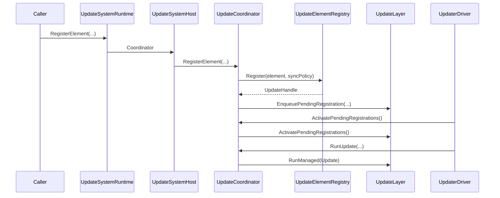
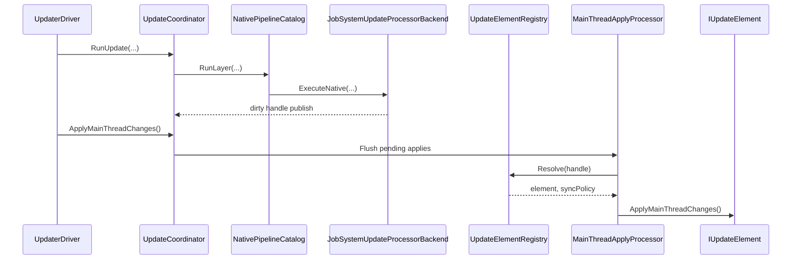
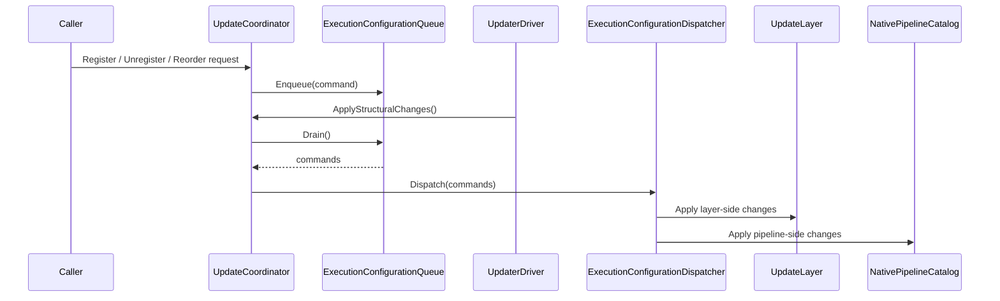

# Updater current specification

## 概要

このドキュメントは、現在の Updater 実装を **final 名だけ** で整理した仕様書です。

Updater は次の 3 つを一体で扱います。

1. `UpdateLayer` ごとの更新順制御
2. managed `IUpdateElement` と native `TState` の統一実行
3. フレーム終端での main-thread apply と実行構成変更反映

## 主な構成

### Foundation

- `World`
  - `UpdateCoordinator`
  - `LayerOrderComparer`
- `Layers`
  - `UpdateLayer`
- `Apply`
  - `MainThreadApplyProcessor`
  - `MainThreadApplyHandleBuffer`
  - `MainThreadApplyCommandBuffer`
- `Elements`
  - `UpdateElementRegistry`
- `Configuration`
  - `ExecutionConfigurationCommandKind`
  - `ExecutionConfigurationCommand`
  - `ExecutionConfigurationQueue`
  - `ExecutionConfigurationDispatcher`
- `Native\Pipelines`
  - `NativePipelineCatalog`
  - `NativeExecutionPipeline`
  - `NativeExecutionRuntime<TState>`
- `Native\Registries`
  - `NativeStateRegistry<TState>`

### Runtime

- `Api`
  - `UpdateSystemRuntime`
- `Hosting`
  - `UpdateSystemHost`
  - `UpdaterDriver`
- `Adapters`
  - `UpdateBehaviourAdapter`

## コンポーネント責務

| コンポーネント | 役割 |
| --- | --- |
| `UpdateSystemHost` | Unity 側の寿命管理、driver の設置、activation 解禁制御 |
| `UpdaterDriver` | `Update` / `LateUpdate` を Updater のフレーム進行へ変換 |
| `UpdateCoordinator` | layer、native pipeline、apply、実行構成変更の統括 |
| `UpdateLayer` | managed element 群の保持、pending/active 管理、実行順維持 |
| `UpdateElementRegistry` | `UpdateHandle` と `IUpdateElement` の対応、同期ポリシー管理 |
| `MainThreadApplyProcessor` | dirty handle と apply command をフレーム終端で適用 |
| `ExecutionConfigurationQueue` | owner thread で処理すべき構成変更要求の集約 |
| `ExecutionConfigurationDispatcher` | register / unregister / reorder を layer と pipeline へ配布 |
| `NativePipelineCatalog` | native pipeline の追加、削除、layer 別走査 |
| `NativeStateRegistry<TState>` | native state の正本管理 |
| `JobSystemUpdateProcessorBackend<TState, TProcessor>` | native state を JobSystem で並列更新 |

## フレーム進行

1 フレームは次の順序で進みます。

1. `ActivatePendingRegistrations()`
2. `RunUpdate(...)`
3. `RunLateUpdate(...)`
4. `ApplyMainThreadChanges()`
5. `ApplyStructuralChanges()`

`UpdaterDriver` がこの順序を固定し、`UpdateCoordinator` が各フェーズの実体を実行します。

### Update / LateUpdate の意味

- `RunUpdate(...)`
  - 各 layer の `Update` フェーズを実行する
  - native pipeline と managed element は同じ `UpdateFrameContext` を共有する
- `RunLateUpdate(...)`
  - 各 layer の `LateUpdate` フェーズを実行する
- `ApplyMainThreadChanges()`
  - native 側から publish された dirty handle と command を main thread で反映する
- `ApplyStructuralChanges()`
  - 登録、解除、並び替え要求を owner thread で確定する

## データモデル

### `UpdateLayer`

`UpdateLayer` は次の状態を持ちます。

- `LayerId`
- `LayerOrder`
- `IsPaused`
- `TimeScale`
- pending 登録集合
- active 実行集合
- pending removal 集合

layer は managed element の順序付き集合を持ち、activation 時に pending を active へ昇格します。

### `UpdateHandle`

`UpdateHandle` は `UpdateElementRegistry` 上の参照キーです。

- element 登録時に採番される
- native state から main-thread apply 対象を指す
- unregister 後は registry から解決できなくなる

### `UpdateElementSyncPolicy`

`UpdateElementSyncPolicy` は handle 解決先 element に対して許可する同期経路を表します。

- `AllowMainThreadApply`
- `AllowFullSyncFallback`

## 登録フロー

### managed element 登録

`UpdateCoordinator.RegisterElement(layerId, element, layerOrder, executionOrder)` を使います。

仕様:

- `element` は registry へ登録され、`UpdateHandle` を得る
- 同一 element の二重登録は許可しない
- 登録直後は pending 状態
- `ActivatePendingRegistrations()` 後に active 実行列へ入る

### native pipeline 登録

2 段階で扱います。

1. `RegisterNativePipeline(pipelineId, registry, backend, layerId, layerOrder)`
2. `RegisterNative(pipelineId, element, initialState, executionOrder, syncPolicy)`

仕様:

- pipeline は `NativePipelineId` で識別する
- `NativeStateRegistry<TState>` が state 正本を保持する
- 必要時だけ dirty handle を publish し、main thread で element を同期する

## main-thread apply

native 側は直接 Unity オブジェクトへ触れず、apply 要求を publish します。

`MainThreadApplyProcessor` は次を処理します。

1. dirty handle を取り出す
2. registry から element と policy を解決する
3. `AllowMainThreadApply` がある要素へ apply を流す
4. command buffer に積まれた apply command を順に実行する

これにより、native 更新と Unity main thread 更新を分離します。

## 実行構成変更

実行中の登録変更は即時反映せず、`ExecutionConfigurationQueue` に積みます。

`ApplyStructuralChanges()` では `ExecutionConfigurationDispatcher` が次を解釈します。

- `Register`
- `Unregister`
- `Reorder`

反映先は layer と native pipeline の両方です。これにより、実行中の列挙を壊さずに構成変更を確定できます。

## Runtime 側の役割

### `UpdateSystemHost`

- `UpdateCoordinator` を生成、保持、破棄する
- `UpdaterDriver` を常駐 GameObject に接続する
- Scene 側の安定状態を見ながら activation を解禁する
- `UpdateSystemRuntime` を install / uninstall する

### `UpdateSystemRuntime`

ゲームコードから Updater を使うための静的入口です。

主な責務:

- `UpdateSystemHost` へのアクセス集約
- element / native 登録 API の公開
- host 未導入時の誤用防止

## 公開 API の要点

### `UpdateCoordinator`

- `RegisterElement(...)`
- `UnregisterElement(...)`
- `RequestElementApply(IUpdateElement element)`
- `RequestElementApply(UpdateHandle handle)`
- `RegisterNativePipeline(...)`
- `RegisterNative(...)`
- `RunUpdate(...)`
- `RunLateUpdate(...)`
- `ApplyMainThreadChanges()`
- `ApplyStructuralChanges()`

### `UpdateSystemRuntime`

- host 導入後に使用する静的 facade
- managed / native 登録を外部コードから呼び出す入口

## シーケンス図

### 1. managed element 登録から初回実行まで

### 2. native state 更新から main-thread apply まで

### 3. 実行中の構成変更反映

## 実装上の前提

- Unity main thread に触る処理は `ApplyMainThreadChanges()` に集約する
- 実行中の列挙を壊す変更は `ApplyStructuralChanges()` まで遅延させる
- native state を正本とし、必要な場合だけ element を同期する
- final 名だけを公開面として扱い、互換名は実装に残さない
