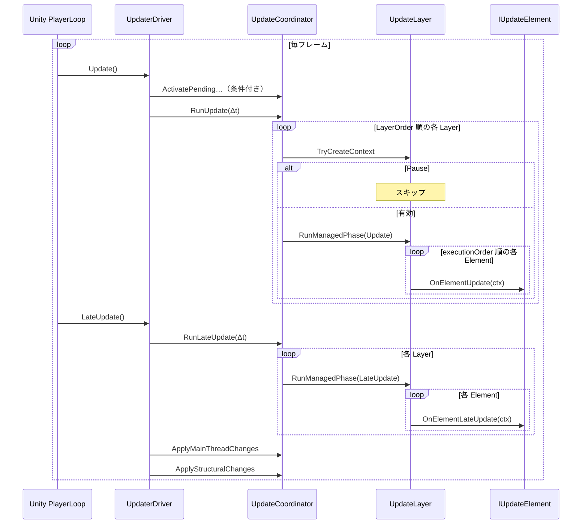
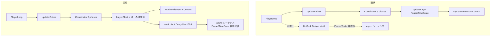
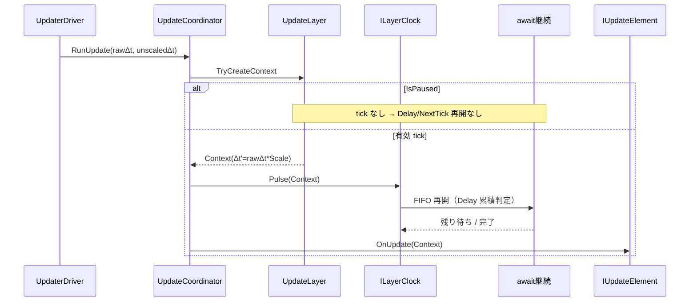

# UpdateSystem — 更新機構の現状と理想（視覚メモ）

> ステータス: 視覚整理メモ (2026-07-27)
> 実装正本: [UPDATER_CURRENT_SPEC.md](UPDATER_CURRENT_SPEC.md)
> 理想（時間権威）: [26-update-async-time-authority.md](../../unity/Assets/Docs/Architecture/26-update-async-time-authority.md)

チャット上で長い AA / Mermaid が末尾までスクロールできない場合があるため、ここに書き出す。

---

## 一文で

- **現状**: 5 フェーズの「更新箱」。Layer の Pause / TimeScale は sync Element / Job に効く。
- **理想**: 同じ権威を **Layer 時計** に昇格し、`UniTask.Delay` / `NextTick` の再開も Pause / TimeScale に乗せる。

---

## 現状（実装済み）

### 4者の流れとループ（これが本体）

誰がループを回すか:

| 誰 | ループ対象 | 1回の意味 |
|---|---|---|
| Unity PlayerLoop | フレーム | 永遠に回り続ける外側 |
| `UpdaterDriver` | （ループなし） | 1フレームにつき `Update` と `LateUpdate` を1回ずつ呼ぶだけ |
| `UpdateCoordinator` | `UpdateLayer` 列 | LayerOrder 順に全 Layer を1周 |
| `UpdateLayer` + backend | `IUpdateElement` 列 | その Layer 内の active Element を executionOrder 順に1周 |

ネストのイメージ（`RunUpdate` のとき）:

```text
┌─ Unity PlayerLoop（毎フレーム）─────────────────────────────┐
│                                                             │
│  UpdaterDriver.Update()          ← 司会。ループは持たない    │
│    │                                                        │
│    ├─ Coordinator.ActivatePending…（条件付き）               │
│    │                                                        │
│    └─ Coordinator.RunUpdate(Δt)                             │
│         │                                                   │
│         │  ┌─ for Layer in layers（LayerOrder 順）──────┐  │
│         │  │                                            │  │
│         │  │  Layer.TryCreateContext?                   │  │
│         │  │    Pause → continue（この Layer スキップ） │  │
│         │  │    OK    → Context 作成                    │  │
│         │  │         → native phase（Job 等）           │  │
│         │  │         → Layer.RunManagedPhase            │  │
│         │  │              │                             │  │
│         │  │              │  ┌─ for Element ──────┐    │  │
│         │  │              │  │  OnElementUpdate   │    │  │
│         │  │              │  │  OnElementUpdate   │    │  │
│         │  │              │  │  …                 │    │  │
│         │  │              │  └────────────────────┘    │  │
│         │  │                                            │  │
│         │  └────────────────────────────────────────────┘  │
│                                                             │
│  UpdaterDriver.LateUpdate()                                 │
│    ├─ Coordinator.RunLateUpdate(Δt)  ← 上と同じ二重ループ   │
│    │     （中身は OnElementLateUpdate）                     │
│    ├─ Coordinator.ApplyMainThreadChanges()                  │
│    └─ Coordinator.ApplyStructuralChanges()                  │
└─────────────────────────────────────────────────────────────┘
```

呼び出しの矢印だけ抜くと:

```text
UpdaterDriver
    │  Update() / LateUpdate() でメソッドを順に叩く
    ▼
UpdateCoordinator
    │  for 各 UpdateLayer
    ▼
UpdateLayer
    │  Context を作り、active な Element 列を渡す
    ▼
IUpdateElement
       OnElementUpdate(ctx) / OnElementLateUpdate(ctx)
```

ポイント:

- **永久ループを持っているのは Unity だけ**。Driver 以下は「1フレーム分の仕事」を上から下へ流す。
- **Layer ループ**は Coordinator が回す。Layer 自身は「自分の Element 列」を回す（実体は backend の for）。
- Element は能動的に回らない。**呼ばれる側**。



### まずこれだけ（役割・要約）

```text
毎フレーム Unity が Update / LateUpdate を呼ぶ
        │
        ▼
  UpdaterDriver  ……「いつ何番をやるか」だけ決める司会
        │
        ▼
  UpdateCoordinator …… Layer を順番に回す司令塔
        │
        ├── Layer "Gameplay"  (Pause? / TimeScale?)
        │       └── 登録された Element / Job を叩く
        │
        └── Layer "UI"        (Pause? / TimeScale?)
                └── 同上
```

ゲームコード側のイメージ:

```text
「この処理を Gameplay Layer に登録して」
  → 毎フレーム、その Layer が生きていれば
    Context（Δt・Scale 入り）付きで呼ばれる
```

用語の対応:

| 呼び名 | 実体 | やること |
|---|---|---|
| 司会 | `UpdaterDriver` | Unity の `Update`/`LateUpdate` を、Coordinator の呼び出し順に変換する |
| 司令塔 | `UpdateCoordinator` | 複数 Layer を `LayerOrder` 順に回す |
| グループ | `UpdateLayer` | Pause / TimeScale の境界。中に Element / Job が並ぶ |
| 参加者 | `IUpdateElement` など | 毎 tick `UpdateFrameContext` を受け取って動く |

### Pause / TimeScale（Layer 単位）

```text
Pause 中  → その Layer の呼び出し自体がスキップ（Element は呼ばれない）
TimeScale → 呼ばれたときの Δt が薄まる／速まる
            Context.DeltaTime = UnityのΔt × Layer.TimeScale
```

補足: Pause 時は Context も作らない。`IsPaused=true` の Context が配られるわけではない。

### 1 フレームの手順（司会が守る順番）

役割図とは別に、時間軸だけ見る。

```text
Update()
  1. 新規登録を有効化     ActivatePendingRegistrations
  2. 各 Layer の Update  RunUpdate

LateUpdate()
  3. 各 Layer の Late    RunLateUpdate
  4. Job 結果などを反映  ApplyMainThreadChanges
  5. 登録解除などを確定  ApplyStructuralChanges
```

各 Layer の Update（手順 2）の中身:

```text
Layer が Pause? → 何もしない（終了）
            else → Context を作る
                 → 同じ Context で native Job と managed Element を実行
```

### 現状の穴（時計が二重）

UpdateSystem に登録したものだけが Pause / Scale に従う。  
`UniTask.Delay` / `Yield` は Unity 素の時間で進むので、ここでは止まらない。

```text
  UpdateSystem に登録した処理     UniTask.Delay / Yield
  （Pause / Scale が効く）         （Unity 時計・効かない）
         │                              │
         ▼                              ▼
   Element / Job                  async の待ち・シーケンス
```

これが次節の理想（Layer 時計へ一本化）の動機。

---

## 理想（時間権威の一本化）

方針:

```text
 UpdateSystem = 時間と再開順の唯一権威（更新箱 → 時計へ昇格）
 UniTask      = その時計を待つ構文（第二のスケジューラではない）
```

役割は現状と同じ。増えるのは **Layer ごとの時計 API**。

```text
  UpdateCoordinator.RunUpdate
        │
        ├── Layer "Gameplay"
        │     │
        │     ├── ★ ILayerClock で待っている継続を再開
        │     │      await clock.NextTick()
        │     │      await clock.Delay(2f)   ← scaled Δt 累積
        │     │
        │     └── 従来どおり Element / Job を実行
        │
        └── Layer "UI" … 同様（時計は Layer 別）
```

### Pause / Time → UniTask への渡し方（構想の核）

```text
  NG: Context を async に持ち歩く
      await をまたぐと古くなる / Pause の意味が曖昧

  OK: Layer 時計を await する
      ILayerClock clock = GetClock("Simulation");

      await clock.NextTick(ct);
        → 「次の有効 tick」まで待つ
        → Layer.IsPaused 中は tick が来ない → 自然に停止

      await clock.Delay(2.0f, ct);
        → Context.DeltaTime（= rawΔt * TimeScale）を累積
        → TimeScale=0.5 なら実時間約 4 秒
        → Pause 中は累積が進まない

  原則:
    ・Context は持ち運ばない
    ・必要な Δt 等は「再開時」に受け取る
    ・async は必ず owner の CancellationToken を取る
```

API スケッチ（最終名ではない。詳細は doc 26）:

```csharp
ILayerClock clock = updateSystem.GetClock("Simulation");

await clock.NextTick(ct);
await clock.Delay(2.0f, ct);

async UniTask PlayIntroAsync(CancellationToken ct)
{
    await character.WalkToAsync(stage.Center, clock, ct);
    await dialogue.ShowAsync("Hello", ct);
    await clock.Delay(0.5f, ct);
    await dialogue.ShowAsync("Welcome", ct);
}
```

残る規約（Analyzer で縛る一行）:

> gameplay の asmdef では素の `UniTask.Delay` / `UniTask.Yield` を使わず、layer clock を await する。

---

## 現状 ↔ 理想（図）



### 1 フレーム内の理想シーケンス



---

## 対比表

| | 現状 | 理想 |
|---|---|---|
| 権威 | 更新順序の箱（5フェーズ） | **時間＋再開順**の唯一権威 |
| Pause | Layer の Element だけ止まる | `clock.Delay` / `NextTick` も止まる |
| TimeScale | Context.Δt に乗るだけ | `clock.Delay` の累積にも乗る |
| Context | sync Element に渡す | async には渡さない／再開時に受ける |
| UniTask | Unity 時計に寄生（未接続） | Layer 時計を待つ構文 |
| 規約 | 運用頼み | gameplay で素の `Delay`/`Yield` を Analyzer 禁止 |

---

## 実装状況

| 項目 | 状態 |
|---|---|
| 5 フェーズ固定（Activate → Update → Late → Apply → Structural） | 実装済み |
| Layer `IsPaused` / `TimeScale` / `UpdateFrameContext` | 実装済み |
| managed + native 同一 Context | 実装済み |
| `ILayerClock` / `NextTick` / `Delay` | **未実装**（doc 26 方針） |
| gameplay Analyzer（素 Delay/Yield 禁止） | **未実装**（doc 26 方針） |

---

## 更新履歴

| 日付 | 内容 |
|---|---|
| 2026-07-27 | 初版。現状 AA / 理想 AA / Mermaid / 対比表を書き出し |
| 2026-07-27 | 現状 AA を「司会→司令塔→Layer」中心に分割し直す。理想図も同型に揃える |
| 2026-07-27 | Driver / Coordinator / Layer / Element のネストループ図と sequence を追加 |
