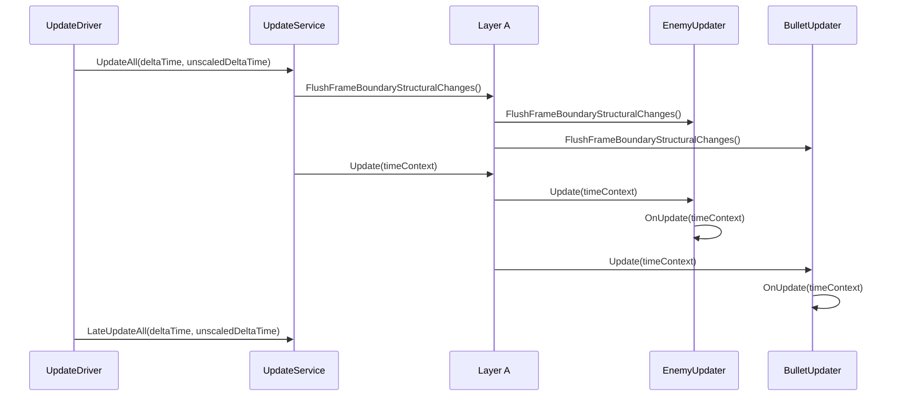
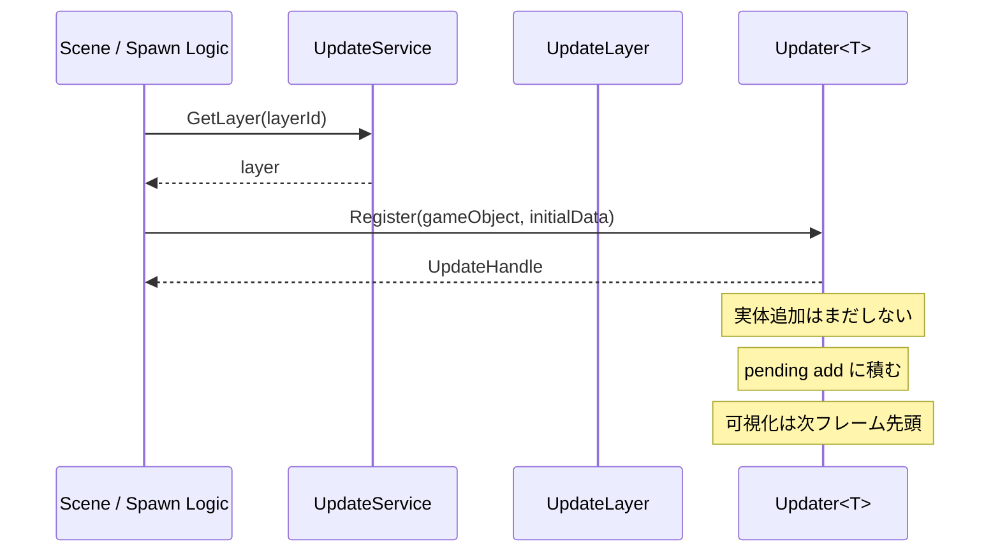
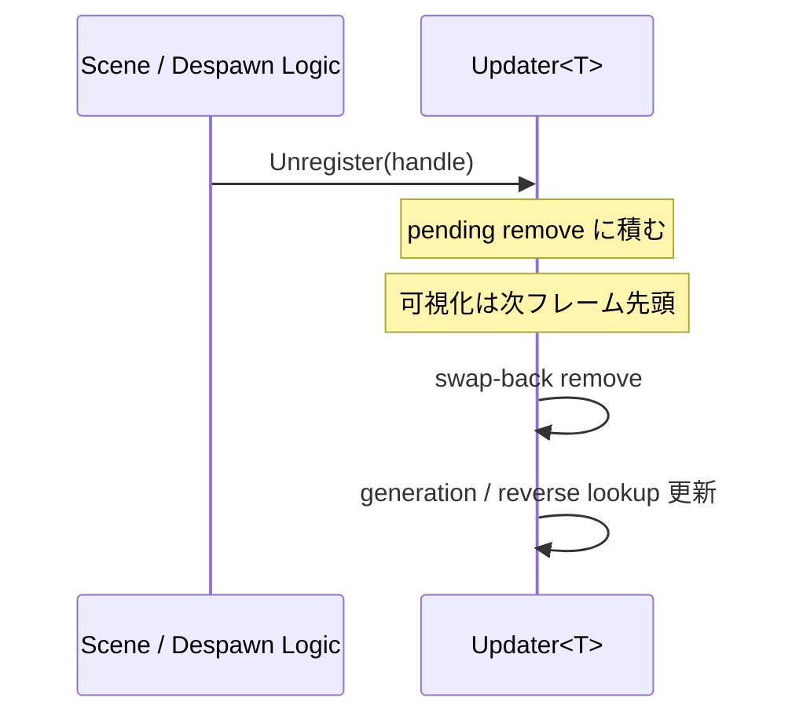
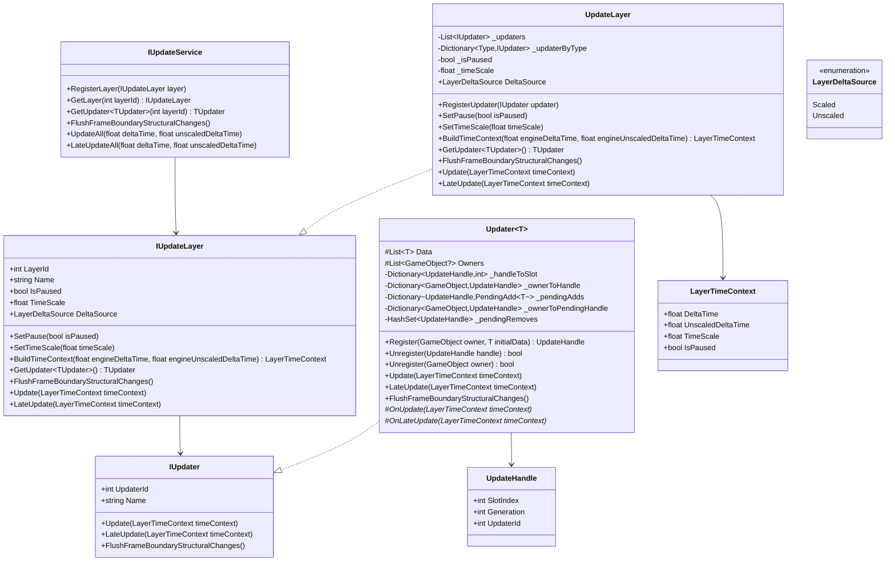

# 16. Update 基盤設計（Layer / Updater）

> ステータス: 設計ドラフト・プロトタイプ検証前 (2026-05-07)
> 優先度: Phase 2 サービス最小実装と並行して vertical slice で検証
>
> **注意:** この文書は実装前ドラフトです。現在の実装仕様は `docs/updater/UPDATER_CURRENT_SPEC.md`（リポジトリルート）を正本として参照してください。
> 本文には未採用案や差し替え済み API が含まれるため、実装確認用途には使わないでください。
>
> **関連:** Async/Await（UniTask）との役割分担・時間権威の設計方針は [26-update-async-time-authority.md](26-update-async-time-authority.md) を参照。

---

## 目次

1. [目的](#1-目的)
2. [決定事項サマリ](#2-決定事項サマリ)
3. [スコープ / 非スコープ](#3-スコープ--非スコープ)
4. [設計思想](#4-設計思想)
5. [実行モデル](#5-実行モデル)
6. [API 設計](#6-api-設計)
7. [データ構造設計](#7-データ構造設計)
8. [シーケンス図](#8-シーケンス図)
9. [クラス図](#9-クラス図)
10. [疑似コード](#10-疑似コード)
11. [実装タスク分解](#11-実装タスク分解)
12. [他フレームワーク比較](#12-他フレームワーク比較)
13. [見直しポイント / リスク](#13-見直しポイント--リスク)
14. [ECS への移行足がかり](#14-ecs-への移行足がかり)

---

## 1. 目的

- `MonoBehaviour.Update()` の分散呼び出しを避け、**Application 常駐の更新基盤**へ集約する
- `Scene` の責務を **GameObject / Asset の寿命管理**に限定し、`Update` の責務を分離する
- `Layer` ごとに **順序・DeltaTime・Pause** を制御できるようにする
- `Updater<T>` ごとに **型別の dense 配列**を保持し、並列更新しやすい構造にする
- 既存の Unity Scene / Animator と共存しつつ、将来的に **ECS へ移行しやすい足がかり**を作る
- ただし対象は **hot path の更新処理**に限定し、「すべての gameplay update を framework 化する」ことは目的にしない

---

## 2. 決定事項サマリ

| 項目 | 決定 |
|---|---|
| Layer の寿命 | **Application ライフタイム** |
| Scene の責務 | **GameObject と Asset の寿命管理のみ** |
| Update の責務 | **Layer / Updater が担当** |
| Layer 間順序 | **登録順で逐次** |
| Layer 内 Updater 順序 | **登録順で逐次** |
| Updater 内実行 | **Struct 配列だけを更新対象にする。prototype は逐次、optimized backend では並列** |
| 更新対象型 | **`Updater<T> where T : struct`** |
| 登録 API | **`Register(GameObject, T) -> UpdateHandle`** |
| 解除 API | **`Unregister(UpdateHandle)` を主契約** |
| 補助解除 API | **`Unregister(GameObject)` は補助として可** |
| 削除戦略 | **swap-back remove** |
| 構造変更反映 | **frame boundary deferred（同一フレーム中の変更は次フレーム先頭で反映）** |
| 同一フレーム整合性 | **pending add / remove を相殺し、spawn 即 cancel を吸収する** |
| Pause 粒度 | **Layer 単位の全停止** |
| Render | **現段階ではスコープ外** |
| 実行 backend | **長期方針は C# Job System + Burst。初期プロトタイプは data-oriented main-thread backend で可** |

---

## 3. スコープ / 非スコープ

### スコープ

- Layer 単位の時間制御（delta time / pause）
- Layer と Updater の順序保証
- `Updater<T>` 単位のデータ更新
- `Register / Unregister` による構造変更管理
- Unity Scene と共存する Application 常駐の更新基盤

### 非スコープ

- Render 実行基盤
- 複数コンポーネントを横断する汎用 Query システム
- ECS 完全互換 API
- 個別 object 単位の pause
- Physics / Animator の置き換え

> **重要:** 本設計は「自前 ECS を完成させる」ことが目的ではない。  
> あくまで **既存 Unity プロジェクトでも導入しやすい更新最適化基盤**を作る。

> **追加方針:** 本設計はまず **1 Layer / 1 Updater / 1 Data 型**の vertical slice で妥当性を検証する。  
> プロトタイプで有効性が確認できるまでは、汎用 Query や複合 dependency 解決へ広げない。

---

## 4. 設計思想

### 4.1 Scene と Update を分離する理由

Scene に `Update` の責務まで持たせると、Scene 遷移のたびに更新基盤の組み換えが必要になる。  
これは責務の境界を曖昧にし、最終的に `MonoBehaviour` 依存を強くする。

本設計では以下に分離する。

```text
Scene   = GameObject / Asset の寿命管理
Layer   = 時間制御と順序制御
Updater = 型 T のデータ更新
```

### 4.2 並列化の単位を限定する理由

「全部を並列化する」は Unity ではほぼ破綻する。  
Unity API、GameObject 階層、Animator、Physics などは主スレッド依存が強い。

そのため、並列化の対象は **Updater 内の `T` 配列だけ**に限定する。

```text
Layer 間        = 逐次
Layer 内 Updater = 逐次
Updater 内 data = 並列
```

この制約によって、依存解決とデバッグ容易性を保ちながら、最も効果の高い箇所だけを高速化する。

### 4.3 最初から Handle を導入する理由

`GameObject` を唯一の識別子にすると、将来的に ECS 的な ID 管理へ移行しづらい。  
`UpdateHandle` を返す設計にしておけば、外部契約は安定し、内部実装だけ段階的に進化できる。

---

## 5. 実行モデル

### 5.1 3 階層モデル

```text
Layer 間        → 登録順で逐次  （大きな依存の解消）
Layer 内 Updater → 登録順で逐次 （細かい依存の解消）
Updater 内 data  → prototype は逐次 / optimized backend は Job/Burst 並列
```

### 5.2 フレームの流れ

```text
Application Frame
  ├─ LayerA.Update(deltaA)
  │   ├─ Updater1.Update(deltaA)
  │   ├─ Updater2.Update(deltaA)
  │   └─ ...
  ├─ LayerB.Update(deltaB)
  │   └─ ...
  ├─ LayerA.LateUpdate(deltaA)
  │   ├─ Updater1.LateUpdate(deltaA)
  │   └─ ...
  └─ LayerB.LateUpdate(deltaB)
      └─ ...
```

### 5.3 時間制御モデル

各 Layer は自分専用の `LayerTimeContext` を持つ。

```csharp
public readonly struct LayerTimeContext
{
    public readonly float DeltaTime;
    public readonly float UnscaledDeltaTime;
    public readonly float TimeScale;
    public readonly bool IsPaused;

    public LayerTimeContext(
        float deltaTime,
        float unscaledDeltaTime,
        float timeScale,
        bool isPaused)
    {
        DeltaTime = deltaTime;
        UnscaledDeltaTime = unscaledDeltaTime;
        TimeScale = timeScale;
        IsPaused = isPaused;
    }
}
```

> **注意:** `Pause` は Layer 単位で全停止する。  
> `Updater` 単位や object 単位の pause は現段階では入れない。

### 5.4 構造変更の可視性契約

本設計では `Register / Unregister` の可視化時刻を **フレーム境界**に固定する。

```text
Frame N 開始前に FlushFrameBoundaryStructuralChanges()
    ↓
Frame N の Update / LateUpdate を実行
    ↓
Frame N 中に発行された Register / Unregister は pending のまま保持
    ↓
Frame N+1 開始前に可視化
```

ルールは以下のとおり。

- `UpdateAll()` 開始前に全 Layer / Updater の pending changes を flush する
- `Update` / `LateUpdate` 実行中の `Register / Unregister` は **同一フレームでは見えない**
- 同一フレームで `Register -> Unregister` が発生した場合は **pending add を相殺**し、実体追加しない
- `Unregister(GameObject)` は active owner と pending owner の両方を見て解決する

この契約により、「どの Updater から見えるか」「LateUpdate には見えるか」の曖昧さを排除する。

### 5.5 Application 起動シーケンスとの統合

既存の `AbstractApplicationInitializer` の 3 フェーズへ、Update 基盤は以下のように統合する。

```text
SubsystemRegistration
    → 前回セッションの UpdateService / UpdateDriver を解放

BeforeSceneLoad
    → UpdateService を生成
    → Application 常駐 Layer / Updater を登録
    → SceneFactory や他サービスへ注入できる状態にする

AfterSceneLoad
    → UpdateDriver を 1 回だけ生成し、UpdateService を接続
```

補足:

- `UpdateDriver` はシーン prefab として置かず、Application ライフタイムで 1 個だけ持つ
- `Application.quitting` と `SubsystemRegistration` の両方で解放する
- 手動 DI（正式採用、[03-di.md](03-di.md) 参照）での配線集約点として `IUpdateService` を使う

---

## 6. API 設計

### 6.1 UpdateHandle

```csharp
/// <summary>
/// Updater 内の要素を指す軽量ハンドル。
///
/// - SlotIndex  : 現在または過去に使われた論理スロット番号
/// - Generation : スロット再利用時に増える世代番号
/// - UpdaterId  : どの Updater が発行したハンドルかを識別する ID
///
/// stale handle を検出するため、slot だけでなく generation を必ず持つ。
/// 将来 ECS へ寄せる際は Entity 相当の識別子として扱える。
/// </summary>
public readonly struct UpdateHandle : IEquatable<UpdateHandle>
{
    public readonly int SlotIndex;
    public readonly int Generation;
    public readonly int UpdaterId;

    public UpdateHandle(int slotIndex, int generation, int updaterId)
    {
        SlotIndex = slotIndex;
        Generation = generation;
        UpdaterId = updaterId;
    }

    public bool Equals(UpdateHandle other)
        => SlotIndex == other.SlotIndex
           && Generation == other.Generation
           && UpdaterId == other.UpdaterId;
}
```

### 6.2 ILayer / IUpdater 抽象

```csharp
public enum LayerDeltaSource
{
    Scaled,
    Unscaled,
}

public interface IUpdateLayer
{
    int LayerId { get; }
    string Name { get; }
    bool IsPaused { get; }
    float TimeScale { get; }
    LayerDeltaSource DeltaSource { get; }

    void SetPause(bool isPaused);
    void SetTimeScale(float timeScale);
    LayerTimeContext BuildTimeContext(float engineDeltaTime, float engineUnscaledDeltaTime);
    TUpdater GetUpdater<TUpdater>() where TUpdater : class, IUpdater;
    bool TryGetUpdater<TUpdater>(out TUpdater? updater) where TUpdater : class, IUpdater;
    void Update(in LayerTimeContext timeContext);
    void LateUpdate(in LayerTimeContext timeContext);
    void FlushFrameBoundaryStructuralChanges();
}

public interface IUpdater
{
    int UpdaterId { get; }
    string Name { get; }

    void Update(in LayerTimeContext timeContext);
    void LateUpdate(in LayerTimeContext timeContext);
    void FlushFrameBoundaryStructuralChanges();
}
```

### 6.3 UpdateLayer

```csharp
/// <summary>
/// Layer は時間制御と Updater の実行順序のみを担当する。
///
/// 重要:
/// - Layer 自体は data を持たない
/// - Layer 自体は GameObject を保持しない
/// - Layer は Updater の登録順を保証する
/// - 同じ concrete updater type を同一 Layer に重複登録しない
/// </summary>
public sealed class UpdateLayer : IUpdateLayer
{
    private readonly List<IUpdater> _updaters = new();
    private readonly Dictionary<Type, IUpdater> _updaterByType = new();
    private bool _isPaused;
    private float _timeScale = 1f;

    public int LayerId { get; }
    public string Name { get; }
    public bool IsPaused => _isPaused;
    public float TimeScale => _timeScale;
    public LayerDeltaSource DeltaSource { get; }

    public UpdateLayer(int layerId, string name, LayerDeltaSource deltaSource)
    {
        LayerId = layerId;
        Name = name;
        DeltaSource = deltaSource;
    }

    public void RegisterUpdater(IUpdater updater)
    {
        var updaterType = updater.GetType();
        if (_updaterByType.ContainsKey(updaterType))
        {
            throw new InvalidOperationException($"Updater type already registered: {updaterType.Name}");
        }

        _updaters.Add(updater);
        _updaterByType.Add(updaterType, updater);
    }

    public void SetPause(bool isPaused)
    {
        _isPaused = isPaused;
    }

    public void SetTimeScale(float timeScale)
    {
        _timeScale = Mathf.Max(0f, timeScale);
    }

    public LayerTimeContext BuildTimeContext(float engineDeltaTime, float engineUnscaledDeltaTime)
    {
        var baseDeltaTime = DeltaSource == LayerDeltaSource.Scaled
            ? engineDeltaTime
            : engineUnscaledDeltaTime;

        return new LayerTimeContext(
            deltaTime: baseDeltaTime * _timeScale,
            unscaledDeltaTime: engineUnscaledDeltaTime,
            timeScale: _timeScale,
            isPaused: _isPaused);
    }

    public TUpdater GetUpdater<TUpdater>() where TUpdater : class, IUpdater
    {
        if (!TryGetUpdater<TUpdater>(out var updater))
        {
            throw new InvalidOperationException($"Updater not found: {typeof(TUpdater).Name}");
        }

        return updater;
    }

    public bool TryGetUpdater<TUpdater>(out TUpdater? updater) where TUpdater : class, IUpdater
    {
        if (_updaterByType.TryGetValue(typeof(TUpdater), out var found))
        {
            updater = (TUpdater)found;
            return true;
        }

        updater = null;
        return false;
    }

    public void FlushFrameBoundaryStructuralChanges()
    {
        for (var i = 0; i < _updaters.Count; i++)
        {
            _updaters[i].FlushFrameBoundaryStructuralChanges();
        }
    }

    public void Update(in LayerTimeContext timeContext)
    {
        if (_isPaused)
        {
            return;
        }

        for (var i = 0; i < _updaters.Count; i++)
        {
            _updaters[i].Update(timeContext);
        }
    }

    public void LateUpdate(in LayerTimeContext timeContext)
    {
        if (_isPaused)
        {
            return;
        }

        for (var i = 0; i < _updaters.Count; i++)
        {
            _updaters[i].LateUpdate(timeContext);
        }
    }
}
```

### 6.4 Updater<T>

```csharp
/// <summary>
/// 型 T ごとの dense data 配列を管理し、OnUpdate / OnLateUpdate で更新ロジックを提供する基底クラス。
///
/// 設計意図:
/// - Updater = System 相当の処理単位
/// - T       = hot path に載せたいデータ
/// - GameObject は寿命管理と反映先の結び付けにのみ使う
///
/// 注意:
/// - OnUpdate / OnLateUpdate 内で Unity API を直接呼ばない
/// - 構造変更は pending command に積み、フレーム境界で flush する
/// - 要素順は意味を持たない。swap-back remove を前提とする
/// - 現段階の storage は prototype 用。job backend では差し替え可能性がある
/// </summary>
public abstract class Updater<T> : IUpdater where T : struct
{
    protected readonly List<T> Data = new();
    protected readonly List<GameObject?> Owners = new();

    private readonly List<SlotMetadata> _slotMetadata = new();
    private readonly Dictionary<UpdateHandle, int> _handleToSlot = new();
    private readonly Dictionary<GameObject, UpdateHandle> _ownerToHandle = new();
    private readonly Dictionary<UpdateHandle, PendingAdd<T>> _pendingAdds = new();
    private readonly Dictionary<GameObject, UpdateHandle> _ownerToPendingHandle = new();
    private readonly HashSet<UpdateHandle> _pendingRemoves = new();

    public int UpdaterId { get; }
    public string Name { get; }

    protected Updater(int updaterId, string name)
    {
        UpdaterId = updaterId;
        Name = name;
    }

    public UpdateHandle Register(GameObject owner, in T initialData)
    {
        if (_ownerToHandle.ContainsKey(owner) || _ownerToPendingHandle.ContainsKey(owner))
        {
            throw new InvalidOperationException("Owner is already registered or pending add.");
        }

        var handle = CreateNewHandle();
        var pending = new PendingAdd<T>(handle, owner, initialData);
        _pendingAdds.Add(handle, pending);
        _ownerToPendingHandle.Add(owner, handle);
        return handle;
    }

    public bool Unregister(UpdateHandle handle)
    {
        if (_pendingAdds.TryGetValue(handle, out var pendingAdd))
        {
            _pendingAdds.Remove(handle);
            _ownerToPendingHandle.Remove(pendingAdd.Owner);
            return true;
        }

        _pendingRemoves.Add(handle);
        return true;
    }

    public bool Unregister(GameObject owner)
    {
        if (_ownerToPendingHandle.TryGetValue(owner, out var pendingHandle))
        {
            _pendingAdds.Remove(pendingHandle);
            _ownerToPendingHandle.Remove(owner);
            return true;
        }

        if (!_ownerToHandle.TryGetValue(owner, out var handle))
        {
            return false;
        }

        _pendingRemoves.Add(handle);
        return true;
    }

    public void Update(in LayerTimeContext timeContext)
    {
        if (Data.Count == 0)
        {
            return;
        }

        OnUpdate(timeContext);
    }

    public void LateUpdate(in LayerTimeContext timeContext)
    {
        if (Data.Count == 0)
        {
            return;
        }

        OnLateUpdate(timeContext);
    }

    public void FlushFrameBoundaryStructuralChanges()
    {
        foreach (var handle in _pendingRemoves)
        {
            RemoveImmediate(handle);
        }
        _pendingRemoves.Clear();

        foreach (var pending in _pendingAdds.Values)
        {
            AddImmediate(pending);
            _ownerToPendingHandle.Remove(pending.Owner);
        }
        _pendingAdds.Clear();
    }

    protected abstract void OnUpdate(in LayerTimeContext timeContext);
    protected abstract void OnLateUpdate(in LayerTimeContext timeContext);
}
```

### 6.5 UpdateService

```csharp
/// <summary>
/// Application ライフタイムで Layer を保持するサービス。
///
/// Scene はこのサービス経由で Register / Unregister を行う。
/// DI 配線（手動 DI）の集約点になる。
/// </summary>
public interface IUpdateService
{
    void RegisterLayer(IUpdateLayer layer);
    IUpdateLayer GetLayer(int layerId);
    TUpdater GetUpdater<TUpdater>(int layerId) where TUpdater : class, IUpdater;
    void FlushFrameBoundaryStructuralChanges();
    void UpdateAll(float deltaTime, float unscaledDeltaTime);
    void LateUpdateAll(float deltaTime, float unscaledDeltaTime);
}
```

### 6.6 Scene からの利用イメージ

```csharp
// Scene 側は UpdateService を受け取り、必要な concrete updater を取得する。
// Register / Unregister の主契約は handle ベース。
var enemyUpdater = updateService.GetUpdater<EnemyUpdater>(GameUpdateLayers.Simulation);

var handle = enemyUpdater.Register(enemyGameObject, new EnemyData
{
    Position = spawnPosition,
    Velocity = initialVelocity,
});

// despawn 時は handle を主に使う。
enemyUpdater.Unregister(handle);
```

---

## 7. データ構造設計

### 7.1 Updater<T> が最低限持つ内部構造

```text
Dense Data (prototype backend)
    - List<T>

Dense Data (job backend candidate)
    - NativeArray<T> / NativeList<T>

Owner References
  - GameObject[] / List<GameObject?>

Metadata
  - generation, alive, handle validity

Reverse Lookups
  - UpdateHandle -> slot
  - GameObject   -> UpdateHandle

Pending Commands
    - UpdateHandle -> PendingAdd<T>
    - GameObject   -> pending handle
    - HashSet<UpdateHandle> pending remove
```

### 7.2 swap-back remove

要素順は意味を持たないため、削除は `swap-back remove` を採用する。

```text
削除前
  slot 0 : A
  slot 1 : B   <- 削除したい
  slot 2 : C   <- 末尾

削除後
  slot 0 : A
  slot 1 : C   <- 末尾を詰める
```

これにより、削除を `O(1)` 近辺に寄せられる。

### 7.3 ArrayPool の役割

ArrayPool は **persistent storage** ではなく、あくまで **prototype backend の一時バッファ**用に使う。

```text
persistent data   = Updater<T> が保持
temporary buffer  = 差分計算・変換・apply 用に ArrayPool から借りる
```

> **注意:** ArrayPool のままでは Burst/job 実行モデルに直接は乗らない。  
> Job backend を使う場合は `NativeArray / NativeList` ベースへ差し替える。

### 7.4 2 段階 backend 戦略

| 段階 | storage | 実行方式 | 目的 |
|---|---|---|---|
| **Prototype** | `List<T>` | main-thread dense loop | API、ライフサイクル、構造変更契約の検証 |
| **Optimized** | `NativeArray<T>` 系 | `IJobParallelFor` + Burst | hot path の高速化 |

> **方針:** 先に API と構造変更契約を固め、backend 最適化はその後に行う。  
> これにより「job に合わせて API が崩れる」ことを防ぐ。

---

## 8. シーケンス図

### 8.1 フレーム更新



### 8.2 Register



### 8.3 Unregister



---

## 9. クラス図



---

## 10. 疑似コード

### 10.1 UpdateDriver

```csharp
/// <summary>
/// Unity 側の Update / LateUpdate から、Application 常駐の UpdateService へ橋渡しする。
///
/// ここは Unity と framework の境界であり、責務は「呼ぶこと」だけに留める。
/// driver 自身が game logic を持ってはいけない。
/// `AbstractApplicationInitializer` から 1 回だけ生成し、ReleaseAll で確実に破棄する。
/// </summary>
public sealed class UpdateDriver : MonoBehaviour
{
    private IUpdateService? _updateService;

    private void Update()
    {
        if (_updateService == null)
        {
            return;
        }

        // ここでは Unity の現在フレーム時間をそのまま渡す。
        // Layer 側で独自の time scale を掛けるかどうかは Layer の責務。
        _updateService.UpdateAll(Time.deltaTime, Time.unscaledDeltaTime);
    }

    private void LateUpdate()
    {
        if (_updateService == null)
        {
            return;
        }

        // LateUpdate も同様に橋渡しだけを行う。
        // Animator の更新順に干渉しない配置が必要。
        _updateService.LateUpdateAll(Time.deltaTime, Time.unscaledDeltaTime);
    }
}
```

### 10.2 UpdateService.UpdateAll

```csharp
/// <summary>
/// 全 Layer を登録順で逐次実行する。
///
/// 重要:
/// - Layer 間依存はこの順序に乗せる
/// - ここで並列化しない
/// - 並列化は Updater 内 data のみに限定する
/// </summary>
public void UpdateAll(float deltaTime, float unscaledDeltaTime)
{
    // 同一フレーム中の構造変更はここで初めて可視化する。
    // これより後に発行された Register / Unregister は次フレームまで見えない。
    FlushFrameBoundaryStructuralChanges();

    for (var i = 0; i < _layers.Count; i++)
    {
        var layer = _layers[i];

        // Layer ごとに独自の timeContext を作る。
        // ここで timeScale や pause を反映する。
        var timeContext = layer.BuildTimeContext(deltaTime, unscaledDeltaTime);

        // Layer 自体の順序保証が依存解消の基本単位。
        layer.Update(timeContext);
    }
}

public void LateUpdateAll(float deltaTime, float unscaledDeltaTime)
{
    for (var i = 0; i < _layers.Count; i++)
    {
        var layer = _layers[i];
        var timeContext = layer.BuildTimeContext(deltaTime, unscaledDeltaTime);
        layer.LateUpdate(timeContext);
    }
}
```

### 10.3 Updater<T>.RemoveImmediate

```csharp
/// <summary>
/// stale handle でないことを確認した上で、swap-back remove を実行する。
///
/// 注意:
/// - handle から slot を引けても、generation が違えば無効
/// - 末尾要素を詰めたら、詰められた側の逆引きを必ず更新する
/// - ownerToHandle と handleToSlot の両方を同期して更新する
/// </summary>
private bool RemoveImmediate(UpdateHandle handle)
{
    if (!_handleToSlot.TryGetValue(handle, out var slot))
    {
        return false;
    }

    // generation を見て stale handle を弾く。
    var metadata = _slotMetadata[slot];
    if (metadata.Generation != handle.Generation)
    {
        return false;
    }

    var lastIndex = Data.Count - 1;
    var removedOwner = Owners[slot];

    if (slot != lastIndex)
    {
        // 末尾要素を削除位置へ詰める。
        Data[slot] = Data[lastIndex];
        Owners[slot] = Owners[lastIndex];
        _slotMetadata[slot] = _slotMetadata[lastIndex];

        // 詰められた要素の handle と owner の逆引きを更新する。
        var movedHandle = _slotMetadata[slot].Handle;
        _handleToSlot[movedHandle] = slot;

        var movedOwner = Owners[slot];
        if (movedOwner != null)
        {
            _ownerToHandle[movedOwner] = movedHandle;
        }
    }

    Data.RemoveAt(lastIndex);
    Owners.RemoveAt(lastIndex);
    _slotMetadata.RemoveAt(lastIndex);
    _handleToSlot.Remove(handle);

    if (removedOwner != null)
    {
        _ownerToHandle.Remove(removedOwner);
    }

    return true;
}
```

### 10.4 Updater<T>.OnUpdate 実装イメージ（Prototype backend）

```csharp
/// <summary>
/// EnemyData を data-oriented に更新する prototype 実装。
///
/// 重要:
/// - ここでは Unity API を触らない
/// - 速度、位置、状態遷移など hot data だけを更新する
/// - この段階では main-thread の dense loop でよい
/// - Job/Burst 最適化は API と構造変更契約が固まってから行う
/// </summary>
protected override void OnUpdate(in LayerTimeContext timeContext)
{
    var count = Data.Count;

    for (var i = 0; i < count; i++)
    {
        var data = Data[i];

        // hot data は T の中だけで更新する。
        data.Position += data.Velocity * timeContext.DeltaTime;
        data.LifeTime += timeContext.DeltaTime;

        Data[i] = data;
    }
}
```

> **補足:** Job/Burst backend へ移行する場合は、この `OnUpdate` の責務を維持したまま  
> `List<T>` の storage を `NativeArray<T>` 系へ差し替える。

---

## 11. 実装タスク分解

### T0. Vertical Slice の定義

**目的**
- `1 Layer / 1 Updater / 1 Data 型 / 1 Scene` で end-to-end の最小検証対象を先に固定する

**注意点**
- ここで対象を広げすぎない
- まずは 1 種類の pure struct update に絞る
- 「動くゲームで妥当性を検証する」ことを gate にする

**完了条件**
- 何を作ればこの設計が妥当と判断できるかが 1 本の具体例で定義されている

### T1. 基礎型の定義

**目的**
- `UpdateHandle`
- `LayerTimeContext`
- `LayerDeltaSource`
- `SlotMetadata`
- `PendingAdd<T>`

**注意点**
- `UpdateHandle` は immutable struct にする
- `Generation` を省略しない
- `UpdaterId` を省略しない
- `LayerTimeContext` と Layer の設定 API が矛盾しないようにする

**完了条件**
- stale handle を理論上検出できる型定義が揃っている

### T2. UpdateLayer 実装

**目的**
- Updater 登録順の保証
- Pause の保持
- TimeScale / DeltaSource の保持
- Update / LateUpdate の逐次実行
- type-safe な updater 取得 API

**注意点**
- Layer は data を持たない
- Layer は GameObject を保持しない
- 例外処理方針を先に決める
- 同じ updater type の重複登録を禁止する

**完了条件**
- 登録順どおりに Updater が呼ばれ、Scene から concrete updater を取得できる

### T3. Updater<T> 骨格実装

**目的**
- `Register`
- `Unregister`
- `FlushFrameBoundaryStructuralChanges`
- `Update`
- `LateUpdate`

**注意点**
- Update 中の構造変更を即時反映しない
- flush タイミングを **frame boundary** に固定する
- OnUpdate / OnLateUpdate 内から再度 Register しても破綻しないこと
- same-frame `Register -> Unregister` を相殺できること

**完了条件**
- deferred structural change が最低限動く

### T4. 逆引き辞書と swap-back remove 実装

**目的**
- `handle -> slot`
- `GameObject -> handle`
- `swap-back remove`

**注意点**
- 末尾詰め後の逆引き更新漏れに注意
- 連続削除時の slot 再利用に注意
- stale handle の除去判定を忘れない

**完了条件**
- 動的生成 / 破棄が多いケースでも `O(n)` 探索を避けられる

### T5. UpdateService / Driver 実装

**目的**
- Application 常駐 Layer 管理
- Unity の Update / LateUpdate との橋渡し
- `AbstractApplicationInitializer` との統合

**注意点**
- driver は game logic を持たない
- Animator との実行順に注意
- Scene 遷移で driver が二重生成されないようにする
- `SubsystemRegistration` と `Application.quitting` の両方で解放する

**完了条件**
- Application 起動中に Layer 群が一貫して動く

### T6. Prototype backend 実装

**目的**
- `List<T>` ベースの data-oriented main-thread 実装を先に成立させる

**注意点**
- ここではまだ Job/Burst に飛びつかない
- API と構造変更契約が先、backend 最適化は後

**完了条件**
- `Updater<T>` が single-thread でも end-to-end で動く

### T7. サンプル Updater 実装

**目的**
- `EnemyUpdater : Updater<EnemyData>` など、1 本具体例を作る

**注意点**
- まずは GameObject への結果反映を最小限にする
- `GetComponent` を毎フレーム呼ばない

**完了条件**
- 1 種類の pure struct 更新が end-to-end で動く

### T8. 計測 / デバッグ追加

**目的**
- Layer 実行時間
- Updater 実行時間
- 登録件数
- pending queue 長

**注意点**
- hot path の計測自体が重くなりすぎないようにする
- Debug 表示は後付けでも、ProfilerMarker は早めに入れる

**完了条件**
- 遅い Layer / Updater を見つけられる

### T9. Job/Burst backend の再評価

**目的**
- `NativeArray / NativeList` ベースの storage を再評価する
- `IJobParallelFor` + Burst が利益を出す hot path を見極める

**注意点**
- Vertical slice が安定する前に着手しない
- 全 Updater 一律で job 化しない
- data 依存性に応じて最適 backend が変わる

**完了条件**
- Job/Burst 化する Updater としない Updater の線引きができる

### T10. テスト追加

**目的**
- 順序保証
- stale handle
- swap-back remove
- deferred add/remove
- pause

**注意点**
- まずは純 C# でテストできる範囲を最大化する
- MonoBehaviour 依存テストを最小限にする

**完了条件**
- 壊れやすい構造変更周りに回帰テストがある

---

## 12. 他フレームワーク比較

| 比較対象 | 本設計の優位 | 本設計の弱み |
|---|---|---|
| 素の MonoBehaviour Update | Update 分散を避け、順序・Pause・DeltaTime を framework で統一できる | 変換コストと自前実装コストがある |
| 一般的な UpdateManager | Layer / Updater / data の 3 階層により、単なる callback 集約より data 指向に寄せられる | Query、自動依存解決、デバッグ支援は弱い |
| 軽量 ECS (Entitas / LeoECS / Morpeh) | Scene / GameObject と共存しやすい。移行コストが低い | Query と system grouping は成熟度で負ける |
| Unity Entities / DOTS | 既存 Unity 資産と共存しやすく、導入障壁が低い | 性能の天井、Query、chunk 最適化、自動依存解決では負ける |

### 総評

本設計は **DOTS の代替**ではなく、**既存 GameObject / Scene ベースの Unity プロジェクトへ導入しやすい data-oriented update 基盤**である。

性能の上限は DOTS に劣るが、導入難易度は大幅に低い。  
現プロジェクトの現実解としてはかなり妥当。  
ただし、妥当性は vertical slice を動かして初めて確定する。

---

## 13. 見直しポイント / リスク

### 13.1 毎フレーム snapshot が本当に必要か

最も大きい性能リスク。  
コピーコストが高すぎる場合、Jobs/Burst の利益を食う可能性がある。

**対策**
- Updater ごとに `snapshot / in-place / double-buffer` の選択余地を残す

### 13.2 hot data を T に寄せきれるか

`GameObject` や `Component` を毎フレーム触ると、この設計の利益は大きく減る。

**対策**
- `Register(GameObject, T)` 時点で hot data を `T` に寄せる
- 毎フレーム `GetComponent` を禁止する

### 13.3 Updater 間依存が増えすぎないか

依存が多すぎると、Layer / Updater の分割が形骸化する。

**対策**
- Updater は単一責務を徹底する
- 強い依存がある処理は最初から同一 Updater へ寄せる選択肢も持つ

### 13.4 自前 ECS 化の誘惑

Query、複合 filter、自動依存解決、observer まで入れ始めると自前 ECS になる。

**対策**
- 現段階では `Updater<T>` 単位に留める
- 複合 query が本格的に必要になったら ECS 導入を再評価する

### 13.5 Application ライフサイクルとの二重管理

Application 常駐サービスである以上、既存の bootstrap と別管理にすると driver 二重生成や release 漏れが起きやすい。

**対策**
- `AbstractApplicationInitializer` の 3 フェーズに寄せる
- `UpdateDriver` を Scene prefab にしない
- `ReleaseAll` の対象へ必ず含める

---

## 14. ECS への移行足がかり

### 14.1 既に ECS 的な要素

- `UpdateHandle` = `Entity` に近い識別子
- `T` の dense 配列 = component storage に近い
- deferred add/remove = structural changes に近い
- Scene と Update の分離 = authoring と runtime の分離に近い

### 14.2 まだ ECS ではない点

- Query がない
- 複数 component の組み合わせを前提としていない
- chunk / archetype 最適化がない
- Job dependency 自動解決がない

### 14.3 将来の移行パス

```text
Phase 1: Updater<T> 単位の単純 dense storage
Phase 2: Bridge を interface 化し、GameObject 依存を薄める
Phase 3: UpdateHandle を中心に runtime 参照を統一する
Phase 4: 複合 query の要求が増えたら ECS 導入を再評価する
```

> **結論:** 本設計は ECS そのものではないが、  
> `MonoBehaviour` から後付けで並列化を頑張るより、はるかに良い移行足場になる。
