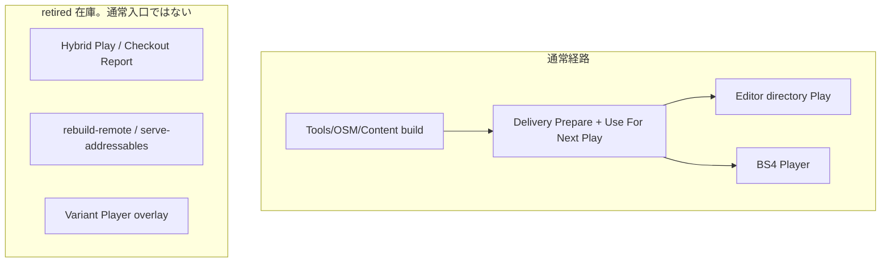

# 20. Variant チェックアウト厳選ワークフロー

> ステータス: 旧 Addressables checkout / Hybrid Play / remote catalog / Variant Player overlay は
> 通常経路から切断した（2026-09-20）。メニューと CLI は置換案内のみ。
> 通常手順は Content Directory build、DIST Delivery、directory Play、BS4 Player である。
> 前提資料: [18. AssetDescription](18-asset-description.md)

Content Directory build と、SampleGame の本番 SceneResource graph からの季節・表現選択は Editor 側の入口である。
新経路の選択規則と build 入口は [18. AssetDescription](18-asset-description.md#samplegame-の季節選択と-editor-build現況) を正とする。
Runtime load と寿命は [13. リソースシステム](13-resource-system.md)、起動と Player / installed override は [4. アプリ起動シーケンス](04-app-startup.md) を正とする。

`com.unity.addressables` 2.11.2 は残す。残存 owner は `AddressableBackend`、serialized `AssetReference`、
WorldCompanion の Addressables 登録、Player の `DoNotBuildWithPlayer` である。package 削除は後続スライス。

---

## 目次

1. [概要](#1-概要)
2. [全体像](#2-全体像)
3. [開発者の手順](#3-開発者の手順)
4. [配信側運用](#4-配信側運用)
5. [リビジョンの扱い](#5-リビジョンの扱い)
6. [制約事項](#6-制約事項)
7. [設定キー早見表](#7-設定キー早見表)
8. [関連ドキュメント](#8-関連ドキュメント)
9. [後続](#9-後続)

---

## 1. 概要

巨大なアセットリポジトリを全員がフル Checkout する必要はない、という旧 Addressables workflow の意図は残る。
通常の実行と Player は Content Directory と DIST install が担い、source checkout は編集用である。

旧経路が実現していた次の分担は、通常入口としては使わない。

- **ローカルに Checkout 済み**かつ**依存閉包が完結**するアセット → 旧 Hybrid Play の AssetDatabase 直読み
- **未 Checkout**または**閉包欠損**のアセット → 旧リモート Addressables catalog

チェックアウト自体（`git sparse-checkout` 等）は手動のまま。Framework の Checkout Report メニューは案内のみ。

### 文書の適用範囲

本書の profile、whitelist、checkout report、hybrid Play Mode Script、remote Addressables catalog、
旧 Player build は **意図的に廃止した通常経路** の在庫である。残ファイルを参照 0 だけで削除しない。
DIST Content Delivery は完成済み Content Directory を local/LAN directory、HTTP、installed offline から
検証済み disk cache へ導入し、Editor Play または対応 Player へ接続する。

DIST は source checkout を代行しない。sourceFiles の Missing / Changed / Complete は編集可能性の案内であり、
未 checkout asset の直接編集を可能にしない。取得済み content からの実行と source の編集可否を分けて扱う。

---

## 2. 全体像

### 中核コンポーネント（現況）

| レイヤ | 型 / ツール | 役割 |
|---|---|---|
| Editor | `SampleGameContentBuild` + bootstrap composer | 季節選択のあと UICommon / SceneResourceMap を Content Directory へ合成 |
| Editor | `ContentDeliveryWindow` / `ContentDeliveryPlayBridge` | verified install を次 Play へ。未選択は fail-closed |
| Runtime | `AbstractApplicationInitializer` | 未指定 mode は pair が無ければ失敗。directory 時は Content 入口で bootstrap |
| Runtime | `AssetManagement.CompleteContentDirectoryPlayStop` | Play 停止の同期完了。`UnloadSceneAsync` も `StopAndDrain` も使わない |
| Editor | BS4 Player coordinator | 通常 Player。`VariantPlayerBuild` メニューは案内のみ |

### retired 在庫（通常手順ではない）

| レイヤ | 型 / ツール | 現状 |
|---|---|---|
| Editor | `VariantCheckoutReportWindow` / Hybrid registrar / Remote setup | メニューは案内 no-op。本体 mutation は呼ばない |
| Editor | `VariantHybridPlayModeScript` / `VariantFilteringBuildScript` | group mutation をせず base Fast/Packed へ委譲する警告経路 |
| Editor | `VariantPlayerBuild` | メニューは app-config を書き換えない |
| Runtime | `RemoteCatalogRuntimeBridge` / `TryLoadRemoteCatalogAsync` | 通常起動から切断。injector は代入しない |
| 外部 | `tools/rebuild-remote.ps1` / `tools/serve-addressables.ps1` | 失敗案内のみ |

`SceneVariantEditorInjector` と明示 `addressables` の SceneVariant 選択は互換 rollback 用に残す。
directory の representation は `content:representation` だけを使う。

### 設計上の要点

- **通常 Play は verified Content Directory** であり、source checkout 完了を起動条件にしない。
- **明示 `addressables`** だけが Addressables 互換口。未指定は pair が無ければ失敗する。
- **旧 Hybrid / remote catalog / Variant overlay** は残ファイルとして残し、参照 0 だけで削除しない。
- **Addressables package** は `AddressableBackend`、serialized `AssetReference`、WorldCompanion、Player `DoNotBuildWithPlayer` が使う。
- **Unity Accelerator** はソースアセットのインポート結果キャッシュであり、Content Directory の代替にはならない。

---

## 3. 開発者の手順

通常の Editor Play は **Tools > OSM > Content** で Content Directory を作り、Delivery で install し、
**Use For Next Play** してから Play する。Player は BS4 coordinator。

旧メニュー（Checkout Report / Hybrid Play / Setup Remote Distribution / Build Player (Active Variant)）は
案内を出すだけで、group snapshot / app-config overlay / Remote プロファイル生成 / catalog 追加ロードを実行しない。
以下の旧ステップは実行しない。

### DIST Content Delivery を使う場合

1. **Tools/OSM/Content/Delivery** で Local/LAN directory、HTTP base URL、Installed offline のいずれかを明示選択する。
2. manifest digest、contentSet、revision、cache root、disk budget を入力して **Prepare** を実行する。target は `StandaloneWindows64-Player` 固定であり、入力項目ではない。Local/LAN と HTTP は同じ manifest/file 検証と install を通る。Offline は既知 digest の installed revision を完全再検証する。
3. Prepare の結果で requested revision と installed revision の一致を確認する。revision 名の大小を新旧判定に使わず、remote の latest を取得したとは表示しない。
4. **Use For Next Play** は検証済み install の identity、representation、installed root、manifest digest を次回以降の起動へ適用する。Play 中の適用は拒否する。**Reset** は bridge 自身が設定した値だけを元へ戻す。
5. sourceFiles の Missing / Changed は checkout 案内として扱う。取得済み content が完全なら対応 Player の起動を止めない。編集が必要な asset は VCS で手動 checkout する。

検証用 loopback HTTP endpoint は開発 fixture であり、本番配信 service ではない。認証、署名、latest channel、
公開 CDN の運用はこの手順に含めない。

### 旧 Addressables 手順（在庫。実行しない）

残ファイルとメニューはある。参照 0 だけで削除しない。通常 Play / 配信 / Player からは使わない。

| 旧入口 | 現状 |
|---|---|
| Project Settings > OneStarMaker > Variant | SceneVariant 互換 rollback 用。directory の representation には使わない |
| OneStarMaker > Variant > Checkout Report | 案内のみ。sparse-checkout を代行しない |
| Register Hybrid Play Mode Script / Variant Hybrid Play Mode Script | 案内のみ。DataBuilders / catalog を変えない |
| OneStarMaker > Build > Build Player (Active Variant) | 案内のみ。app-config overlay を書かない。通常 Player は BS4 coordinator |
| 起動時 `TryLoadRemoteCatalogAsync` | 通常起動から切断 |

明示 `content:runtimeMode=addressables` だけが Addressables 互換口である。

---

## 4. 配信側運用

通常の配信は Content publish と Delivery の HTTP / local / installed offline である。

`OneStarMaker > Addressables > Setup Remote Distribution` は案内のみで Addressables 設定を変えない。
`tools/rebuild-remote.ps1` と `tools/serve-addressables.ps1` は失敗案内のみで、git pull、RemoteFull ビルド、
`ServerData` 配信を実行しない。Remote プロファイル生成、日次 rebuild、catalog.json 配信を通常手順にしない。

`VariantRemoteBuildBatch` は残ファイルである。通常 CI / 配信入口ではない。

---

## 5. リビジョンの扱い

通常起動はリモート Addressables catalog を追加ロードしない。revision の一致は DIST の requested と
installed の identity / manifest digest で見る。

旧 Hybrid の `build-info.json` 比較と `WarnOnRevisionMismatchAsync`、および「リモート PC で
`rebuild-remote.ps1` を再実行」は通常の対処ではない。残コードがあっても実行手順にしない。

---

## 6. 制約事項

### Editor / Play 制約

- **未 Checkout のシーンは Hierarchy で開けない。** Editor 上でのシーン直接編集にはローカル実体が必要。通常 Play は DIST install から読む。
- 起動時 Scene Variant は [§4.8](04-app-startup.md#48-起動時-scene-variant-と職種-companion-set) / [§18](18-asset-description.md) が別口で所有する。directory の representation は `content:representation`。
- **旧 Hybrid の Play Mode Script で catalog を絞る方式は通常 Play に使わない。**

### 本番ビルド

- 通常 Player は BS4 coordinator。`VariantPlayerBuild` は案内のみ。

### Unity Accelerator との関係

| | Unity Accelerator | 通常の Content Directory |
|---|---|---|
| 対象 | ソースアセットのインポート結果キャッシュ | DIST が検証した installed revision |
| 前提 | アセットファイル自体がローカル（またはキャッシュサーバ経由で取得済み） | source checkout 完了を起動条件にしない |
| 関係 | **補完**。Checkout 済みアセットのインポート待ちを短縮できる。Content Directory の代替ではない |

---

## 7. 設定キー早見表

### DIST directory 起動

| キー | 用途 |
|---|---|
| `content:runtimeMode` 未指定 | Editor Play は verified pair が無ければ失敗。pair があれば directory |
| `content:runtimeMode=addressables` | Addressables 互換・rollback |
| `content:runtimeMode=directory` | directory backend の明示選択 |
| `content:installedRevisionPath` | DIST managed revision root。manifest digest と pair 必須 |
| `content:manifestSha256` | 受信 transport manifest bytes の固定 digest |
| `content:buildIdentity` | installed manifest revision と一致させる identity |
| `content:representation` | 起動中に固定する表現 |

managed pair は legacy `content:directoryPath` より優先して検証する。既存 package-relative directory と
明示 `addressables` は互換 rollback。未指定の通常 Editor Play は Delivery pair が無ければ失敗する。

### AppConfig（`app-config.json`）

| キー | 用途 | 設定タイミング |
|---|---|---|
| `assetCheckout:remoteCatalogUrl` | 旧リモート Addressables カタログ URL。通常起動は読まない | 残キー。`VariantPlayerBuild` は案内のみ |
| `assetCheckout:firstSceneIdentify` | 旧論理初回シーン識別子 | 残キー。通常 Player は書かない |
| `assetCheckout:localRevision` | 旧ローカル Git リビジョン（乖離検知用） | 残キー |

### BuildVariantProfile（ScriptableObject）

| フィールド | 用途 |
|---|---|
| `VariantWhitelist` | 同梱 / Checkout 対象 Variant 名（完全一致） |
| `RemoteCatalogUrl` | フォールバック先リモートカタログ URL。空 = 無効 |
| `FirstSceneIdentify` | 論理初回シーン。空 = AppInitializer 既定（`Title`） |
| `RemoteGroupName` | リモート配信ビルド時の同期先グループ。空 = ローカルグループ |
| `TargetAddressablesGroupName` | ローカル whitelist 同期先グループ |

### Editor メニュー一覧（retired。案内 no-op）

| メニュー | 現状 |
|---|---|
| Project Settings > OneStarMaker > Variant | SceneVariant 互換 rollback 用。directory の representation には使わない |
| OneStarMaker > Variant > Checkout Report | 案内のみ |
| OneStarMaker > Addressables > Register Hybrid Play Mode Script | 案内のみ。DataBuilders を変えない |
| OneStarMaker > Addressables > Setup Remote Distribution | 案内のみ。Addressables 設定を変えない |
| OneStarMaker > Build > Build Player (Active Variant) | 案内のみ。app-config を書き換えない |
| Tools > OSM > Content / Delivery | 通常入口 |

### 外部スクリプト（retired）

| パス | 現状 |
|---|---|
| `tools/rebuild-remote.ps1` | 失敗案内。Content build へ置換 |
| `tools/serve-addressables.ps1` | 失敗案内。Delivery HTTP へ置換 |

---

## 8. 関連ドキュメント

- [18. AssetDescription — 目的・有用性・実装](18-asset-description.md) — Variant の定義と第二用途（チェックアウト厳選タグ）
- [13. リソースシステム + メモリバジェット設計](13-resource-system.md) — ランタイムアセット管理

## 9. 後続

RET 完了後も次は残る。本書の通常手順にはしない。

- ADDR-RETIRE: Addressables package と serialized `AssetReference` の全廃は未確認。残存 owner は冒頭の表。WorldCompanion の Addressables 登録と flake、Player の `DoNotBuildWithPlayer` を含む。衛生スライスと混ぜない。
- ADDR-HYGIENE: Active Player DataBuilder がまだ `VariantFilteringBuildScript`。`TryLoadRemoteCatalogAsync` は呼び出し切断済みの死コード。retired メニュー / CLI / batch / DataBuilder / settings 反射の試験はメニュー 4 つ以外が未証明。`CompleteContentDirectoryPlayStopAsync` は参照 0 でも削除しない。本スライスは settings mutation をしない。
- 配信運用拡張（signing、latest channel、CDN、delta/resume）は DIST v1 に含めない。同一 directory 内の季節グループ単位ハッシュ不変もここに含まれ、WCD は主張しない。
- 非 Scene Description / Mesh は実需要が出た種別だけの専用 slice。
- 部分 Checkout 開発の再燃は未所有。世界計画の S-7 実装スライスは廃止し、通常の未取得実行は DIST が担う。
- 1 Player で四季を持つか、`all-full` 起動か複数 directory 登録かは S-5 の A0。WCD は切らない。

> 注: 旧「17. Variant BuildScript レビュー」はファイル未保存のまま失われたため欠番。whitelist BuildScript の設計判断は実装（`Editor/Build/Variants/`）と本書の在庫表を正とする。
