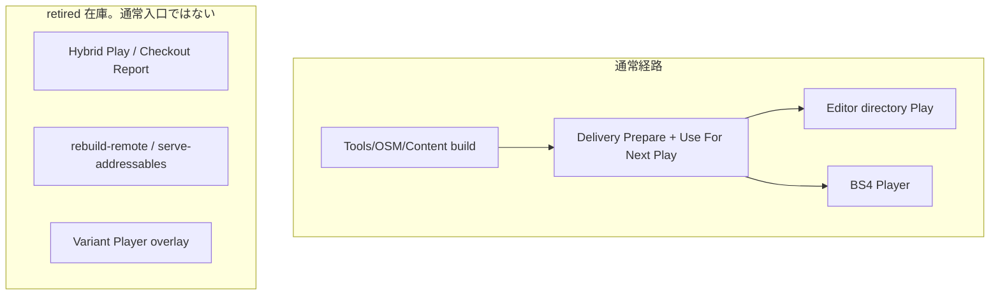

# 20. Variant チェックアウト厳選ワークフロー

> ステータス: 旧 Addressables checkout / Hybrid Play / remote catalog / Variant Player overlay は
> 通常経路から切断した（2026-09-20）。メニューと CLI は置換案内のみ。
> 通常手順は Content Directory build、DIST Delivery、directory Play、BS4 Player である。
> 前提資料: [18. AssetDescription](18-asset-description.md)

Content Directory build と、SampleGame の本番 SceneResource graph からの季節・表現選択は Editor 側の入口である。
新経路の選択規則と build 入口は [18. AssetDescription](18-asset-description.md#samplegame-の季節選択と-editor-build現況) を正とする。
Runtime load と寿命は [13. リソースシステム](13-resource-system.md)、起動と Player / installed override は [4. アプリ起動シーケンス](04-app-startup.md) を正とする。

`com.unity.addressables` 2.11.2 は残す。残存 owner は `AddressableBackend`、serialized `AssetReference`、
WorldCompanion の Addressables 登録、Player の `DoNotBuildWithPlayer` である。package 削除は後続スライス。

---

## 目次

1. [概要](#1-概要)
2. [全体像](#2-全体像)
3. [開発者の手順](#3-開発者の手順retired通常手順ではない)
4. [リモート PC（配信側）運用](#4-リモート-pc配信側運用retired通常手順ではない)
5. [リビジョンずれ時の対処](#5-リビジョンずれ時の対処retired通常手順ではない)
6. [制約事項](#6-制約事項)
7. [設定キー早見表](#7-設定キー早見表)
8. [関連ドキュメント](#8-関連ドキュメント)

---

## 1. 概要

巨大なアセットリポジトリを全員がフル Checkout する必要はない、という旧 Addressables workflow の意図は残る。
通常の実行と Player は Content Directory と DIST install が担い、source checkout は編集用である。

旧経路が実現していた次の分担は、通常入口としては使わない。

- **ローカルに Checkout 済み**かつ**依存閉包が完結**するアセット → 旧 Hybrid Play の AssetDatabase 直読み
- **未 Checkout**または**閉包欠損**のアセット → 旧リモート Addressables catalog

チェックアウト自体（`git sparse-checkout` 等）は手動のまま。Framework の Checkout Report メニューは案内のみ。

### 文書の適用範囲

本書の profile、whitelist、checkout report、hybrid Play Mode Script、remote Addressables catalog、
旧 Player build は **意図的に廃止した通常経路** の在庫である。残ファイルを参照 0 だけで削除しない。
DIST Content Delivery は完成済み Content Directory を local/LAN directory、HTTP、installed offline から
検証済み disk cache へ導入し、Editor Play または対応 Player へ接続する。

DIST は source checkout を代行しない。sourceFiles の Missing / Changed / Complete は編集可能性の案内であり、
未 checkout asset の直接編集を可能にしない。取得済み content からの実行と source の編集可否を分けて扱う。

---

## 2. 全体像



### 中核コンポーネント（現況）

| レイヤ | 型 / ツール | 役割 |
|---|---|---|
| Editor | `SampleGameContentBuild` + bootstrap composer | 季節選択のあと UICommon / SceneResourceMap を Content Directory へ合成 |
| Editor | `ContentDeliveryWindow` / `ContentDeliveryPlayBridge` | verified install を次 Play へ。未選択は fail-closed |
| Runtime | `AbstractApplicationInitializer` | 未指定 mode は pair が無ければ失敗。directory 時は Content 入口で bootstrap |
| Runtime | `AssetManagement.CompleteContentDirectoryPlayStopAsync` | Play 停止の完全 drain。`UnloadSceneAsync` は使わない |
| Editor | BS4 Player coordinator | 通常 Player。`VariantPlayerBuild` メニューは案内のみ |

### retired 在庫（通常手順ではない）

| レイヤ | 型 / ツール | 現状 |
|---|---|---|
| Editor | `VariantCheckoutReportWindow` / Hybrid registrar / Remote setup | メニューは案内 no-op。本体 mutation は呼ばない |
| Editor | `VariantHybridPlayModeScript` / `VariantFilteringBuildScript` | group mutation をせず base Fast/Packed へ委譲する警告経路 |
| Editor | `VariantPlayerBuild` | メニューは app-config を書き換えない |
| Runtime | `RemoteCatalogRuntimeBridge` / `TryLoadRemoteCatalogAsync` | 通常起動から切断。injector は代入しない |
| 外部 | `tools/rebuild-remote.ps1` / `tools/serve-addressables.ps1` | 失敗案内のみ |

`SceneVariantEditorInjector` と明示 `addressables` の SceneVariant 選択は互換 rollback 用に残す。
directory の representation は `content:representation` だけを使う。

### 設計上の要点

- **通常 Play は verified Content Directory** であり、source checkout 完了を起動条件にしない。
- **明示 `addressables`** だけが Addressables 互換口。未指定は pair が無ければ失敗する。
- **旧 Hybrid / remote catalog / Variant overlay** は残ファイルとして残し、参照 0 だけで削除しない。
- **Addressables package** は `AddressableBackend`、serialized `AssetReference`、WorldCompanion、Player `DoNotBuildWithPlayer` が使う。
- **Unity Accelerator** はソースアセットのインポート結果キャッシュであり、Content Directory の代替にはならない。

---

## 3. 開発者の手順（retired。通常手順ではない）

通常の Editor Play は **Tools > OSM > Content** で Content Directory を作り、Delivery で install し、
**Use For Next Play** してから Play する。Player は BS4 coordinator。以下の旧メニューは案内を出すだけで
group snapshot / app-config overlay / Remote プロファイル生成 / catalog 追加ロードを実行しない。

### DIST Content Delivery を使う場合

1. **Tools/OSM/Content/Delivery** で Local/LAN directory、HTTP base URL、Installed offline のいずれかを明示選択する。
2. manifest digest、contentSet、revision、cache root、disk budget を入力して **Prepare** を実行する。target は `StandaloneWindows64-Player` 固定であり、入力項目ではない。Local/LAN と HTTP は同じ manifest/file 検証と install を通る。Offline は既知 digest の installed revision を完全再検証する。
3. Prepare の結果で requested revision と installed revision の一致を確認する。revision 名の大小を新旧判定に使わず、remote の latest を取得したとは表示しない。
4. **Use For Next Play** は検証済み install の identity、representation、installed root、manifest digest を次回以降の起動へ適用する。Play 中の適用は拒否する。**Reset** は bridge 自身が設定した値だけを元へ戻す。
5. sourceFiles の Missing / Changed は checkout 案内として扱う。取得済み content が完全なら対応 Player の起動を止めない。編集が必要な asset は VCS で手動 checkout する。

検証用 loopback HTTP endpoint は開発 fixture であり、本番配信 service ではない。認証、署名、latest channel、
公開 CDN の運用はこの手順に含めない。

### 3.1 Variant プロファイルの選択

1. **Project Settings > OneStarMaker > Variant** を開く
2. 自分の開発領域に合った `BuildVariantProfile` を選択する（UserSettings に保存され、VCS 外）

### 3.2 Checkout 対象の確認

1. メニュー **OneStarMaker > Variant > Checkout Report** を開く
2. レポートを生成し、Included アセットが次の 3 分類で表示されることを確認する
   - **LocalComplete**: ローカルで依存閉包が完結。`AssetDatabase` 直読み可能
   - **RemoteResolve**: ローカルに無いが、リモートカタログ（全 Variant 同梱前提）で解決可能とみなす
   - **Error**: ローカル・リモートとも解決不可（whitelist エラー、閉包欠損等）
3. **Copy required asset paths to clipboard** ボタンで Checkout 必要パス一覧をクリップボードへコピー
4. `git sparse-checkout` 等で**手動 Checkout** する（Framework は Checkout 操作自体を行わない）

### 3.3 Editor Play（ハイブリッドモード）

初回のみ:

1. **OneStarMaker > Addressables > Register Hybrid Play Mode Script** を実行（DataBuilder 登録）
2. **Addressables Settings > Play Mode Script** で **Variant Hybrid Play Mode Script** を選択

以降:

1. Play を実行
2. `VariantHybridPlayModeScript` が whitelist 対象のうち**閉包完結分のみ**ローカルカタログへ載せ、欠損分は Addressables 設定から一時除外
3. 起動時 `TryLoadRemoteCatalogAsync` がプロファイルの `RemoteCatalogUrl`（または AppConfig）からリモートカタログを追加ロード
4. ローカル完結分は `AssetDatabase`、未取得分はリモートバンドルから解決

### 3.4 プレイヤービルド

1. **OneStarMaker > Build > Build Player (Active Variant)** を実行
2. 本経路は Build Settings を**参照しない**。`VariantPlayerBuild.BootstrapScenePath`（`Assets/Scenes/SampleScene.unity`）を明示指定してビルドするため、Scene 0 が何であっても出力は変わらない
3. プロファイルの `FirstSceneIdentify` が `app-config.json` の `assetCheckout:firstSceneIdentify` へ一時書き込みされ、ビルド完了後（成否問わず）復元される
4. ⚠️ **書き込みのみ実装済み。起動側の読者は未実装**（2026-08-15 確認）。ランタイムが読む `assetCheckout:*` は `remoteCatalogUrl` と `localRevision` だけで、`firstSceneIdentify` を消費するコードはリポジトリに存在しない。`AppInitializer.GetFirstSceneIdentify` というメソッドも無い。したがって Variant 出荷は現状 `SampleScene` で起動して止まる。§2.1 の「Scene 0 差し替えではなく論理初回シーン注入」は、読者が実装されるまで意図の宣言に留まる

> **Scene 0 について（2026-08-15 更新）**
>
> `EditorBuildSettings` の Scene 0 は `SampleScene` から `Assets/SampleGame/OutGame/Title/Title.unity` へ変更済み。**Editor の Play from first scene を Title から始めるための変更**であり、本節の出荷経路には影響しない（上記 2）。
>
> - `AppInitializer` は `[RuntimeInitializeOnLoadMethod]` で起動するため、Scene 0 が何であっても初期化は走る。`SampleScene` に Bootstrap オブジェクトは無い（Main Camera / Directional Light / Global Volume のみ）
> - **素の `File > Build Settings > Build` は使わないこと。** Title が Addressables カタログとプレイヤー本体の両方に載り、§3.4 冒頭の「コンテンツ二重化を避ける」意図が壊れる。プレイヤービルドは常に上記 1 の経路を使う

---

## 4. リモート PC（配信側）運用（retired。通常手順ではない）

通常の配信は Content publish と Delivery HTTP/local install である。`tools/rebuild-remote.ps1` と
`tools/serve-addressables.ps1` は失敗案内のみ。

### 4.1 初回セットアップ

1. リポジトリを clone
2. Unity Editor で **OneStarMaker > Addressables > Setup Remote Distribution** を実行
   - Remote プロファイル変数、リモート Addressables グループ、`RemoteFull` プロファイル等を生成
3. Addressables Settings の **Remote.LoadPath** を実 IP / URL に変更する（例: `http://192.168.x.x:8080/[BuildTarget]`）
4. `BuildVariantProfile.RemoteCatalogUrl` も開発者 PC から到達可能な URL に合わせる

### 4.2 日常運用

```powershell
# リポジトリルートから
$env:UNITY_PATH = "C:\Program Files\Unity\Hub\Editor\<version>\Editor\Unity.exe"
.\tools\rebuild-remote.ps1      # git pull + Unity バッチモードで RemoteFull ビルド
.\tools\serve-addressables.ps1  # ServerData/[BuildTarget]/ を HTTP 配信
```

| 項目 | 推奨 |
|---|---|
| 更新頻度 | **最低日次**。可能ならコミット毎 |
| 配信ポリシー | 中間状態（ビルド途中の不完全成果物）を配信しない |
| 成果物 | `ServerData/[BuildTarget]/` に catalog.json + バンドル + `build-info.json` |

`VariantRemoteBuildBatch` は Unity バッチモードから `VariantFilteringBuildScript` を呼び出し、`RemoteGroupName` 指定時に Remote Catalog を一時有効化してリモートグループへ同期する。

---

## 5. リビジョンずれ時の対処（retired。通常手順ではない）

通常起動はリモート catalog を追加ロードしない。以下は旧 Hybrid / remote catalog 経路の在庫である。

リモートビルド時、`VariantFilteringBuildScript` が成果物ディレクトリへ `build-info.json`（`revision`, `builtAtUtc`）を出力する。

起動時 `AbstractApplicationInitializer.WarnOnRevisionMismatchAsync` が:

1. リモート `build-info.json` を取得
2. ローカル Git HEAD（または AppConfig `assetCheckout:localRevision`）と比較
3. 乖離時に **警告ログ** を出力（best-effort。取得失敗時はスキップ）

### 乖離が検出された場合

| 状況 | 対処 |
|---|---|
| リモートが古い | リモート PC で `rebuild-remote.ps1` を再実行 |
| ローカルが古い | `git pull` 等でローカルをリモートビルド元リビジョンに合わせる |
| 意図的な差分 | 警告を確認のうえ開発を継続（動作保証は開発者責任） |

---

## 6. 制約事項

### Editor / Play 制約

- **未 Checkout のシーンは Hierarchy で開けない。** リモートフォールバックは Addressables ロード（Runtime）のみが対象。Editor 上でのシーン直接編集にはローカル実体が必要。
- **本機構はビルド / カタログ構成レイヤーで完結**し、作業者が手元に置く領域を選ぶ機能である。起動時 Scene Variant は [§4.8](04-app-startup.md#48-起動時-scene-variant-と職種-companion-set) / [§18](18-asset-description.md) が別口で所有する。
- **Editor の Addressables はローカル前提**のため、欠損分の除外は Play Mode Script でカタログを絞る方式である。AddressableGroup 設定だけでは実現できない。

### 本番ビルド

- 本番ビルドは従来通り **全アセット同梱**（Production プロファイル、リモートフォールバック無効）。

### Unity Accelerator との関係

| | Unity Accelerator | 本ワークフロー |
|---|---|---|
| 対象 | ソースアセットのインポート結果キャッシュ | Checkout 不要なアセットの実行時実体配信 |
| 前提 | アセットファイル自体がローカル（またはキャッシュサーバ経由で取得済み） | ソース未 Checkout でもリモートバンドルからロード可能 |
| 関係 | **補完**。併用すると Checkout 済みアセットのインポート待ちを短縮できる |

---

## 7. 設定キー早見表

### DIST directory 起動

| キー | 用途 |
|---|---|
| `content:runtimeMode` 未指定 | Editor Play は verified pair が無ければ失敗。pair があれば directory |
| `content:runtimeMode=addressables` | Addressables 互換・rollback |
| `content:runtimeMode=directory` | directory backend の明示選択 |
| `content:installedRevisionPath` | DIST managed revision root。manifest digest と pair 必須 |
| `content:manifestSha256` | 受信 transport manifest bytes の固定 digest |
| `content:buildIdentity` | installed manifest revision と一致させる identity |
| `content:representation` | 起動中に固定する表現 |

managed pair は legacy `content:directoryPath` より優先して検証する。既存 package-relative directory と
明示 `addressables` は互換 rollback。未指定の通常 Editor Play は Delivery pair が無ければ失敗する。

### AppConfig（`app-config.json`）

| キー | 用途 | 設定タイミング |
|---|---|---|
| `assetCheckout:remoteCatalogUrl` | リモート Addressables カタログ URL | 開発ビルド / 実機。`VariantPlayerBuild` または手動 |
| `assetCheckout:firstSceneIdentify` | 論理初回シーン識別子 | `VariantPlayerBuild` がビルド中のみ一時書き込み |
| `assetCheckout:localRevision` | ローカル Git リビジョン（乖離検知用） | ビルド時に焼き込み（任意） |

### BuildVariantProfile（ScriptableObject）

| フィールド | 用途 |
|---|---|
| `VariantWhitelist` | 同梱 / Checkout 対象 Variant 名（完全一致） |
| `RemoteCatalogUrl` | フォールバック先リモートカタログ URL。空 = 無効 |
| `FirstSceneIdentify` | 論理初回シーン。空 = AppInitializer 既定（`Title`） |
| `RemoteGroupName` | リモート配信ビルド時の同期先グループ。空 = ローカルグループ |
| `TargetAddressablesGroupName` | ローカル whitelist 同期先グループ |

### Editor メニュー一覧（retired。案内 no-op）

| メニュー | 現状 |
|---|---|
| Project Settings > OneStarMaker > Variant | SceneVariant 互換 rollback 用。directory の representation には使わない |
| OneStarMaker > Variant > Checkout Report | 案内のみ |
| OneStarMaker > Addressables > Register Hybrid Play Mode Script | 案内のみ。DataBuilders を変えない |
| OneStarMaker > Addressables > Setup Remote Distribution | 案内のみ。Addressables 設定を変えない |
| OneStarMaker > Build > Build Player (Active Variant) | 案内のみ。app-config を書き換えない |
| Tools > OSM > Content / Delivery | 通常入口 |

### 外部スクリプト（retired）

| パス | 現状 |
|---|---|
| `tools/rebuild-remote.ps1` | 失敗案内。Content build へ置換 |
| `tools/serve-addressables.ps1` | 失敗案内。Delivery HTTP へ置換 |

---

## 8. 関連ドキュメント

- [18. AssetDescription — 目的・有用性・実装](18-asset-description.md) — Variant の定義と第二用途（チェックアウト厳選タグ）
- [13. リソースシステム + メモリバジェット設計](13-resource-system.md) — ランタイムアセット管理（リモートロード後のキャッシュ等）

> 注: 旧「17. Variant BuildScript レビュー」はファイル未保存のまま失われたため欠番。whitelist BuildScript の設計判断は本書と実装（`Editor/Build/Variants/`）を正とする。
