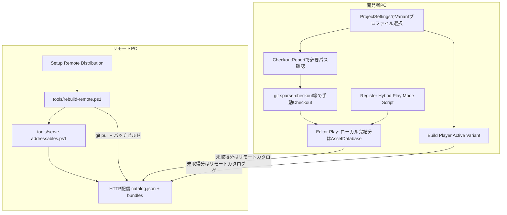

# 20. Variant チェックアウト厳選ワークフロー

> ステータス: 実装済み (2026-07-05)
> 前提資料: [18. AssetDescription](18-asset-description.md)

---

## 目次

1. [概要](#1-概要)
2. [全体像](#2-全体像)
3. [開発者の手順](#3-開発者の手順)
4. [リモート PC（配信側）運用](#4-リモート-pc配信側運用)
5. [リビジョンずれ時の対処](#5-リビジョンずれ時の対処)
6. [制約事項](#6-制約事項)
7. [設定キー早見表](#7-設定キー早見表)
8. [関連ドキュメント](#8-関連ドキュメント)

---

## 1. 概要

巨大なアセットリポジトリを全員がフル Checkout する必要はない。本ワークフローは、既存の `AssetPayload.Variant` を **チェックアウト厳選タグ** として活用し、開発者が選んだ `BuildVariantProfile` に応じて次を実現する。

- **ローカルに Checkout 済み**かつ**依存閉包が完結**するアセット → `AssetDatabase` 直読み（Editor Play）またはローカル Addressables カタログ
- **未 Checkout**または**閉包欠損**のアセット → リモート PC でビルド済みの Addressables バンドルからストリーミング

チェックアウト自体（`git sparse-checkout` 等）は手動。Framework は「何を Checkout すべきか」のレポート生成と、ローカル/リモートのハイブリッド解決を担う。

---

## 2. 全体像



### 中核コンポーネント

| レイヤ | 型 / ツール | 役割 |
|---|---|---|
| Editor | `AssetDependencyClosure` | アセットの依存閉包を計算し、ローカル完結性（閉包メンバーが全てディスク上に存在するか）を判定 |
| Editor | `BuildVariantProfile` 拡張 | `RemoteCatalogUrl` / `FirstSceneIdentify` / `RemoteGroupName` を追加 |
| Editor | `DeveloperVariantSettings` | UserSettings（VCS 外）に開発者ごとの Active プロファイルを保存 |
| Editor | `VariantCheckoutReportWindow` | Included アセットを LocalComplete / RemoteResolve / Error に 3 分類。Checkout 必要パスをクリップボードへコピー |
| Editor | `VariantHybridPlayModeScript` | Play 時、閉包完結分のみローカルカタログへ載せ、欠損分は一時除外してリモート解決へ |
| Editor | `VariantFilteringBuildScript` | リモートビルド時 `RemoteGroupName` 指定で Remote Catalog を一時有効化 |
| Editor | `VariantPlayerBuild` | Active Variant でプレイヤービルド。`FirstSceneIdentify` を app-config.json へ一時反映 |
| Runtime | `RemoteCatalogRuntimeBridge` | Editor → Runtime のリモートカタログ URL ブリッジ |
| Runtime | `AbstractApplicationInitializer.TryLoadRemoteCatalogAsync` | 起動時にリモートカタログを追加ロード |
| 外部 | `tools/rebuild-remote.ps1` / `tools/serve-addressables.ps1` | リモート PC の自動リビルド + HTTP 配信 |

### 設計上の要点

- **Editor の Addressables は「アセットは常にローカルにある」前提**で動く。欠損分のリモート倒しは AddressableGroup 設定ではなく、**Play Mode Script（カタログ生成のカスタマイズ）**で実現する。
- **ローカル完結の判定はアセット単体ではなく依存閉包全体**で行う。シーンだけ Checkout 済みでも、参照 Material / Texture が欠損していれば LocalComplete にならない。
- **共有 VCS ファイル**（`AddressableAssetSettings`, `app-config.json`）は恒久変更せず、Build / Play 中のみ一時変更 + スナップショット復元する。
- **Scene 0 差し替えではなく論理初回シーン注入**を採用する（Build Settings の Bootstrap シーンを維持し、コンテンツ二重化を避ける）。
- **リモートビルドの鮮度維持**（自動リビルド運用）が前提。鮮度が崩れるとリビジョン乖離警告が出る。
- **Unity Accelerator** はソースアセットのインポート結果キャッシュであり、本機構の代替にはならない。併用は有効。

---

## 3. 開発者の手順

### 3.1 Variant プロファイルの選択

1. **Project Settings > OneStarMaker > Variant** を開く
2. 自分の開発領域に合った `BuildVariantProfile` を選択する（UserSettings に保存され、VCS 外）

### 3.2 Checkout 対象の確認

1. メニュー **OneStarMaker > Variant > Checkout Report** を開く
2. レポートを生成し、Included アセットが次の 3 分類で表示されることを確認する
   - **LocalComplete**: ローカルで依存閉包が完結。`AssetDatabase` 直読み可能
   - **RemoteResolve**: ローカルに無いが、リモートカタログ（全 Variant 同梱前提）で解決可能とみなす
   - **Error**: ローカル・リモートとも解決不可（whitelist エラー、閉包欠損等）
3. **Copy required asset paths to clipboard** ボタンで Checkout 必要パス一覧をクリップボードへコピー
4. `git sparse-checkout` 等で**手動 Checkout** する（Framework は Checkout 操作自体を行わない）

### 3.3 Editor Play（ハイブリッドモード）

初回のみ:

1. **OneStarMaker > Addressables > Register Hybrid Play Mode Script** を実行（DataBuilder 登録）
2. **Addressables Settings > Play Mode Script** で **Variant Hybrid Play Mode Script** を選択

以降:

1. Play を実行
2. `VariantHybridPlayModeScript` が whitelist 対象のうち**閉包完結分のみ**ローカルカタログへ載せ、欠損分は Addressables 設定から一時除外
3. 起動時 `TryLoadRemoteCatalogAsync` がプロファイルの `RemoteCatalogUrl`（または AppConfig）からリモートカタログを追加ロード
4. ローカル完結分は `AssetDatabase`、未取得分はリモートバンドルから解決

### 3.4 プレイヤービルド

1. **OneStarMaker > Build > Build Player (Active Variant)** を実行
2. 本経路は Build Settings を**参照しない**。`VariantPlayerBuild.BootstrapScenePath`（`Assets/Scenes/SampleScene.unity`）を明示指定してビルドするため、Scene 0 が何であっても出力は変わらない
3. プロファイルの `FirstSceneIdentify` が `app-config.json` の `assetCheckout:firstSceneIdentify` へ一時書き込みされ、ビルド完了後（成否問わず）復元される
4. ⚠️ **書き込みのみ実装済み。起動側の読者は未実装**（2026-08-15 確認）。ランタイムが読む `assetCheckout:*` は `remoteCatalogUrl` と `localRevision` だけで、`firstSceneIdentify` を消費するコードはリポジトリに存在しない。`AppInitializer.GetFirstSceneIdentify` というメソッドも無い。したがって Variant 出荷は現状 `SampleScene` で起動して止まる。§2.1 の「Scene 0 差し替えではなく論理初回シーン注入」は、読者が実装されるまで意図の宣言に留まる

> **Scene 0 について（2026-08-15 更新）**
>
> `EditorBuildSettings` の Scene 0 は `SampleScene` から `Assets/SampleGame/OutGame/Title/Title.unity` へ変更済み。**Editor の Play from first scene を Title から始めるための変更**であり、本節の出荷経路には影響しない（上記 2）。
>
> - `AppInitializer` は `[RuntimeInitializeOnLoadMethod]` で起動するため、Scene 0 が何であっても初期化は走る。`SampleScene` に Bootstrap オブジェクトは無い（Main Camera / Directional Light / Global Volume のみ）
> - **素の `File > Build Settings > Build` は使わないこと。** Title が Addressables カタログとプレイヤー本体の両方に載り、§3.4 冒頭の「コンテンツ二重化を避ける」意図が壊れる。プレイヤービルドは常に上記 1 の経路を使う

---

## 4. リモート PC（配信側）運用

### 4.1 初回セットアップ

1. リポジトリを clone
2. Unity Editor で **OneStarMaker > Addressables > Setup Remote Distribution** を実行
   - Remote プロファイル変数、リモート Addressables グループ、`RemoteFull` プロファイル等を生成
3. Addressables Settings の **Remote.LoadPath** を実 IP / URL に変更する（例: `http://192.168.x.x:8080/[BuildTarget]`）
4. `BuildVariantProfile.RemoteCatalogUrl` も開発者 PC から到達可能な URL に合わせる

### 4.2 日常運用

```powershell
# リポジトリルートから
$env:UNITY_PATH = "C:\Program Files\Unity\Hub\Editor\<version>\Editor\Unity.exe"
.\tools\rebuild-remote.ps1      # git pull + Unity バッチモードで RemoteFull ビルド
.\tools\serve-addressables.ps1  # ServerData/[BuildTarget]/ を HTTP 配信
```

| 項目 | 推奨 |
|---|---|
| 更新頻度 | **最低日次**。可能ならコミット毎 |
| 配信ポリシー | 中間状態（ビルド途中の不完全成果物）を配信しない |
| 成果物 | `ServerData/[BuildTarget]/` に catalog.json + バンドル + `build-info.json` |

`VariantRemoteBuildBatch` は Unity バッチモードから `VariantFilteringBuildScript` を呼び出し、`RemoteGroupName` 指定時に Remote Catalog を一時有効化してリモートグループへ同期する。

---

## 5. リビジョンずれ時の対処

リモートビルド時、`VariantFilteringBuildScript` が成果物ディレクトリへ `build-info.json`（`revision`, `builtAtUtc`）を出力する。

起動時 `AbstractApplicationInitializer.WarnOnRevisionMismatchAsync` が:

1. リモート `build-info.json` を取得
2. ローカル Git HEAD（または AppConfig `assetCheckout:localRevision`）と比較
3. 乖離時に **警告ログ** を出力（best-effort。取得失敗時はスキップ）

### 乖離が検出された場合

| 状況 | 対処 |
|---|---|
| リモートが古い | リモート PC で `rebuild-remote.ps1` を再実行 |
| ローカルが古い | `git pull` 等でローカルをリモートビルド元リビジョンに合わせる |
| 意図的な差分 | 警告を確認のうえ開発を継続（動作保証は開発者責任） |

---

## 6. 制約事項

### Editor / Play 制約

- **未 Checkout のシーンは Hierarchy で開けない。** リモートフォールバックは Addressables ロード（Runtime）のみが対象。Editor 上でのシーン直接編集にはローカル実体が必要。
- **本機構はビルド / カタログ構成レイヤーで完結**し、ランタイム Variant 選択機能ではない（[18](18-asset-description.md) §2 参照）。
- **Editor の Addressables はローカル前提**のため、欠損分の除外は Play Mode Script でカタログを絞る方式である。AddressableGroup 設定だけでは実現できない。

### 本番ビルド

- 本番ビルドは従来通り **全アセット同梱**（Production プロファイル、リモートフォールバック無効）。

### Unity Accelerator との関係

| | Unity Accelerator | 本ワークフロー |
|---|---|---|
| 対象 | ソースアセットのインポート結果キャッシュ | Checkout 不要なアセットの実行時実体配信 |
| 前提 | アセットファイル自体がローカル（またはキャッシュサーバ経由で取得済み） | ソース未 Checkout でもリモートバンドルからロード可能 |
| 関係 | **補完**。併用すると Checkout 済みアセットのインポート待ちを短縮できる |

---

## 7. 設定キー早見表

### AppConfig（`app-config.json`）

| キー | 用途 | 設定タイミング |
|---|---|---|
| `assetCheckout:remoteCatalogUrl` | リモート Addressables カタログ URL | 開発ビルド / 実機。`VariantPlayerBuild` または手動 |
| `assetCheckout:firstSceneIdentify` | 論理初回シーン識別子 | `VariantPlayerBuild` がビルド中のみ一時書き込み |
| `assetCheckout:localRevision` | ローカル Git リビジョン（乖離検知用） | ビルド時に焼き込み（任意） |

### BuildVariantProfile（ScriptableObject）

| フィールド | 用途 |
|---|---|
| `VariantWhitelist` | 同梱 / Checkout 対象 Variant 名（完全一致） |
| `RemoteCatalogUrl` | フォールバック先リモートカタログ URL。空 = 無効 |
| `FirstSceneIdentify` | 論理初回シーン。空 = AppInitializer 既定（`Title`） |
| `RemoteGroupName` | リモート配信ビルド時の同期先グループ。空 = ローカルグループ |
| `TargetAddressablesGroupName` | ローカル whitelist 同期先グループ |

### Editor メニュー一覧

| メニュー | 用途 |
|---|---|
| Project Settings > OneStarMaker > Variant | Active プロファイル選択 |
| OneStarMaker > Variant > Checkout Report | Checkout レポート / パスコピー |
| OneStarMaker > Addressables > Register Hybrid Play Mode Script | Hybrid Play Mode DataBuilder 登録（初回） |
| OneStarMaker > Addressables > Setup Remote Distribution | リモート配信構成のワンショット生成 |
| OneStarMaker > Build > Build Player (Active Variant) | Active Variant でプレイヤービルド |

### 外部スクリプト

| パス | 用途 |
|---|---|
| `tools/rebuild-remote.ps1` | git pull + Unity バッチビルド |
| `tools/serve-addressables.ps1` | Addressables 成果物の HTTP 配信 |

---

## 8. 関連ドキュメント

- [Carbon 参照 01 §3.8 — 設計方針宣言](../../../../docs/reference/carbon-engine/01-resources-vs-asset-management.md#38-設計方針宣言--unity-超巨大プロジェクトのつらみを解く) — **なぜ** Variant/checkout を EVE/Carbon モデルごと採らないか（本書は **どうやるか**）
- [Carbon 参照 01 §3.9 — 巨大チーム向け構想](../../../../docs/reference/carbon-engine/01-resources-vs-asset-management.md#39-巨大チーム向けに足す仕組み構想) — org レイヤ（Catalog Registry / Closure artifact 等）のロードマップ
- [18. AssetDescription — 目的・有用性・実装](18-asset-description.md) — Variant の定義と第二用途（チェックアウト厳選タグ）
- [13. リソースシステム + メモリバジェット設計](13-resource-system.md) — ランタイムアセット管理（リモートロード後のキャッシュ等）

> 注: 旧「17. Variant BuildScript レビュー」はファイル未保存のまま失われたため欠番。whitelist BuildScript の設計判断は本書と実装（`Editor/Build/Variants/`）を正とする。
