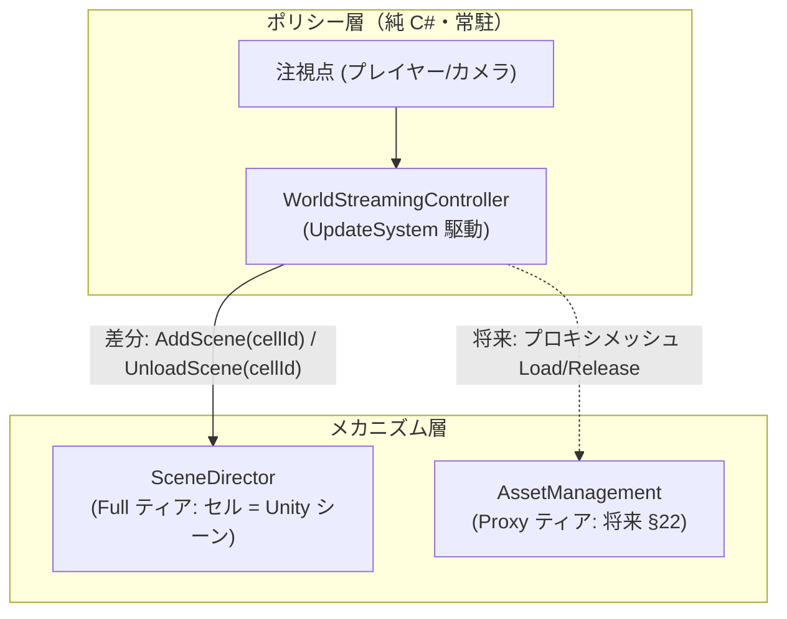

# 21. SceneStreaming — セルストリーミング設計

> ステータス: コア実装済み（T-01〜T-06.5: `WorldStreamingController` + `SessionWorldStreamingDriver`）。**T-07〜T-09（実証スライス・テレメトリ・受入判定）は未了。** HLOD / Proxy ティアは未着手
> 前提資料: [05. シーン管理](05-scene.md) / [13. リソースシステム](13-resource-system.md)
> 関連: HLOD / Proxy ティアの詳細は将来の §22 に分離する（本書はインターフェース予約のみ）

---

## 目次

1. [目的・スコープ](#1-目的スコープ)
2. [用語定義](#2-用語定義)
3. [設計判断](#3-設計判断)
4. [アーキテクチャ](#4-アーキテクチャ)
5. [SceneDirector 堅牢化（前提作業）](#5-scenedirector-堅牢化前提作業)
6. [セル生成パイプライン](#6-セル生成パイプライン)
7. [セル制作規約](#7-セル制作規約)
8. [WorldStreamingController ポリシー仕様](#8-worldstreamingcontroller-ポリシー仕様)
9. [テレメトリと受け入れ条件](#9-テレメトリと受け入れ条件)
10. [実装チケット](#10-実装チケット)
11. [撤退ライン](#11-撤退ライン)
12. [将来拡張（§22 予約）](#12-将来拡張22-予約)

---

## 1. 目的・スコープ

ワールドをセル（グリッド分割された Unity シーン）単位で動的にロード/アンロードする **SceneStreaming** を実証する。

**実証スライスで証明すること:**

- 注視点の移動に追従してセルが自動的にロード/アンロードされ、表示セル集合が常に「あるべき集合」へ収束する
- 高速移動時、ロード中セルのキャンセル/保留アンロードが正しく機能し、リークしない
- フレームスパイク・メモリが受け入れ条件（§9）内に収まる

**非スコープ:**

- HLOD / Proxy ティアの実装（§22 に分離。本書は Controller のティア構造予約のみ）
- 無限ワールド・実行時のセル動的生成（グリッドはビルド時に確定）
- セル間シームレス物理（実証スライスでは考慮しない）

---

## 2. 用語定義

| 用語 | 定義 |
|---|---|
| セル (Cell) | グリッド分割されたワールドの1区画。実体は Addressable な Unity シーン |
| 注視点 (Focus) | ストリーミングの基準点。通常はプレイヤーまたはカメラ位置 |
| リング | 注視点からの距離帯。Full（フルシーン）/ Proxy（将来: 代替表示）/ Unloaded |
| ロード半径 / アンロード半径 | セルをロード対象にする距離 / アンロード対象にする距離。**ロード半径 < アンロード半径**とし、境界振動を防ぐ（ヒステリシス） |
| あるべき集合 (Desired Set) | 現在の注視点から計算される「ロードされているべきセル」の集合 |
| Full ティア | セルをフルシーンとしてロードする距離帯。SceneDirector が担当 |
| Proxy ティア | （将来）プロキシメッシュで代替表示する距離帯。AssetManagement 直ロードが担当 |

---

## 3. 設計判断

### 3.1 決定事項

| # | 決定 | 根拠 |
|---|---|---|
| D-1 | **セルの実体は Unity シーン**。Prefab はシーンを構築する部品 | Unity Editor の作業単位はシーン。レベルデザイン・ライティング・オクルージョン等のベイクがシーン単位で完結する |
| D-2 | **Full ティアのロード機構は SceneDirector のシーンツリーに乗せる** | セル=シーンである以上、シーンのライフサイクル管理は必須であり、それは SceneDirector の責務そのもの（§3.2 参照） |
| D-3 | **ロード判断は常駐の `WorldStreamingController`（純 C#）に集約**。セル自身は判断しない | アンロード済みセルには判断主体（SceneBase インスタンス）が存在しないため、外部常駐者が構造的に必須。SceneLifecycleManager 唯一オーナー原則とも整合 |
| D-4 | **2層構成**: Controller = ポリシー（あるべき集合の計算）、SceneDirector = メカニズム（Full ティア）、AssetManagement 直 = メカニズム（Proxy ティア予約） | ポリシー/メカニズム分離。バックエンド差し替え（§11 撤退ライン）を Controller 内部の実装交換で済ませられる |
| D-5 | セルは `AddScene` / `UnloadScene` 専用。`SwitchScene` / 履歴 / `TransitionPlan` には決して乗せない | 画面遷移の語彙とストリーミングの語彙を混ぜない。履歴汚染防止 |

### 3.2 SceneDirector 採用のトレードオフ判定

| 決定 | 採用 | 却下理由 |
|---|---|---|
| Full ティアの機構 | **SceneDirector シーンツリー** | 下記2案を却下 |
| 却下案1: SceneBase 継承クラスが自分でロード判断（自律セル） | — | アンロード済みセルに判断主体がいない。距離判定ロジックがシーン側へ散り、SceneLifecycleManager 唯一オーナー原則（旧プロジェクトの SceneState 二重管理の教訓）と衝突する |
| 却下案2: 完全独立の WorldStreaming サブシステム（AssetManagement 直） | — | SceneDirector が既にテスト付きで解いている収束問題を再発明することになる: ロード中アンロード要求の収束（キャンセル窓 + `_pendingUnloads`）、重複要求の除去、キャンセル時の親子逆順巻き戻し、3フェーズ再帰破棄、テレメトリ/SceneEvent 観測。さらに画面遷移とストリーミングの2つのライフサイクル系が相互作用する境界（InGame 退出時のセル一括破棄等）を自前配線する必要があり、バグの温床になる |

**SceneDirector 採用が前提とする既存機能（実装済み・活用する）:**

| 既存機能 | ストリーミングでの意味 |
|---|---|
| `UnloadScene` のキャンセル窓判定 + `_pendingUnloads` | ロード中セルへのアンロード要求が宣言的に収束する（窓内なら即キャンセル、PoNR 通過後は Stable 到達直後に自動アンロード） |
| `AddScene` の重複要求スキップ / アンロード完了待機 | Controller は差分を投げるだけでよい |
| `LoadType.OnDemand` の子シーン | World コンテナ配下にセルをぶら下げ、親ロード時に自動ロードさせない |
| 3フェーズ再帰アンロード | World 親の `UnloadScene` 1回で全ロード済みセルが正しい順序で破棄される（InGame 退出処理） |
| `AddScene`/`UnloadScene` のテレメトリ span + メモリ差分 | セルロードの観測が既定で付く |
| `SceneBase.BindAssets` + `OnPreLoadedImpl` | セルの重量アセットをキャンセル可能なフェーズでプリフェッチできる（§7 R-1） |

---

## 4. アーキテクチャ



### シーンツリー構成

```
Main (ルート)
  └── InGame (コンテナ)
        └── World (コンテナ、セルの親)
              ├── Cell_0_0 (LoadType.OnDemand)          ← 距離ストリーミング境界
              │     └── Environment_0_0 (OnDemand)      ← 職種作業単位（引っ張られない）
              ├── Cell_0_1 (LoadType.OnDemand)
              └── ... (N×N)
```

### Cell 作業単位と子シーン（CCS / 2026-07-26）

Cell は「距離ストリーミングの境界」であると同時に、**人間が並走作業する大きさの作業単位**でもある。

| ルール | 内容 |
|---|---|
| 距離判断の単位 | 常に Cell。`WorldStreamingController` は Cell identity だけを見る |
| Full ティア | Unity シーンを SceneDirector で Load（Prefab 直ストリーミングへ逃げない） |
| 子の LoadType | 既定 `OnDemand`。Cell `AddScene` で Environment 等は自動ロードされない |
| 子の明示ロード | SampleGame の薄いデモ配線（`SessionCellChildLoadDriver`）が Cell Stable 後に `AddScene` |
| 子の Unload | 親 Cell Unload の再帰破棄に任せる（ダングリング防止）。ロード時の引っ張りとは別 |
| フォルダ境界 | Scene identity の実行単位とディスクフォルダを揃える。実行物は `SampleGame/.../InGameSession/World/` 配下に集約 |

SampleGame 既定レイアウト（カタログ `SceneResourceMap` は Common/SceneMap に残してよい）:

```
SampleGame/InGame/InGameSession/World/
  World.unity / Materials/DemoCellLit.mat / WorldGridDefinition.asset
  Cells/
    Cell_0_0/
      Cell_0_0.unity / Cell_0_0.asset
      Environment_0_0.unity / Environment_0_0.asset   ← 萌芽（一部 Cell のみ）
```

- セルは全て `World` の子・`LoadType.OnDemand`。親ロード時に自動ロードされず、Controller の指示でのみ出入りする
- InGame 退出は `UnloadScene("World")`（または InGame ごと）で全セルが再帰破棄される
- `WorldStreamingController` は DependOnAll で手動 DI 配線し（[03-di.md](03-di.md)）、InGame シーンの寿命に合わせて Start/Stop する

---

## 5. SceneDirector 堅牢化（前提作業）

現行の SceneDirector は「一度に1遷移」の利用しか経験しておらず、並行 `AddScene` はテストされていない。ストリーミング着手前に以下を塞ぐ。

| # | 問題 | 対策 |
|---|---|---|
| H-1 | **並行 AddScene の親共有競合**: 2つの `AddScene` が同じ親（World）を共有するとき、`LoadUnityScene` のスキップ条件が `IsActive`（=Stable）のみのため、親が `Loading` 中だと後発も突入し、状態遷移の二重実行と `PerformUnitySceneLoad` の二重 Addressables ロードが起き得る | ✅ 対応済み (2026-07-06): `AddScene` / `LoadSceneBase` / `LoadUnityScene` を identity ごとの in-flight 完了通知で共有し、後発呼び出しは進行中ロードへ合流する |
| H-2 | `SceneLoadOptions` の priority が 100 固定 | `AddScene` 引数へ公開し、Controller が距離順の優先度を渡せるようにする ✅ 対応済み (2026-07-06) |
| H-3 | `AddScene` 毎の `CaptureMemorySnapshot` + Summary span がセル大量出入りで過剰になる可能性 | テレメトリレベルを呼び出し側で指定可能にする（セルは Verbose、画面遷移は Summary 維持）。実測で問題なければ据え置き可 ✅ 対応済み (2026-07-06) |
| H-4 | **PreLoad 中のキャンセル窓が機能しない**（2026-07-06 ベースラインテスト復活で発見）: `LoadCts` の代入が `LoadSceneBase` 完了**後**のため、PreLoad 実行中に `UnloadScene` を呼ぶと `LoadCts.Cancel()` ではなく `_pendingUnloads` 登録に落ちる。PreLoad がキャンセル待ちで永久にブロックしている場合デッドロックする | ✅ 対応済み (2026-07-06): `LoadCts` を SceneBase 生成時（PreLoad 開始前）に代入し、PoNR 通過時とキャンセル/例外経路で従来どおりクリアする |

H-1 は画面遷移側にも潜在する欠陥であり、ストリーミングと無関係に修正価値がある。
H-4 はストリーミングの高速通過（ロード中セルの即キャンセル）の生命線であり、H-1 と同時修正を推奨。

---

## 6. セル生成パイプライン

セルの SceneResource は SceneGraph Editor の手編集では量産できない（N×N ノードの手配置は非現実的）。専用のエディタ生成ツールを設ける。

```
グリッド定義 (ScriptableObject: 原点, セルサイズ, N×N, 命名規則 Cell_{x}_{y})
   │  エディタツール「World Cell Generator」
   ▼
セルシーン (.unity) 量産 or 既存シーンの取り込み
   +
SceneResource 量産 (World の子, LoadType.OnDemand)
   +
SceneResourceMap への登録
   +
Addressables グループ登録 (既存の AddressablesGroupSyncFilter を流用)
```

- 実装は `HpGaugeSliceSceneCreator`（シーン+ノード生成）と `SceneResourceGenerator` の既存資産を流用する
- セルは `AssetPayload.Variant` タグを付与でき、[20. Variant チェックアウト](20-variant-checkout-workflow.md) の whitelist ビルド/部分チェックアウトの対象にできる（ワールドの一部だけ Checkout して作業する運用）

#### 生成器の非破壊契約（2026-08-16）

**Cell の `.unity` は「生成物が正本」と「手編集が正本」が同居する。** どちらか一方に決める必要はなく、決めてもいけない — 両方を同居させられることがサンプルの証明対象だからである。

| policy | 意味 | 再生成時 |
|---|---|---|
| `Generated` | 生成物が正本 | Cell / Environment とも常に上書き |
| `HandAuthored` | 手編集が正本 | `AuthoredRoot` があれば触らない。無ければ初回スキャフォールドとして生成する |

判定は **`SampleGame.DependOnAll.Editor.Cells.CellPopulationPlan`（純関数）に閉じる。** `AssetDatabase` / `EditorSceneManager` に依存させない。呼び出し側に `if (policy == HandAuthored)` を書くと単体テストが書けなくなる。

**手編集を壊し得る経路は 3 つしかなく、すべて計画経由でなければならない:**

1. Cell シーンへの書き込み（`AuthoredRoot` の作り直し）
2. Environment シーンへの書き込み（同上）
3. **グリッド範囲外 Cell フォルダの削除** — `HandAuthored` は範囲外でも削除しない

3 番目を忘れやすい。グリッドを縮小すると範囲外の手編集がフォルダごと消える。

**`HandAuthored` を「範囲外だが保持する」状態に置いたら、その状態を知らないコードを探すこと。** 実際に、フォルダと `.unity` を守っても SceneGraph の `SceneNodeData` だけが刈られる欠陥が同じ形で 2 度発生した。

派生ルール:

- **Cell と Environment は独立に判定する。** 片方 Skip でもう片方 Populate があり得る
- **Skip は書き込みだけを飛ばす。配線は必ず続行する。** シーンファイルの生成・`SceneResource` の作成・親子リンク・`SetDirty` を飛ばすと Map と親子関係が壊れる
- **Environment の Skip 条件は `.unity` の有無ではなく `AuthoredRoot` の有無。** シーンファイル生成と中身の焼き込みは 2 段構えなので、前者を条件にすると中断時に空の Environment が永久に残る

#### policy データの所在（2026-08-16）

**「どの Cell が手編集正本か」は SampleGame の運用方針であって FW の契約ではない。** したがって:

- `CellAuthoringPolicy` を `OneStarMaker`（FW）側に置かない
- `WorldGridDefinition`（FW）に policy フィールドを足さない
- `SceneResource`（FW の型）にフラグを足さない

いずれも「FW → Game 参照禁止」に反するか、FW に Game の運用概念を漏らす。

#### グリッド寸法の正本（2026-08-16）

**`WorldCellCatalog`（`SampleGame.InGame.Streaming` の const）が正本で、`WorldGridDefinition.asset` はその写しである。** 生成器の `EnsureGridDefinition` が実行のたびにアセットへ書き戻すことで一致を強制している。

**アセット側だけを書き換えても効かない。** ランタイムの `SessionWorldStreamingDriver` はアセットではなく `WorldCellCatalog` の const を読んで desired set を組むため、乖離させると存在しない Cell を要求する。グリッド寸法を変えるときは const 側を変えること。

#### エディタ拡張が batchmode で踏む罠（2026-08-16）

**`EditorSceneManager.NewScene(..., NewSceneMode.Additive)` は、未保存の untitled シーンが開いていると必ず失敗する。** `Single` モードの `NewScene` / `OpenScene` は成功するため、この差に気づきにくい。

セルの `.unity` を新規作成する経路は Additive を使う。したがって**その手前で `.unity` を Additive で開閉するコードを足すと、Unity が未保存 untitled を作り直して生成器全体が落ちる。** 症状は「フォルダだけできて `.unity` が 1 つも作られない」。既存の 16 セルが揃っている間は新規作成に到達しないので発火せず、`git clone` 直後の初回実行と、グリッド縮小 → 拡大でだけ表に出る。

対処は、シーンを開閉したあとに**保存済みの実シーンを `Single` で開き直す**こと（`NewScene(EmptyScene, Single)` は dirty な untitled を作るので逆効果）。

---

## 7. セル制作規約

| # | ルール | 施行方法 | 強制力 |
|---|---|---|---|
| R-1 | 重量アセット（テクスチャ群・プレハブ群）は `OnPreLoadedImpl` の `Assets.LoadAsync` でプリフェッチする（キャンセル窓内 = 高速通過時に中止可能）。Unity シーン本体は参照とレイアウトのみの軽量構成とし、PoNR 区間を最小化する | セルテンプレート + コードレビュー | 規約 |
| R-2 | セルは UIView を持たない | CellScene 基底クラスが UIView 検索を行わない | 構造的強制 |
| R-3 | セルを `SwitchScene` / `GoBack` / `TransitionPlan` に乗せない（D-5） | `SwitchSceneCore` 冒頭のセル identity ガード（`CellIdentity.IsCellId` で検出し `InvalidOperationException`。T-04 で実装） | 構造的強制 |
| R-4 | セルの `LoadingDisplayType` は常に `None` | Controller が固定値で呼ぶ | 構造的強制 |
| R-5 | セル内オブジェクトはセル外のシーンオブジェクトを参照しない（隣接セルとの直接参照禁止） | コードレビュー | 規約 |
| R-6 | **生成器は `HandAuthored` な Cell / Environment の手編集を消さない**（§6「生成器の非破壊契約」） | `CellPopulationPlan`（純関数）と単体テスト 13 本 | 構造的強制 |

---

## 8. WorldStreamingController ポリシー仕様

```csharp
// 疑似コード
Tick(focusPosition):                       // UpdateSystem 駆動。毎フレーム不要
    desired = ComputeDesiredSet(focusPosition, loadRadius)
    retain  = ComputeDesiredSet(focusPosition, unloadRadius)   // ヒステリシス

    foreach cell in desired - current:      // 入るセル
        EnqueueLoad(cell, priority: DistanceOrder(cell, focusPosition))

    foreach cell in current - retain:       // 出るセル
        director.UnloadScene(cell).Forget() // 窓内キャンセル/保留は SceneDirector が収束させる

    PumpLoadQueue(maxInFlight)              // 同時ロード数制御
```

| パラメータ | 設計時の初期値（仮） | **SampleGame 実装値** | 備考 |
|---|---|---|---|
| セルサイズ | 100m × 100m | **250m × 250m** | Player カプセル（約 2.2m）を基準に作業単位として拡大 |
| グリッド | 10 × 10 | **4 × 4** | `WorldGridDefinition.asset` |
| ロード半径 | 150m | **375m** | 中心間 250m の約 1.5 セル。**セルサイズに追随させること** |
| アンロード半径 | 250m | **550m** | 差分 = ヒステリシス幅 |
| 同時 in-flight ロード上限 | 2 | 2 | H-2 の priority と併用 |
| Tick 頻度 | 5Hz または注視点が 1/4 セル移動したとき | 同左 | 毎フレーム距離計算はしない |

実装値の正本は `SampleGame/InGame/InGameSession/Streaming/WorldCellCatalog.cs`（半径・グリッド）と `WorldGridDefinition.asset`（セルサイズ）。

> **半径はセルサイズに従属する。** セルサイズ 250m に対してロード半径 150m だと、隣接セル中心（250m 先）が desired set に入らず、ストリーミングが成立しない。セルサイズを変えるときは必ず半径を再計算すること。

- Controller は純 C#・MonoBehaviour 非使用。テストは FakeSceneDirector（`ISceneStreamingBackend` インターフェース経由）で行う
- **`ISceneStreamingBackend`**（`AddCell` / `RemoveCell` の2メソッド程度）を Controller と SceneDirector の間に挟む。これが §11 撤退ラインの差し替え点になり、Proxy ティア（§22）も同型のバックエンドとして追加する

---

## 9. テレメトリと受け入れ条件

**計測（既存 span + 追加カウンタ）:**

- セルロード所要時間の分布（既存 SceneLoad span を identity プレフィックスで集計）
- 常駐セル数 / in-flight 数 / キャンセル発生数 / 保留アンロード発生数（Controller が定期 emit、DebugStudio で観測）
- AssetResidentCache のヒット率（セルのプリフェッチアセットに対して）

**受け入れ条件（T-09 で判定。数値は実測開始時に確定させる）:**

| # | 条件 | 目安 |
|---|---|---|
| A-1 | フライスルー（等速でグリッドを横断）中のフレームスパイク | 33ms 超のフレームが横断あたり N 回以下 |
| A-2 | セルロード所要時間 p95 | X ms 以下（実測で基準化） |
| A-3 | 横断往復後、常駐セル集合が「あるべき集合」と一致 | 不一致 0 |
| A-4 | 横断往復後、Addressables ハンドル数・managed/native メモリがベースラインへ復帰 | リーク 0 |
| A-5 | 高速横断（ロード半径をロード完了前に通過する速度）でキャンセル/保留アンロードが機能 | 例外 0・A-3/A-4 を満たす |

---

## 10. 実装チケット

| # | 内容 | 受入条件 |
|---|---|---|
| T-01 | ✅ 並行 AddScene 親共有競合の再現テスト（H-1） | 現行コードで競合が失敗として観測できる |
| T-02 | ✅ in-flight タスク共有によるガード実装 | T-01 のテストがグリーン。`OneStarMaker.Tests` 180 本に回帰なし |
| T-03 | ✅ priority / テレメトリレベルの公開（H-2, H-3） | 既存呼び出しの挙動不変 |
| T-04 | ✅ CellScene 基底（セル座標・バウンズのメタデータ運搬のみ。判断ロジック禁止）+ セル identity バリデータ | R-1/R-2 が構造的に守られる |
| T-05 | ✅ World Cell Generator（エディタツール、§6） | グリッド定義から N×N のシーン + SceneResource + Map 登録が生成される |
| T-06 | ✅ `ISceneStreamingBackend` + `WorldStreamingController`（§8） | FakeBackend による純 C# テストで差分発火・ヒステリシス・in-flight 上限を検証 |
| T-06.5 | ✅ Controller × 本物 SceneDirector 統合テスト（`SceneDirectorStreamingBackend`） | 施行表 T-06.5 の 5 テストが全グリーン（A-3 / A-5 の EditMode 版） |
| T-07 | 実証スライス（**4×4 グリッド / セル 250m** + Player + 簡易コンテンツ） | Editor Play で横断できる |
| T-08 | テレメトリ計測 + DebugStudio でのセル状態観測 | §9 の計測値が取得できる |
| T-09 | 受け入れ判定（§9）と撤退判断（§11） | 判定記録を本書に追記 |

T-01〜T-03 はストリーミングと独立にフレームワークの価値がある（先行着手可・別コミット推奨）。

**T-01 完了記録 (2026-07-06):**
`Tests/Scene/SceneDirectorConcurrentAddSceneTests.cs` に5本のレッドテスト + ハーネス健全性テスト1本を作成。
現行コードでの失敗の観測結果:

| 経路 | テスト | 現行の失敗 |
|---|---|---|
| 親が Loading 中に後発 AddScene 突入 | `Concurrent_AddTwoCells_WhileParentUnitySceneLoading_BothReachStable` ほか2本 | `InvalidOperationException: Invalid scene state transition: Loading → Loading` |
| 親が PreLoading 中に後発が素通り | `Concurrent_AddTwoCells_WhileParentPreLoading_WaitsAndPreLoadsOnce` | `Invalid scene state transition: PreLoading → Loading`（PreLoad 完了を待たない） |
| 同一 identity の並行 AddScene | `Concurrent_AddSameCellTwice_SecondAwaiterCompletesOnlyAfterStable` | 後発が Stable 到達前に即完了する（先頭ガードのスキップは完了を待たない） |

T-02 の受入条件はこの5本のグリーン化（`Sequential_AddTwoCells_SharedParentLoadsOnce` は現行でもグリーンで、回帰検知用）。

**T-02 完了記録 (2026-07-06):**
`SceneDirector` に identity ごとの in-flight 完了通知を追加し、`AddScene` / `LoadSceneBase` / `LoadUnityScene` の後発呼び出しを進行中ロードへ合流させた。
また、`LoadCts` を PreLoad 開始前に設定することで、PreLoad 中の `UnloadScene` がキャンセル窓として機能するよう修正。
検証結果:

- `OneStarMaker.Tests.SceneSystem`: 53 / 53 passed
- `OneStarMaker.Tests`: 180 / 180 passed

設計上の割り切り（in-flight 合流の意味論）:

- 同一 identity で進行中ロードへ合流した後発 `AddScene` の `afterOnLoadedTask` / `context` / `progress` は無視される（旧スキップガードと同等の意味論）
- 先発がキャンセルされた場合、合流側・兄弟セル側の `AddScene` はシーン未ロードのまま OCE または正常終了で収束する。WorldStreamingController（T-06）の desired-set 再照合で吸収する前提

事後修正 (2026-07-06): 非 OCE 例外（factory 失敗・PreLoad 内例外）経路で `LoadCts` が破棄済み CTS を指したまま残り、後続 `UnloadScene` が `ObjectDisposedException` を投げる潜在バグを修正。`AddSceneCore` の `finally` で `linkedCts` を Dispose する前に、当該 CTS を参照する pair の `LoadCts` を null クリアする。再発防止テスト `UnloadScene_AfterPreLoadNonCancellationException_DoesNotThrow` を追加。

**T-03 完了記録 (2026-07-06):**
`AddScene` の `priority` を `AddSceneCore` → `LoadUnityScene` → `PerformUnitySceneLoad` へ引数で伝搬し、対象シーンと親ロードの両方に同一値を適用した。`AddScene` / `UnloadScene` の `telemetryLevel` を `FinishSpan` の引数へ接続し、呼び出し側から Verbose / Summary を選択できるようにした。
検証結果:

- `OneStarMaker.Tests.SceneSystem`: 60 / 60 passed
- `OneStarMaker.Tests`: 187 / 187 passed

設計上の割り切り:

- 同一 identity で in-flight に合流した後発 `AddScene` の `priority` / `telemetryLevel` は無視される（I-5 と同じ意味論。先発の値が使われる）
- `IncrementalLoadAsync` および `NecessaryAlways` 子シーンの `LoadUnityScene` 呼び出しは既定値 100 のままとし挙動不変（セルは葉の OnDemand であり子ロード経路を通らない）
- `SwitchScene` / `GoBack` / `TransitionPlan` 内部の `AddScene` / `UnloadScene` 呼び出しは引数を渡さず既定値のままとし、画面遷移の挙動を変えない（G-3）

**T-04 完了記録 (2026-07-06):**
`Runtime/SceneSystem/Cells/` に `CellIdentity`（`Cell_{x}_{y}` の判定・解析・整形）、`CellGridConfig`（原点・セルサイズ・高さ）、`CellScene`（SceneBase 派生、座標・バウンズのメタデータ運搬のみ）を新設。
R-2 の構造的強制のため `SceneBase` の UIView 自動検索を `protected virtual UIView? SearchUIView()` へ抽出し、`CellScene` が `sealed override` で null 固定（検索自体を行わない）。既存シーンの挙動は不変。
R-3 を「将来」から本チケットへ繰り上げ、`SwitchSceneCore` 冒頭（span 開始・Show・履歴記録より前）でセル identity を検出したら `InvalidOperationException` を投げるガードを追加。GoBack / ExecuteTransitionPlan も SwitchSceneCore を経由するため全経路が守られる。画面遷移の正常系挙動は不変（G-3。セル identity は元々未定義動作であり、明示的失敗への変更は許容）。
テスト: `Tests/Scene/CellSceneTests.cs` に 8 本（CellIdentity 判定/整形 2、座標解析・不正 identity・バウンズ 3、R-2 UIView 非登録 1 + ハーネス健全性 1、R-3 SwitchScene ガード 1）。TDD サイクル: スケルトン + レッド 7 本（健全性 1 本はグリーン）を確認後に実装。
検証結果:

- `OneStarMaker.Tests.SceneSystem`: 68 / 68 passed
- `OneStarMaker.Tests`: 195 / 195 passed

設計上の割り切り:

- セル座標は非負整数のみ（`Cell_-1_0` は非セル扱い）。グリッドはビルド時確定・原点基準のため
- セルシーンテンプレート（.unity アセット）は T-05 World Cell Generator がシーン量産と併せて生成するため本チケットでは作成せず、規約の構造的強制（R-2 の SearchUIView 封鎖・identity 検証）のみを本チケットで実装した
- ガードは `AddScene` / `UnloadScene` には掛けない（セルの正規経路。D-5）

**T-05 完了記録 (2026-07-06):**
`Editor/Streaming/` に `WorldGridDefinition`（ScriptableObject: 原点・セルサイズ・N×N・親 identity・出力フォルダ）と `WorldCellGenerator` を新設。
生成ロジックを純関数に分離: `ComputePlan`（グリッド定義 + 既存状態 → Create/Skip の計画）と `ApplyPlan`（計画 → SceneResource 生成・親子設定・Map 登録。.unity 書き込みなし）がテスト対象。`.unity` I/O は `ApplySceneFiles`（Additive 作成 → 保存 → クローズで作業中シーンを破壊しない）と `Generate`（一括実行）に隔離し、施行表どおりテスト対象外。
テスト: `Tests/Editor/WorldCellGeneratorTests.cs` に 6 本（N×N 生成、OnDemand + 親子双方向、`Cell_{x}_{y}` 命名、冪等性、Map 登録、不正定義の例外）。TDD サイクル: スケルトン + レッド 5 本を確認後に実装。
検証結果:

- `OneStarMaker.Tests`: 211 / 211 passed（T-05 6 本 + T-06 10 本を含む）

設計上の割り切り・要点:

- 冪等性は `WorldCellExistingState.FromMap` → `ComputePlan` の Skip 判定で表現。2 回目は Create 0 件・既存インスタンスの再利用（同一参照）・`parent.Children` 非増加をテストで保証
- `SceneAssetDescription` の書き込みは boxedValue を使わず SerializedProperty の要素単位転記（11-scene-graph-editor.md §W-1 と同方針）。GUID 解決は `AssetPathToGUIDOptions.OnlyExistingAssets` で削除済みアセットを除外
- `Generate` は Map 未登録だがディスクに存在するセル .asset を先に Map / 親子へ取り込む（identity がファイル名と食い違う場合は警告してスキップ。取り込みは登録のみで payload 内容は無検証）
- 既存ファイルへの変更は `SceneResourceMap` への `internal RebuildDictionary()` 追加のみ（ApplyPlan 後の辞書整合性用）
- Addressables 登録・セルシーンテンプレートの中身は T-07 以降で判断（生成される .unity は空シーン）

**T-06 完了記録 (2026-07-06):**
`Runtime/Streaming/` に `ISceneStreamingBackend`（施行表で固定した API）、`StreamingConfig`（グリッド + loadRadius / unloadRadius / maxInFlight。引数検証つき）、`WorldStreamingController` を新設。純 C#・MonoBehaviour / SceneDirector 非依存で、`Tick(Vector3)` を外部から手動駆動する。
ポリシー: 毎 Tick 全セルの XZ 距離を計算し、loadRadius 内 = desired（距離昇順ソート）、unloadRadius 内 = retain。ロード済み or Add in-flight で retain 外のセルへ RequestRemove、desired かつ未ロード・非 in-flight のセルへ距離順ランク（0 始まり）を priority として RequestAdd。current 集合は保持せず毎 Tick `IsLoaded` で再照合（G-6 自己修復）。
テスト: `Tests/Streaming/WorldStreamingControllerTests.cs` に 10 本（desired set、アンロード半径、ヒステリシス、差分発火、距離順 priority、in-flight 上限、キュー取り消し、G-6 再発行、focus 移動収束、Add/Remove 競合）。`FakeStreamingBackend` は即時/手動完了の切替・履歴記録・二重 RequestAdd 検出（例外）を持つ。TDD サイクル: スケルトン + レッド 9 本を確認後に実装。
検証結果:

- `OneStarMaker.Tests`: 211 / 211 passed

設計上の割り切り・要点:

- in-flight の Add は完了観測（`ObserveAddCompletionAsync` の finally）まで解放しない。desired 外へ出たセルは Add 未完了でも RequestRemove を発行するが、Add 枠は完了まで占有し続けることで desired 復帰時の二重 RequestAdd を防ぐ
- Remove in-flight 中のセルへは再 Add しない（Remove 完了後の次 Tick の G-6 再照合に委ねる）
- UniTask の消費は Observe ヘルパー内の 1 箇所の await のみ（二重消費禁止）。例外・キャンセルもそこで観測し、失敗セルは次 Tick の再照合で回収
- maxInFlight の空き枠は発行ごとに再評価（即時完了バックエンドでは 1 Tick で maxInFlight 超の件数を順次発行可。未完了同時数は常に上限以下）
- Add 保留中に retain 外へ出たセルには Tick ごとに RequestRemove が再発行され得る（バックエンド側 Remove の冪等性で吸収する前提。レビュー Nit として許容）
- UpdateSystem への接続アダプタ・Tick 間引き（5Hz / 1/4 セル移動）はアダプタ側の責務で T-07 にて実装

**T-06.5 完了記録 (2026-07-06):**
`Runtime/Streaming/SceneDirectorStreamingBackend.cs`（`ISceneStreamingBackend` の本実装）を新設。`RequestAdd` → `AddScene(cellId, null, CancellationToken.None, loadingDisplay: None, priority, telemetryLevel: Verbose)`、`RequestRemove` → `UnloadScene(cellId, telemetryLevel: Verbose)` へ委譲（R-4 / H-3）。`IsLoaded` は `GetLoadedScene` + `Lifecycle.State == Stable` で **Stable のみ true**（`ISceneQuery.IsSceneLoaded` は Loading 中も true になるため不使用。G-6 再照合の観測点として Loading/アンロード中/未登録を false に統一）。
テスト: `Tests/Streaming/StreamingIntegrationTests.cs` に 6 本（施行表の 5 本: グリッド横断で最終常駐集合 == desired の完全一致、高速通過のキャンセル窓内/PoNR 後 2 経路 + 例外ログ 0、先発キャンセル後の合流 Add が再照合で最終ロード（G-6 実機検証）、World アンロードの全セル再帰破棄 + Controller 再生成での desired 復元、保留アンロードの Stable 到達後自動実行。追加 1 本: backend 委譲パラメータの直接検証 = 距離順 priority 0/1 と SceneLoad/SceneUnload スパンの Verbose）。`SceneDirectorTestBase` に `SetupWorldWithCellGrid(gridWidth, gridHeight)` ヘルパーを追加。TDD サイクル: スケルトン（NotImplementedException）+ レッド 5 本を Unity バッチで確認後に実装。
検証結果:

- `OneStarMaker.Tests`: 217 / 217 passed（既存 211 + T-06.5 6 本、回帰ゼロ）

設計上の割り切り・要点:

- SceneDirector / WorldStreamingController 本体は無変更で統合が成立（H-1〜H-4 の堅牢化と G-6 再照合設計の実証）。統合欠陥は検出されなかった
- テストの決定性: Tick 回数依存を排除し、PoNR 到達（`SceneState.Loading`）とアンロード完了（`ContainsScene == false`）を上限つき yield ループで明示待機。収束判定は desired ⊆ resident ⊆ retain の観測で行い、横断テストのみ unloadRadius < セル中心間距離に設定して常駐集合 == desired の完全一致を検証
- キャンセルされ得る PreLoad ゲートは `UniTask.WhenAny(gate, WaitUntilCanceled(ct))` + `ThrowIfCancellationRequested` でキャンセル観測型とし、ハング・未観測例外を排除（施行表 §5）
- `LoadingDisplayType.None` の伝搬は TestableSceneDirector が NullLoadingDisplay 固定のため直接検証していない（実装は R-4 どおり None を明示指定）

**ベースラインテスト復活記録 (2026-07-06):**
初回コミット以来コメントアウトされていた SceneDirector テスト群（AddScene / UnloadScene / Guard / Cancellation / Misc、計 19 本）を現行 API（`AssetManagement` 引数、`progress:` 名前付き引数、同期 `IProgress` 実装）へ合わせて復活。実行結果は SceneSystem 全体で **53 本中 46 グリーン / 7 レッド**。レッドの内訳:

- 5 本 — T-01 の並行 AddScene テスト（H-1、T-02 で修正予定）
- 2 本 — PreLoad 中のキャンセル窓デッドロック（**H-4 として §5 に追加**。`Timeout(10000)` で高速レッド化済み）

---

## 11. 撤退ライン

以下のいずれかに該当した場合、**Controller と `ISceneStreamingBackend` は維持したまま**、Full ティアのバックエンドを AssetManagement 直の実装へ差し替える（SceneDirector 経由を放棄する）。

1. H-1 の修正が SceneDirector の広範な再設計に発展し、既存テストの安定を損なう場合
2. セルあたりのオーバーヘッド（SceneBase 生成・状態遷移・span 発行）が原因で A-1/A-2 を満たせないことが実測で示された場合

判定時期は T-09。差し替えの場合も D-1（セル=シーン）と D-3（Controller 集約）は変更しない。

---

## 12. 将来拡張（§22 予約）

- **Proxy ティア**: 中遠距離セルをプロキシメッシュ（セル内静的メッシュのベイク統合）で代替表示。シーンではないため AssetManagement 直ロード。`ISceneStreamingBackend` と同型の ProxyBackend として Controller のリング構造に追加する
- **HLOD ベイカー**: Unity 6.5 に公式 HLOD は存在しない（公式 HLODSystem リポジトリは 2021.3 で停滞、Unity 6.2 の Mesh LOD は単一メッシュ内 LOD でドローコール統合はしない）ため、Editor ベイカーを自作する。プロキシは「far Variant」として Addressables 出力し、既存の Variant ビルド基盤（`Editor/Build/Variants/`）を流用する
- **Mesh LOD 併用**: 近〜中距離の個別メッシュには Unity 6.2+ の Mesh LOD を使い、自作は「セル統合プロキシ」に限定する
