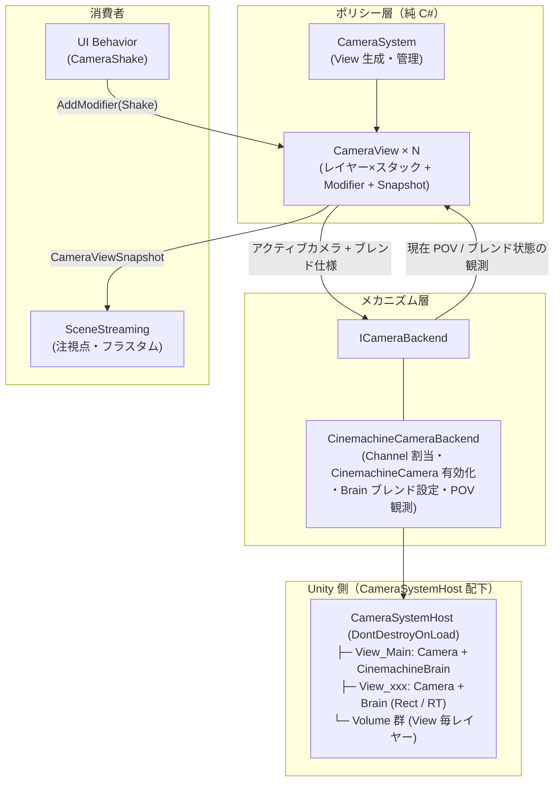

# 23. CameraSystem — カメラシステム設計

> ステータス: 要件確定・実装前 (2026-07-07)
> 前提資料: [03. DI](03-di.md) / [06. UI 管理](06-ui.md) / [16. Update 基盤](16-update-architecture.md) / [21. SceneStreaming](21-scene-streaming.md)
> 関連計画書: `docs/planning/CAMERA_SYSTEM_TDD_PLAN_2026-07-07.md`

---

## 目次

1. [目的・スコープ](#1-目的スコープ)
2. [用語定義](#2-用語定義)
3. [設計判断](#3-設計判断)
4. [アーキテクチャ](#4-アーキテクチャ)
5. [機能要件](#5-機能要件)
6. [API スケッチ](#6-api-スケッチ)
7. [Cinemachine バックエンド対応](#7-cinemachine-バックエンド対応)
8. [URP / Volume 方針](#8-urp--volume-方針)
9. [SceneStreaming 連携](#9-scenestreaming-連携)
10. [テレメトリと受け入れ条件](#10-テレメトリと受け入れ条件)
11. [実装チケット](#11-実装チケット)
12. [撤退ライン](#12-撤退ライン)
13. [将来拡張](#13-将来拡張)

---

## 1. 目的・スコープ

ゲーム内の全カメラを一元管理する **CameraSystem** を Runtime サブシステムとして新設する。

**解決する問題:**

- 「今どのカメラが画面を映しているか」の決定権が散在する問題（シーン毎の Main Camera 直置き）を、単一オーナーのスタック管理へ集約する
- カットシーン・演出・デバッグ視点の切替とブレンドを、呼び出し側が後始末を忘れられない形（ハンドル方式）で提供する
- 分割画面・ピクチャインピクチャ・RenderTexture 描画（ミニマップ、UI 内 3D）を同一の概念（View）で扱う
- SceneStreaming の注視点・フラスタム情報源として、テスト可能な形でカメラ状態を公開する

**非スコープ:**

- カメラワークそのもの（追従ダンピング・障害物回避・構図制御）は Cinemachine の責務であり、本システムは再実装しない
- Timeline との統合（§13 将来拡張）
- XR / マルチディスプレイ

---

## 2. 用語定義

| 用語 | 定義 |
|---|---|
| 論理カメラ (LogicalCamera) | 「どこから何を映したいか」を表すデータ。純 C# オブジェクトで、それ自体は描画しない。実体はバックエンドが対応付ける（Cinemachine では CinemachineCamera） |
| View | 出力先 1 つ（画面の Viewport Rect または RenderTexture）に対応する単位。実 Unity Camera 1 つ + CinemachineBrain 1 つ + レイヤー×スタック 1 セットを持つ |
| レイヤー (CameraLayer) | View 内の大分類。`Gameplay < Cutscene < Debug` の 3 レイヤー固定。上位レイヤーに 1 枚でも積まれていれば下位より優先される |
| スタック | 同一レイヤー内の論理カメラの積み。最後に Push されたものが勝つ（後勝ち）。Push はハンドル（`IDisposable`）を返し、Dispose = Pop |
| POV | ある瞬間の視点状態（位置・回転・FOV・near/far・アスペクト）。純 C# の `CameraPose` 構造体で表す |
| ブレンド | アクティブ論理カメラが切り替わる際の POV 補間。時間 + イージング指定。時間 0 = カット |
| Modifier | 最終 POV に加算修飾を施すスタック要素（シェイク・オフセット等）。UE の CameraModifier に相当し、ブレンドの後段で適用される |
| スナップショット (CameraViewSnapshot) | View の現在 POV から計算される読み取り専用構造体。フラスタム 6 平面・速度を含む。SceneStreaming 等の外部消費者向け |

---

## 3. 設計判断

### 3.1 決定事項

| # | 決定 | 根拠 |
|---|---|---|
| D-1 | **論理カメラ（データ）と実 Camera（描画）を分離する**。実 Camera は View 毎に 1 つで、フレームワークが所有する | UE（PlayerCameraManager + ViewTarget）も Cinemachine（Brain + CinemachineCamera）も同型に収束している業界標準。Unity Camera を複数直接積むと描画コストがカメラ数分かかり、切替ブレンドも書けない |
| D-2 | **カメラワークのバックエンドは Cinemachine**。ただし `ICameraBackend` を挟み、機構を差し替え可能にする | 追従・ブレンド・構図の枯れた実装を再発明しない。ポリシー/メカニズム分離は SceneStreaming（`ISceneStreamingBackend`）と同型 |
| D-3 | **View を第一級概念とする**。分割画面・PiP・RT 描画は全て「View の追加」で表現する | 「どの画面に出すか（ルーティング）」と「どのカメラが勝つか（優先度）」は直交概念。Cinemachine 3 系が Channel を Priority と別軸で導入したのと同じ判断 |
| D-4 | **View 内は少数レイヤー × スタックでアクティブカメラを決定する**。Push/Pop はハンドル（`IDisposable`）方式 | UISystem（6 レイヤー + Stack）と同じ規律。カットシーン終了で自動的に元のカメラへ戻る、が構造的に保証される |
| D-5 | **Cinemachine の Priority / Channel 数値は公開 API に出さない**。バックエンド内部の実装詳細に隠蔽する | Priority int の調整合戦（100 vs 101 問題）を構造的に排除する。勝者決定は純 C# のスタックポリシーが唯一のオーナー |
| D-6 | **スタックポリシー・フラスタム計算・Modifier 合成は純 C#**。MonoBehaviour / Cinemachine 型に依存しない | `WorldStreamingController` と同じテスト戦略。バックエンドは翻訳のみを行う薄い層に保つ |
| D-7 | View 毎に `CameraViewSnapshot`（フラスタム 6 平面・速度含む）を公開する。**ブレンド中は遷移先 POV も公開する** | SceneStreaming の注視点・先読み入力（§9）。ブレンド完了を待たずに遷移先エリアのプリフェッチを開始できる |

### 3.2 却下案

| 却下案 | 却下理由 |
|---|---|
| Unity Camera を優先度順に複数積む（URP カメラスタッキング流用） | カメラ毎にカリング・描画コストがフルにかかる。URP の Base/Overlay スタッキングは合成用であり、視点切替の道具ではない。ブレンド不可 |
| Priority int 同値 + 特別処理で複数ビューを表現 | ルーティングと優先度を 1 つの数値に押し込むことになり追跡不能。Cinemachine 2 系のレイヤーハックと同じ轍 |
| RenderTexture 描画を別システムとして分離 | View の出力先設定（Rect / RT）の違いにすぎず、別システムにすると管理主体が二重になる。UE の SceneCapture が別系なのは「視点争いに参加しない」ためであり、本設計では「固定カメラ 1 枚だけ積んだ View」として同じ性質を表現できる |
| Cinemachine API を Game 層へ直接公開 | 撤退ライン（§12）が消滅する。シーン内配置の CinemachineCamera はラップ登録 API（F-9）経由で扱う |
| 汎用の優先度スタックフレームワーク新設 | UISystem・UpdateSystem も各自の順序付けを持つが共通化していない。時期尚早な抽象化 |

---

## 4. アーキテクチャ



- `CameraSystemHost` はブートストラップで生成する `DontDestroyOnLoad` の常駐ヒエラルキー（`UICommon` / `UpdateSystemHost` と同パターン）。シーン側は Main Camera を持たない
- 配線は DependOnAll（`AppInitializer`）の手動 DI（[03-di.md](03-di.md)）。Game 層は `ICameraSystem` / `ICameraView` インターフェースのみを知る
- 毎フレーム処理（Modifier 減衰・スナップショット更新・Volume weight 補間）は UpdateSystem のアダプタ経由で駆動する（Cinemachine Brain 自体は LateUpdate 駆動）

---

## 5. 機能要件

### 5.1 必須（実証スライスで動作させる）

| # | 要件 |
|---|---|
| F-1 | 論理カメラを View のレイヤー（Gameplay / Cutscene / Debug）へ Push でき、ハンドルの Dispose で Pop できる。アクティブカメラ = 最上位の非空レイヤーのスタックトップ |
| F-2 | Push / Pop 時に遷移先へブレンドできる（時間 + イージング。時間 0 = カット）。ブレンド中の再切替は現在の補間位置から新ブレンドを開始する（Cinemachine の既定挙動に委譲） |
| F-3 | 論理カメラ毎に描画設定を持てる: FOV・near/far・cullingMask・VolumeProfile。アクティブ化に伴い View の実 Camera / Volume へ反映される |
| F-4 | View を複数同時に持てる。出力先は画面 Viewport Rect または RenderTexture。分割画面 = 全画面外の Rect を持つ View の追加、ミニマップ = RT 出力 View に固定論理カメラを 1 枚 Push |
| F-5 | RT 出力 View は更新頻度（毎フレーム / N フレーム毎 / 手動）を指定できる |
| F-6 | Modifier スタック: シェイク等を最終 POV へ加算できる。時限 Modifier は減衰完了で自動除去。UI Behavior 計画の `CameraShake`（`UI_MVVM_Behaviour_Plan.md` 外部演出システム）の受け皿となる |
| F-7 | View 毎に `CameraViewSnapshot`（位置・回転・FOV・アスペクト・near/far・フラスタム 6 平面・速度）を公開する。フラスタム計算は純 C# で単体テスト可能 |
| F-8 | ブレンド中は遷移先論理カメラの POV スナップショットも公開する（SceneStreaming の先読み入力） |
| F-9 | シーン内に配置（オーサリング）された CinemachineCamera を論理カメラとしてラップ登録できる（カットシーン用カメラのレベル内配置を許容する） |
| F-10 | 空スタック時のフォールバック POV（原点注視の既定カメラ）を持ち、View が「カメラなし」で不定になる状態を作らない |

### 5.2 保留（要件として認識するが実証スライス外）

| # | 要件 | 保留理由 |
|---|---|---|
| P-1 | Timeline / CinemachineTrack との共存（Brain 制御の委譲と復帰） | カットシーンの実装方式が未確定 |
| P-2 | フラスタムベースのストリーミング優先度（方向重み付け） | まず注視点（位置）供給で成立させる（§9） |
| P-3 | View 毎の入力ルーティング（分割画面のプレイヤー対応付け） | InputManager 自体が Phase 2 未着手 |
| P-4 | 画面遷移（SceneDirector）とのライフサイクル自動連動 | まず Game 層の明示 Push/Pop で運用し、パターンが見えてから抽象化する |

---

## 6. API スケッチ

> シグネチャは TDD 計画書で確定させる。ここでは形状の合意のみ。

```csharp
// ===== ポリシー層（純 C#、OneStarMaker.Runtime/CameraSystem/）=====

public enum CameraLayer { Gameplay, Cutscene, Debug }   // 昇順 = 優先度順

public interface ICameraSystem
{
    ICameraView MainView { get; }
    ICameraView CreateView(in CameraViewConfig config); // Rect or RenderTexture 出力
    void ReleaseView(ICameraView view);
}

public interface ICameraView
{
    // Push はハンドルを返す。Dispose = Pop（二重 Dispose 安全）
    CameraStackHandle Push(LogicalCamera camera, CameraLayer layer, in CameraBlendSpec blend);
    CameraModifierHandle AddModifier(ICameraPoseModifier modifier);

    CameraViewSnapshot Snapshot { get; }            // 現在（ブレンド済み）POV 由来
    CameraViewSnapshot? IncomingSnapshot { get; }   // ブレンド中のみ非 null（F-8）
}

// POV とフラスタム（全て struct・Unity 型は数学型のみ）
public readonly struct CameraPose { /* position, rotation, fovDeg, near, far, aspect */ }
public readonly struct CameraViewSnapshot { /* CameraPose, FrustumPlanes(6), velocity */ }
public readonly struct CameraBlendSpec { /* durationSec, easing。Cut = duration 0 */ }

// Modifier: ブレンド後の最終 POV を加算修飾する（UE CameraModifier 相当）
public interface ICameraPoseModifier
{
    /// <returns>false を返したら自動除去（時限シェイクの減衰完了など）</returns>
    bool Apply(ref CameraPose pose, float deltaTime);
}

// ===== メカニズム層 =====

public interface ICameraBackend
{
    // View 単位の翻訳のみ。勝者決定・ブレンド仕様の決定はポリシー側が行う
    void SetActiveCamera(ViewId view, LogicalCamera camera, in CameraBlendSpec blend);
    CameraPose GetCurrentPose(ViewId view);                  // Brain 出力の観測
    CameraPose GetCameraPose(LogicalCamera camera);          // 遷移先 POV の観測（F-8）
    bool IsBlending(ViewId view);
    void ApplyPostModifier(ViewId view, in CameraPose finalPose); // Modifier 適用結果の反映
}
```

- `LogicalCamera` は純 C# データ（レンズ設定・cullingMask・VolumeProfile 参照・追従ターゲットのヒント）。バックエンドが CinemachineCamera を生成または対応付ける（F-9 のラップ登録を含む）
- Game 層のクラスはコンストラクタ注入で `ICameraSystem` を受け取る。static アクセス・Service Locator は設けない

---

## 7. Cinemachine バックエンド対応

Cinemachine（3 系以降、`OutputChannels` を持つ版）を新規パッケージとして導入する。フレームワーク概念との対応:

| フレームワーク概念 | Cinemachine 側の実装 |
|---|---|
| View | Unity Camera + CinemachineBrain。View 毎に Channel を 1 つ割当て、Brain の `ChannelMask` に設定 |
| 論理カメラのアクティブ化 | 対象 CinemachineCamera のみを当該 Channel で有効化（Priority 操作は内部でのみ使用。D-5） |
| ブレンド | Brain のブレンド設定（`CameraBlendSpec` から生成）。ブレンド中 POV は Brain 出力を観測 |
| Modifier 適用 | Brain 更新後（`CinemachineCore.CameraUpdatedEvent` 等）に最終 POV へ加算を反映。Cinemachine Impulse は使わない（バックエンド差し替え可能性を保つため Modifier はフレームワーク概念とする） |
| 追従・構図 | CinemachineCamera の Follow/LookAt をそのまま使う（本システムは関与しない） |

**制約:** Brain は LateUpdate 駆動のため、スナップショット更新・Modifier 適用の順序は「Brain 更新 → Modifier → Snapshot 確定」を UpdateSystem 上で保証すること（TDD 計画のガードレール参照）。

---

## 8. URP / Volume 方針

- URP の Volume はカメラからほぼ独立（グローバル/ローカル Volume + カメラ側の Volume Mask / Trigger）であるため、深い統合は行わない
- 「論理カメラ毎のポストエフェクト」は **論理カメラ毎の VolumeProfile + weight クロスフェード**で実現する: View 毎に専用の Volume 用 Unity レイヤーを割当て、アクティブカメラの VolumeProfile を weight=1 へ、退場側を weight=0 へブレンド時間で補間する。weight 計算は純 C#（テスト対象）、Volume コンポーネント反映は Host 側
- View が増えるほど Unity レイヤーを消費する。View 実用数は 2〜3 想定であり許容（超える場合は §12 で再評価）
- 実 Camera は View 毎に URP Base カメラ 1 つ。Overlay スタッキングは使わない。View 追加 = Base カメラ追加の描画コストは受け入れ、RT View は F-5 の更新頻度指定で間引く

---

## 9. SceneStreaming 連携

§21 の注視点（Focus）は「プレイヤーまたはカメラ位置」と定義済み。本システムがカメラ側の情報源となる。

- 供給アダプタが **全 View のスナップショット**から注視点集合を構成し、`WorldStreamingController` へ渡す。分割画面では 2 つの注視点の和集合で desired set が計算される
- **ブレンド中は `IncomingSnapshot` の位置も注視点集合へ加える**（F-8）。カットシーンで遠方カメラへ Push した瞬間、ブレンド完了前に遷移先エリアのロードが始まる
- `WorldStreamingController` の既存単一 focus API・既存テストは変更しない。複数注視点対応は加算的な拡張（複数 focus の desired set 和）として行う
- フラスタム 6 平面は本フェーズでは公開のみ（消費は P-2 の方向重み付けで将来利用）。ただし計算はテスト済みの状態で提供する（F-7）

---

## 10. テレメトリと受け入れ条件

**計測:**

- View 数 / スタック深度（レイヤー毎）/ アクティブカメラ identity / ブレンド発生数を `CameraSystemTelemetryCollector` が snapshot として公開し、`CameraSystemTelemetryEmitter` が AppTelemetry（Verbose）経由で定期 emit する
- snapshot counters と `CameraSwitch` span は `Metadata` の Camera 専用フィールド（`CameraTotalViewCount` 等）を使い、Scene/Memory フィールドとは分離する。DebugSocket `DebugTelemetryEnvelopeV1` key 17 以降経由で DebugStudio へ流れる
- カメラ切替 span（Push/Pop による Active 変化 → ブレンド完了）を `TelemetryStartType.CameraSwitch` として Verbose レベルで発行。初期 fallback 同期は span 対象外

**受け入れ条件（実証スライスで判定）:**

| # | 条件 | 判定方法 | 実測 / 備考 | 状態 |
|---|---|---|---|---|
| CA-1 | カットシーン Push → Pop で、ブレンド往復後に Gameplay カメラへ完全復帰する（スタック残留 0・ハンドルリーク 0） | Play 目視 + `CameraSwitch` span / stack depth テレメトリ | 未測定（Play 目視未実施）。EditMode: `CameraStackTests` / `CameraViewTests` で Push/Pop・勝者復帰を検証済み | **未判定** |
| CA-2 | 分割画面（View×2）で各 View が独立にカメラ切替でき、相互干渉しない | Play 目視 + 各 View の `ActiveCameraId` / stack depth snapshot | 未測定（Play 目視未実施）。EditMode: `CameraSystemTickTests` / `CameraSystemSliceSetupTests` で View 独立 Tick を検証済み | **未判定** |
| CA-3 | RT View（ミニマップ想定）が指定頻度で更新され、メイン View のフレームタイムへの影響が想定内 | Play 目視 + フレームタイム実測 | 未測定（Play 目視・フレームタイム計測とも未実施）。EditMode: `IsRenderTextureView` / `UpdateMode=EveryNFrames` 設定は snapshot で観測可能 | **未判定** |
| CA-4 | シェイク Modifier がブレンド中でも破綻なく合成され、減衰完了で自動除去される | Play 目視 | 未測定（Play 目視未実施）。EditMode: `CameraModifierTests.ShakeModifier_DecaysToZero_ThenSelfRemoves` 検証済み | **未判定** |
| CA-5 | ストリーミング注視点をカメラ供給に切替えた状態で §21 A-3（あるべき集合一致）が維持され、ブレンド先読みでロード開始がブレンド完了より早いことがテレメトリで確認できる | Play 目視 + ストリーミング / `IncomingSnapshot` テレメトリ | 未測定（Play 目視未実施）。EditMode: `CameraFocusProviderTests` / `WorldStreamingControllerMultiFocusTests` で先読み注視点集合を検証済み。ブレンド vs ロード開始タイミングの実測は TBD | **未判定** |

---

## 11. 実装チケット

チケットの施行表（レッドテスト仕様・ガードレール）は `docs/planning/CAMERA_SYSTEM_TDD_PLAN_2026-07-07.md` を正とする。

| # | 内容 | 受入条件 |
|---|---|---|
| CAM-01 | Cinemachine パッケージ導入 + asmdef 配線 | コンパイル成功・既存全テスト回帰ゼロ |
| CAM-02 | `CameraPose` / フラスタム計算 / `CameraViewSnapshot`（純 C#） | フラスタム 6 平面の内外判定テストがグリーン |
| CAM-03 | レイヤー×スタックポリシー + ハンドル | Push/Pop/勝者決定/フォールバックの純 C# テスト |
| CAM-04 | Modifier スタック | 合成順序・時限自動除去の純 C# テスト |
| CAM-05 | `ICameraBackend` + FakeBackend + `CameraView`/`CameraSystem` 結合 | バックエンド指示・スナップショット・IncomingSnapshot の純 C# テスト |
| CAM-06 | `CinemachineCameraBackend` + `CameraSystemHost` | Channel 割当・有効化制御の EditMode テスト + ブレンドの Play 確認 |
| CAM-07 | Volume weight クロスフェード | weight 計算の純 C# テスト + Play 確認 |
| CAM-08 | SceneStreaming 注視点供給アダプタ（複数 View + ブレンド先読み） | 複数注視点 desired set / 先読みのテスト。既存ストリーミングテスト回帰ゼロ |
| CAM-09 | 実証スライス（分割画面 + ミニマップ RT + カットシーンブレンド + シェイク） | CA-1〜CA-4 の目視 + テレメトリ確認 |
| CAM-10 | テレメトリ + 受け入れ判定 | CA-1〜CA-5 の判定記録を本書へ追記 |

---

## 12. 撤退ライン

以下に該当した場合、**ポリシー層（スタック・Modifier・Snapshot）と `ICameraBackend` は維持したまま**、バックエンドを素の Transform 制御実装へ差し替える（Cinemachine を放棄する）。

1. Cinemachine の Channel / Brain 制御が View モデルと根本的に噛み合わないことが CAM-06 で判明した場合
2. Brain の更新順序制約が Modifier / Snapshot の一貫性（§7 制約）を実用的なコストで満たせない場合

D-1（論理/実分離）・D-3（View 第一級）・D-4（レイヤー×スタック）は撤退時も変更しない。

---

## 13. 将来拡張

- **Timeline 統合（P-1）**: CinemachineTrack 再生中は Brain 制御を Timeline へ委譲し、終了で スタック勝者へ復帰する。Cutscene レイヤーへの「Timeline 委譲カメラ」の Push として表現できる見込み
- **フラスタムベースのストリーミング重み付け（P-2）**: F-7 の 6 平面を使い、視錐台内のセルの priority を引き上げる
- **View 毎の入力ルーティング（P-3）**: InputManager（Phase 2）実装時に View と プレイヤーの対応付けを設計する
- **デバッグフライカメラ**: Debug レイヤーへの Push として実装。DebugStudio からの遠隔操作（DebugSocket の Camera 検査ハードコードの置き換え先）
