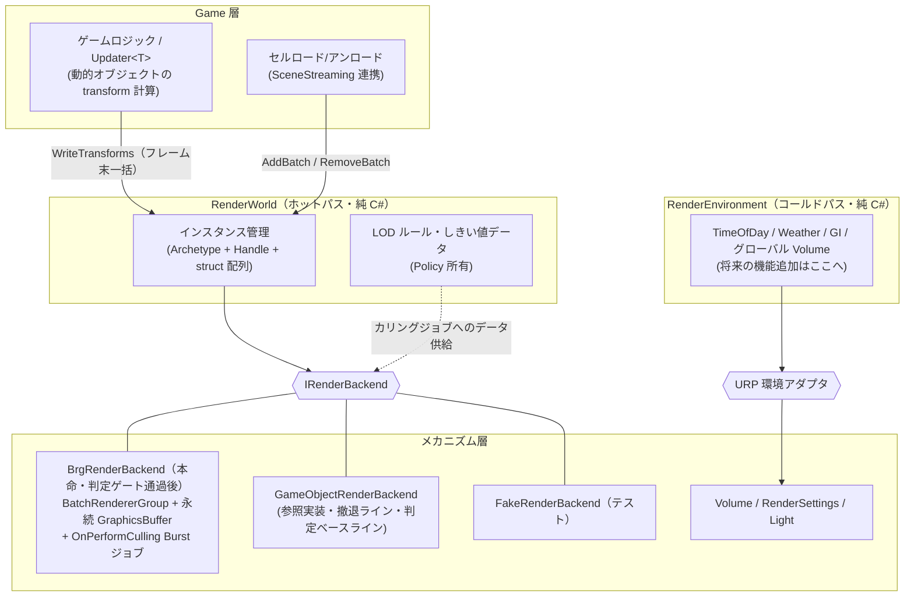

# 24. RenderingSystem — レンダリングシステム構想

> ステータス: 構想段階・骨子（実装前・要件未確定）(2026-07-08)
> 前提資料: [13. リソースシステム](13-resource-system.md) / [UpdateSystem 正本](../../../../docs/updater/UPDATER_CURRENT_SPEC.md) / [21. SceneStreaming](21-scene-streaming.md) / [23. CameraSystem](23-camera-system.md)
> 関連計画書: なし（TDD 計画は判定ゲート（§5）の結果を踏まえて作成する）

---

## 目次

1. [目的・スコープ](#1-目的スコープ)
2. [用語定義](#2-用語定義)
3. [設計判断](#3-設計判断)
4. [アーキテクチャ](#4-アーキテクチャ)
5. [ベンチマークワークロードと判定ゲート](#5-ベンチマークワークロードと判定ゲート)
6. [機能要件](#6-機能要件)
7. [API スケッチ](#7-api-スケッチ)
8. [BRG バックエンド対応](#8-brg-バックエンド対応)
9. [RenderEnvironment（環境制御）](#9-renderenvironment環境制御)
10. [他システムとの関係](#10-他システムとの関係)
11. [テレメトリ](#11-テレメトリ)
12. [実装チケット](#12-実装チケット)
13. [撤退ライン](#13-撤退ライン)
14. [オープン論点](#14-オープン論点)
15. [将来拡張](#15-将来拡張)

---

## 1. 目的・スコープ

大量インスタンスの描画発行と、フレーム全体の見た目状態（環境）を一元管理する **RenderingSystem** を Runtime サブシステムとして新設する構想。

**解決する問題:**

- セルストリーミング（§21）で配置される大量オブジェクトを、Unity 標準の GameObject/MeshRenderer 経路の限界を超えて描画できる経路を用意する（ただし「限界を超えているか」自体を計測で判定する。§5）
- 動的オブジェクト（ユニット・弾等）の描画データを、UpdateSystem の `Updater<T>`（struct 配列）が計算した結果からまとめて発行する経路を用意する
- 大域照明・天候・時間変化・グローバル Volume 等の「フレームにひとつの見た目状態」に単一のオーナーを与え、将来の機能追加を大量描画のホットパスに触れずに行えるようにする

**非スコープ:**

- URP / SRP の置き換え。本システムは URP の上に乗る「登録と発行の管理層」であり、レンダーパイプラインそのものではない
- UI 描画（UISystem / PanelRenderer の責務）
- 一点物（ヒーローオブジェクト・キャラクター等）の描画。通常の GameObject 経路のままとする
- スキンメッシュの大量描画（§14 O-2。当面 GameObject 経路）
- カメラ・Volume クロスフェード等の View 単位の描画設定（CameraSystem §8 の責務。所有権境界は §10）

---

## 2. 用語定義

| 用語 | 定義 |
|---|---|
| RenderWorld | 大量インスタンスの登録状態を持つ純 C# のポリシー層。Archetype・Handle・インスタンス struct 配列を管理する（ホットパス） |
| RenderEnvironment | フレーム全体の見た目状態（TimeOfDay / Weather / GI / グローバル Volume）を持つ純 C# のポリシー層（コールドパス）。§9 |
| Archetype (RenderArchetype) | Mesh + Material + 描画フラグ（影・レイヤー等）の組。同一 Archetype のインスタンスがバッチ描画の単位になる |
| インスタンス (RenderInstance) | Archetype に属する描画 1 件分のデータ（localToWorld 行列 + 限定的な per-instance プロパティ）。GameObject を持たない |
| バッチ (RenderBatch) | 静的経路で一括登録されるインスタンス集合。セルのライフサイクルと対応する |
| BRG | `BatchRendererGroup`。Unity の低レベルバッチ描画 API。Entities Graphics の下回りであり、ECS パッケージなしで直接使用できる |
| DOTS Instancing | BRG が要求するシェーダのインスタンシング方式（`DOTS_INSTANCING_ON`）。URP 標準シェーダは対応済み、カスタムシェーダは対応が必要 |
| 判定ゲート | GameObject バックエンドでのベンチマーク計測結果により、BRG 実装（REN-03 以降）の着手可否を決める関門。§5 |

---

## 3. 設計判断

### 3.1 決定事項

| # | 決定 | 根拠 |
|---|---|---|
| D-1 | **ホット（RenderWorld）とコールド（RenderEnvironment）を構造分離する**。細かい機能（GI・天候・時間変化・Volume）の追加はコールド側で完結させ、RenderWorld に触れない | インスタンス数に比例する処理と、フレームに 1 つの状態管理は性質が全く異なる。拡張性の担保はこの分離そのもの |
| D-2 | **ECS パッケージ（com.unity.entities / Entities Graphics）は導入しない**。`Updater<T>` 型の struct 配列（RenderWorld）+ BRG 直叩きを本命とする | §16 の方針（ECS はブリッジで備え、複合クエリが必要になった時点で再評価）と整合。Entities Graphics は「ECS チャンク → BRG」の実装であり、チャンクの役割を RenderWorld が代替すれば同じ土俵（BRG + DOTS Instancing）に立てる |
| D-3 | **`IRenderBackend` によるポリシー/メカニズム分離**。`GameObjectRenderBackend`（参照実装・撤退ライン・判定ベースライン）/ `BrgRenderBackend`（本命）/ `FakeRenderBackend`（テスト）を差し替え可能にする | SceneStreaming（`ISceneStreamingBackend`）・CameraSystem（`ICameraBackend`）と同型。Backend 抽象の最大の価値は差し替え可能性ではなく、**高価な実装（BRG）の着手を計測結果まで遅延できること** |
| D-4 | **BRG 実装の着手は判定ゲート方式**。ベンチマークワークロード（§5）を GameObject バックエンドで計測し、予算超過が確認された場合のみ REN-03 以降を解禁する | 「大量」は計測なしには反証不可能。§16 が ECS 再評価条件を明文化しているのと同じ規律を BRG にも適用し、投機的最適化を排除する |
| D-5 | **公開 API は Archetype + Handle**。BRG の型（`BatchID` / `BatchMeshID` 等）を公開 API に一切漏らさない | Backend 差し替え（GameObject ⇔ BRG）と、将来の ECS 全面採用時の移行可能性（§14 O-3）の担保 |
| D-6 | **静的・動的の 2 経路に分ける**。静的 = セルロード時の `AddBatch` 一括登録／アンロードで一括解放。動的 = 個別 Handle + 毎フレーム `WriteTransforms` | データの寿命と更新頻度が根本的に異なる。静的は GPU 永続バッファに置きっぱなしで毎フレームコストほぼゼロ、動的は UpdateSystem の計算結果をフレーム末にまとめて転送する |
| D-7 | **細かいカリング・LOD 選択は Backend 内の Burst ジョブ**（BRG の `OnPerformCulling`）で実行する。LOD しきい値・可視フラグ等のルールとデータは Policy が所有し、ジョブ本体は静的純関数として EditMode テスト可能にする | フラスタム平面はパイプラインがカメラ・ライト（シャドウ）ごとに供給する。Policy 層での自前カリングは二重実装になる。CameraSystem のフラスタム公開（F-7）は描画カリングには使わない（§10） |
| D-8 | **DOTS Instancing シェーダ規約を初日から採用する**。カスタムシェーダは最初から `DOTS_INSTANCING_ON` 対応で書く | 唯一、後付けの改修コストが高い投資。BRG 採用時も将来の Entities Graphics 移行時もシェーダ資産がそのまま生きる。判定ゲートの結果に依存しない「どちらに転んでも生き残る」投資はこれと公開 API・2 経路・テレメトリのみ |
| D-9 | **スキンメッシュは対象外**。アニメーションするオブジェクトの大量描画は初期スコープに含めない | BRG に標準スキニングはなく、VAT（頂点アニメーションテクスチャ）等の別技術が必要。要件（群衆の必要性）が未確定の段階で背負わない（§14 O-2） |

### 3.2 却下案

| 却下案 | 却下理由 |
|---|---|
| Entities Graphics（com.unity.entities）採用 | UpdateSystem と ECS World の二重管理になり、§16 の「ECS はブリッジで備える」方針と矛盾。ECS 全面採用の再評価条件（複合クエリ）を満たしていない |
| 計測なしで BRG を無条件採用 | 投機的最適化。Unity 6 の SRP Batcher は素の GameObject でも相当数を処理でき、予算内に収まる可能性が現実にある。判定ゲート（D-4）で計測してから決める |
| `Graphics.RenderMeshInstanced` を主経路にする | 毎フレーム描画発行の CPU コストがインスタンス数に比例し、カリング・LOD も自前になる。永続データ（静的経路）に不向き。短命オブジェクト用の限定バックエンドとしては将来検討余地あり（§14 O-6） |
| カリングを Policy 層で自前実装（CameraSystem F-7 のフラスタムを使用） | BRG の `OnPerformCulling` にはシャドウカスケード等ライト由来のカリング要求も来るため、カメラフラスタムだけでは不足。パイプライン供給の平面に対する判定を Backend 内ジョブで行うのが正 |
| 環境制御（TimeOfDay 等）を各機能バラバラのサービスとして追加 | 「フレームにひとつの見た目状態」のオーナーが散在し、CameraSystem 以前の Main Camera 散在問題と同じ構図になる。RenderEnvironment に集約する（D-1） |

---

## 4. アーキテクチャ



- 配線は DependOnAll の手動 DI（[03-di.md](03-di.md)）。Game 層は `IRenderingSystem` インターフェースのみを知る
- Host（MonoBehaviour・DontDestroyOnLoad）は Backend が必要とする Unity リソース（BRG 登録、GameObject プール等）の所有者。`CameraSystemHost` / `UpdateSystemHost` と同パターン
- 更新順序の不変条件 **I-R1: シミュレーション更新（Updater&lt;T&gt;）→ `WriteTransforms` → Unity 描画（`OnPerformCulling` はパイプラインが駆動）**。UpdateCoordinator の順序制御に乗せる

---

## 5. ベンチマークワークロードと判定ゲート

本システムの「大量」を反証可能にするため、ベンチマークワークロードと数値基準を定義し、**GameObject バックエンド（REN-02）でのベースライン計測を BRG 着手（REN-03 以降）の判定ゲートとする**。

これはフレームワークのサンプルゲームでありプロダクト要件が降ってこないため、ベンチマークの定義がそのまま要件定義となる。以下の数値はすべて初期値（仮置き）であり、妥当性の確定は REN-02 で行う（§14 O-1）。

### 5.1 ワークロード（初期値）

| # | 内容 | 規模（初期値） | 備考 |
|---|---|---|---|
| W-1 | 静的インスタンス（小物・植生・建物想定） | 100,000 インスタンス / メッシュ 8 種 / LOD 2 段 / ストリーミングセルに分散配置 | セルロード・アンロードを含めて計測 |
| W-2 | 動的インスタンス（非スキンのユニット想定） | 5,000 体 / 毎フレーム transform 更新 | `Updater<T>` → `WriteTransforms` 経路 |
| W-3 | 短命インスタンス（弾・エフェクト想定） | 保留 | 経路設計自体が論点（§14 O-6）。判定ゲートには含めない |

### 5.2 合格基準（CA 表・初期値）

| # | 条件 | 判定方法 | 実測 | 状態 |
|---|---|---|---|---|
| CA-R1 | **判定ゲート**: W-1 + W-2 を `GameObjectRenderBackend` で描画し、PC_Renderer / Mobile_Renderer それぞれでフレーム予算に対する計測記録を残す。予算内なら REN-03 以降は着手せず、本システムは API + GameObject バックエンドで一旦完成とする | ベンチマークシーン + Profiler + テレメトリ（§11）。予算初期値: メインスレッド描画関連（culling + render loop）PC 4ms / Mobile 8ms、GC Alloc 0 / frame | 未測定 | **未判定** |
| CA-R2 | （ゲート通過時のみ）同一ワークロードを `BrgRenderBackend` で描画し、CA-R1 で超過した項目が予算内に収まる | 同上 | 未測定 | **未判定** |
| CA-R3 | セルロード/アンロード往復でバッチ登録・解放がリークしない（インスタンス数・GPU バッファ使用量が往復前に完全復帰） | テレメトリの登録数・バッファサイズ counter | 未測定 | **未判定** |
| CA-R4 | RenderWorld のハンドル・Archetype・バッチ管理が `FakeRenderBackend` で純 C# テストグリーン | EditMode テスト | 未測定 | **未判定** |
| CA-R5 | （ゲート通過時のみ）カリング・LOD 選択ジョブが純関数テストで検証済みで、実行時の可視数がテレメトリで観測できる | EditMode テスト + Play 計測 | 未測定 | **未判定** |

### 5.3 判定ゲートの運用

- CA-R1 の計測結果（予算内 / 超過、超過項目）は本書に追記し、REN-03 以降の着手可否の根拠として記録する
- 予算内だった場合も公開 API・2 経路・テレメトリ・DOTS Instancing シェーダ規約（D-8）は成果として残る。将来ワークロードが成長して予算超過した時点でゲートを再判定し、REN-03 を解禁する
- ECS 全面採用の再評価（§16 の複合クエリ条件）が先に発動した場合は、§14 O-3 の差し替え単位の論点を先に解決する

---

## 6. 機能要件

### 6.1 必須（実証スライスで動作させる）

| # | 要件 |
|---|---|
| F-R1 | Archetype（Mesh + Material + 描画フラグ）を登録でき、同一 Archetype のインスタンスがバッチ描画単位になる |
| F-R2 | 静的経路: インスタンス集合を `AddBatch` で一括登録でき、バッチ Handle の解放で一括除去できる（セルライフサイクル対応） |
| F-R3 | 動的経路: インスタンスを個別 Handle で追加・除去でき、`WriteTransforms` で複数インスタンスの transform をまとめて更新できる |
| F-R4 | 公開 API に Backend 固有型が現れない（D-5）。`FakeRenderBackend` で RenderWorld の全ポリシーが純 C# テスト可能 |
| F-R5 | LOD しきい値（距離段階）を Archetype 単位で定義でき、選択ルールのデータは Policy が所有する |
| F-R6 | テレメトリ: 登録インスタンス数・可視数・バッチ数・フレームあたりアップロードバイト数を counter として公開する（§11） |
| F-R7 | （ゲート通過時）BRG バックエンドでフラスタムカリング + LOD 選択が Burst ジョブで動作し、ジョブ本体が純関数としてテスト済みである |
| F-R8 | RenderEnvironment: 少なくとも 1 つの環境状態（TimeOfDay 想定）が純 C# 状態 + URP アダプタの形で動作し、機能追加の型を示す |

### 6.2 保留（要件として認識するが実証スライス外）

| # | 要件 | 保留理由 |
|---|---|---|
| P-R1 | スキンメッシュ / アニメーション群衆（VAT 等） | 要件未確定。技術選定から別途必要（§14 O-2） |
| P-R2 | 短命大量オブジェクト（弾）の専用経路 | Add/Remove の高頻度呼び出しで足りるか、リングバッファ等の専用経路が要るかは計測後に判断（§14 O-6） |
| P-R3 | per-instance マテリアルプロパティ（色・ティント等） | 対応範囲が GPU バッファレイアウトに直結するため、最小（行列のみ）で開始して拡張する（§14 O-4） |
| P-R4 | セル内 MeshRenderer の Editor ベイク（描画専用データ資産化） | §21 §12 の HLOD / Proxy ティア（§22 予約）と統合して設計すべき |
| P-R5 | GPU オクルージョンカリング・indirect draw | フラスタム + LOD で足りない証拠が出てから |
| P-R6 | Weather / GI / グローバル Volume の実装 | RenderEnvironment の型（F-R8）を示した後、機能ごとに追加 |

---

## 7. API スケッチ

> シグネチャは TDD 計画書で確定させる。ここでは形状の合意のみ。

```csharp
// ===== ポリシー層（純 C#、OneStarMaker.Runtime/RenderingSystem/）=====

public readonly struct RenderArchetypeId { /* 内部 int。Backend 型は含まない */ }
public readonly struct RenderBatchHandle { /* 静的経路。解放 = バッチ一括除去 */ }
public readonly struct RenderInstanceHandle { /* 動的経路。個別除去用 */ }

public readonly struct RenderArchetypeDesc
{
    // Mesh / Material 参照、影キャスト等の描画フラグ、LOD 距離しきい値（F-R5）
}

public readonly struct RenderInstanceData
{
    // localToWorld（float4x4）。per-instance プロパティの拡張は P-R3
}

public interface IRenderingSystem
{
    RenderArchetypeId RegisterArchetype(in RenderArchetypeDesc desc);

    // 静的経路（F-R2）: セルロード時に一括登録、Handle 解放で一括除去
    RenderBatchHandle AddBatch(RenderArchetypeId archetype, ReadOnlySpan<RenderInstanceData> instances);
    void RemoveBatch(RenderBatchHandle batch);

    // 動的経路（F-R3）: Updater<T> の計算結果をフレーム末にまとめて転送
    RenderInstanceHandle AddInstance(RenderArchetypeId archetype, in RenderInstanceData data);
    void RemoveInstance(RenderInstanceHandle handle);
    void WriteTransforms(ReadOnlySpan<RenderInstanceHandle> handles, ReadOnlySpan<Matrix4x4> localToWorld);
}

// ===== メカニズム層 =====

public interface IRenderBackend
{
    // 翻訳のみ。何を登録するか・LOD ルールは Policy が決める
    // Backend 内部 ID は Policy 側の Handle 対応表で管理し、公開 API へは漏らさない（D-5）
    // 形状の詳細（バッチ生成・transform 更新・解放）は TDD 計画で確定
}

// ===== RenderEnvironment（コールドパス・純 C#）=====

public interface IRenderEnvironment
{
    // フレームにひとつの見た目状態。TimeOfDay / Weather 等の機能はここへ追加（D-1）
    // 純 C# の状態計算（例: 時刻 → 太陽角度・色温度）+ URP アダプタ（Light / RenderSettings / Volume 反映）
}
```

- Game 層のクラスはコンストラクタ注入で `IRenderingSystem` / `IRenderEnvironment` を受け取る。static アクセス・Service Locator は設けない
- `WriteTransforms` は UpdateCoordinator 上でシミュレーション更新の後段に配置する（I-R1）

---

## 8. BRG バックエンド対応

判定ゲート（§5）通過後に実装する `BrgRenderBackend` の技術ノート。

| フレームワーク概念 | BRG 側の実装 |
|---|---|
| Archetype 登録 | `RegisterMesh` / `RegisterMaterial` + バッチメタデータ（DOTS Instancing プロパティレイアウト）定義 |
| 静的バッチ | 永続 `GraphicsBuffer` にインスタンスデータを常駐。セル解放までアップロード再実行なし |
| 動的インスタンス | 動的専用バッファ領域へ `WriteTransforms` の内容をフレーム末に部分アップロード |
| カリング + LOD | `OnPerformCulling` コールバック内の Burst ジョブ。渡された `BatchCullingContext` の平面（カメラ・シャドウ）に対して判定し、可視インデックスと LOD 選択を出力。ジョブ本体は静的純関数（D-7） |
| シェーダ | DOTS Instancing 対応必須（D-8）。URP 標準 Lit/SimpleLit は対応済み。カスタムシェーダは `DOTS_INSTANCING_ON` variant を持つこと |

**制約・注意:**

- BRG はプラットフォーム要件がある（GLES 等の非対応環境）。Mobile_Renderer 対象デバイスでの動作可否は REN-03 の最初に確認する
- `OnPerformCulling` はメインスレッド外から呼ばれ得るため、Policy 所有データ（LOD しきい値等）はジョブへ NativeArray 等で安全に受け渡す。RenderWorld の変更（Add/Remove）とカリングの競合はフレーム同期点で解決する
- Brain（CameraSystem）や UpdateSystem との実行順序に依存しない。カリングはパイプライン駆動であり、I-R1 の保証は `WriteTransforms` の完了までで足りる

---

## 9. RenderEnvironment（環境制御）

「細かい機能への拡張性」の答えは、**機能追加をコールドパスに閉じ込める構造**である。

- TimeOfDay / Weather / GI / グローバル Volume は全て「フレームにひとつのグローバル状態」であり、インスタンス数と無関係。RenderWorld とは更新頻度もデータ構造も共有しない
- 各機能は「純 C# の状態ポリシー（テスト対象）+ URP への薄いアダプタ（Light / RenderSettings / Volume コンポーネント反映）」の組で追加する。CameraSystem の Volume weight クロスフェード（weight 計算純 C# + Host 反映）と同じ型
- 機能間の合成（例: 時刻の太陽色 × 天候の減光）が必要になった時点で合成ポリシーを設計する。先回りの合成フレームワークは作らない（時期尚早な抽象化の回避）
- **Volume の所有権境界**: View 固有の Volume（論理カメラ毎のポストエフェクト）は CameraSystem §8 の所有。全 View 共通の環境 Volume は RenderEnvironment の所有。同一 Volume を両者が触ることを禁止する

---

## 10. 他システムとの関係

| システム | 関係 |
|---|---|
| SceneStreaming（§21） | セルロード完了 → `AddBatch`、アンロード → `RemoveBatch` のライフサイクル対応（F-R2）。当面はセルシーン内のコンポーネントが登録を行い、将来は Editor ベイク（P-R4）で描画専用データ資産に置き換える。§22（HLOD / Proxy ティア予約）の遠景 Variant は本システムの静的経路の自然な消費者になる |
| UpdateSystem（§16） | 動的経路の供給元。`Updater<T>` のシミュレーション結果を `WriteTransforms` で転送する。順序不変条件 I-R1（シミュレーション → 転送 → 描画）を UpdateCoordinator で保証。RenderWorld の struct 配列 + Handle 方式は `Updater<T>` と同思想であり、ECS 移行時の再評価も §16 の条件に従う |
| CameraSystem（§23） | 描画カリングに F-7（フラスタム公開）は**使わない**（D-7 根拠参照）。F-7 の消費先は従来どおりストリーミング優先度（P-2）。Volume 所有権境界は §9。View（分割画面・RT）が増えても本システムは関与しない — BRG のカリングはカメラ毎にパイプラインが呼ぶため自動的に View 対応になる |
| リソースシステム（§13） | Archetype が参照する Mesh / Material のロードは AssetManagement の責務。GPU 永続バッファのメモリをメモリバジェットに計上するかは論点（§14 O-7）。将来の `MeshShaderLodProvider` / `VirtualTextureProvider`（§13 §15）は本システムの LOD 段階と接続し得る |

---

## 11. テレメトリ

- counter: 登録インスタンス数（静的/動的別）・Archetype 数・バッチ数・可視インスタンス数（ゲート通過後）・フレームあたり GPU アップロードバイト数・カリングジョブ所要時間
- CameraSystem の `CameraSystemTelemetryCollector` / `Emitter` と同型の collector / emitter 構成とし、AppTelemetry（Verbose）経由で定期 emit する
- `Metadata` の Rendering 専用フィールド追加と DebugSocket `DebugTelemetryEnvelopeV1` の key 割当は実装時に §12/§15 の規約へ従って確定する
- ベンチマーク（§5）の判定はこのテレメトリ + Unity Profiler の併用で行い、計測手順を再現可能な形で残す

---

## 12. 実装チケット

TDD 計画書は REN-02 の判定ゲート結果を見てから作成する。番号と受入条件の骨子のみ先に定める。

| # | 内容 | 受入条件 | ゲート |
|---|---|---|---|
| REN-01 | RenderWorld 純 C#（Archetype / Handle / バッチ / 動的インスタンス管理）+ `FakeRenderBackend` | CA-R4。Push/解放・二重解放安全・Backend 呼び出し内容の純 C# テスト | — |
| REN-02 | `GameObjectRenderBackend` + ベンチマークシーン（W-1 / W-2）+ ベースライン計測 | CA-R1 の計測記録を本書 §5.2 に追記。**判定ゲートの実施** | — |
| REN-03 | `BrgRenderBackend` 最小（静的経路のみ・カリングなし全描画・DOTS Instancing シェーダ 1 本・対象デバイス動作確認） | W-1 が BRG 経路で描画される。既存全テスト回帰ゼロ | ゲート通過時のみ |
| REN-04 | カリング + LOD 選択 Burst ジョブ | CA-R5。純関数テスト + 可視数テレメトリ | ゲート通過時のみ |
| REN-05 | 動的経路（`WriteTransforms` → 部分アップロード、UpdateCoordinator 配線） | W-2 が I-R1 の順序で動作。GC Alloc 0 / frame | ゲート通過時のみ |
| REN-06 | セルストリーミング連携（セル ⇔ バッチのライフサイクル接続） | CA-R3。既存ストリーミングテスト回帰ゼロ | —（GameObject 経路でも実施） |
| REN-07 | テレメトリ + DebugStudio 連携 + 受け入れ判定 | CA-R1〜R5 の判定記録を本書へ追記 | — |
| REN-08 | RenderEnvironment 骨格（TimeOfDay 最小: 時刻 → 太陽角度の純 C# 計算 + Light アダプタ） | F-R8。状態計算の純 C# テスト | —（別トラック・優先度低） |

---

## 13. 撤退ライン

以下に該当した場合、**ポリシー層（RenderWorld・LOD ルール・テスト）と `IRenderingSystem` / `IRenderBackend` は維持したまま**、`GameObjectRenderBackend` へ退避する（BRG を放棄する）。

1. 対象デバイス（Mobile_Renderer 想定機）で BRG が動作しない、または REN-03 で予算改善が確認できない場合
2. `OnPerformCulling` のスレッド制約と RenderWorld の変更同期が実用的なコストで両立しない場合

D-1（ホット/コールド分離）・D-5（Handle API）・D-6（2 経路）・D-8（シェーダ規約）は撤退時も変更しない。DOTS Instancing 対応シェーダは通常の SRP Batcher 経路でもそのまま動くため、シェーダ資産への損害はない。

なお判定ゲート（D-4）で「そもそも BRG に着手しない」と判定された場合は撤退ではなく、本システムが API + GameObject バックエンドとして完成した状態である。

---

## 14. オープン論点

| # | 論点 | 現時点の見立て |
|---|---|---|
| O-1 | ベンチマーク数値（§5 の規模・予算）の初期値妥当性 | REN-02 の計測で較正する。数値の変更は本書を更新して記録する |
| O-2 | スキンメッシュ / アニメーション群衆の大量描画 | VAT（頂点アニメーションテクスチャ）+ BRG が有力だが、群衆要件が発生してから技術選定する。それまで GameObject 経路 |
| O-3 | ECS 全面採用時の差し替え単位 | Entities Graphics はデータ管理（チャンク）ごと置き換わるため、差し替え単位が Backend ではなく `IRenderingSystem` 実装ごとになる可能性が高い。公開 API（Handle / Archetype）を ECS 上で再実装できる形に保つことが移行可能性の実体 |
| O-4 | per-instance マテリアルプロパティの対応範囲 | 行列のみで開始（P-R3）。色等の追加は DOTS Instancing のプロパティレイアウト設計に直結するため、必要になった機能から個別に追加 |
| O-5 | 既存 / 今後のカスタムシェーダの DOTS Instancing 対応コスト | URP 標準シェーダは対応済み。カスタムシェーダ規約（D-8）を 10-coding-rules へ反映するかは REN-03 時点で判断 |
| O-6 | 短命大量オブジェクト（弾）の経路 | 動的経路の Add/Remove 頻度が問題になるかは計測次第。専用リングバッファ経路や `RenderMeshInstanced` 限定バックエンドの可能性を残す |
| O-7 | GPU 永続バッファのメモリバジェット計上 | §13 のメモリバジェットは Addressables アセット対象。GPU バッファを別枠 counter として計上する案が有力 |

---

## 15. 将来拡張

- **HLOD / Proxy ティア統合（§22 予約）**: Editor ベイクでセルの遠景 Variant を静的経路のインスタンスデータ資産として生成し、距離帯によって near（実セル）/ far（Proxy バッチ）を切り替える
- **GPU オクルージョンカリング / indirect draw（P-R5）**: フラスタム + LOD で不足する計測証拠が出た場合
- **VAT 群衆（O-2）**: スキンアニメーションのテクスチャベイクと BRG の組合せ
- **RenderEnvironment の機能拡充（P-R6）**: Weather・GI 制御・環境 Volume ブレンド。追加はコールドパスで完結する（D-1）
- **フラスタム方向重み付けとの接続**: CameraSystem P-2 が実装された場合、ストリーミング優先度と LOD 選択の一貫性を検討する
