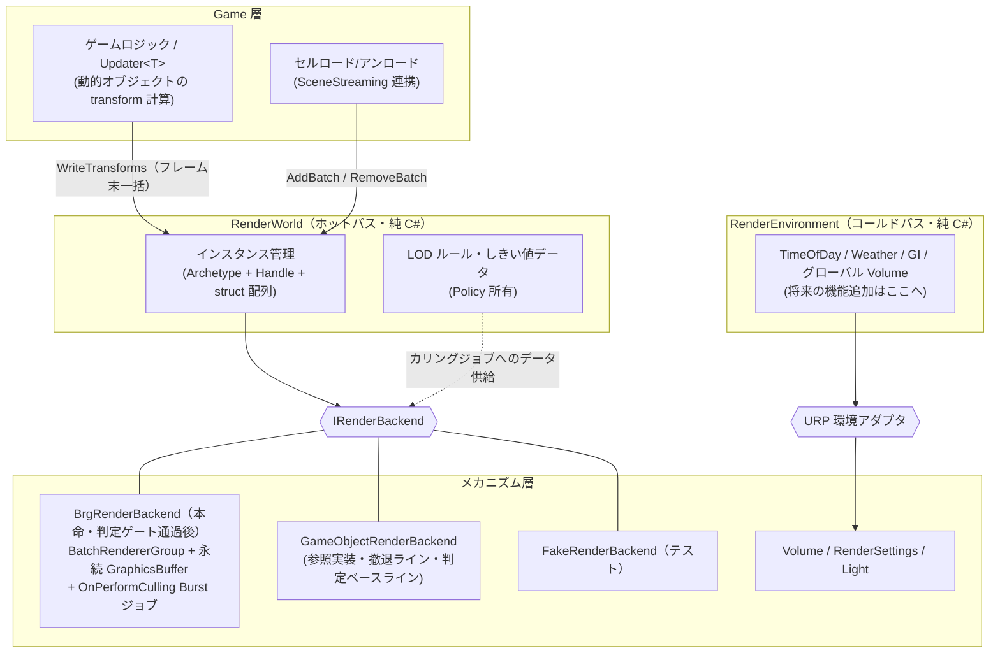

# 24. RenderingSystem — レンダリングシステム構想

> ステータス: RenderWorld は構想段階。RenderEnvironment の最小 lease / sink 骨格は S-4c で実装済み（2026-09-25）。VFX 抽象（§16）は S-4d1 で実装済み（2026-10-18。VFX Graph の backend と `Tick` の登録は S-4d2、Scene に配置した Season / Cell の VFX は S-4d3）。
> 前提資料: [13. リソースシステム](13-resource-system.md) / [UpdateSystem 正本](../../../../docs/updater/UPDATER_CURRENT_SPEC.md) / [21. SceneStreaming](21-scene-streaming.md) / [23. CameraSystem](23-camera-system.md)
> 関連計画書: なし（TDD 計画は判定ゲート（§5）の結果を踏まえて作成する）

---

## 目次

1. [目的・スコープ](#1-目的スコープ)
2. [用語定義](#2-用語定義)
3. [設計判断](#3-設計判断)
4. [アーキテクチャ](#4-アーキテクチャ)
5. [ベンチマークワークロードと判定ゲート](#5-ベンチマークワークロードと判定ゲート)
6. [機能要件](#6-機能要件)
7. [API スケッチ](#7-api-スケッチ)
8. [BRG バックエンド対応](#8-brg-バックエンド対応)
9. [RenderEnvironment（環境制御）](#9-renderenvironment環境制御)
10. [他システムとの関係](#10-他システムとの関係)
11. [テレメトリ](#11-テレメトリ)
12. [実装チケット](#12-実装チケット)
13. [撤退ライン](#13-撤退ライン)
14. [オープン論点](#14-オープン論点)
15. [将来拡張](#15-将来拡張)
16. [VFX 抽象](#16-vfx-抽象)

---

## 1. 目的・スコープ

大量インスタンスの描画発行と、フレーム全体の見た目状態（環境）を一元管理する **RenderingSystem** を Runtime サブシステムとして新設する構想。

**解決する問題:**

- セルストリーミング（§21）で配置される大量オブジェクトを、Unity 標準の GameObject/MeshRenderer 経路の限界を超えて描画できる経路を用意する（ただし「限界を超えているか」自体を計測で判定する。§5）
- 動的オブジェクト（ユニット・弾等）の描画データを、UpdateSystem の `Updater<T>`（struct 配列）が計算した結果からまとめて発行する経路を用意する
- 大域照明・天候・時間変化・グローバル Volume 等の「フレームにひとつの見た目状態」に単一のオーナーを与え、将来の機能追加を大量描画のホットパスに触れずに行えるようにする

**非スコープ:**

- URP / SRP の置き換え。本システムは URP の上に乗る「登録と発行の管理層」であり、レンダーパイプラインそのものではない
- UI 描画（UISystem / PanelRenderer の責務）
- 一点物（ヒーローオブジェクト・キャラクター等）の描画。通常の GameObject 経路のままとする
- スキンメッシュの大量描画（§14 O-2。当面 GameObject 経路）
- カメラ・Volume クロスフェード等の View 単位の描画設定（CameraSystem §8 の責務。所有権境界は §10）

---

## 2. 用語定義

| 用語 | 定義 |
|---|---|
| RenderWorld | 大量インスタンスの登録状態を持つ純 C# のポリシー層。Archetype・Handle・インスタンス struct 配列を管理する（ホットパス） |
| RenderEnvironment | フレーム全体の見た目状態（TimeOfDay / Weather / GI / グローバル Volume）を持つ純 C# のポリシー層（コールドパス）。§9 |
| Archetype (RenderArchetype) | Mesh + Material + 描画フラグ（影・レイヤー等）の組。同一 Archetype のインスタンスがバッチ描画の単位になる |
| インスタンス (RenderInstance) | Archetype に属する描画 1 件分のデータ（localToWorld 行列 + 限定的な per-instance プロパティ）。GameObject を持たない |
| バッチ (RenderBatch) | 静的経路で一括登録されるインスタンス集合。セルのライフサイクルと対応する |
| BRG | `BatchRendererGroup`。Unity の低レベルバッチ描画 API。Entities Graphics の下回りであり、ECS パッケージなしで直接使用できる |
| DOTS Instancing | BRG が要求するシェーダのインスタンシング方式（`DOTS_INSTANCING_ON`）。URP 標準シェーダは対応済み、カスタムシェーダは対応が必要 |
| 判定ゲート | GameObject バックエンドでのベンチマーク計測結果により、BRG 実装（REN-03 以降）の着手可否を決める関門。§5 |

---

## 3. 設計判断

### 3.1 決定事項

| # | 決定 | 根拠 |
|---|---|---|
| D-1 | **ホット（RenderWorld）とコールド（RenderEnvironment）を構造分離する**。細かい機能（GI・天候・時間変化・Volume）の追加はコールド側で完結させ、RenderWorld に触れない | インスタンス数に比例する処理と、フレームに 1 つの状態管理は性質が全く異なる。拡張性の担保はこの分離そのもの |
| D-2 | **ECS パッケージ（com.unity.entities / Entities Graphics）は導入しない**。`Updater<T>` 型の struct 配列（RenderWorld）+ BRG 直叩きを本命とする | §16 の方針（ECS はブリッジで備え、複合クエリが必要になった時点で再評価）と整合。Entities Graphics は「ECS チャンク → BRG」の実装であり、チャンクの役割を RenderWorld が代替すれば同じ土俵（BRG + DOTS Instancing）に立てる |
| D-3 | **`IRenderBackend` によるポリシー/メカニズム分離**。`GameObjectRenderBackend`（参照実装・撤退ライン・判定ベースライン）/ `BrgRenderBackend`（本命）/ `FakeRenderBackend`（テスト）を差し替え可能にする | SceneStreaming（`ISceneStreamingBackend`）・CameraSystem（`ICameraBackend`）と同型。Backend 抽象の最大の価値は差し替え可能性ではなく、**高価な実装（BRG）の着手を計測結果まで遅延できること** |
| D-4 | **BRG 実装の着手は判定ゲート方式**。ベンチマークワークロード（§5）を GameObject バックエンドで計測し、予算超過が確認された場合のみ REN-03 以降を解禁する | 「大量」は計測なしには反証不可能。§16 が ECS 再評価条件を明文化しているのと同じ規律を BRG にも適用し、投機的最適化を排除する |
| D-5 | **公開 API は Archetype + Handle**。BRG の型（`BatchID` / `BatchMeshID` 等）を公開 API に一切漏らさない | Backend 差し替え（GameObject ⇔ BRG）と、将来の ECS 全面採用時の移行可能性（§14 O-3）の担保 |
| D-6 | **静的・動的の 2 経路に分ける**。静的 = セルロード時の `AddBatch` 一括登録／アンロードで一括解放。動的 = 個別 Handle + 毎フレーム `WriteTransforms` | データの寿命と更新頻度が根本的に異なる。静的は GPU 永続バッファに置きっぱなしで毎フレームコストほぼゼロ、動的は UpdateSystem の計算結果をフレーム末にまとめて転送する |
| D-7 | **細かいカリング・LOD 選択は Backend 内の Burst ジョブ**（BRG の `OnPerformCulling`）で実行する。LOD しきい値・可視フラグ等のルールとデータは Policy が所有し、ジョブ本体は静的純関数として EditMode テスト可能にする | フラスタム平面はパイプラインがカメラ・ライト（シャドウ）ごとに供給する。Policy 層での自前カリングは二重実装になる。CameraSystem のフラスタム公開（F-7）は描画カリングには使わない（§10） |
| D-8 | **DOTS Instancing シェーダ規約を初日から採用する**。カスタムシェーダは最初から `DOTS_INSTANCING_ON` 対応で書く | 唯一、後付けの改修コストが高い投資。BRG 採用時も将来の Entities Graphics 移行時もシェーダ資産がそのまま生きる。判定ゲートの結果に依存しない「どちらに転んでも生き残る」投資はこれと公開 API・2 経路・テレメトリのみ |
| D-9 | **スキンメッシュは対象外**。アニメーションするオブジェクトの大量描画は初期スコープに含めない | BRG に標準スキニングはなく、VAT（頂点アニメーションテクスチャ）等の別技術が必要。要件（群衆の必要性）が未確定の段階で背負わない（§14 O-2） |

### 3.2 却下案

| 却下案 | 却下理由 |
|---|---|
| Entities Graphics（com.unity.entities）採用 | UpdateSystem と ECS World の二重管理になり、§16 の「ECS はブリッジで備える」方針と矛盾。ECS 全面採用の再評価条件（複合クエリ）を満たしていない |
| 計測なしで BRG を無条件採用 | 投機的最適化。Unity 6 の SRP Batcher は素の GameObject でも相当数を処理でき、予算内に収まる可能性が現実にある。判定ゲート（D-4）で計測してから決める |
| `Graphics.RenderMeshInstanced` を主経路にする | 毎フレーム描画発行の CPU コストがインスタンス数に比例し、カリング・LOD も自前になる。永続データ（静的経路）に不向き。短命オブジェクト用の限定バックエンドとしては将来検討余地あり（§14 O-6） |
| カリングを Policy 層で自前実装（CameraSystem F-7 のフラスタムを使用） | BRG の `OnPerformCulling` にはシャドウカスケード等ライト由来のカリング要求も来るため、カメラフラスタムだけでは不足。パイプライン供給の平面に対する判定を Backend 内ジョブで行うのが正 |
| 環境制御（TimeOfDay 等）を各機能バラバラのサービスとして追加 | 「フレームにひとつの見た目状態」のオーナーが散在し、CameraSystem 以前の Main Camera 散在問題と同じ構図になる。RenderEnvironment に集約する（D-1） |

---

## 4. アーキテクチャ


```mermaid
flowchart TB
    subgraph game ["Game 層"]
        LOGIC["ゲームロジック / Updater&lt;T&gt;\n(動的オブジェクトの transform 計算)"]
        CELL["セルロード/アンロード\n(SceneStreaming 連携)"]
    end

    subgraph hot ["RenderWorld（ホットパス・純 C#）"]
        RW["インスタンス管理\n(Archetype + Handle + struct 配列)"]
        LOD["LOD ルール・しきい値データ\n(Policy 所有)"]
    end

    subgraph cold ["RenderEnvironment（コールドパス・純 C#）"]
        ENV["TimeOfDay / Weather / GI / グローバル Volume\n(将来の機能追加はここへ)"]
    end

    RB{{IRenderBackend}}
    EA{{URP 環境アダプタ}}

    subgraph mech ["メカニズム層"]
        BRGB["BrgRenderBackend（本命・判定ゲート通過後）\nBatchRendererGroup + 永続 GraphicsBuffer\n+ OnPerformCulling Burst ジョブ"]
        GOB["GameObjectRenderBackend\n(参照実装・撤退ライン・判定ベースライン)"]
        FAKE["FakeRenderBackend（テスト）"]
        URPS["Volume / RenderSettings / Light"]
    end

    LOGIC -->|"WriteTransforms（フレーム末一括）"| RW
    CELL -->|"AddBatch / RemoveBatch"| RW
    RW --> RB
    LOD -.->|"カリングジョブへのデータ供給"| RB
    RB --- BRGB
    RB --- GOB
    RB --- FAKE
    ENV --> EA --> URPS
```

- 配線は DependOnAll の手動 DI（[03-di.md](03-di.md)）。Game 層は `IRenderingSystem` インターフェースのみを知る
- Host（MonoBehaviour・DontDestroyOnLoad）は Backend が必要とする Unity リソース（BRG 登録、GameObject プール等）の所有者。`CameraSystemHost` / `UpdateSystemHost` と同パターン
- 更新順序の不変条件 **I-R1: シミュレーション更新（Updater&lt;T&gt;）→ `WriteTransforms` → Unity 描画（`OnPerformCulling` はパイプラインが駆動）**。UpdateCoordinator の順序制御に乗せる

---

## 5. ベンチマークワークロードと判定ゲート

本システムの「大量」を反証可能にするため、ベンチマークワークロードと数値基準を定義し、**GameObject バックエンド（REN-02）でのベースライン計測を BRG 着手（REN-03 以降）の判定ゲートとする**。

これはフレームワークのサンプルゲームでありプロダクト要件が降ってこないため、ベンチマークの定義がそのまま要件定義となる。以下の数値はすべて初期値（仮置き）であり、妥当性の確定は REN-02 で行う（§14 O-1）。

### 5.1 ワークロード（初期値）

| # | 内容 | 規模（初期値） | 備考 |
|---|---|---|---|
| W-1 | 静的インスタンス（小物・植生・建物想定） | 100,000 インスタンス / メッシュ 8 種 / LOD 2 段 / ストリーミングセルに分散配置 | セルロード・アンロードを含めて計測 |
| W-2 | 動的インスタンス（非スキンのユニット想定） | 5,000 体 / 毎フレーム transform 更新 | `Updater<T>` → `WriteTransforms` 経路 |
| W-3 | 短命インスタンス（弾・エフェクト想定） | 保留 | 経路設計自体が論点（§14 O-6）。判定ゲートには含めない |

### 5.2 合格基準（CA 表・初期値）

| # | 条件 | 判定方法 | 実測 | 状態 |
|---|---|---|---|---|
| CA-R1 | **判定ゲート**: W-1 + W-2 を `GameObjectRenderBackend` で描画し、PC_Renderer / Mobile_Renderer それぞれでフレーム予算に対する計測記録を残す。予算内なら REN-03 以降は着手せず、本システムは API + GameObject バックエンドで一旦完成とする | ベンチマークシーン + Profiler + テレメトリ（§11）。予算初期値: メインスレッド描画関連（culling + render loop）PC 4ms / Mobile 8ms、GC Alloc 0 / frame | 未測定 | **未判定** |
| CA-R2 | （ゲート通過時のみ）同一ワークロードを `BrgRenderBackend` で描画し、CA-R1 で超過した項目が予算内に収まる | 同上 | 未測定 | **未判定** |
| CA-R3 | セルロード/アンロード往復でバッチ登録・解放がリークしない（インスタンス数・GPU バッファ使用量が往復前に完全復帰） | テレメトリの登録数・バッファサイズ counter | 未測定 | **未判定** |
| CA-R4 | RenderWorld のハンドル・Archetype・バッチ管理が `FakeRenderBackend` で純 C# テストグリーン | EditMode テスト | 未測定 | **未判定** |
| CA-R5 | （ゲート通過時のみ）カリング・LOD 選択ジョブが純関数テストで検証済みで、実行時の可視数がテレメトリで観測できる | EditMode テスト + Play 計測 | 未測定 | **未判定** |

### 5.3 判定ゲートの運用

- CA-R1 の計測結果（予算内 / 超過、超過項目）は本書に追記し、REN-03 以降の着手可否の根拠として記録する
- 予算内だった場合も公開 API・2 経路・テレメトリ・DOTS Instancing シェーダ規約（D-8）は成果として残る。将来ワークロードが成長して予算超過した時点でゲートを再判定し、REN-03 を解禁する
- ECS 全面採用の再評価（§16 の複合クエリ条件）が先に発動した場合は、§14 O-3 の差し替え単位の論点を先に解決する

---

## 6. 機能要件

### 6.1 必須（実証スライスで動作させる）

| # | 要件 |
|---|---|
| F-R1 | Archetype（Mesh + Material + 描画フラグ）を登録でき、同一 Archetype のインスタンスがバッチ描画単位になる |
| F-R2 | 静的経路: インスタンス集合を `AddBatch` で一括登録でき、バッチ Handle の解放で一括除去できる（セルライフサイクル対応） |
| F-R3 | 動的経路: インスタンスを個別 Handle で追加・除去でき、`WriteTransforms` で複数インスタンスの transform をまとめて更新できる |
| F-R4 | 公開 API に Backend 固有型が現れない（D-5）。`FakeRenderBackend` で RenderWorld の全ポリシーが純 C# テスト可能 |
| F-R5 | LOD しきい値（距離段階）を Archetype 単位で定義でき、選択ルールのデータは Policy が所有する |
| F-R6 | テレメトリ: 登録インスタンス数・可視数・バッチ数・フレームあたりアップロードバイト数を counter として公開する（§11） |
| F-R7 | （ゲート通過時）BRG バックエンドでフラスタムカリング + LOD 選択が Burst ジョブで動作し、ジョブ本体が純関数としてテスト済みである |
| F-R8 | RenderEnvironment: 少なくとも 1 つの環境状態（TimeOfDay 想定）が純 C# 状態 + URP アダプタの形で動作し、機能追加の型を示す |

### 6.2 保留（要件として認識するが実証スライス外）

| # | 要件 | 保留理由 |
|---|---|---|
| P-R1 | スキンメッシュ / アニメーション群衆（VAT 等） | 要件未確定。技術選定から別途必要（§14 O-2） |
| P-R2 | 短命大量オブジェクト（弾）の専用経路 | Add/Remove の高頻度呼び出しで足りるか、リングバッファ等の専用経路が要るかは計測後に判断（§14 O-6） |
| P-R3 | per-instance マテリアルプロパティ（色・ティント等） | 対応範囲が GPU バッファレイアウトに直結するため、最小（行列のみ）で開始して拡張する（§14 O-4） |
| P-R4 | セル内 MeshRenderer の Editor ベイク（描画専用データ資産化） | §21 §12 の HLOD / Proxy ティア（§22 予約）と統合して設計すべき |
| P-R5 | GPU オクルージョンカリング・indirect draw | フラスタム + LOD で足りない証拠が出てから |
| P-R6 | Weather / GI / グローバル Volume の実装 | RenderEnvironment の型（F-R8）を示した後、機能ごとに追加 |

---

## 7. API スケッチ

> シグネチャは TDD 計画書で確定させる。ここでは形状の合意のみ。

```csharp
// ===== ポリシー層（純 C#、OneStarMaker.Runtime/RenderingSystem/）=====

public readonly struct RenderArchetypeId { /* 内部 int。Backend 型は含まない */ }
public readonly struct RenderBatchHandle { /* 静的経路。解放 = バッチ一括除去 */ }
public readonly struct RenderInstanceHandle { /* 動的経路。個別除去用 */ }

public readonly struct RenderArchetypeDesc
{
    // Mesh / Material 参照、影キャスト等の描画フラグ、LOD 距離しきい値（F-R5）
}

public readonly struct RenderInstanceData
{
    // localToWorld（float4x4）。per-instance プロパティの拡張は P-R3
}

public interface IRenderingSystem
{
    RenderArchetypeId RegisterArchetype(in RenderArchetypeDesc desc);

    // 静的経路（F-R2）: セルロード時に一括登録、Handle 解放で一括除去
    RenderBatchHandle AddBatch(RenderArchetypeId archetype, ReadOnlySpan<RenderInstanceData> instances);
    void RemoveBatch(RenderBatchHandle batch);

    // 動的経路（F-R3）: Updater<T> の計算結果をフレーム末にまとめて転送
    RenderInstanceHandle AddInstance(RenderArchetypeId archetype, in RenderInstanceData data);
    void RemoveInstance(RenderInstanceHandle handle);
    void WriteTransforms(ReadOnlySpan<RenderInstanceHandle> handles, ReadOnlySpan<Matrix4x4> localToWorld);
}

// ===== メカニズム層 =====

public interface IRenderBackend
{
    // 翻訳のみ。何を登録するか・LOD ルールは Policy が決める
    // Backend 内部 ID は Policy 側の Handle 対応表で管理し、公開 API へは漏らさない（D-5）
    // 形状の詳細（バッチ生成・transform 更新・解放）は TDD 計画で確定
}

// ===== RenderEnvironment（コールドパス・純 C#）=====

public interface IRenderEnvironment
{
    // フレームにひとつの見た目状態。TimeOfDay / Weather 等の機能はここへ追加（D-1）
    // 純 C# の状態計算（例: 時刻 → 太陽角度・色温度）+ URP アダプタ（Light / RenderSettings / Volume 反映）
}
```

- Game 層のクラスはコンストラクタ注入で `IRenderingSystem` / `IRenderEnvironment` を受け取る。static アクセス・Service Locator は設けない
- `WriteTransforms` は UpdateCoordinator 上でシミュレーション更新の後段に配置する（I-R1）

---

## 8. BRG バックエンド対応

判定ゲート（§5）通過後に実装する `BrgRenderBackend` の技術ノート。

| フレームワーク概念 | BRG 側の実装 |
|---|---|
| Archetype 登録 | `RegisterMesh` / `RegisterMaterial` + バッチメタデータ（DOTS Instancing プロパティレイアウト）定義 |
| 静的バッチ | 永続 `GraphicsBuffer` にインスタンスデータを常駐。セル解放までアップロード再実行なし |
| 動的インスタンス | 動的専用バッファ領域へ `WriteTransforms` の内容をフレーム末に部分アップロード |
| カリング + LOD | `OnPerformCulling` コールバック内の Burst ジョブ。渡された `BatchCullingContext` の平面（カメラ・シャドウ）に対して判定し、可視インデックスと LOD 選択を出力。ジョブ本体は静的純関数（D-7） |
| シェーダ | DOTS Instancing 対応必須（D-8）。URP 標準 Lit/SimpleLit は対応済み。カスタムシェーダは `DOTS_INSTANCING_ON` variant を持つこと |

**制約・注意:**

- BRG はプラットフォーム要件がある（GLES 等の非対応環境）。Mobile_Renderer 対象デバイスでの動作可否は REN-03 の最初に確認する
- `OnPerformCulling` はメインスレッド外から呼ばれ得るため、Policy 所有データ（LOD しきい値等）はジョブへ NativeArray 等で安全に受け渡す。RenderWorld の変更（Add/Remove）とカリングの競合はフレーム同期点で解決する
- Brain（CameraSystem）や UpdateSystem との実行順序に依存しない。カリングはパイプライン駆動であり、I-R1 の保証は `WriteTransforms` の完了までで足りる

---

## 9. RenderEnvironment（環境制御）

「細かい機能への拡張性」の答えは、**機能追加をコールドパスに閉じ込める構造**である。

- TimeOfDay / Weather / GI / グローバル Volume は全て「フレームにひとつのグローバル状態」であり、インスタンス数と無関係。RenderWorld とは更新頻度もデータ構造も共有しない
- 各機能は「純 C# の状態ポリシー（テスト対象）+ URP への薄いアダプタ（Light / RenderSettings / Volume コンポーネント反映）」の組で追加する。CameraSystem の Volume weight クロスフェード（weight 計算純 C# + Host 反映）と同じ型
- 機能間の合成（例: 時刻の太陽色 × 天候の減光）が必要になった時点で合成ポリシーを設計する。先回りの合成フレームワークは作らない（時期尚早な抽象化の回避）
- **Volume の所有権境界**: View 固有の Volume（論理カメラ毎のポストエフェクト）は CameraSystem §8 の所有。全 View 共通の環境 Volume は RenderEnvironment の所有。同一 Volume を両者が触ることを禁止する

### 9.1 S-4c で実証した最小実装

S-4c は、季節という Game 層の都合を Framework の policy に持ち込まず、次の最小境界を実装した。

- `RenderEnvironment` は App lifetime の単一 owner を lease と generation token で調停する。二件目の取得は即時失敗し、stale lease の `Apply` / `Dispose` が新しい owner を壊さない。
- `IRenderEnvironmentSink` は policy と Unity I/O の境界であり、Unity 側の実装だけが `Light` と `RenderSettings` を変更する。lease 解放時は capture した baseline を復元する。
- SampleGame の `SeasonLightingScene` は季節 preset を解決してから lease を取得し、Unload 時に解放する。季節名は Framework の公開面へ出さない。
- Spring の `(4,2)` / `(5,2)` は Season Lighting、Cell、Environment、Cell Lighting を同時 bake する代表入力として扱う。Cell Lighting は局所光のみを持ち、global sun / sky / fog を所有しない。

S-4c の完了判断では、代表 bake の構造・実行時 lease 維持・EditMode 回帰を確認した。隣接 Cell 境界の seam については人間の「明白な明暗差なし」という観察記録はあるが、C' bundle 内の独立証拠としては不十分だった。追加の Scene 目視を行っても実装上の新しい問いに答えず、残存リスクを有意に減らさないと人間が判断したため、未確認の証拠不足を明記したまま受け入れた。この判断は seam が無いことの新たな証明ではなく、追加確認の費用対効果に関する完了判断である。

---

## 10. 他システムとの関係

| システム | 関係 |
|---|---|
| SceneStreaming（§21） | セルロード完了 → `AddBatch`、アンロード → `RemoveBatch` のライフサイクル対応（F-R2）。当面はセルシーン内のコンポーネントが登録を行い、将来は Editor ベイク（P-R4）で描画専用データ資産に置き換える。§22（HLOD / Proxy ティア予約）の遠景 Variant は本システムの静的経路の自然な消費者になる |
| UpdateSystem（§16） | 動的経路の供給元。`Updater<T>` のシミュレーション結果を `WriteTransforms` で転送する。順序不変条件 I-R1（シミュレーション → 転送 → 描画）を UpdateCoordinator で保証。RenderWorld の struct 配列 + Handle 方式は `Updater<T>` と同思想であり、ECS 移行時の再評価も §16 の条件に従う |
| CameraSystem（§23） | 描画カリングに F-7（フラスタム公開）は**使わない**（D-7 根拠参照）。F-7 の消費先は従来どおりストリーミング優先度（P-2）。Volume 所有権境界は §9。View（分割画面・RT）が増えても本システムは関与しない — BRG のカリングはカメラ毎にパイプラインが呼ぶため自動的に View 対応になる |
| リソースシステム（§13） | Archetype が参照する Mesh / Material のロードは AssetManagement の責務。GPU 永続バッファのメモリをメモリバジェットに計上するかは論点（§14 O-7）。将来の `MeshShaderLodProvider` / `VirtualTextureProvider`（§13 §15）は本システムの LOD 段階と接続し得る |

---

## 11. テレメトリ

- counter: 登録インスタンス数（静的/動的別）・Archetype 数・バッチ数・可視インスタンス数（ゲート通過後）・フレームあたり GPU アップロードバイト数・カリングジョブ所要時間
- CameraSystem の `CameraSystemTelemetryCollector` / `Emitter` と同型の collector / emitter 構成とし、AppTelemetry（Verbose）経由で定期 emit する
- `Metadata` の Rendering 専用フィールド追加と DebugSocket `DebugTelemetryEnvelopeV1` の key 割当は実装時に §12/§15 の規約へ従って確定する
- ベンチマーク（§5）の判定はこのテレメトリ + Unity Profiler の併用で行い、計測手順を再現可能な形で残す

---

## 12. 実装チケット

TDD 計画書は REN-02 の判定ゲート結果を見てから作成する。番号と受入条件の骨子のみ先に定める。

| # | 内容 | 受入条件 | ゲート |
|---|---|---|---|
| REN-01 | RenderWorld 純 C#（Archetype / Handle / バッチ / 動的インスタンス管理）+ `FakeRenderBackend` | CA-R4。Push/解放・二重解放安全・Backend 呼び出し内容の純 C# テスト | — |
| REN-02 | `GameObjectRenderBackend` + ベンチマークシーン（W-1 / W-2）+ ベースライン計測 | CA-R1 の計測記録を本書 §5.2 に追記。**判定ゲートの実施** | — |
| REN-03 | `BrgRenderBackend` 最小（静的経路のみ・カリングなし全描画・DOTS Instancing シェーダ 1 本・対象デバイス動作確認） | W-1 が BRG 経路で描画される。既存全テスト回帰ゼロ | ゲート通過時のみ |
| REN-04 | カリング + LOD 選択 Burst ジョブ | CA-R5。純関数テスト + 可視数テレメトリ | ゲート通過時のみ |
| REN-05 | 動的経路（`WriteTransforms` → 部分アップロード、UpdateCoordinator 配線） | W-2 が I-R1 の順序で動作。GC Alloc 0 / frame | ゲート通過時のみ |
| REN-06 | セルストリーミング連携（セル ⇔ バッチのライフサイクル接続） | CA-R3。既存ストリーミングテスト回帰ゼロ | —（GameObject 経路でも実施） |
| REN-07 | テレメトリ + DebugStudio 連携 + 受け入れ判定 | CA-R1〜R5 の判定記録を本書へ追記 | — |
| REN-08 | RenderEnvironment 骨格（TimeOfDay 最小: 時刻 → 太陽角度の純 C# 計算 + Light アダプタ） | F-R8。状態計算の純 C# テスト | —（別トラック・優先度低） |

---

## 13. 撤退ライン

以下に該当した場合、**ポリシー層（RenderWorld・LOD ルール・テスト）と `IRenderingSystem` / `IRenderBackend` は維持したまま**、`GameObjectRenderBackend` へ退避する（BRG を放棄する）。

1. 対象デバイス（Mobile_Renderer 想定機）で BRG が動作しない、または REN-03 で予算改善が確認できない場合
2. `OnPerformCulling` のスレッド制約と RenderWorld の変更同期が実用的なコストで両立しない場合

D-1（ホット/コールド分離）・D-5（Handle API）・D-6（2 経路）・D-8（シェーダ規約）は撤退時も変更しない。DOTS Instancing 対応シェーダは通常の SRP Batcher 経路でもそのまま動くため、シェーダ資産への損害はない。

なお判定ゲート（D-4）で「そもそも BRG に着手しない」と判定された場合は撤退ではなく、本システムが API + GameObject バックエンドとして完成した状態である。

---

## 14. オープン論点

| # | 論点 | 現時点の見立て |
|---|---|---|
| O-1 | ベンチマーク数値（§5 の規模・予算）の初期値妥当性 | REN-02 の計測で較正する。数値の変更は本書を更新して記録する |
| O-2 | スキンメッシュ / アニメーション群衆の大量描画 | VAT（頂点アニメーションテクスチャ）+ BRG が有力だが、群衆要件が発生してから技術選定する。それまで GameObject 経路 |
| O-3 | ECS 全面採用時の差し替え単位 | Entities Graphics はデータ管理（チャンク）ごと置き換わるため、差し替え単位が Backend ではなく `IRenderingSystem` 実装ごとになる可能性が高い。公開 API（Handle / Archetype）を ECS 上で再実装できる形に保つことが移行可能性の実体 |
| O-4 | per-instance マテリアルプロパティの対応範囲 | 行列のみで開始（P-R3）。色等の追加は DOTS Instancing のプロパティレイアウト設計に直結するため、必要になった機能から個別に追加 |
| O-5 | 既存 / 今後のカスタムシェーダの DOTS Instancing 対応コスト | URP 標準シェーダは対応済み。カスタムシェーダ規約（D-8）を 10-coding-rules へ反映するかは REN-03 時点で判断 |
| O-6 | 短命大量オブジェクト（弾）の経路 | 動的経路の Add/Remove 頻度が問題になるかは計測次第。専用リングバッファ経路や `RenderMeshInstanced` 限定バックエンドの可能性を残す |
| O-7 | GPU 永続バッファのメモリバジェット計上 | §13 のメモリバジェットは Addressables アセット対象。GPU バッファを別枠 counter として計上する案が有力 |

---

## 15. 将来拡張

- **HLOD / Proxy ティア統合（§22 予約）**: Editor ベイクでセルの遠景 Variant を静的経路のインスタンスデータ資産として生成し、距離帯によって near（実セル）/ far（Proxy バッチ）を切り替える
- **GPU オクルージョンカリング / indirect draw（P-R5）**: フラスタム + LOD で不足する計測証拠が出た場合
- **VAT 群衆（O-2）**: スキンアニメーションのテクスチャベイクと BRG の組合せ
- **RenderEnvironment の機能拡充（P-R6）**: Weather・GI 制御・環境 Volume ブレンド。追加はコールドパスで完結する（D-1）
- **フラスタム方向重み付けとの接続**: CameraSystem P-2 が実装された場合、ストリーミング優先度と LOD 選択の一貫性を検討する

---

## 16. VFX 抽象

VFX の寿命、非対応環境での停止、例外の隔離、時間の領域への追従を、VFX 実装の型に依存しない Framework の契約として保証する（S-4d1、時間の領域と配置済み VFX の登録は S-4d4a、Cell Events の trigger から起動する VFX の実例は S-4d4b、Season 直下の major Event の `Scene(id)` 所有の VFX の実例は S-4d5a）。実装は `unity/Assets/OneStarMaker/Scripts/Runtime/Rendering/Vfx/`（namespace `OneStarMaker.Runtime.Rendering.Vfx`、asmdef `OneStarMaker.Runtime`）。VFX Graph に依存する backend は SampleGame に置き（S-4d2）、Framework に VFX Graph の型と asmdef 参照を持ち込まない。同時数の上限・優先度・間引き・pool / prewarm・DebugStudio 観測は、必要になったスライスで決める。

### 16.1 公開型と配置

| 型 | 役割 |
|---|---|
| `IVfxSystem` | Game が `Spawn(in VfxSpawnRequest, AssetOwner)` で VFX を起動し、`Adopt(placed, owner, timeLayerId)` で Scene に配置済みの VFX を登録する窓口（§16.8） |
| `VfxSystem` | composition が生成し、`BindSceneLifecycle`・`Tick`・`Dispose` を呼ぶ App 寿命のサービス。ctor は `IVfxBackend`、`ILogger<VfxSystem>`、消え切り待ちの timeout（既定 10 秒、有限の正の値だけ） |
| `IVfxHandle` | 1 instance の操作（`Play` / `Stop` / `StopAllowingParticlesToFinish` / Set* / `Dispose`）。`Dispose` は `Stop` と同じ即時の回収で、消え切り待ちを打ち切る。止まった時間の領域での `Play` は受理して true を返し、開始を保留する（§16.8） |
| `VfxSpawnRequest` | `Source`（呼び出し側がロードした `UnityEngine.Object`）、world 座標の位置・回転、親。親なしと「親ありだが破棄済み」を `HasParent` で区別する。時間の領域は `TimeLayerId`（既定 `UpdateLayerIds.Gameplay`）で、`WithUnscaledTime()` で unscaled に外れる |
| `IVfxBackend` | VFX 実装への差し込み口。`VfxSystem` は借用するだけで所有・Dispose しない。再生状態の反映 `SetPlayback(id, paused, rate)`、配置済みの登録 `Adopt` と回収 `Release` を含む |
| `VfxInstanceId` | backend が返す instance の識別値（0 は無効） |

内部は 3 つに分ける。

- `VfxHandle`: 状態遷移と、backend 呼び出しの例外境界。callback だけを受け取るので、`VfxSystem` なしで単体テストできる。
- `VfxOwnerIndex`: 所有者ごとの索引と、Scene の終端状態。
- `VfxSystem`: イベントの解釈と受理規則。

`Bind(go)` の破棄通知は `VfxOwnerDestroyNotifier`（internal MonoBehaviour）が届ける。全メソッドは main thread からだけ呼ぶ（スレッド安全にしない）。

### 16.2 状態と回収の規則

handle の状態は `Created` → `Playing` → `Stopping`（消え切り待ち）→ `Released` の一方向で、`Released` は終端。

- **回収は `Release` の 1 か所だけを通る。**
  - 順序は (1) 既に Released なら何もしない、(2) Released を書く、(3) 索引から外す、(4) backend `Destroy` を 1 回呼ぶ（例外は捕まえて記録する）。
  - (2)(3) を backend より先に行うので、`Destroy` が破棄通知や `Spawn` を同期に再入させても、二重に破棄しない。
  - 複数の handle をまとめて回収する経路は、どれも索引の snapshot を列挙する。
- **backend 呼び出しの後の書き戻し。** backend の呼び出し中に、同じ handle の `Stop` / `Dispose` や所有者の終端が再入しうる。呼び出しの後で状態を書くのは、戻った時点の状態が呼び出し前と同じときだけなので、Released から生き返らない。
- **例外の隔離。** backend の例外は、それを起こした instance だけを回収して終わる（Error ログは handle ごとに最初の 1 回）。ほかの instance と呼び出し元へは伝えない。投げるのは引数の誤り（`ArgumentNullException` / `ArgumentOutOfRangeException`）だけ。
- **消え切り待ち。** 反映点（§16.8）ごとに、Stopping の handle の待ち時間をその instance の領域の時間だけ進める。`待ち時間 >= timeout` になるか、backend が粒子なしを返した時点で回収する。負・NaN・∞の delta は 0 として扱う。同じ instance への再試行ループは持たない。領域が止まっている間は進まないので、`App` / `Manual` 所有の消え切り待ちは、時間が止まり続けると `VfxSystem.Dispose` まで残る（実時間の出口は timer ではなく所有者の終端が持つ）。
- **非対応環境。** `QueryCapability` は `VfxSystem` の生涯で 1 回だけ呼ぶ。false か例外なら、以後の backend 呼び出しは 0 回、診断ログは 1 回で、`Spawn` と `Adopt` は何もしない handle を返す（配置済みの `VisualEffect` は 1 つも有効にならない）。

### 16.3 所有者の終端

所有者は `AssetOwner` で宣言する。

| 所有者 | 回収の時点 |
|---|---|
| `Scene(id)` | `SceneDirector.OnSceneEvent` の `StateChanged` で `PreUnloading` または `LoadCanceled` を受けた時点。Unity の Scene unload と asset の解放より前に instance を壊す。`Removed` / `CancelCleanedUp` は冪等な保険。同じ id の `StateChanged(PreLoading)` で終端から外れる |
| `Bind(go)` | 破棄通知の時点（同期）。通知が届かない破棄（一度も active にならなかった go 等）は、go が `== null` になった後の最初の `Tick` |
| `App` / `Manual` | `VfxSystem.Dispose` |

- **終端中の Scene は拒否する。**
  - 終端の処理は「終端中集合へ登録 → 回収」の順で行う。
  - `PreUnloading` の時点では `ISceneQuery.IsSceneLoaded` がまだ true なので、回収中に再入した `Spawn` を拒否できるのはこの集合だけである。
  - Tick による回収の最中でも、生きている Scene への `Spawn` は受理する。
- **`Spawn` の拒否。** 次の場合は backend を呼ばず、何もしない handle を返す（ログは出さない）。
  - `default(AssetOwner)`
  - 終端中・未ロードの Scene、lifecycle が未接続か完了後の Scene
  - 破棄済みの go、`source == null`、破棄済みの親
  - `Create` 中の再入に備えて、`Create` の後で受理判定をやり直す。
- **`BindSceneLifecycle`。**
  - 具象の `SceneDirector` ではなく、`Observable<SceneEvent>` と `ISceneQuery` を受け取る。
  - `SceneDirector` の生成直後、最初の Scene のロード前に呼ぶ（途中接続の状態同期は約束しない）。
  - 二回目の呼び出しは差し替えで、前の購読を解除し、Scene 所有の instance を回収し、終端中集合を空にする。差し替えの間は、Scene 所有の `Spawn` を拒否する。
  - 前の購読の解除が例外を投げても、回収と新しい購読へ進む。
  - 差し替えの途中で `BindSceneLifecycle` が再入した場合は、内側の差し替えを正とし、外側は回収・終端の消去・購読をしない。
  - `OnCompleted`（SceneDirector の Dispose）を受けたら、`BindSceneLifecycle` し直すまで Scene 所有の `Spawn` を拒否する。
- **`Dispose`。** Dispose 済みの印を先に立て、購読を解除してから全 instance を回収する。購読の解除が例外を投げても、回収は行う。

### 16.4 source asset と backend の契約

- **source の寿命は呼び出し側が持つ。**
  - `VfxSystem` は asset handle を保持・Release しない。
  - 呼び出し側は、その source から作った instance が Released になるまで、source を有効に保つ。
  - 同じ `AssetOwner` にしても解放順は保証されない。asset の所有者を VFX の所有者より長く生かす（例: Events Scene の `Scene(id)` で asset をロードし、その Scene の go に `Bind` した VFX を起動する）。
- **backend の契約**（`IVfxBackend` の XML doc が正）は次のとおり。
  - main thread からだけ呼ばれる。
  - `Create` は instance を作るだけで、発射は `Play` だけが行う。
  - `Create` が id を返す前に失敗したら、作りかけの資源は backend が後始末する。
  - 同時に生存する instance に同じ id を返さない。
  - `Destroy` は id ごとに高々 1 回呼ばれ、破棄済みの GameObject や失効した source に対しても安全に完了する。
  - instance には、`Create` で作る動的なものと、`Adopt` で登録した配置済みのもの（adopted）がある。`Adopt` は登録だけで有効化しない。回収は動的なら `Destroy`、adopted なら `Release` で、id ごとにどちらか一方が高々 1 回呼ばれる。`Release` は無効化して登録を外すだけで GameObject を壊さず、破棄済みの対象にも安全に完了する。adopted の `Play` は最初の 1 回が有効化（初期イベントが送られる）、2 回目以降は動的と同じ再トリガ。
  - 作った・登録した instance は（止まっていない、倍率 1）の再生状態で用意する。`SetPlayback` は値が変わったときだけ呼ばれる。
  - backend はログを出さない。
- **保証の範囲。** Framework が保証するのは、backend へ破棄を要求する時点と回数である。Unity の native 実体の破棄完了（`Object.Destroy` はフレームの終わりまで遅れる）までの間に描画・発射しないことは、backend が同期の処理で保証する（§16.6）。

### 16.5 composition と更新

`VfxSystem` は Framework の `AbstractApplicationInitializer` が internal の `VfxRuntimeHost`（`Rendering/Vfx/Implements/`）を通して所有する。Game は backend を `protected virtual IVfxBackend? CreateVfxBackend()`（既定 null）で差し込むだけで、生成・接続・更新・破棄の順序は Framework が決める。Game は `protected IVfxSystem? Vfx`（`BeforeSceneLoad` の後は非 null）で `IVfxSystem` を受け取り、Scene class へは ctor で渡す（SampleGame は `GameSceneFactory` → `CellCompanionScene` / `SeasonAtmosphereVfxScene`。service locator にしない）。

- **backend 未構成。** `CreateVfxBackend` が null なら internal の `UnconfiguredVfxBackend`（`QueryCapability` が false、固定の理由文）を使う。Game には常に非 null の `VfxSystem` があり、未構成と非対応は Warning 1 件の理由文で区別する。
- **生成。** `BeforeSceneLoad` の logger factory の生成直後に `VfxRuntimeHost.Create`。backend の所有権は `Create` に入った時点で host に移り、`Create` が失敗したら作りかけの `VfxSystem` と backend を Dispose してから例外を外へ出す（`BeforeSceneLoad` の失敗にする。VFX を黙って無効にしない）。`VfxSystem` の ctor が `QueryCapability` を呼ぶので、能力判定は最初の Scene の Awake より前に済む。
- **Scene lifecycle への接続。** `AfterSceneLoad` の `SceneDirector` 生成と `BindSceneDirector` の直後、既存 Scene の登録より前に `BindSceneLifecycle`。例外は host が Error 1 件にして起動を続ける（Scene 所有の `Spawn` だけが拒否される）。
- **更新。** host は生成時に時間の領域 `UpdateLayerIds.Gameplay`（order 0。`UpdateBehaviourAdapter` の既定 layer と同じ）を `GetOrCreateLayer` で作り、存在を保証する。`VfxSystem` は layer `UpdateLayerIds.Vfx`（order 55。Camera 50 の後、Streaming 60 の前）に登録し、Scene 安定待ちの gate を通さず即時 active にする。`Vfx` layer は反映を担うので pause / time scale しない（所属先に指定すると `ArgumentException`）。`Tick` は `Vfx` layer の **LateUpdate** から呼び、そこが反映点になる（§16.8）。時間の値は internal の `IVfxTimeSource`（host が `UnityEngine.Time` と `UpdateCoordinator.TryGetLayer` で実装）から読み、`VfxSystem` は `UnityEngine.Time` を直接読まない。`Tick` は instance 0 件で何も確保せず早期 return し、生存 instance があり値が変わらないフレームの反映処理も確保しない。handle・所有者ごとに例外を隔離する。
- **破棄。** `ReleaseAll` の CTS cancel の直後、DebugSocket と UpdateSystem の Dispose より前に `DisposeVfx`（要素を no-op にする → 登録解除 → `VfxSystem.Dispose` → backend が `IDisposable` なら Dispose）。logger・`SceneDirector`・AssetManagement より前なので、回収のログが出せ、source asset は破棄要求より後に解放される（§16.4）。

### 16.6 SampleGame の VFX Graph backend

VFX Graph（`com.unity.visualeffectgraph` 17.6.0）に依存する実装は `unity/Assets/SampleGame/Common/Scripts/Rendering/Vfx/`（namespace `SampleGame.Common.Rendering.Vfx`）に置く。asmdef は engine module の `UnityEngine.VFX` だけで足り、参照を増やしていない。

- **能力判定（`VfxGraphCapabilityPolicy`）。** platform の事実だけを読む純粋な規則で、compute 対応・頂点 shader の SSBO 対応・Linear color space・graphics device が拒否リスト（OpenGL ES 等）に無い、の全てで対応とする。platform 名は見ない。VFX Graph の実行要件をそのまま規則にしたもので、個々の端末での動作保証ではない。
- **配置済み VFX（`PlacedVfxActivator`）。** Scene・Prefab に置く `VisualEffect` は無効で保存し、同じ GameObject に marker の `PlacedVfxActivator` を置く。marker は有効化しない（`Awake` は何もしない）。公開面は `Component Effect`（同じ go の `VisualEffect`）と時間の宣言（既定 gameplay、serialized の unscaled 指定）で、InGame は `VisualEffect` 型を使わずに `Adopt(marker.Effect, …)` を呼ぶ。有効化（= 初期イベントによる自動再生）は `VfxSystem` が最初の止まっていない反映点で backend `Play` として届ける。非対応環境では `Adopt` が backend を呼ばないので 1 つも有効化しない。
- **再生状態の換算（`SetPlayback`）。** `pause` はそのまま、`playRate = rate × u ÷ min(u, VFXManager.maxDeltaTime)`（u = `Time.unscaledDeltaTime`）。u か上限が 0・負・NaN・∞ のフレームは playRate を前回の値のままにする（pause は書く）。`Adopt` は component の `pause = false`・`playRate = 1` を書き、契約の初期状態（止まっていない、倍率 1）に揃える（前の登録で書いた pause が残っていると、同じ component を登録し直したときに `SetPlayback` が呼ばれず止まったまま有効化される）。
- **VFX Graph の 1 フレームの上限を揃える（`VfxGraphMaxDeltaTimeAlignment`）。** VFX Graph の 1 フレームの進みは `min(u, VFXManager.maxDeltaTime) × playRate`、Unity の `Time.deltaTime` は `min(u, Time.maximumDeltaTime) × Time.timeScale`（頭打ちは timeScale を掛ける前）。上限が食い違うと、その間のフレームで Framework の rate が変わらず換算が書き直されない。そこで backend は、対応と判定した最初の `QueryCapability` で 1 回だけ `VFXManager.maxDeltaTime` に実行時の `Time.maximumDeltaTime` を写す。書き換えはプロセス全体で参照を数え（最初の backend が元の値を保存し、最後の Dispose が戻す）、`Application.quitting` では数に関係なく戻す。project 設定（`VFXManager.asset`）は変えず、ProjectSettings に残さない。`VFXManager.maxDeltaTime` はプロセス内の全ての `VisualEffect`（`VfxSystem` の外のものも含む）に効く。**時間の一致は `Time.maximumDeltaTime` を backend の生成より前に決め、実行中に変えないことを前提にする**（変えると VFX の上限は古い値のまま）。
- **`.vfx` の Update Mode。** 全ての `.vfx` を Delta Time + Ignore Time Scale（`m_UpdateMode: 3`）にする。VFX Graph が `Time.timeScale` を内部で効かせると Framework の rate と二重になり、Fixed は 1/60 の刻みでフレームごとに一致しない。`PlacedVfxAuthoringTests` が検査する。
- **`Create` は発射しない。** source が `VisualEffectAsset` でなければ何も作らない。非 active の GameObject に `VisualEffect` を足し、**`initialEventName = string.Empty` を `visualEffectAsset` より先に書く**（後に書くと、asset の設定時に既定の初期イベントで発射してしまう）。親の下（親なしは backend が遅延生成する `DontDestroyOnLoad` の root。active Scene に置くと無関係な Scene の unload で Unity が先に壊すため）で world の位置・回転を設定してから active にする。`Reinit` と `enabled` の切り替えは呼ばない（初期イベントが送られる）。
- **`Destroy` は同期に止める。** id を対応表から先に外し、GameObject が残っていれば `VisualEffect.enabled = false`・`visualEffectAsset = null`・非 active 化を同期に行ってから `Object.Destroy` する。`DestroyImmediate` は `Bind` 所有者の破棄中に失敗しうるので使わない。
- **粒子の有無。** Play の後は `HasAnySystemAwake() || aliveParticleCount > 0`。`aliveParticleCount` は GPU からの非同期の読み戻しで遅れるので単独では使わず、誤判定は回収を遅らせる側に倒して timeout が上限を保証する。id は backend の生涯で単調増加し、再利用しない。
- **描画の確かめ方（テスト）。** batch の Editor では Game view が無いので、明示の `camera.Render()` と `ReadPixels` で画素を数える。起動したばかりの Editor の process では、通常の描画ループが一度も VFX を描いていないと明示の描画にも粒子が入らないため、計測の前に別のカメラと instance で一度描かせ、両方を壊してから計測する。graphics なし（`-nographics`）では Play 中のテストが Inconclusive になるので、VFX の判定には `run-tests.ps1 -WithGraphics` を使う。
- **Scene に置く VFX（Season Atmosphere・Cell VFX）。** 季節全域の常時エフェクトは Season 直下の `{Season}_AtmosphereVFX`、Cell の常駐中ずっと続くエフェクトは Cell の職種 child `{Season}_VFX_{x}_{y}` の別 Scene に置く（分類と LoadType は [§5.13](05-scene.md#513-cell-と職種-companion-の分類)）。配置済みの `VisualEffect` は、その Scene の class（`CellCompanionScene` / `SeasonAtmosphereVfxScene`）が `OnInitialize` で root から marker を集め（InGame の internal `PlacedVfxAdopter`。role は見ない）、配置した Scene の `Scene(id)` 所有で `Adopt` する。回収は `PreUnloading` で、`VisualEffect` がまだ破棄されていない時点に無効化だけを行う。`.vfx` は Scene と同じフォルダに置く。各 System の bounds は Manual・Local 空間で、Cell VFX の描画 bounds は親 Cell の `_volume` の内側に収める。Scene に Collider、ゲーム進行の trigger、カメラ追従の script を置かない。
- **culling。** Scene に常駐する環境エフェクトの `.vfx` は culling を `CullNone`（常に simulate）にする。template の既定（`CullDefault`）はカメラから見えている間しか simulate しないので、カメラが向いていない間は粒子が空のままで、向いたときに出直す。カメラの無い Play のテストでは粒子が出ない。画面外でも simulate するコストは §16.7 の S-9 の項目。
- **authoring の検査（`PlacedVfxAuthoringTests`）。** `Seasons/` 配下で `.vfx` に依存する Scene と、Season Atmosphere・Cell VFX の必須 Scene の全ての `VisualEffect`（非 active の GameObject のものを含む）が、無効で保存され、同じ GameObject に `PlacedVfxActivator` を持ち、`visualEffectAsset` が null でないこと、全ての `.vfx` が上の Update Mode であることを EditMode で確かめる。保存フックではない。
- **時間の追従の確かめ方（テスト）。** `VfxGraphBackendPlayTests` の時間の一致は、PlayerLoop の `PostLateUpdate.VFXUpdate` の直後に差し込んだ記録点で、フレーム番号・u・領域の時間・spawn system の `totalTime` を取り、同じフレーム番号どうしで比べる（`yield return null` の再開は VFXUpdate より後なので、再開時点で行を対応付けるとずれる）。負荷スパイクは gameplay layer の要素の Update の中で計算のループで作る（VFXUpdate より前。実際のスパイクと同じ位置で、VFX Graph が Unity の `Time` で進むことを区別できる）。寿命の無い粒子の fixture の `aliveParticleCount` は同じフレームで変わるが、reap する system では約 60 フレームに 1 回しか変わらないので、フレーム単位の判定に使わない。
- **実 Scene の Play テスト（`VfxScenePlayTests`・`VfxSceneRenderPlayTests`）。** Scene は test が持つ `SceneDirector`（実 `SceneResource` の複製で Season を根にした Map）で載せる。アプリの director で Season を載せると祖先の InGameSession の距離ストリーミングが動き、読み込み半径の外の Cell を次の Tick で外す。描画の陽性・陰性は本番と同じ `.vfx` だけを置いた専用 Scene で測り、計測の間はアプリの起動が載せる Renderer（UICommon の `UIPanel`）を無効にする。Play の間は DebugSocket を無効にする（接続失敗の warning が長いテストの本体に混ざり、`LogAssert.NoUnexpectedReceived` を落とす）。後始末は基底の `[UnityTearDown]` 1 つにまとめる（ExitPlayMode をまたぐ 2 つ目の TearDown は NullReferenceException で落ちた）。

### 16.7 後続スライスへの送り

d1〜d5a では答えず、後続スライスの Phase A で決める事項。

- **d1〜d2 から残る確認（所有スライス未定）:** S-4d4b は、同じ identity の Scene の再ロードを実 `SceneDirector` で 1 往復確かめた（§16.9）。次の事項は、Cell の unload を `End()` の `Stop` で回収する設計にしたので通らない経路になり、未確認のまま残る。
  - notifier（`VfxOwnerDestroyNotifier`）の `OnDestroy` だけで、実 Scene の unload と go の Destroy の回収が起きることの Play Mode 確認。
  - `Bind` 所有者の破棄から 1 フレーム以内の回収（d2 のテストは 2 フレーム待つ）。S-4d4b の「破棄したフレームで回収」は trigger 自身の `OnDestroy` → `End()` によるもので、同じ go の notifier との順を Unity は定めないので、`Bind` の仕組みの証拠にはならない。
  - `Create` 直後に発射しないことの長い観測窓（d2 は 120 フレーム）、host の Update 登録の失敗、backend の `Create` が GameObject の作成後に失敗した場合の後始末（d2 はコードレビューで確認）。
  - graphics なし（`-nographics`）の既定の回帰では、実 `VisualEffect` を作る Play 中のテストが全て Inconclusive になる。runner はそれを失敗の終了コードにするので、全件回帰の判定には `-WithGraphics` の実行を併用する。
- **S-4d5a から送った事項（所有スライス未定）:**
  - 親の unload の開始後に子を Add すると取り残される（Framework）。親の unload は子孫を post-order で外し終えるまで親を Stable のまま見せるので、`SessionCellCompanionLoadDriver` が unload 中の Cell の下に Events を再 Add し、Cell の `Removed` の後に一時的に取り残す（Add 完了後の補償で外れる）。major Event は同期の受理と発行でこの窓に Add を出さない（[§05 §5.13](05-scene.md#513-cell-と職種-companion-の分類)）が、Framework の修正は未着手。
  - 既存の `IssuedSceneController.AddScene` は await の後に個体を観測個体へ登録するので、companion driver の Add が枝の切替の待ちを塞ぎうる。major Event だけが await より前の登録を使う。companion driver の経路の確認と修正。
  - `MajorEventDriver` で、await より前に個体を捕捉できない Add が**成功**で終わる経路。driver は補償の unload を出して終端を待たずに Idle に戻り、unload の進行中の再要求で同じ identity の Add を再発行しうる。controller の成功側は await 後の捕捉にも失敗すると op を完了させず、枝の待ちを塞ぎうる。現在の Framework は Stable な親の子を最初の await より前に辞書へ入れるので通常の経路では起きず、テストは例外で終わる側だけを見ている。
  - Season が UIView を持つようになった場合に祖先の unload の開始を知る口、major Event の仕組みの Framework への移設と Season 以外の親への一般化。
  - `SeasonMajorEventPlayTests` の複製 Map は Season の `NecessaryAlways` の子（Lighting・Atmosphere）を含まないので、同じ枝にそれらがいる場合の Event の回収順は Play で再現していない。
  - `MajorEventVfxAnchor` は位置に加えて `.vfx` の address を authoring の値として持つ。起動位置の marker を増やす場合は address の置き場所を決め直す。
  - `.vfx` の Content Directory・Player の経路は local Event と同じく未整備で、Content Directory 上では source のロードが失敗し、Event は Error を 1 回出して VFX なしで進む（BuildSystem の実装系）。
  - 全件回帰（`-WithGraphics`、1 プロセス）の中でだけ落ちる不安定なテスト: `ContentHttpArtifactSourceTests.FailedNextRevision_PreservesKnownGoodBytesAndPin_ThenRetrySucceeds`（ローカル HTTP の接続が切断される）と `VfxGraphBackendPlayTests.AC7_UnscaledEffectTime_IsCappedAtMaximumDeltaTime`（負荷下のフレーム遅延で測定の前提が外れる）。単独の再実行では通る。
- **S-4d4b から送った事項（所有スライス未定）:**
  - 進入者の追跡の厳密化。1 つの Rigidbody が trigger に重なる Collider を複数持つ場合の在室（Collider ごとの入退出を Rigidbody へ集約する）と、退出の通知が来ない破棄・非 active 化（在室が残り、Cell の unload まで VFX が残る）。
  - `AssetManagement.LoadAssetAsync` は backend のロードを await した後、所有者の Scene の終端を確かめずに登録する。所有者が先に `ReleaseScene` された後にロードが完了すると、その asset は誰にも解放されない（Framework 側の欠落。§16.9 は `OnLoadedImpl` でロードしてこの経路を避けている）。
  - trigger の `.vfx` を Content Directory・Player build に乗せる経路と、Content Directory 上で trigger の VFX が起動すること（BuildSystem の実装系。いまは Content Directory を使う実行でロードが失敗し、Error ログを出してその trigger だけが止まる）。
  - World Workspace の companion 作成 transaction が、未保存の untitled Scene だけが開いている Editor でも preflight を通り、失敗後の rollback で元の Scene 構成（空）を復元できず journal が残る。
- **d4a から送った事項（所有スライス未定）:**
  - gameplay のコードを gameplay layer へ移し、ゲームの一時停止を実際に作ること（いまの SampleGame に layer を pause / time scale する呼び出しは無い）。
  - Prefab で動的に置いた配置済み VFX の登録（`Bind(go)` 所有の `Adopt`）。
  - `SetPlayback` の rate が、毎フレームの float の丸めで「変わった」と判定され頻繁に呼ばれうるか（未観測）。
  - `IVfxSystem.Adopt` は任意の layer id を受けるが、`VfxSpawnRequest` は gameplay / unscaled の 2 値だけ。`Spawn` と `Adopt` の受理規則の重複。
  - `AbstractApplicationInitializer.Vfx` は Dispose 後に null ではなく `ObjectDisposedException` を返す。`OnInitialize` より前の `Adopt` は拒否される（契約の明示）。
  - `Application.quitting` で上限を戻す経路の単体テスト（現在は ProjectSettings の差分が空であることで見ている）。カメラがある条件での追従は未観測（時間の Play テストはカメラを置かない）。
  - Content build の `outcome.json` の `selected` / `roots` / `closure` が空配列で、候補の一覧は `preflight.json` にしか無い（BuildSystem の記録形式）。
- **S-9:**
  - Player での Season / Cell VFX の描画の確認。BS4 Spring Player（`Tools/OSM/Content/Build BS4 Spring Player`）は content の smoke 専用で、Title の smoke の後に `Application.Quit(0)` し、InGame の Spring に入らない。S-4d3 の Player の証拠は build の成功と、Content Directory に 2 つの VFX Scene が入ることまで。Spring `(0,4)` に入る Player の観測経路は未作成。
  - 常に simulate する（`CullNone`）配置済み VFX の画面外のコスト・同時数と、季節全域の大きな bounds の culling。
  - 保存時の `VFXRenderer` は、Edit Mode では `VisualEffect` の無効に合わせて無効と読める。「`VFXRenderer` が有効のまま `VisualEffect` だけが無効」の状態で描画されないことは測っていない。
  - 本番の SceneGraph で Season と Cell (4,2) を同時に載せる経路の VFX（S-4d3 の Play テストは Season を根にした複製の Map で載せる）。

### 16.8 時間の領域と配置済み VFX の登録

VFX の時間は「どの世界に属するか」で決め、作り方（動的に起動したか、Scene に配置したか）では分けない（S-4d4a）。動的な VFX も配置済みの VFX も `VfxSystem` に登録し、時間・開始・回収・非対応環境での停止を同じ規則で扱う。

- **時間の領域。** 全ての VFX は時間の領域を 1 つ持つ。実体は `UpdateLayer` の `IsPaused` / `TimeScale` で、既定は gameplay layer（`UpdateLayerIds.Gameplay`）。UI 演出などは unscaled を明示して外れる（`VfxSpawnRequest.WithUnscaledTime()`、`Adopt` の `timeLayerId = null`、marker の unscaled 指定）。まだ作られていない layer は「止まっていない、倍率 1」とみなす。`Vfx` layer は領域にできない。`IsPaused`（状態）と `TimeScale == 0`（倍率）は区別する。倍率 0 は止まっていないので開始は届き、時間だけが進まない。
- **領域の時間（1 フレーム分）。** gameplay の領域は `IsPaused ? 0 : Time.deltaTime × layer.TimeScale`（`Time.deltaTime` は `Time.maximumDeltaTime` で頭打ちになった値のまま）。unscaled の領域は `min(Time.unscaledDeltaTime, Time.maximumDeltaTime)`（Unity が頭打ちにした時間から timeScale を外したもの）。u が 0・負・NaN・∞ のフレームは 0（異常の判定は min の前に行う）。gameplay のコードが受け取る時間と VFX の進む時間を、負荷スパイクのフレームを含めて一致させる。
- **反映点。** `Vfx` layer の LateUpdate。各 instance について、所属 layer の状態から (paused, rate = 領域の時間 ÷ u) を求め、前回 backend へ書いた組と違うときだけ `SetPlayback` を呼ぶ。所属 layer が止まって要素が呼ばれなくても、反映点は呼ばれる（Pause も Resume も届く）。VFX Graph の simulation（`PostLateUpdate.VFXUpdate`）はこの後なので、Update 中のどの layer で状態を変えても同じフレームに効く。反映点より後に変えた値は次のフレームから効く。u が異常で rate を計算できないフレームは rate だけ前回の値を保ち、paused はそのフレームの状態を書く。計算は状態を持たない internal の `VfxTimeLayerBinding`、前回の値・領域・開始の保留は `VfxHandle` が持つ。
- **開始の契約。** 領域が止まっている間は、開始（動的な `Play`、配置済みの最初の有効化）を backend に届けない。`IVfxHandle.Play()` は受理して true を返し、handle に開始の保留を立てる。開始は、領域が止まっていない最初の反映点で、そのフレームの (paused, rate) を書いた後に届く（「登録 → 状態の反映 → 開始」）。保留中の `Stop` / `Dispose` は backend `Play` を呼ばずに回収する。`Play()` の可否は呼び出し時点の領域の状態で決めるので、反映点より後に Resume した同じフレームの `Play` はそのフレームに開始する（その instance だけ 1 フレーム早く効く）。Unity の標準の挙動（有効化 = 開始、`pause` / `playRate` が同じフレームの VFXUpdate に効く、rate 0 からの再開に `Play` の再送は要らない）だけで成り立ち、`initialEventName` の書き換え・`enabled` の切り替え・`Reinit` は使わない。
- **配置済み VFX の登録（`Adopt`）。** `IVfxSystem.Adopt(UnityEngine.Object placed, AssetOwner owner, string? timeLayerId = UpdateLayerIds.Gameplay)`。`placed` は配置済みの VFX の component で、Framework は型を知らない。所有者は配置した Scene の `Scene(id)`（`OnInitialize` の時点で `IsSceneLoaded` は true なので受理される）。`Adopt` は登録だけで、配置済み VFX は「自動で開始するもの」として最初の止まっていない反映点で backend `Play` を受ける。同じ component の 2 回目の `Adopt` は backend を呼ばず何もしない handle を返す（Editor で既に開いている Scene を再利用する経路で起きうる）。回収は終端で、VFX Graph は `enabled` の切り替えで初期イベントを再送するので、`VfxSystem` が同じ component を再び有効化することは無い。再び使うなら新しく `Adopt` する。
- **確かめていること。** 偽 backend・偽の時間源の単体テスト（`VfxSystemTimeLayerTests`・`VfxSystemAdoptTests`）と、実 `VisualEffect` の Play テスト（Pause → Resume で粒子の増加が止まって戻る（動的・配置済み）、(`Time.timeScale`, layer の倍率) = (0.5, 0.5)・(1, 2)・(2, 0.5) と unscaled で、u ≈ 0.1・0.2・0.5 秒のフレームを含む列でフレームごと max(5 ms, 2%)・列の和 1% 以内の一致、止まった領域で載せた d3 の Scene が Resume まで粒子 0）。

### 16.9 Cell Events の trigger から起動する VFX

Cell の Events Scene（`{Season}_Events_{x}_{y}`）に置いた trigger から、一時的な VFX を `IVfxSystem.Spawn` で起動し、Cell の unload と trigger の GameObject の破棄で、source asset の解放より前に 1 回ずつ回収する（S-4d4b。実例は `Spring_Events_4_2`）。Framework のコードと公開 API は変えず、SampleGame.InGame の 3 つの型で組む。

| 型 | 責務 |
|---|---|
| `LocalVfxEventTrigger`（MonoBehaviour） | authoring の面（`.vfx` の Addressables address）と、physics の callback を session へ渡す受け口。`OnTriggerEnter` / `OnTriggerExit` の `attachedRigidbody` の id（`EntityId`）を進入・退出として流す。session が付く前の callback は出来事の列として順に溜め、付いた時点で流す。`OnDestroy` で session を `End()` する |
| `LocalVfxEventSession`（internal、純 C#） | trigger 1 つ分の規則。状態は `Preparing` → `Ready` / `Failed` → `Ended` の一方向。在室は Rigidbody の id の集合で、生存 handle は高々 1 つ。進入（在室 0→1）で残った handle が `IsActive` なら `Stop` してから `Spawn` → `Play`、退出（在室 1→0）で `StopAllowingParticlesToFinish`。準備前の進入は、準備の完了で起動する |
| `LocalVfxEventBinder`（internal、instance） | Events Scene の lifecycle との接続。`CellCompanionScene` が 1 つ持つ（`SceneBase` は `OnPreUnLoadedImpl` の直前に `RootObjects` を空にするので、session の一覧を Scene の寿命で保持する）。trigger が無い companion では作らない |

- **寿命。** source asset は `OnLoadedImpl` で `LoadSceneScopedAssetAsync`（所有者 `Scene(Events の identity)`）でロードし、handle 自体は渡さず個別に Release もしない（解放は `ReleaseScene`）。`OnLoadedImpl` はキャンセル窓の外なので、ロード中に要求された unload は Stable の後へ保留され、`ReleaseScene` がロードの完了より前に起きない（`SceneDirectorSceneScopedAssetLoadTests` が直接・親の再帰の両方で確かめる）。VFX は `Bind(trigger の go)` 所有で親なし（親を trigger にすると、Unity の Scene unload が回収漏れを隠す）。
- **回収の順序。** Cell の unload では `OnPreUnLoadedImpl` の `End()` が生存 handle を `Stop` する。その後に Unity Scene の unload、`ReleaseScene` が続くので、「VFX の回収 → asset の解放」が保たれる。`Bind` の破棄通知（`OnDestroy`）と `Tick` の偽 null の検査は、go を個別に破棄した場合と `End()` が呼ばれなかった場合の保険で、この順序の根拠にしない（一度も active にならなかった go などでは `OnDestroy` が呼ばれず、回収が `ReleaseScene` の後の `Tick` になる）。`End()` の後の進入と、後から届いた準備の完了は `Spawn` しない。
- **失敗。** asset のロードの失敗（例外か null）は Events Scene のロード失敗にしない。session が Error ログを trigger ごとに 1 件出し、その trigger だけを止める（`OperationCanceledException` だけは外へ出す）。InGame は VFX の型を知らないので `UnityEngine.Object` で受け、型の検査は backend の `Create` に任せる。
- **進入者。** `attachedRigidbody` を持つ Collider 全て（Player に限らない）を Rigidbody ごとに数える。進入者の Rigidbody が trigger に重なる Collider を 1 つだけ持つことを前提にする（§16.7）。
- **authoring。** Events Scene は World Workspace の Planner role の作成 transaction で作る（[§5.13](05-scene.md#513-cell-と職種-companion-の分類)）。trigger の go に `isTrigger` の Collider と `LocalVfxEventTrigger` を置き、Renderer・`VisualEffect`・`PlacedVfxActivator` は置かない（Cell の `_volume` を変えない）。`.vfx` は Events Scene と同じフォルダに置き、Update Mode は §16.6 の規約、Addressables entry は Scene と同じ group で address は asset path。`LocalVfxEventAuthoringTests` が EditMode で確かめる。Events Scene は `Build Spring Full` / `Build Spring Whitebox` の Content Directory に Scene payload として入るが、`.vfx` は Scene の依存ではないので入らない。
- **確かめていること。** session の単体テスト（`LocalVfxEventSessionTests`、偽 `IVfxSystem`）、`VfxSystemSceneDirectorTests` の同じ identity の再ロード後の再受理、実 Scene の Play テスト（`LocalVfxEventPlayTests`。test の `SceneDirector` で Cell と Events だけを載せ、kinematic Rigidbody の `MovePosition` で `OnTriggerEnter` を起こす。`PreUnloading` → `Destroy` → `Removed` の時系列と `IAssetDiagnostics.GetOwners`、go の `Object.Destroy` と同じフレームの `Destroy`、Cell を載せ直した後の再起動、非対応の `VfxSystem`、実 backend で `Removed` の次のフレームに `VisualEffect` 0 件）。

### 16.10 Season 直下の major Event の VFX

Season の `OnDemand` の子として独立に Add / Unload する major Event Scene（S-4d5a。実例は `Spring_Event_MultiCellProof`）は、`Scene(Event の identity)` 所有の動的 VFX の実例である。Event の寿命と受理は [§05 §5.13](05-scene.md#513-cell-と職種-companion-の分類)。Framework のコードと公開 API は変えていない。

- **起動。** `SeasonMajorEventScene` は `OnInitialize` で root から `MajorEventVfxAnchor`（起動位置と `.vfx` の address。状態を持たない）と `MajorEventCompletionTrigger` を集める。`OnLoadedImpl` で異なる address ごとに 1 回 `LoadSceneScopedAssetAsync`（所有者 `Scene(Event)`、キャンセル窓の外。§16.9 と同じ理由）でロードし、`OnStabledImpl` で anchor ごとに同期に `Spawn`（所有者 `Scene(Event)`、親なし、時間は gameplay layer）して `Play` する。親の生存は確かめない（Season の unload 中に Stable へ達した Event が起動しても、保留された unload の `Scene(Event)` 所有の回収が壊す）。
- **回収。** Scene class は `Stop` を呼ばず、Framework の `Scene(id)` 所有の経路に任せる。Event の完了・枝の切替・Season の unload・Session の unload のどれでも、Event の `PreUnloading` で VFX が壊され、その後に `ReleaseScene` と `Removed` が続く（「VFX の回収 → asset の解放」）。Event の `Removed` の次のフレームに、その Event が起動した `VisualEffect` は 0 件。
- **失敗。** source のロード失敗は Event の失敗にせず、Error を 1 回出して VFX を起動しない（§16.9 と同じ）。
- **authoring。** Event Scene は `Seasons/{Season}/Events/{identity}/` に置き、`.vfx` は同じフォルダ、Update Mode は §16.6 の規約、Addressables entry は Scene と同じ group で address は asset path。Renderer・`VisualEffect`・`PlacedVfxActivator` は置かない。anchor は起動位置の Cell の `_volume` の中に置く（実例は Cell (4,2) と (5,2) に 1 つずつ、完了の trigger は (5,2)）。開始の trigger は Cell Events（実例は `Spring_Events_4_2`）。`MajorEventAuthoringTests` と `VfxSceneStructureTests` が EditMode で確かめる。Event Scene は `Build Spring Whitebox` の Content Directory に Scene payload（Full の共有）として入るが、`.vfx` は入らない。
- **確かめていること。** `SeasonMajorEventPlayTests`（test の `SceneDirector` と実 `InGameSession` を根にした複製の Map）: 記録 backend で `PreUnloading` → `Destroy` 2 回 → `ReleaseScene` → `Removed` の順と `IAssetDiagnostics.GetOwners`、実 backend で Event が起動した `VisualEffect` だけを数えて `Removed` の次のフレームに 0 件、非対応の `VfxSystem` で backend を呼ばずに開始・完了が進むこと。
