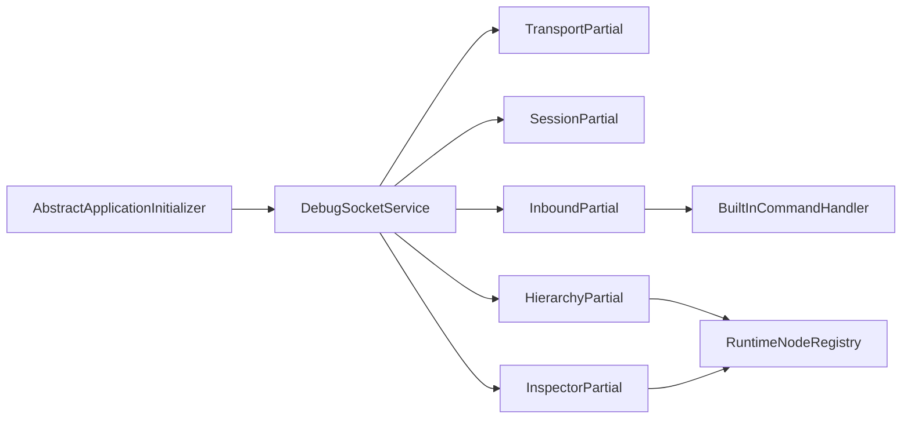

# DebugSocketService 分割 実施表

> 作成日: 2026-07-11  
> 対象: `Scripts/Runtime/DebugSocketServices/DebugSocketService.cs`  
> 目的: 約 2,300 行の God Class を、通信仕様と Bootstrap の公開 API を変えずに段階的に分割する。

---

## 1. 実施方針

`DebugSocketService` を一度に協調クラスへ分解しない。まず partial class で物理的に分割して、共有状態と `_gate` の排他境界を保ったまま可読性とテスト可能性を改善する。その後、依存方向が一方向になる責務だけを `internal` 型へ抽出する。

### 変更してはいけない外部契約

- `DebugSocketService` のコンストラクタ、`Options`、`RealtimeStream`、`IsRunning`、`StartAsync`、`StopAsync`、`Dispose`、`EnqueueTelemetry`、`NotifyHierarchyChanged`。
- `DebugSocketMessageType`、MessagePack envelope、`debugsocket.ping` と `debugsocket.runtime-diagnostics` の応答 schema。
- 単一クライアント、新接続による旧セッション置換、未接続時 drop、bounded queue の oldest-drop。
- main thread context が存在しないときに Hierarchy / Inspector capability を公開しない仕様。
- `AbstractApplicationInitializer` の生成・起動・破棄配線。

> **wire DTO の正本**はリポジトリ直下 `protocol/debugsocket/`（中立 YAML）です。Unity / DebugStudio の MessagePack C# は `tools/protocol-codegen` で生成するため、DTO を手編集・二重コピーしないこと（手順: `protocol/debugsocket/README.md`）。

---

## 2. 実行・レビュー運用

| 区分 | 担当 | 完了条件 |
|---|---|---|
| 実装 | 低コスト実行モデル | チケット単位で変更し、指定テストとコンパイルを実行する |
| 一次レビュー | 本チャットのレビュー担当 | 差分、状態遷移、スレッド境界、リソース所有権を確認し、問題があれば同一チケットへ差し戻す |
| 修正ループ | 低コスト実行モデル + レビュー担当 | 指摘が 0 件になるまで「修正 → テスト → 再レビュー」を繰り返す |
| 最終チェック | 本チャットのレビュー担当 | 全チケットの差分、契約互換、テスト結果、コメントを横断確認する |

### チケットごとの提出物

- 変更対象ファイル一覧と、公開 API / wire format に変更がないことの宣言。
- 実行したテストまたは Unity コンパイルの結果。
- 新規または更新した日本語コメントの一覧。
- 未実行の検証がある場合は、その理由と手動確認手順。

### レビューで必ず確認する観点

1. `_gate` で守る状態を別々の lock に分割していないか。
2. 旧セッション由来の受信メッセージが、現セッションの hierarchy/token 状態を変更できないか。
3. `OutgoingFrame.Release()` が enqueue 拒否、overflow drop、送信失敗、close の全経路で一回だけ呼ばれるか。
4. Unity API の呼び出しが main thread に限定されているか。
5. 例外を握り潰す既存方針を変更して、listener / transport 全体を意図せず停止させていないか。

---

## 3. チケット一覧

### DS-01: 現行挙動のテスト固定

- **目的**: 分割前の契約をテストで可視化し、以降の抽出で意味論を変えない。
- **対象**:
  - `Assets/OneStarMaker/Tests/`
  - `Scripts/Runtime/DebugSocketServices/DebugSocketService.cs`
- **実施内容**:
  - protocol framing、capability negotiation、built-in command の正常系・異常系を EditMode テストへ追加する。
  - queue の oldest-drop、未接続 drop、pooled buffer の解放を Unity API 非依存のテスト可能な境界まで固定する。
  - hierarchy snapshot/delta、token の非再利用、inspector query、セッション置換は PlayMode テストまたは明確な手動検証項目にする。
- **日本語コメント**:
  - 新しいテストケースには「守る既存契約」と「退行時に起きる障害」をコメントする。
  - race を再現しにくいテストには、同期ポイントと検証対象の状態遷移をコメントする。
- **受入条件**:
  - 既存実装で全テストが成功する。
  - 以後の各チケットで該当テストを回帰実行できる。
- **注意**:
  - テストのためだけに公開 API を増やさない。必要なら `internal` と `InternalsVisibleTo` の既存方針を確認して使う。

### DS-02: partial class への物理分割

- **目的**: 動作を変えずに責務の見通しを作り、共有ロックを壊さない。
- **対象**:
  - `DebugSocketService.cs`
  - `DebugSocketService.Transport.cs`
  - `DebugSocketService.Session.cs`
  - `DebugSocketService.Inbound.cs`
  - `DebugSocketService.Hierarchy.cs`
  - `DebugSocketService.Inspector.cs`
- **実施内容**:
  - 元ファイルにはフィールド、コンストラクタ、公開 API、Dispose とファイル分担の索引だけを残す。
  - transport、session、inbound、hierarchy、inspector を上記 partial へ移動する。
  - 型、メソッド可視性、処理順、lock 範囲は変更しない。
- **日本語コメント**:
  - 元ファイル先頭に partial ごとの責務と「共有状態は `_gate` で一括保護する」ことを記載する。
  - `DebugSocketService.Session.cs` の close 実装に、self-await 回避と `OutgoingFrame` の所有権を説明するコメントを残す。
- **受入条件**:
  - public API と namespace が不変。
  - DS-01 の全テスト、Unity コンパイル、DebugStudio の `ping` / `runtime-diagnostics` 手動確認が成功。
- **注意**:
  - このチケットでは新規 interface や DI を導入しない。構造変更と設計変更を分離する。

### DS-03: Built-in command handler の抽出

- **目的**: 受信ルーターから純粋に近い command 応答生成を取り出す。
- **対象**:
  - `Scripts/Runtime/DebugSocketServices/Commands/DebugSocketBuiltInCommandHandler.cs`
  - `DebugSocketService.Inbound.cs`
- **実施内容**:
  - `ping` と `runtime-diagnostics` の判定・結果生成を `internal` handler に移す。
  - diagnostics snapshot は値または read-only provider として渡し、handler から session / Unity API へ依存しない。
  - JSON のプロパティ名、null 表現、時刻の単位を維持する。
- **日本語コメント**:
  - built-in command を dispatcher より先に処理する理由（アプリ固有 dispatcher が未実装でも疎通確認できる）を handler の入口に記載する。
  - 手組み JSON を当面維持する互換上の理由を `EscapeJsonString` 付近に記載する。
- **受入条件**:
  - `debugsocket.ping` と `debugsocket.runtime-diagnostics` の既存応答が byte / payload 観点で互換。
  - handler 単体テストが追加される。
- **注意**:
  - command 名の alias や大文字小文字の扱いを変えない。

### DS-04: Runtime node registry の抽出

- **目的**: hierarchy と inspector の共有境界である stable token 管理を一箇所に閉じる。
- **対象**:
  - `Scripts/Runtime/DebugSocketServices/Hierarchy/DebugSocketRuntimeNodeRegistry.cs`
  - `DebugSocketService.Hierarchy.cs`
  - `DebugSocketService.Inspector.cs`
- **実施内容**:
  - forward / reverse の三つの辞書、採番、検索、prune、reset を registry へ移す。
  - session 切替時の reset と、採番値を戻さない契約を registry API とテストで固定する。
  - hierarchy / inspector は registry の公開する最小操作だけを使用する。
- **日本語コメント**:
  - token を wire に出し Unity の object identity を出さない理由を registry の型コメントに記載する。
  - `Reset` が辞書を消しても採番値を戻さない理由（遅延 query の alias 防止）をメソッドコメントに明記する。
- **受入条件**:
  - stale token、破棄済み GameObject、セッション切替後の query が安全に NotFound となる。
  - `_gate` による session 切替と registry reset の原子性が保たれる。
- **注意**:
  - registry 専用 lock を先行導入しない。`_gate` の所有権設計を変える場合は別チケットにする。

### DS-05: Inspector builder の抽出

- **目的**: Unity object から inspector DTO を構築する処理を独立させる。
- **対象**:
  - `Scripts/Runtime/DebugSocketServices/Inspector/DebugSocketInspectorBuilder.cs`
  - `DebugSocketService.Inspector.cs`
- **実施内容**:
  - GameObject / Transform / Component の section・property 構築と値の formatting を builder へ移す。
  - target 解決と fault frame の制御は service 側に残し、builder は有効な `GameObject` と `Scene` を入力として受け取る。
- **日本語コメント**:
  - `InspectorQueryFlags` ごとに取得コストと公開範囲が変わる理由を builder の入口へ記載する。
  - Component の型別プロパティが「読み取り専用の最小セット」であることを該当分岐に記載する。
- **受入条件**:
  - 既存の section 順序、property ID の連番、raw value、単位、NotFound/Faulted 応答が不変。
- **注意**:
  - builder の内部で Unity API を呼ぶため、呼び出し元の main-thread 切替は削除しない。

### DS-06: Hierarchy publisher の抽出

- **目的**: scene 走査、snapshot/delta、revision を一つの内部責務へまとめる。
- **対象**:
  - `Scripts/Runtime/DebugSocketServices/Hierarchy/DebugSocketHierarchyPublisher.cs`
  - `DebugSocketService.Hierarchy.cs`
- **実施内容**:
  - SceneManager event 購読、capture、snapshot/delta 比較、published state、revision 管理を publisher に移す。
  - facade の `NotifyHierarchyChanged` は main-thread への dispatch と publisher 呼び出しを維持する。
- **日本語コメント**:
  - capture と published state 更新を同じ排他境界で行う理由を publish の入口に残す。
  - snapshot ではなく delta を送らない条件を、仕様として分岐の直前に記載する。
- **受入条件**:
  - 初回は snapshot、変更時は delta、変更なしでは送信なしという既存挙動が維持される。
  - session 切替・停止後に旧 session へ hierarchy を送らない。
- **注意**:
  - `SceneManager` event の解除漏れは PlayMode 終了後の多重通知につながるため、Dispose テストを追加する。

### DS-07: Session と transport の協調クラス化

- **目的**: WebSocket I/O と transport lifecycle を service facade から分離する。
- **対象**:
  - `Scripts/Runtime/DebugSocketServices/Transport/DebugSocketClientSession.cs`
  - `Scripts/Runtime/DebugSocketServices/Transport/DebugSocketTransportHost.cs`
  - `DebugSocketService.Transport.cs`
  - `DebugSocketService.Session.cs`
- **実施内容**:
  - `ClientSession`、`OutgoingFrame`、send / receive loop を `DebugSocketClientSession` に抽出する。
  - listener accept、connect reconnect、HTTP upgrade、session activation を `DebugSocketTransportHost` に抽出する。
  - inbound callback、current-session 判定、queue overflow 診断は最小の `internal` contract で渡す。
- **日本語コメント**:
  - 新 session を current にしてから旧 session を閉じる順序と、その目的を activation の入口に記載する。
  - receive loop から close するときに receive task 自身を await しない理由を close API に記載する。
  - pooled buffer の所有権移転点を `OutgoingFrame` の型コメントに記載する。
- **受入条件**:
  - listen / connect の双方で起動・停止・再接続が成功する。
  - listener 停止、upgrade 中の cancellation、送受信失敗、queue overflow の全経路で socket と pooled buffer が解放される。
- **注意**:
  - `HttpListener` 例外の扱いと connect 失敗時のログ抑制を変えない。

### DS-08: Inbound router と最終 facade 化

- **目的**: message type ごとの処理を明示化し、`DebugSocketService` をライフサイクルと組み立てに収束させる。
- **対象**:
  - `Scripts/Runtime/DebugSocketServices/Protocol/DebugSocketInboundMessageRouter.cs`
  - `DebugSocketService.Inbound.cs`
  - `DebugSocketService.cs`
- **実施内容**:
  - capability hello、debug command、inspector query、unsupported message の routing を router へ移す。
  - capability negotiation、初回 hierarchy snapshot、main-thread 切替、`IsCurrentSession` 再確認の順序を保持する。
  - facade には dependency composition と public API だけを残す。
- **日本語コメント**:
  - `IsCurrentSession` を deserialization 後かつ Unity API に触る前に確認する理由を router へ記載する。
  - capability hello 完了前に実行できない message を明記する。
- **受入条件**:
  - 受信 message type ごとの応答が DS-01 の期待値と一致する。
  - `DebugSocketService.cs` が公開 API、ライフサイクル、依存組み立てを中心とした薄い facade になる。
- **注意**:
  - このチケットで protocol DTO や Foundation asmdef を変更しない。

### DS-09: 横断回帰と最終レビュー

- **目的**: チケット単位の成功だけでなく、統合時の契約互換を確認する。
- **対象**: DS-01 から DS-08 の全差分。
- **実施内容**:
  - Unity の EditMode / PlayMode テスト、Runtime asmdef コンパイル、DebugStudio の protocol・ping・command correlation 関連テストを実行する。
  - listen mode と connect mode の手動疎通を確認する。
  - Bootstrap の `CreateDebugSocketService`、logger stream、telemetry sink、Dispose 順序を確認する。
- **日本語コメント**:
  - 各 partial / internal 型の責務境界を確認し、説明が不足する public / internal API にだけコメントを追加する。
  - 実装の逐語説明や自明なコメントは追加しない。
- **受入条件**:
  - レビュー指摘が 0 件。
  - テスト失敗、コンパイル警告、未説明の仕様変更がない。
  - `DebugSocketService` の外部利用箇所を変更せずに既存の Bootstrap が動作する。

---

## 4. 実装時の禁止事項

- 大規模分割と protocol 仕様変更、DI コンテナ導入、asmdef 再編を同一チケットで行わない。
- `lock (_gate)` を無根拠に狭めたり、Unity API を lock 外へ移動して session 切替との原子性を失わせない。
- `Forget()`、空の `catch`、Cancellation の既存挙動を「整理」の名目で変えない。変更が必要なら独立した障害修正チケットにする。
- pooled buffer を通常の `byte[]` と同じように扱わない。所有権を受け取った側が必ず一度だけ返却する。
- `internal` 型を public にしない。アプリ固有の command 拡張点は既存の `IDebugCommandDispatcher` を維持する。

## 5. 実施順序と中断点

`DS-01 → DS-02 → DS-03 → DS-04 → DS-05 → DS-06 → DS-07 → DS-08 → DS-09` の順に実施する。

DS-02、DS-04、DS-06、DS-07 の完了時はリスクが高い中断点である。次のチケットへ進む前に、レビュー担当が差分と回帰結果を承認する。
